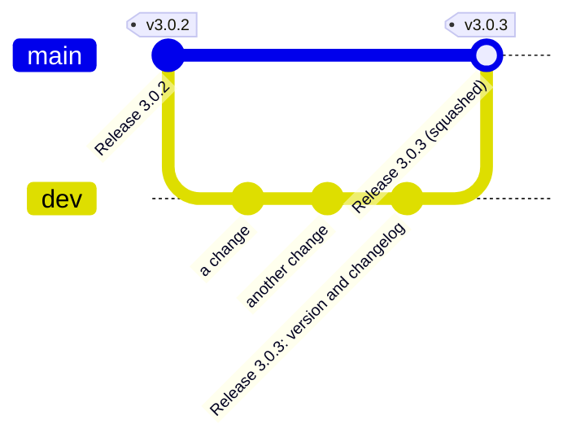

← [Documentation](docs/README.md)

# Contributing

Thanks for helping. This page gets you from a clone to a change that passes CI: setting up, running the app while you work on it, the tests, and how commits are written here. For how the code fits together, read [docs/contributing/ARCHITECTURE.md](docs/contributing/ARCHITECTURE.md) first; it's short.

## Setting up

You need Node.js 22.12 or later (CI runs Node 22) and git.

```sh
git clone https://github.com/xiaodoudou/embed-cms.git embed-cms
cd embed-cms
npm ci
```

`npm ci` installs `sharp`, the image library, which downloads a prebuilt binary for your platform; there is nothing else to compile.

The first `npm ci` also builds the admin app into `dist/` (`scripts/prepare.js`, the `prepare` script, which builds only when `dist/` is missing); set `EMBED_CMS_SKIP_BUILD=1` to skip it. `npm pack` always rebuilds it first (`prepack`), and the `files` list of `package.json` decides what the package contains: add a new top-level file there if the CMS needs it at run time.

## Running it

There are two ways, depending on what you work on.

**Backend, or a quick look.** Start the server (run `npm run build` after changing `src/`):

```sh
npm start                 # http://localhost:9990/admin, localAdmin / localAdmin
```

To see what the admin bundle is made of, build with `ANALYZE=1 npm run build`: it also writes `stats.html`, a map of the chunks (git-ignored).

**The admin app, with hot reload.** Run the backend and Vite side by side, in two terminals:

```sh
npm run serve-backend     # the server on 9990, serving src/ instead of dist/, with --inspect for a debugger
npm run dev               # Vite on 19990, proxying /admin, /api and the plugin routes to 9990
```

Open <http://localhost:19990/admin/>. Opening port 9990 in this mode gives a blank page, because nothing there compiles `src/`. In VS Code, `.vscode/launch.json` has a configuration that attaches to the backend.

`bin/cms.js` (the `cms` command, `npm start`) is a development harness when it runs in this folder: it turns on the sync plugin and turns off replication (`lib/cliOptions.js`). Run anywhere else, it starts a plain CMS from that folder's `cms.json`. `PORT` changes its port. The resources in `resources/` are the field catalogue, one resource per family of field types, which is also what the field documentation's screenshots show.

`npm run serve-prod` runs the built app with `NODE_ENV=production`, so it refuses to start with the default secrets and doesn't create `localAdmin`. That's on purpose; see [SECURITY.md](SECURITY.md).

## Tests

| Command | What it runs |
|---|---|
| `npm run test:unit` | Backend unit and security tests (mocha, `test/unit`, `test/security`). Each test boots its own CMS on a random port. |
| `npm run test:frontend` | Frontend tests (vitest and jsdom, `test/frontend`), including components mounted with Vuetify. Same as `npx vitest run`. |
| `npm test` | The older HTTP integration suite. Set `TEST_PORT` if 9990 is taken. |
| `npm run test:all` | All three. |
| `npm run test:coverage` | The unit tests with a coverage summary. |
| `npx mocha test/unit/drivers.contract.test.js` | The same suite against the JSON store, PostgreSQL and MongoDB (the last two are skipped without a server). |

[docs/contributing/TESTING.md](docs/contributing/TESTING.md) explains how the tests are built, the helpers, the driver contract suite, the benchmark, and what to do about random `ETIMEDOUT` failures on some machines.

A few tests guard the documentation:

- `test/frontend/fieldDocs.test.js`: every field type in `FormService.typeMapper` has a page in `docs/reference/fields/`, linked from `docs/reference/FIELDS.md`, and every screenshot a page links to exists.
- `test/unit/securityConfig.test.js`: the recommended configuration in `SECURITY.md` only uses real options and boots.
- `test/frontend/brand.test.js`: no text file mentions the project's former owner.
- `test/frontend/designSystem.test.js`: the design rules of [docs/extending/DESIGN_SYSTEM.md](docs/extending/DESIGN_SYSTEM.md) hold (no colour literals in components, every token defined in both themes).

## Screenshots of the documentation

A script takes the pictures of the documentation, so you can retake them after the interface changes. They are the pictures of `docs/reference/fields/img` (one per state of each field type) and the ones of `docs/ui` that the README and the guides show. They use the light theme unless the file name says dark.

```sh
npm i --no-save playwright-core
npm run docs:screenshots
```

The script starts a throw-away CMS on a free port, with the catalogue of `resources/` and a temporary data folder. It seeds the records some pictures need over REST, drives a headless Chrome through the admin, and writes the PNG files over the old ones. It looks for Chrome in its usual install folder. `CHROME_PATH` names another one.

Two options help:

- `npm run docs:screenshots -- --only string` retakes only the pictures whose name matches the regular expression.
- `--url http://127.0.0.1:9990 --seed` uses a server that is already running (seeded first) instead of a throw-away one.

One picture is one entry in `test/docs/screenshots/fields.js` (the field pages) or `ui.js` (the interface). The entry gives the file name, the resource, the steps that bring the form to the state the page describes, and what to crop. `lib.js` holds the browser helpers, `seed.js` the records and `fixtures.js` the files the pictures upload. A failed picture leaves a `docshot-fail-<name>.png` in the temporary folder of the system.

Each example has its own script for its pictures:

- The example site of [PAGE_HELPER.md](docs/reference/PAGE_HELPER.md) (`docs/img/page-helper-*.png`: the home page, an article, the 404 page and the error page). Run `npm run docs:site-screenshots`. It boots `docs/examples/site` over a throw-away CMS with four articles and photographs its pages.
- The [magazine](docs/examples/magazine/README.md) (`docs/img/magazine-*.png`). Run `npm run docs:magazine-screenshots`.
- The [docs platform](docs/examples/platform/README.md) (`docs/img/platform-*.png`, one of them signed in). Run `npm run docs:platform-screenshots`.
- [Boardwalk](docs/examples/taskboard/README.md) (`docs/img/taskboard-*.png`). Run `npm run docs:taskboard-screenshots`. Vite builds the app, and a browser signs in as a person of the team.

## What CI checks

`.github/workflows/test.yml` runs on every pull request and on `main` and `dev`:

1. `npx eslint lib src index.js test/unit test/security test/integration test/helpers test/bench` (no `--fix`: run `npm run lint` locally to fix what can be fixed);
2. `npm run test:unit`, `npm run test:frontend`, `npm test`;
3. `npm run build`;
4. `npm audit --omit=dev --audit-level=high`;
5. in a second job, the driver contract suite against PostgreSQL 16 and MongoDB 7 service containers;
6. in a third job, that the commit messages of the push or pull request follow [Conventional Commits](#commit-messages), and that the title of a pull request into `main` does too.

Run the first three locally before you push. `npm run knip` finds unused files, exports and dependencies.

## Project layout and naming conventions

```
bin/            the four commands: cms.js, cmsSync.js, cmsImport.js, cmsImportRemote.js (package.json "bin")
index.js        the CMS class, what require('embed-cms') gives
lib/            the backend: the managers, Resource.js, db/ (stores and engines), util/, plugins/, importers/
src/            the admin app (Vue 3 + Vuetify): components/, services/, mixins/, utils/, filters/, assets/, styles/
test/           unit/, security/, frontend/, integration/, helpers/, fixtures/, bench/ (see docs/contributing/TESTING.md)
resources/      the field catalogue the development server loads
docs/           the documentation, docs/examples/ holds example configurations
i18n/ public/ types/ index.d.ts   translations, static files, type definitions
scripts/        prepare.js (builds dist/ on install), migrateStore.js
```

Tool configuration files stay at the root under the names their tools expect (`vite.config.js`, `vitest.config.mjs`, `eslint.config.mjs`, `knip.config.js`, `.mocharc.cjs`, `jsconfig.json`, `jsdoc.conf.json`).

One naming rule for the whole tree:

- **Folders** are lowercase, one word when possible, kebab-case otherwise. Exception: the folders of `lib/plugins/` are named after the option that turns the plugin on (`anonymousRead`, `importFromRemote`, `sync`...), and `index.js` loads them by that name. They keep their camelCase.
- **Files** are `PascalCase.js` or `.vue` when the module is something that gets mounted, instantiated or extended: a Vue component, a class (one class per file: `ExpressManager.js`, `lib/db/FileStore.js`, `lib/db/local/JsonDown.js`), a frontend service (`TranslateService.js`), a mixin (`src/mixins/RecordName.js`). Everything else is `camelCase.js`: utilities, helpers, middleware, functions and factories (`lib/db/jsonStore.js`, `lib/plugins/rest/middleware/findResource.js`), scripts, tests. No snake_case or kebab-case source file names.
- **Resource definitions** under `resources/`, and the pages of `docs/reference/fields/`, are named after the resource or field type they define (`text_long`, `inputtag`): they are data, not code, and are not renamed. The top-level documentation pages are `UPPERCASE.md`.
- **Tests** mirror the source and say what kind they are by their folder, not by their name: `test/unit/<subject>.test.js`, `test/security/<area>.security.test.js`, `test/frontend/<subject>.test.js` and `<component>.component.test.js`, `test/integration/<suite>.test.js`. Shared code is in `test/helpers/`, shared data in `test/fixtures/`.
- Public names do not follow the file names. These keep their old names: the keys of `RestHelper.mw` (`find_resource`, `parse_query`), the plugin names, the configuration keys, the REST routes, the storage engine names (`jsondown`, `sqlite`) and the npm scripts (`migrate-store`).

## Making a change

- One concern per commit, small enough to review. A refactor and a behaviour change are two commits.
- A bug fix comes with a test that fails without the fix.
- Protections are on by default. A protection becomes a `security.*` setting that defaults to on (`lib/util/securityOptions.js`), so a deployment can turn one off for a reason but never gets one silently missing. It is documented in `SECURITY.md`.
- UI code follows the design system: colours, sizes and spacing come from `src/styles/tokens.scss`; texts go through the translation files in `i18n/`, in English and Chinese.
- Update the documentation in the same change. A new option goes into [docs/reference/CONFIG.md](docs/reference/CONFIG.md), a new field option into its page in `docs/reference/fields/`, a new route into [docs/reference/API.md](docs/reference/API.md). [docs/README.md](docs/README.md) says which page owns which topic.
- Draw diagrams with [Mermaid](https://mermaid.js.org/) in a ` ```mermaid ` block (GitHub renders it), not as ASCII art or images, so they stay editable in a diff. Check a new one with `npx -y @mermaid-js/mermaid-cli -i diagram.mmd -o diagram.svg`. Folder trees can stay plain text.

## Commit messages

Commit messages follow [Conventional Commits 1.0.0](https://www.conventionalcommits.org/en/v1.0.0/):

```
<type>(<scope>): <description>

<body>

<footer>
```

The title is one line of at most 100 characters, with no final period. It says what changes for the user of the code, in the present tense.

| Type | Use it for |
|---|---|
| `feat` | A new feature, or a change a user can see |
| `fix` | A bug fix |
| `docs` | Documentation only |
| `style` | Formatting and lint rules, with no change of behaviour |
| `refactor` | A change of the code that neither fixes a bug nor adds a feature |
| `perf` | A change that makes something faster or lighter |
| `test` | Tests |
| `build` | The build, the dependencies and the package |
| `ci` | The CI and release workflows |
| `chore` | Anything else, and releases: `chore(release): 3.0.5` |
| `revert` | A revert |

The scope is the part of the CMS the change is about, in lower case: `admin`, `fields`, `api`, `rest`, `sync`, `storage`, `security`, `i18n`, `examples`, `release`. Leave it out when no part fits.

```
fix(admin): keep Tab inside the omnibar switcher
feat(fields): add the geopoint field
docs: say which page to read for each question
ci: update actions/checkout and actions/setup-node to v7
```

A change that breaks users gets a `!` before the colon, and a `BREAKING CHANGE:` footer that says what to do about it:

```
feat(security)!: turn every protection on by default

BREAKING CHANGE: the legacy security profile is gone, see SECURITY.md.
```

The body, wrapped at about 120 characters, explains **why**: what was wrong, what the change does about it, and anything a reviewer should know (what was tried and dropped, what is left for later). The diff already says what changed line by line. Put detail that does not fit in a title of 100 characters in the body.

### The check

`npm install` points git at `.githooks` (`git config core.hooksPath .githooks`, done by `scripts/prepare.js`), and its `commit-msg` hook refuses a message that does not follow the rules above, with the reason. The rules are in `scripts/commitlint.js`, which has no dependency. You can run it yourself:

```sh
node scripts/commitlint.js --range origin/dev..HEAD   # the commits of a branch
node scripts/commitlint.js --title "fix: stop the crash"   # one title
```

The hook only helps the person who has it, so CI checks the same rules on every push and pull request. Merge commits, reverts made by git and the `fixup!` commits of an autosquash are let through.

## Branches

`main` has **one commit per version**, each tagged (`v3.0.3`), and nobody pushes to it: the only way in is a release pull request. `dev` is where the work happens, with its commits as they were made. A change is a pull request against `dev`; a release is a pull request from `dev` to `main`, squashed into one commit.



## Pull requests

Open them against `dev`. Describe the problem, the change, and how you checked it; screenshots for UI changes, in both themes when colours are involved. CI must be green before review.

Security problems don't go in a public issue or pull request: see [SECURITY.md](SECURITY.md#reporting-a-vulnerability).

## Releasing

A release is a tag on `main`. Every change worth telling goes under **Unreleased** in `CHANGELOG.md`, in the same commit that makes the change. Write it for the person who uses the CMS: what they can do now, what behaves differently, what was broken. Do not write it in the words of the code.

1. **On `dev`**, a last commit titled `chore(release): 3.0.4` moves the Unreleased entries under a heading with the version and the date, adds the compare link at the bottom, and bumps the version of `package.json`. CI is green.
2. Open a pull request from `dev` to `main` titled "chore(release): 3.0.4", with the new section of the changelog as its description, and **squash-merge** it (the only way `main` accepts). `main` gets one commit, with that title and description.
3. Tag that commit and push the tag:

```sh
git fetch origin
git tag -a v3.0.4 -m "embed-cms 3.0.4" origin/main
git push origin v3.0.4
```

4. Bring `dev` up to date with `main`, so that the next release pull request shows only what came after. The squash commit has the same content as `dev` already has, so nothing changes in the files:

```sh
git checkout dev
git merge -s ours origin/main -m "chore: merge release 3.0.4 from main"
git push origin dev
```

`.github/workflows/release.yml` runs when the tag is pushed, in order: a check that the tag names the version of `package.json` and is on `main`, the same jobs as on every push, `npm publish`, and the GitHub release with its generated notes. A step that fails stops the next ones, so nothing is published from a red build. A tag with a prerelease suffix (`v3.1.0-rc.1`) is published under the `next` tag of npm and marked as a prerelease on GitHub.

One-time setup, on npmjs.com: the package page, Settings, Trusted Publisher, GitHub Actions, with the repository `xiaodoudou/embed-cms` and the workflow file name `release.yml`. There is no token to store: the run proves its identity to npm, and the package gets its provenance badge.
