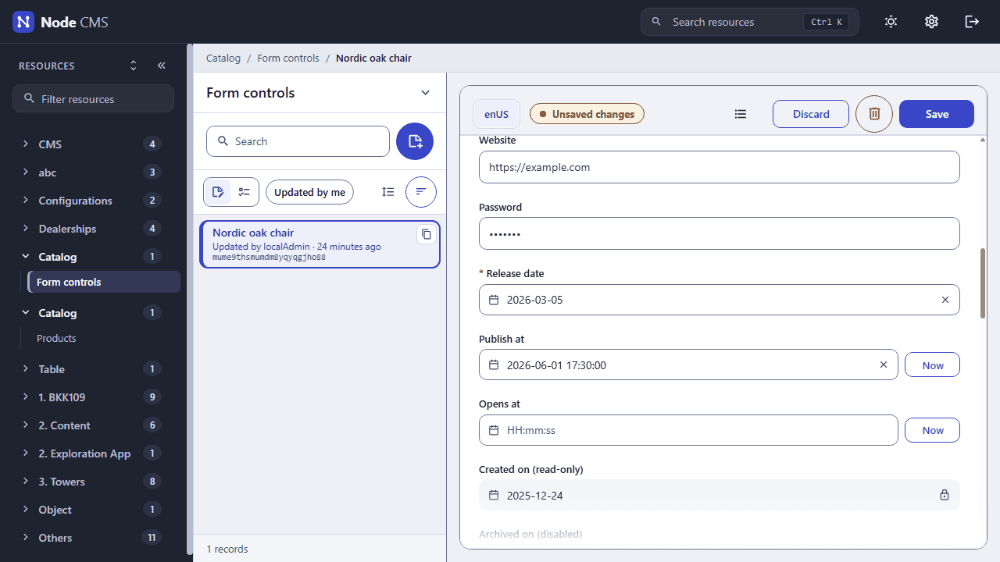

<div align="center">

# Embed CMS

> A headless CMS for Node.js: describe your content in JavaScript files, get an admin app, a REST API and a JavaScript API

[](LICENSE) [](#try-it-in-five-minutes) [](docs/reference/CONFIG.md) [](docs/start/GETTING_STARTED.md) [](docs/start/CONCEPTS.md) [](docs/contributing/TESTING.md)

You describe your content in plain JavaScript files, one per resource, and Embed CMS gives you three things from them: an admin app where editors write and translate that content, a REST API that serves it to your sites and apps, and a JavaScript API for your own server code.



</div>

---

It keeps your content in a LevelDB database on disk by default, so there is no database server to set up; SQLite, MongoDB and PostgreSQL are there when you need them ([how they compare](docs/operations/STORAGE.md)). It runs on its own or inside an existing Express app, handles translations, images and files, users and rights, and can keep several servers in step.

## Try it in five minutes

You need [Node.js](https://nodejs.org/) 22.12 or later and git.

```sh
git clone https://github.com/xiaodoudou/embed-cms.git embed-cms
cd embed-cms
npm install          # also builds the admin app into dist/, the first time
npm start
```

Open <http://localhost:9990/admin> and sign in with **localAdmin** / **localAdmin** when the browser asks. The menu already holds a catalogue of example resources, one per family of field types (see [`resources/`](resources/README.md)). Click around: everything you see there is generated from the files in `resources/`.

The first start writes a `cms.json` with the default settings and a `data/` folder with your content. Stop the server with Ctrl+C.

## Your first resource

Say you want to publish articles, in English and Chinese. Create `resources/articles.js`:

```js
module.exports = {
  displayname: 'Articles',
  group: 'Content',
  locales: ['enUS', 'zhCN'],
  schema: [
    { field: 'title', input: 'string', label: 'Title', required: true },
    { field: 'slug', input: 'transliterate', label: 'Slug', localised: false, unique: true, options: { valueFrom: 'title' } },
    { field: 'body', input: 'wysiwyg', label: 'Body' },
    { field: 'cover', input: 'image', label: 'Cover', localised: false, options: { maxCount: 1 } }
  ]
}
```

Restart `npm start`. **Articles** now appears in the menu under **Content**, with a tab per language, a rich-text editor and an image drop zone. Write an article and save it.

The same content is already on the REST API:

```sh
curl -u localAdmin:localAdmin http://localhost:9990/api/articles
```

```json
[{ "title": { "enUS": "Hello", "zhCN": "你好" }, "slug": "hello", "body": { "enUS": "<p>…</p>" },
   "_id": "muosrfetmuosr8shy000gql4", "_createdAt": 1790814577349, "_updatedAt": 1790814577349 }]
```

And you can write to it the same way:

```sh
curl -u localAdmin:localAdmin -X POST http://localhost:9990/api/articles \
  -H 'Content-Type: application/json' \
  -d '{ "title": { "enUS": "Second post" }, "slug": "second-post" }'
```

That's the whole loop: describe a resource, edit it in the admin, read it over the API. The [getting started guide](docs/start/GETTING_STARTED.md) takes it further: putting embed-cms inside your own Express app, letting everyone read the articles without a password, relations between resources, and going to production.

## Before you go to production

Two things in this quick start are only fit for your laptop. The `localAdmin` account has a published password (the server logs an error at every start until you change it), and `cms.json` holds secrets whose default values are published too. Run with `NODE_ENV=production` and follow [SECURITY.md](SECURITY.md): production mode refuses to start with those defaults.

## Documentation

[docs/README.md](docs/README.md) is the map of the documentation. The pages you'll want first:

- [Getting started](docs/start/GETTING_STARTED.md): from the quick start to a real project.
- [Concepts](docs/start/CONCEPTS.md): resources, fields, locales, attachments, users and groups, in plain words.
- [Field types](docs/reference/FIELDS.md): every input type, with screenshots.
- [Configuration](docs/reference/CONFIG.md) and [API](docs/reference/API.md): the references.
- [Storage engines](docs/operations/STORAGE.md): LevelDB, SQLite, JSON file, MongoDB or PostgreSQL, with benchmarks and what a crash loses.
- [Examples](docs/examples/README.md): three runnable sites to learn from, each a tutorial: a [blog](docs/examples/site/README.md) (the shortest site), a bilingual [magazine](docs/examples/magazine/README.md) and a [docs platform](docs/examples/platform/README.md) with products, versions and pages for members, and a CMS that stays off the public site.

## Contributing, security, license

Setting up a development copy, running the tests and writing commits: [CONTRIBUTING.md](CONTRIBUTING.md). Reporting a vulnerability: [SECURITY.md](SECURITY.md#reporting-a-vulnerability). What changed in each version, and what is coming: [CHANGELOG.md](CHANGELOG.md).

Authors: Edouard Durand, Hugo Barbier. Released under the [GNU GPL, version 3 only](LICENSE); versions up to 2.6.1 were MIT, and their notice is kept in the license file.
