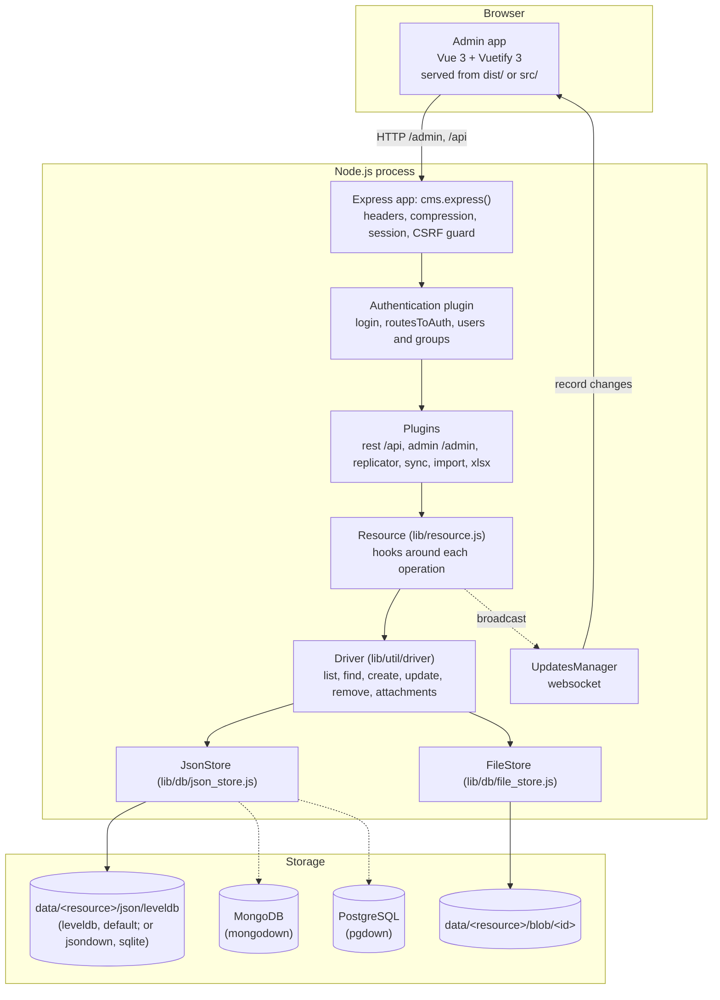
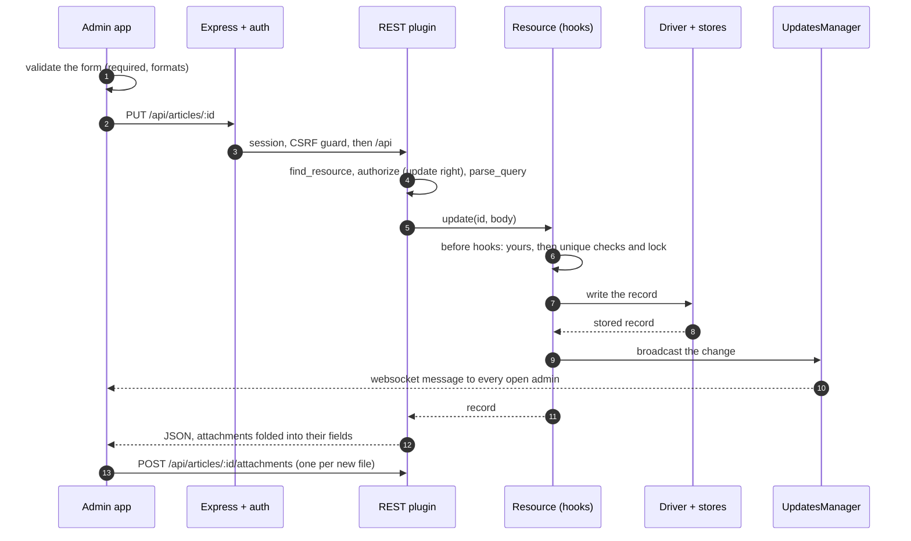

# Architecture

This page follows one request, an editor saving an article in the admin, from the browser down to the file on disk and
back. It is the map to keep in mind when you change the code or debug something odd. Words such as resource or hook
are explained in [CONCEPTS.md](CONCEPTS.md).

## The big picture

Everything runs in one process. `new CMS(options)` (`index.js`) reads the configuration, loads the resource files,
builds an Express app and installs the plugins. `cms.express()` hands you that app to mount; `cms.bootstrap(server)`
opens the stores, creates the default groups and users, and attaches the websocket to your HTTP server.

Here is the whole trip for one save, before each step is explained:

## 1. The admin app sends the request

The admin is a single-page Vue 3 app in `src/`. In production it is built into `dist/` (`npm run build`) and served by
the admin plugin under `/admin`. In development, Vite serves it from `src/` with hot reload (see
[CONTRIBUTING.md](../CONTRIBUTING.md#running-it)).

When it starts, the app fetches `/admin/config` (the public part of the configuration), `/admin/resources` and
`/admin/paragraphs` (the declarations, from which it draws the menu and every form) and its translations from
`/admin/i18n/`. The address bar keeps the state: `#/?id=articles&record=<id>`.

When the editor clicks Save, the form (`src/services/FormService.js` picks a component per field type) has already
checked required fields, formats and patterns. `ResourceService` then sends the record with `fetch` through
`RequestService`, relative to the page: `PUT ../api/articles/<id>`. Files go afterwards, one multipart `POST` per file to
`../api/articles/<id>/attachments`.

## 2. Express and the authentication plugin

The request enters the app built in `index.js`, which applies in order: security headers (helmet, or the stricter set of
`security.headers`, on by default), compression, the session (when a login mode is on), the CSRF guard (`security.csrf`) and
the authentication plugin.

The authentication plugin (`lib/plugins/authentication`) owns `POST /admin/login`, `/admin/logout`, the `_users`,
`_groups` and `_settings` resources, and the `routesToAuth` list of admin and plugin routes that need a login. It knows
two ways to log in: HTTP Basic (the default) and a JWT in the `nodeCmsJwt` cookie. See
[CONFIG.md](CONFIG.md#authentication).

## 3. The REST plugin finds the resource and checks the rights

`/api` belongs to the REST plugin (`lib/plugins/rest`). Every route runs the same chain:

1. `find_resource` turns `articles` into the resource object, or answers `404`;
2. `authorize` identifies the caller (Basic header, JWT, or anonymous) and asks the authentication plugin whether the
   caller's group has the right for this method on this resource (`PUT` needs `update`). It also stamps
   `_updatedBy` into the body;
3. `parse_query` parses and checks `?query=`;
4. the handler in `routes.js` calls the resource: here `req.resource.update(id, body)`.

The same middlewares are available to your own routes as [`CMS.RestHelper`](REST_HELPER.md).

## 4. The resource runs its hooks

`lib/resource.js` wraps every operation (`create`, `read`, `find`, `list`, `update`, `remove` and the attachment ones) in a
pipeline of hooks. For a create, the built-in ones are: normalise the record, give it an id and timestamps, lock the
resource, check `maxCount`, check `unique` fields; and after it is stored: keep one record active if `activeField` is set,
broadcast the change, and start replication if the resource's type asks for it.

Your own hooks run before the built-in ones (`cms.api()('articles').before('create', fn)`, see
[API.md](API.md#hooks)). This is also where the built-in resources get their behaviour: `_users` hashes passwords in a
before-hook and hides them in an after-hook.

## 5. The driver and the stores

`lib/util/driver` implements the operations on top of two stores per resource, created in `lib/resource.js`:

- **`JsonStore`** (`lib/db/json_store.js`) keeps the records. It is a level-style key-value store (the abstract-level
  interface) with one of five engines behind it, chosen by `dbEngine.type` ([STORAGE.md](STORAGE.md) compares them):
  `leveldb` (default, `leveldbdown.js`, classic-level) and `sqlite` (`sqlitedown.js`) keep them on disk and read them
  from there; `jsondown` holds the records in memory and writes them to `data/<resource>/json/db.json`, through a
  temporary file renamed over the old one, a few milliseconds after a change; `mongodown` and `pgdown` keep them in
  a MongoDB collection or a PostgreSQL table per resource. The three local engines are created by
  `lib/db/leveldown/localEngines.js`, and share the replication code in `sync.js`; the two servers have their own.
  Queries are filtered in the process with sift, whatever the engine.
- **`FileStore`** (`lib/db/file_store.js`) keeps the attachments as plain files in `data/<resource>/blob/`, named by
  attachment id, with resized copies next to them. Fields configured for Alibaba Cloud OSS go there instead.

Every record id starts with a timestamp followed by the `mid` of the node that made it, so ids sort in creation order and
a node can tell its own records from replicated ones.

## 6. The answer, and everyone else

The record goes back up the same way, as JSON. The REST plugin folds the attachment descriptions into their fields and
adds a download `url` to each.

Meanwhile the broadcast of step 4 reaches `UpdatesManager` (`lib/UpdatesManager.js`), which sends
`{ action, data: { resource, _id, _updatedBy } }` over a websocket to every open admin. Another editor looking at the same
list sees it refresh. Resources whose name starts with `_` are not broadcast.

If the resource has peers and a replication type, the replicator (`lib/plugins/replicator`) now syncs the change to the
other nodes: records over its TCP protocol, files over HTTP. See [REPLICATION.md](REPLICATION.md).

## Other paths through the code

| Path | Where |
|---|---|
| The log page: `/api/_syslog`, server-sent events | `lib/SyslogManager.js` |
| CPU, memory and disk for the admin's top bar: `/api/system` | `lib/SystemManager.js` |
| Image resizing and smart cropping | `lib/util/imageOptimization.js`, `lib/util/smartcrop.js` |
| Security settings and their defaults | `lib/util/securityOptions.js`, [SECURITY.md](../SECURITY.md) |
| Sync, import, Excel, import from remote | `lib/plugins/sync`, `import`, `xlsx`, `importFromRemote`, `lib-import*/` |
| The `cms` command | `server.js` |
| Type definitions for editors and TypeScript users | `index.d.ts`, `types/`, `lib/jsdoc-types.js` |
