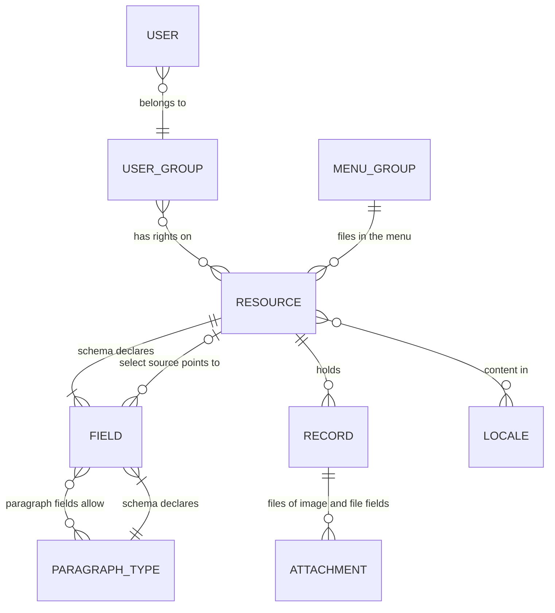

# Concepts

embed-cms has a small vocabulary. Once these words click, the rest of the documentation reads easily. Each section says
what the thing is, why it exists, and where to read more.

Here is how the main ideas relate. Each box is explained below.



## Resource

A resource is a kind of content: articles, authors, products, the site settings. It is declared by one JavaScript file
in `resources/`, and the file name is its name: `resources/articles.js` declares `articles`, served at `/api/articles`
and listed in the admin's menu.

```js
// resources/articles.js
module.exports = {
  displayname: { enUS: 'Articles', zhCN: '文章' },  // the name in the menu
  group: 'Content',                                  // the heading it is filed under
  locales: ['enUS', 'zhCN'],                         // content languages, see Locale
  schema: [ /* fields */ ]
}
```

Each resource keeps its records apart from the others: its own LevelDB folder (or file, table or collection) and its own folder of
files. A record is one item of a resource, one article, with an `_id` the CMS gives it.

The keys a declaration can have:

| Key | What it does |
|---|---|
| `schema` | The [fields](#field). |
| `displayname` | The name shown in the admin; a string or one per admin language. |
| `group` | The [menu group](#group) it is listed under. |
| `locales` | The [content languages](#locale). |
| `view` | `'table'` for a spreadsheet-like [view](#view) instead of the list. |
| `maxCount` | The most records it may hold. With `1` it is a single record (site settings, a home page): the admin opens it directly, without a list. Once the limit is reached, a create returns the existing record instead of failing. |
| `type` | `normal`, `downstream` or `upstream`: the direction of [replication](REPLICATION.md#directions). |
| `groups` | Titles for nested fields, keyed by prefix: `groups: { address: { label: 'Address' } }`. |
| `allowed` | User groups that see the resource in the admin's menu. The API doesn't enforce it: use group rights for that. |
| `layout` | A form layout in lines and widths for the editor. |
| `activeField` | A boolean field of which at most one record may be `true` (say, the current campaign). |

## Field

A field is one entry of the `schema`: a value of the record and the control that edits it.

```js
{ field: 'price', input: 'number', label: 'Price', required: true, options: { min: 0, hint: 'In euros' } }
```

`field` is the key in the record, `input` the type of control (24 of them: text, numbers, dates, choices, images,
files, rich text, blocks…). The type decides what is stored and how the admin checks it. A dotted key such as
`address.city` nests the value and groups the fields in the form.

The admin checks `required`, formats, lengths and patterns before it saves; the server only checks `unique`. Anything
that writes over the API is trusted to send valid data. [FIELDS.md](FIELDS.md) has every type, with screenshots.

## Locale

"Language" means two separate things in embed-cms, and it helps to keep them apart:

- **Content locales** are the languages your content is written in. A resource lists them in `locales`, and every
  field then holds one value per locale, `{ "title": { "enUS": "Hello", "zhCN": "你好" } }`, unless it says
  `localised: false`. The editor has a tab per locale, and a required field must be filled in each.
- **Admin languages** are the languages of the admin app itself: English (`enUS`) and Chinese (`zhCN`), from the files in
  `i18n/`. Labels and hints can be given per admin language: `label: { enUS: 'Price', zhCN: '价格' }`.

A resource can have content locales the admin isn't translated into, and the other way round.

## Attachment

An attachment is a file that belongs to a record: an image of an `image` field, a PDF of a `file` field. The record
keeps a description of each file (its name, type, size and MD5); the file itself lives next to the resource's data, or in
Alibaba Cloud OSS for fields configured for it. The API returns attachments grouped under their field, each with a
`url`. Images can be resized and cropped on request (`?resize=400x300`), and the resized copies are cached.

## Paragraph

A paragraph field holds a list of blocks that the editor adds, reorders and removes: a text block, then a quote, then a
gallery. Each block has a type, and each type is declared like a small resource, in `resources/paragraphs/`:

```js
// resources/paragraphs/quote.js
module.exports = {
  displayname: 'Quote',
  schema: [
    { field: 'text', input: 'text', label: 'Quote' },
    { field: 'author', input: 'string', label: 'Author' }
  ]
}
```

A field `{ field: 'body', input: 'paragraph', options: { types: ['quote', 'text'] } }` then lets editors build a page
from those blocks. Blocks can nest. See [the paragraph field](fields/paragraph.md) and, for side-by-side blocks,
[dynamic layout](DYNAMIC_LAYOUT.md).

## Users, groups and rights

Everyone who logs in is a **user**, and every user belongs to one **group**. Rights belong to groups, per resource:

| Right | Allows |
|---|---|
| `read` | Reading records (`GET`). |
| `create` | Creating records (`POST`). |
| `update` | Changing records (`PUT`). |
| `remove` | Deleting records (`DELETE`). |
| `attachments` | Adding, changing and removing files. |
| `plugins` | Seeing admin pages by name, such as `Syslog`. |

Users and groups are ordinary resources (`_users`, `_groups`), edited in the admin's **CMS** menu. A user also carries two
preferences for their own admin: a **Theme** (light or dark, when [dark mode](CONFIG.md#features-you-can-switch) is on) and a
**Language** (one of the [admin's languages](CONFIG.md#features-you-can-switch)). Both apply when they log in, and at once when
they save their own user. Two groups always
exist. **`admins`** is given every right on every resource at each start. **`anonymous`** is the group of requests
without a login, and has no rights until you give it some, for example with [`anonymousRead`](CONFIG.md#features-you-can-switch).
How people log in (browser prompt or login page) is set in [CONFIG.md](CONFIG.md#authentication).

## Group

The word is used for three things:

- a **user group**, as above;
- a **menu group**, the `group` of a resource: the heading it is filed under in the admin. Groups can get an icon in
  **Settings**;
- a **field group**, the heading the form draws over nested fields (`address.city`, `address.zip`).

## View

A view is how the admin shows the records of a resource:

- the **list** (the default): a column of records on the left, the editor on the right;
- the **table** (`view: 'table'`): a grid with a column per field, sorting, column choice and bulk delete, for resources
  with many short records;
- the **single record** (`maxCount: 1`): no list, the editor straight away.

## Plugin

A plugin is a feature you can switch on or off: the REST API, the admin, replication, sync, import, the Excel export.
Each one lives in `lib/plugins/`, is turned on by an option of [CONFIG.md](CONFIG.md#features-you-can-switch), and
mounts its own routes. In code, `cms.use(Plugin, options)` installs one.

The admin has plugin **pages** too: Syslog, Replicator, Cms Import, Sync. A project can add its own Vue pages in
`embed-cms/plugins/`, which the admin build picks up.

## System resources

Resources whose name starts with an underscore belong to the CMS: `_users`, `_groups`, `_settings` (logo, title,
top-bar links and menu icons), and `_sync` and `_xlsx` when their plugins are on. They are edited in the admin like any
other resource and are not broadcast over the update websocket.
