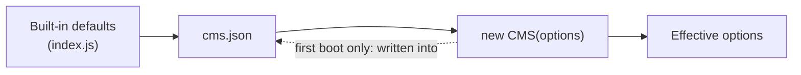

# Configuration

Every option of embed-cms lives in one object. You can write it in `cms.json`, pass it to the constructor, or both. This page
is the reference for that object. The security settings have their own page, [SECURITY.md](../SECURITY.md), because they
come with a profile and a checklist.

## Where the configuration comes from

When the CMS starts, it builds its options in three layers. Each layer overrides the one before it:

1. the built-in defaults (`defaultConfig` in `index.js`);
2. `cms.json` in the current folder (or the file named by the `config` option);
3. the object you pass to `new CMS(options)`.



If `cms.json` doesn't exist yet, the first boot writes it: the defaults merged with your constructor options. From then
on the file is yours to edit. That has two consequences worth knowing:

- **Secrets you pass to the constructor end up in `cms.json`** on that first boot. Keep the file out of version control
  (the repository's `.gitignore` already does).
- **A value in the constructor always wins** over the same value in `cms.json`. If an edit to the file seems to have no
  effect, check what your code passes in.

```js
const CMS = require('embed-cms')

const cms = new CMS({
  config: './config/cms.json', // optional: where to read (and first write) the file
  data: '/var/lib/my-site/cms'  // overrides "data" from the file
})
```

The CMS reads its configuration once, at start-up. Restart the process after you edit `cms.json`; the admin
does not edit this file. Run the CMS under a supervisor (systemd, pm2, Docker) that starts it again.

## Core

| Option | Default | What it does |
|---|---|---|
| `resources` | `"./resources"` | Folder of resource declarations. Every `.js` file in it becomes a resource named after the file. |
| `paragraphs` | same as `resources` | The parent folder of `paragraphs/`, where paragraph types are declared. |
| `data` | `"./data"` | Where records and attachments are stored, one sub-folder per resource. Created if missing. |
| `autoload` | `true` | Load every file of `resources` and `paragraphs/` at start-up. With `false`, declare resources in code with `cms.resource(name, definition)`. |
| `mode` | `"normal"` | In `normal` mode, code that asks for an undeclared resource (`cms.resource('logs')`, `cms.api()('logs')`) gets one created on the fly, without a schema. With any other value (the code base uses `"strict"`) only declared resources exist. The REST API never creates resources: an unknown name answers 404 in both modes. |
| `mid` | a time-based id, written to `cms.json` on first boot | Machine id: **exactly 8 characters**, or every create fails with `Machine id should be an 8 digit string`. It is part of every record id and tells replication peers apart, so each node of a cluster needs its own. Don't change it once records exist: records whose id carries another `mid` count as foreign and can't be edited. |
| `ns` | `[]` | Extra path segments between `data` and the resource folders, to keep several sites in one data folder. |
| `dbEngine` | none: LevelDB on disk | Which store keeps the records: `leveldb`, `sqlite`, `jsondown`, `mongodb` or `postgres`. See [Storage engines](#storage-engines). |

## Features you can switch

| Option | Default | What it does |
|---|---|---|
| `disableREST` | `false` | Turn off the REST API under `/api`. |
| `disableAdmin` | `false` | Turn off the admin app under `/admin`. |
| `disableReplication` | `false` | Turn off the replication plugin. It is on by default: its routes are mounted and records sync to any peers you list. `netPort` additionally opens a TCP port for peers to connect to. See [REPLICATION.md](REPLICATION.md). |
| `sync` | not set | Turn on the sync plugin by giving it a block. See [SYNC.md](SYNC.md). An empty block (`{}`) turns it on too. |
| `import` | not set | Turn on the Google Sheets import by giving it a block. See [IMPORT.md](IMPORT.md). |
| `importFromRemote` | `true` | The plugin that copies records from another embed-cms. See [IMPORT.md](IMPORT.md). |
| `xlsx` | not set | Turn on the Excel export and import routes (`true`). See [IMPORT.md](IMPORT.md). |
| `anonymousRead` | not set | A list of resource names anyone may read without logging in. At each start the CMS adds them to the read rights of the `anonymous` group. |
| `wsRecordUpdates` | `true` | Broadcast record changes over a websocket, so an open admin sees edits made elsewhere. |
| `disableDarkMode` | `true` | With `true`, the login page and the admin are always light. With `false`, the login page follows the system's light or dark preference, and the admin follows each user's **Theme**, with a switch in the top bar (and the field of the user, which applies as soon as you save your own). |
| `admin.language` | English only | The admin's languages: `{ "defaultLocale": "enUS", "locales": ["enUS", "zhCN"] }`. The older form `admin.config.language` is read too. Each user chooses one of them in the **Language** field of their user, and the admin opens in it (and its date pickers speak it); a user without one gets `defaultLocale`. There is no language switch in the app bar, and the field only offers the languages listed here. |
| `toolbarTitle` | not set | Text shown in the admin's top bar. A string, or one text per admin language: `{ "enUS": "Newsroom", "zhCN": "新闻室" }`. |

## Authentication

Two switches decide how people log in. Their names are negatives, which makes them easy to misread, so here are the
combinations spelled out:

| `disableAuthentication` | `disableJwtLogin` | What happens |
|---|---|---|
| `false` | `true` | **The default.** HTTP Basic authentication. The browser shows its own login prompt for the admin, and REST clients send an `Authorization: Basic` header. |
| `true` | `false` | Login page. The admin shows a login form; a successful login stores a JWT (valid 24 hours) in the `embedCmsJwt-<mid>` cookie (named after the `mid` of the server, so that two CMS on one host do not clear each other's login; the session cookie is `embedCmsSid-<mid>`, or the `session.name` you set). API clients get the token from `POST /admin/login` and send it back as an `x-access-token` header, a `token` query parameter or the cookie. |
| `false` | `false` | Both. The admin shows the login page and uses the JWT cookie; REST clients can still send Basic credentials. |
| `true` | `true` | No authentication at all. Everyone is the `anonymous` user and gets the rights of the `anonymous` group. |

Who may do what is decided by groups, not by these switches: see [Users, groups and rights](CONCEPTS.md#users-groups-and-rights).

| Option | Default | What it does |
|---|---|---|
| `auth.secret` | a value published in the source | Signs JWTs. Must be longer than 16 characters. **Replace it**: with `NODE_ENV=production` the CMS refuses to start with the published value. |
| `session.secret` | a value published in the source | Signs the session cookie. Replace it too. |
| `session.resave`, `session.saveUninitialized` | `true`, `true` | Passed to `express-session`. Both are forced to `false` (a session is only stored once a login wrote to it). |
| `routesToAuth` | `/api/_syslog`, `/api/system`, `/admin/resources`, `/admin/paragraphs`, `/import`, `/importFromRemote`, `/replicator`, `/resources` | Routes that require a login before anything else runs. The REST API checks rights on every request anyway, so this list is about the admin and plugin routes. If you set it, you replace the whole list. |
| `disableAnonymous` | `false` | Refuse every request authenticated as the `anonymous` user, whatever rights that group has. |
| `blockRetry` | `{ "retry": 10, "duration": 5 }` | Lock an account after `retry` failed logins from one address, for `duration` minutes. `false` turns it off. |

On a fresh data folder the CMS creates the `admins` and `anonymous` groups and a `localAdmin` user with the password
`localAdmin`, and logs an error at every start while that password is unchanged. Change it, or delete the account once you
have your own administrator. With `NODE_ENV=production` it is not created at all.

## Security

`security.*`, `trustProxy`, `imageConcurrency`, `attachmentCleanupGrace` and the `replication.secret` family are
documented in [SECURITY.md](../SECURITY.md), with a recommended production configuration. In short: run with
`NODE_ENV=production`: every protection is on by default, and production also requires strong secrets and creates no `localAdmin`.

## Logs

The admin has a log page (**Syslog**, in the CMS menu) fed by `/api/_syslog`. The `syslog` block decides where those lines come
from. The behaviour depends on the operating system, so read this table carefully:

| `syslog` | On Linux | On macOS and Windows |
|---|---|---|
| not set | Nothing is captured; the log page stays empty. | Sample log lines are generated, so the page has something to show. |
| `{ "method": "file", "path": "./cms.log" }` | The CMS captures its own console output, appends it to `path`, and shows that file (including what was in it at start-up). | Same. |
| `{ "method": "journalctl", "identifier": "my-cms" }` | Follows `journalctl -u my-cms.service`. | Treated like `file` if `path` is set, otherwise sample lines. |
| `{ "method": "syslog", "identifier": "my-cms" }` | Follows `/var/log/syslog` and strips the `my-cms[pid]:` prefix from lines. | Treated like `file` if `path` is set, otherwise sample lines. |

`syslog.max` (default `2000`) is the number of lines kept in memory and sent to a page that opens. On Linux,
`journalctl` and `syslog` need an `identifier`: without one nothing is captured.

A very long log is kept in check by three more settings (set any of them to `0` to turn it off):

| Setting | Default | What it does |
|---|---|---|
| `syslog.maxLineLength` | `10000` | A longer line is cut on the page, with the number of characters left out. The file keeps it whole. |
| `syslog.maxFileSize` | `10485760` (10 MB) | With the `file` method, a log file past this size is copied to `<path>.1` (replacing the previous copy) and emptied. Checked at start-up and every minute. |
| `syslog.maxClientBuffer` | `8388608` (8 MB) | A page that stops reading is dropped once this many bytes wait for it. It reconnects by itself. |

`{ "method": "command", "command": "tail -F /var/log/app.log" }` follows the output of any command, on every operating
system and without an `identifier`. It runs through the shell, so pipes work, and it is started again 2 seconds after it
exits, which makes it a poor fit for one-shot commands.

How much the CMS itself prints is set by the `LOG_LEVEL` environment variable: `error`, `warn`, `info` (the default),
`verbose`, `debug` or `silent`. Requests a client got wrong (a duplicate key, a refused query) are logged at `debug`, so
they don't fill the log with errors.

In a terminal, the time, the level and the values of logged objects are coloured; written to a file or a pipe, lines stay
plain. stdout and stderr (where warnings and errors go) are checked separately. `NO_COLOR=1` turns colours off and
`FORCE_COLOR=1` turns them on, for example under a process manager that isn't a terminal. The log page shows the colours
too, and reads the level of a coloured line as it would a plain one.

The log page shows what the process prints, to every user whose group has the `plugins` right for it. Keep secrets out of
log lines.

## Storage engines

Every resource keeps its records in a store, and you choose which kind with `dbEngine.type`. Without `dbEngine` the
records go to `leveldb`, a LevelDB folder per resource, and the attachments are files next to it
(`<data>/<resource>/blob/`). That needs no database server.

| `dbEngine.type` | What it is | Needs |
|---|---|---|
| `leveldb` (the default) | a LevelDB folder per resource, read from disk | nothing (the `classic-level` package comes with embed-cms) |
| `sqlite` | one SQLite file per resource, read from disk | nothing (it is part of Node 22; Node marks it experimental) |
| `jsondown` | all records in memory, saved to one JSON file per resource | nothing |
| `mongodb` | one collection per resource | a MongoDB server |
| `postgres` | one table per resource | a PostgreSQL server |

[STORAGE.md](STORAGE.md) compares them: speed, memory, what a crash loses, and when to pick which. The three that need no
server are one line in `cms.json`:

```json
{ "dbEngine": { "type": "sqlite" } }
```

Their files sit in `<data>/<resource>/json/` (`db.json`, `db.sqlite` or `leveldb/`). The server engines also take a `url`:

```json
{ "dbEngine": { "type": "postgres", "url": "db.internal:5432/cms" } }
```

```json
{ "dbEngine": { "type": "mongodb", "url": "db.internal:27017/cms" } }
```

| Engine | `url` | Credentials and extras |
|---|---|---|
| `postgres` | `host:port/database`; one table per resource | Environment variables `POSTGRES_USER` and `POSTGRES_PASSWORD`; `POSTGRES_HOST`, `POSTGRES_PORT` and `POSTGRES_DB` override the url; `POSTGRES_SSL` turns on TLS. |
| `mongodb` | `host:port/database` (the CMS adds `mongodb://`); one collection per resource | Put credentials in the url (`user:password@host:27017/cms`); `MONGODB_PROTOCOL=mongodb+srv` for an SRV address. |

Without a `url`, each start creates a database with a new, time-based name. Always set one. An unknown `type` stops the
start with an error instead of falling back to the default, so a typo never opens an empty store beside your content.

A resource that already has a `db.json` and no LevelDB store keeps using the file when no `dbEngine` is set (and logs a
warning), so updating embed-cms never starts a server on an empty store. Setting a different engine on a server that
already has content does not move the content: the new store starts empty. See
[Changing the engine](STORAGE.md#changing-the-engine). The same test suite runs against all five engines (see
[TESTING.md](TESTING.md#driver-contract-suite)).

## A complete example

A development `cms.json` with the plugins most projects use. For production, start from the block in
[SECURITY.md](../SECURITY.md#recommended-production-configuration) and add these options to it.

```json
{
  "resources": "./resources",
  "data": "./data",
  "mid": "webnode1",
  "mode": "strict",
  "auth": { "secret": "a-random-string-of-at-least-32-characters" },
  "session": { "secret": "another-random-string-of-32-characters" },
  "disableReplication": true,
  "anonymousRead": ["articles", "pages"],
  "xlsx": true,
  "disableDarkMode": false,
  "toolbarTitle": { "enUS": "Newsroom", "zhCN": "新闻室" },
  "syslog": { "method": "file", "path": "./cms.log" }
}
```

## Options that don't exist

Earlier versions of these docs listed some options the code doesn't read. Setting them does nothing:

- `defaultPaging`: a list without `limit` returns every record;
- `test`;
- `disableSync` (leave out the `sync` block instead).
- `smartCrop` (smart cropping needs no setup: ask for it with `smart=true`, see [SMART_CROPPING.md](SMART_CROPPING.md)).
