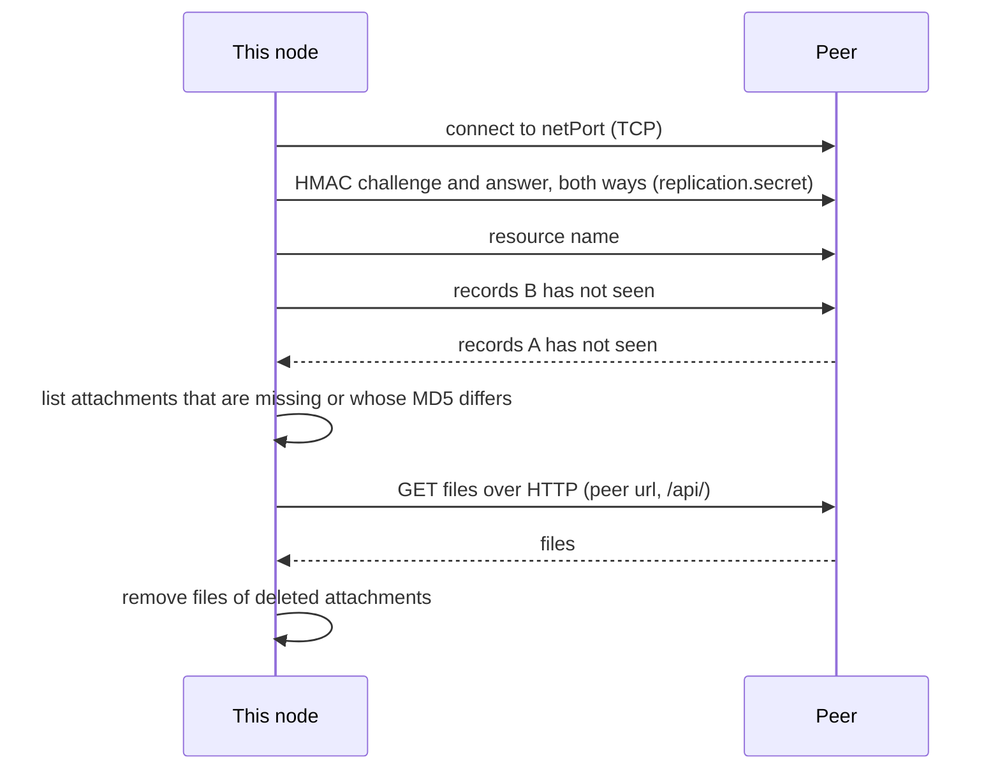
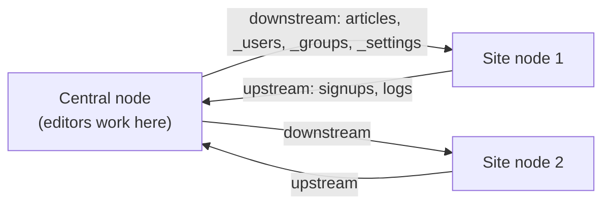

# Replication

Replication keeps the records and files of a resource identical on several node-cms servers. The usual reason is a
fleet: one server where editors work, and several sites, kiosks or edge servers that should show the same content, or
that collect data (logs, sign-ups) and send it back.

It works at the level of the store, record by record, and knows which node created each record. If you only need to
copy a few resources between a staging and a production CMS now and then, the simpler [sync plugin](SYNC.md) may be a
better fit.

## How it works

Every record id carries the [`mid`](CONFIG.md#core) of the node that created it. A node only edits its own records; the
others it receives from peers are read-only (`_local: false`). This is what keeps two nodes from overwriting each other,
and why every node needs its own 8-character `mid`.

A sync between two nodes has two parts:

1. **Records** go over a TCP connection. The node that starts the sync connects to the peer's replication port and
   names a resource; both sides then exchange the changes the other hasn't seen yet, using an index of changes per
   machine.
2. **Files** go over HTTP. Once the records are in, the node compares the attachments of the records it received with
   what it has (by MD5), downloads the missing or changed ones from the peer's REST API, and removes those that are
   gone.



A sync starts after each create, update or remove of a record whose resource has a `type` other than `normal` (if that
resource has peers), or when you ask for it over HTTP or from code.

## Setting it up

The replication plugin is **on by default** (`disableReplication: false`). With no peers it has nothing to do. Two settings
make it useful:

- `netPort`: the TCP port this node listens on, so peers can connect to it. Without it, the node can still push to and
  pull from peers, but no peer can start a sync with it.
- `replication.peers` (or `replication.peersByResource`): the nodes this one syncs with.

```json
{
  "mid": "editnode",
  "netPort": 9000,
  "replication": {
    "secret": "the-same-long-random-string-on-every-node",
    "peers": [
      { "host": "site-1.internal", "port": 9000, "url": "http://site-1.internal:9990/api/", "direction": "downstream" }
    ],
    "peersByResource": {
      "signups": [
        { "host": "site-1.internal", "port": 9000, "url": "http://site-1.internal:9990/api/", "direction": "upstream" }
      ]
    },
    "auth": { "username": "replicator", "password": "…" }
  }
}
```

| Option | What it does |
|---|---|
| `netPort` | Port to listen on for peers. No default: without it the node doesn't listen. |
| `replication.peers` | The peers of every resource. Each peer is `{ host, port, url, direction }`: `host` and `port` reach its `netPort`, `url` is its REST API, ending in `/api/`, for files. |
| `replication.peersByResource` | Peers per resource name. Replaces `peers` for that resource. |
| `replication.auth` | `{ username, password }` sent as Basic credentials when downloading files from a peer that requires a login. |
| `replication.secret` | A shared secret. Both sides prove they know it (HMAC-SHA256 challenge) before any resource is named. Required when `netPort` is set (unless `security.strictReplication` is turned off). |
| `replication.strictTypes` | Make `direction` matter (see below). Off by default. |
| `replication.settleDelay` | Milliseconds to wait for the peer to flush before syncing files (`2000`). |
| `replication.maxRecordBytes` | Largest record accepted from a peer with `strictReplication` (4 MB). |

### Directions

A resource declares how its data flows with `type` in its declaration:

| `type` | Meaning | Typical use |
|---|---|---|
| `normal` (default) | Both ways. | Content edited on several nodes. |
| `downstream` | From the central node down to the others. | Content edited centrally and shown on every site; `_users`, `_groups` and `_settings` are downstream. |
| `upstream` | From the nodes up to the central one. | Logs, analytics, form submissions collected on each site. |



Two things to know. First, only resources whose `type` isn't `normal` sync automatically after a write; a `normal`
resource syncs when you ask. Second, the direction rules of peers are only applied with `replication.strictTypes: true`.
Without it every resource is treated as `normal`, as in earlier releases. Before you turn it on, give every peer a
`direction`, or it stops syncing `_users`, `_groups` and `_settings` ([SECURITY.md](../SECURITY.md#other-options-added)
explains why).

## Starting a sync by hand

When replication runs, the admin has a **Replicator** page in the System menu (for the `admins` group, which gets it by
default). It lists the resources with their type and peers, syncs a resource or one record, and says which peers failed.
The same is available over HTTP to any logged-in user (the routes are in `routesToAuth`), and from code:

| Route | What it does |
|---|---|
| `GET /replicator/resources` | Resources with their type and peers. |
| `POST /replicator/sync/:resource` | Sync a resource with its peers. |
| `POST /replicator/sync/:resource/:id` | Bring one record to the peers: `404` if this node doesn't have it. The record travels with any other change of the resource the peer hasn't seen yet (the protocol exchanges changes, so nothing is sent twice); only that record's attachments are synced. |

```js
await cms.$replicator.syncResource('articles')
```

## What can go wrong

- **Nothing arrives.** Check that the peer has `netPort` set and that a firewall lets you reach it, that `host` and
  `port` point to that port (not to the HTTP port), and that both nodes have the same `replication.secret`.
- **Records arrive, files don't.** `url` must be the peer's REST API ending in `/api/`, reachable from this node. If the
  peer requires a login to read the resource, set `replication.auth`. Look in the log for MD5 mismatches.
- **"Can't modify foreign records".** The record was created on another node. Edit it there.
- **Two nodes clash.** They share a `mid`. Give each node its own, before it creates records.
- **`POST /replicator/sync/…` answers 200 but nothing changed.** Errors of each peer are collected into the answer
  instead of failing the request. Read the body (the Replicator page shows them), and the server log.

## Security

The replication port can read and write every record of the resources it serves. Set `replication.secret` on every node,
firewall the port to the peers, and run it on a private network or a tunnel: the secret authenticates peers, it doesn't
encrypt the traffic. With `strictReplication` (on by default), a peer may only ask for resources this node has,
and what it sends is validated. Details in [SECURITY.md](../SECURITY.md).
