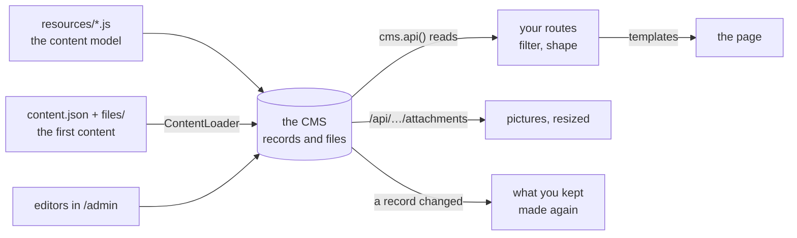

← [Documentation](../README.md)

# Examples: three sites and an app built on embed-cms

Three of the examples are runnable sites in this folder. Each is one Express application: the CMS (the admin for editors, the API for files) and the public pages your visitors see, side by side. The fourth, [Boardwalk](taskboard/README.md), is an application: a Vue 3 single-page app that uses the CMS as its backend. Each has its own README written as a tutorial, to read with the code beside it. Start one, open it, change something in the admin, reload the page, and you have seen the whole loop.

| | [Blog](site/README.md) | [Magazine](magazine/README.md) | [Docs platform](platform/README.md) (advanced) |
|---|---|---|---|
| What it is | The shortest site: four articles, a list, a 404 and an error page | A bilingual magazine: authors, categories, pictures, a search, a feed, a sitemap | A platform that hosts the docs of several products, a version at a time, some of it for members: a sign-in, private files, a support form |
| How the pages are made | The [PageHelper](../reference/PAGE_HELPER.md) renders [Mustache](https://mustache.github.io/mustache.5.html) templates and keeps the finished pages | Express routes, `cms.api()` and a template engine of its own (thirty lines around `_.template`) | The PageHelper for the public pages, Express routes for the rest |
| Resources | 1 (`articles`) | 4 (`settings`, `authors`, `categories`, `articles`) with relations between them | 5 (`products`, `versions`, `pages`, `members`, `messages`), a tree of three levels |
| Languages | 1 | 2 (`/en`, `/zh`) | 1 |
| Pictures and files | none | covers and photos, resized by the CMS, public | diagrams and PDFs, streamed by the site, public or for members |
| Read it to learn | How little code a site needs | What a site with relations, pictures and two languages asks for | How to keep the CMS off the public site, and decide in code who sees what |
| Run it | `cd docs/examples/site && node server.js` | `cd docs/examples/magazine && node server.js` | `cd docs/examples/platform && node server.js` |

They open on `http://localhost:3000`. The blog and the magazine have the admin on `/admin` of the same address; the platform has it on `http://127.0.0.1:3001/admin`, on another port (`localAdmin` / `localAdmin` on a development machine). The first start loads the content from `content.json`; the next ones change nothing.

## The three tutorials

- [**The blog**](site/README.md): the shortest way to a site. The tutorial builds it in seven steps (a resource, the CMS and the site in one application, the first content, the templates, a route and its loader, the 404 and error pages) and ends with the sitemap and how a request becomes a page. Every option of the helper is in [PageHelper](../reference/PAGE_HELPER.md).
- [**The magazine**](magazine/README.md): what a site with relations, pictures, two languages, a search and a feed asks for. The tutorial builds it in ten steps, each with the code of the file it is about, and has the sitemap of all its pages.
- [**The docs platform**](platform/README.md): the advanced one. A platform that hosts the documentation of several products, a version at a time (`/tidewater/latest/…` goes to the current one, an old version says so, a switcher keeps you on the page), whose CMS is **not** on the public site: a second port for the editors, the site reading in its own process, products and pages that are public or for members (text, diagram and PDF alike, by one rule), a sign-in of its own with passwords nobody can read back, and a support form that names the page it is about. It is the one to read before you put private content on embed-cms.

- [**Boardwalk**](taskboard/README.md): not a site but an app. A team task board in **Vue 3** (single-file components, Vue Router, Vite, no state library, no TypeScript) over the REST API of the CMS: a login whose cookie the app never sees, one small client, one generic store for the records of a resource (optimistic writes that are taken back, writes kept in order, answers that come late), real time as the CMS really says it (a removal has no id, a file is announced by its own id), drag and drop with one write, a filter in the address, a card that others change while you edit it, and hooks of the CMS that number the cards and sign the comments. It has about 270 tests, down to the real CMS with a real websocket.

Each tutorial has a few screenshots, only to show what the code makes.

## What they have in common: the core of using the CMS in a project

These are the few ideas a project needs. Each one is the same in all three examples (the platform changes the second, and says why), so learn them once.



### 1. The content model is a file per resource

A file in `resources/` is a resource: its `schema` is the fields the editors fill, and the file name is the name of the resource. Both examples keep theirs next to the site, and give the folder to the CMS with `resources:`. See [Field types](../reference/FIELDS.md).

```js
// resources/articles.js
module.exports = {
  displayname: { enUS: 'Articles' },
  locales: ['enUS'],
  schema: [
    { field: 'title', input: 'string', label: 'Title', required: true },
    { field: 'slug', input: 'string', label: 'Slug', localised: false, required: true, unique: true },
    { field: 'body', input: 'wysiwyg', label: 'Body' },
    { field: 'published', input: 'checkbox', label: 'Published', localised: false }
  ]
}
```

### 2. The CMS and the site are one Express application, the CMS first

`cms.express()` answers `/admin` and `/api`; your pages go after it so they never take its addresses. The CMS starts when the server listens.

```js
const cms = new CMS({ mid: 'webnode1', resources: './resources', data: './data', anonymousRead: ['articles'] })
const app = express()
app.use(cms.express())      // /admin, /api, the files
app.use(pages)              // your pages
const server = app.listen(3000, () => cms.bootstrap(server))
```

`anonymousRead` is what a visitor's browser may read over `/api` (the pictures of a page come from there): reads only, nothing can be written. See [Getting started](../start/GETTING_STARTED.md).

### 3. The first content is a JSON file

`content.json` is a list of records for each resource. A relation is a URI (`authors://mei-lin`), a file is another (`attachment://files/cover.jpg`). The [ContentLoader](../operations/CONTENT_LOADER.md) checks all of it before it writes, and a second run changes nothing.

```json
{ "slug": "slow-mornings-in-lisbon", "title": { "enUS": "Slow mornings in Lisbon" },
  "author": "authors://mei-lin", "cover": "attachment://files/articles/slow-mornings-in-lisbon.jpg" }
```

```js
const server = app.listen(3000, async () => {
  await cms.bootstrap(server)
  await new CMS.ContentLoader(cms).load('./content.json')
})
```

### 4. A page reads with `cms.api()`, and the filter is the rule of the site

`cms.api()` reads with the rights of your server, so **the filter is what keeps a draft off the site**: `published: true` in every read. Name the related resources to get the author as a record, not an id. See [the API](../reference/API.md).

```js
const articles = await cms.api('articles', 'authors', 'categories').list({ published: true })
const one = await cms.api('articles').find({ slug, published: true })    // undefined → a 404
```

### 5. Two ways to make the page

- **PageHelper (blog):** a route names a template and a loader that returns the data; the helper renders it and keeps it. Templates have no code, so a designer cannot break the server. See [PageHelper](../reference/PAGE_HELPER.md).
- **Your own engine (magazine):** an Express `res.render` over `_.template` files, with the page sent by your route. More to write, nothing hidden.

```js
router.get('/articles/:slug', pages.route('article', async ({ api, params, notFound }) => {
  const article = await api('articles').find({ slug: params.slug, published: true })
  return article ? { article } : notFound()
}))
```

### 6. Keep what is costly, and make it again when a record changes

The blog keeps whole pages, made again when a template file or a record it read is updated. The magazine keeps its lists in memory and clears them in a hook when a record is created, updated or removed, and tells the browser `Last-Modified` so it gets a `304` with no body. Whichever you pick, **the editor's change must show at once**. See [hooks](../reference/API.md#hooks).

### 7. Pictures come from the CMS, at the size the page needs

`/api/articles/<id>/attachments/<fileId>.jpg?resize=640xauto` is resized by the CMS, which keeps the copy. The magazine gives the browser a `srcset` of four widths. See [attachments](../reference/API.md#attachments).

### 8. A 404 and an error are pages too

An address no route answered gets a 404 page; a route that threw gets an error page that **says nothing of the error** (it is logged). The error page must not need the CMS: it is what is shown when the CMS failed.

### 9. Private content: keep the CMS off the public site

`anonymousRead` opens a resource **and every file of it**, drafts included: a visitor who guesses the address of a draft's cover can fetch it. That is fine for the pictures of a magazine and wrong for content that is private. The [docs platform](platform/README.md) shows the other way: the CMS has its own application on its own port, for the editors; the public site has no `/api`, reads the CMS in its own process (`cms.api()`), and streams each file from a route of its own, after the one question it asks of every page, text, diagram and PDF alike: *may this visitor read this page?*

### 10. An app is not a site: the front end gets the REST API, and listens

When the front end is an application, the pages are made in the browser and the CMS is reached over `/api`: with a cookie that the app cannot read, a client that is the only place that talks HTTP, records held by id and written optimistically, and the websocket of the CMS to hear about changes. What the REST API gives, and does not give (no sort, a removal with no id, a file announced by its own id), shapes the stores. [Boardwalk](taskboard/README.md) is that, step by step.

## Where to go next

- Your own resources and fields: [Field types](../reference/FIELDS.md).
- Who may read and write what: [Getting started](../start/GETTING_STARTED.md), [Security](../../SECURITY.md).
- More traffic: put the pages behind a cache or a CDN; the `304` and the kept pages are what they need. [What a bigger site would change](magazine/README.md#what-a-bigger-site-would-change).
