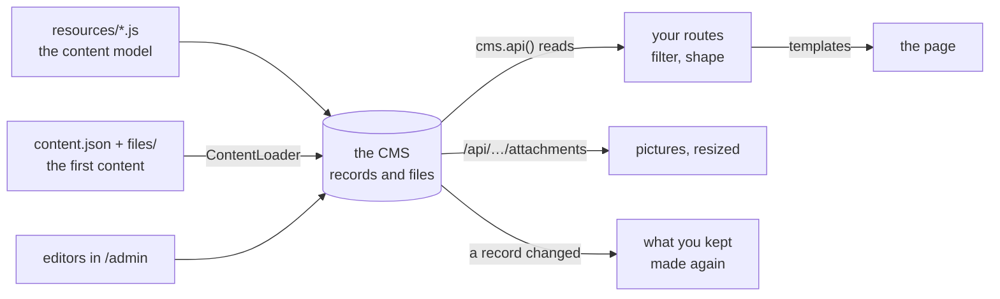

← [Documentation](../README.md)

# Examples

This folder holds five runnable examples. Each has its own README, written as a tutorial to read with the code beside it.

- Three are sites. Each is one Express application: the CMS (the admin for editors, the API for files) and the public pages your visitors see, side by side.
- One, [Boardwalk](taskboard/README.md), is an application: a Vue 3 single-page app that uses the CMS as its backend.
- One, [Docker](docker/README.md), is not a site. It shows how to run one in a container, with every secret in a `.env`.

Start a site, open it, change something in the admin and reload the page. You have then seen the whole loop.

| | [Blog](site/README.md) | [Magazine](magazine/README.md) | [Docs platform](platform/README.md) (advanced) |
|---|---|---|---|
| What it is | The shortest site: four articles, a list, a 404 and an error page | A bilingual magazine: authors, categories, pictures, a search, a feed, a sitemap | A platform that hosts the docs of several products, one version at a time, some for members only: a sign-in, private files, a support form |
| How the pages are made | The [PageHelper](../reference/PAGE_HELPER.md) renders [Mustache](https://mustache.github.io/mustache.5.html) templates and keeps the finished pages | Express routes, `cms.api()` and a template engine of its own (thirty lines around `_.template`) | The PageHelper for public pages, Express routes for the rest |
| Resources | 1 (`articles`) | 4 (`settings`, `authors`, `categories`, `articles`), with relations | 5 (`products`, `versions`, `pages`, `members`, `messages`), a tree of three levels |
| Languages | 1 | 2 (`/en`, `/zh`) | 1 |
| Pictures and files | None | Covers and photos, resized by the CMS, public | Diagrams and PDFs, streamed by the site, public or for members |
| Read it to learn | How little code a site needs | What a site with relations, pictures and two languages needs | How to keep the CMS off the public site, and decide in code who sees what |
| Run it | `cd docs/examples/site && node server.js` | `cd docs/examples/magazine && node server.js` | `cd docs/examples/platform && node server.js` |

The sites open on `http://localhost:3000`. The blog and the magazine have the admin at `/admin` on the same address. The platform has it at `http://127.0.0.1:3001/admin`, on another port. On a development machine, sign in with `localAdmin` / `localAdmin`. The first start loads the content from `content.json`. Later starts change nothing.

## The tutorials

- [**The blog**](site/README.md) is the shortest way to a site. It builds the site in seven steps: a resource, the CMS and the site in one application, the first content, the templates, a route and its loader, and the 404 and error pages. It ends with the sitemap and how a request becomes a page. Every option of the helper is in [PageHelper](../reference/PAGE_HELPER.md).
- [**The magazine**](magazine/README.md) shows what a site needs when it has relations, pictures, two languages, a search and a feed. It builds the site in ten steps, each with the code of the file it is about, and it has the sitemap of all its pages.
- [**The docs platform**](platform/README.md) is the advanced one. It hosts the documentation of several products, one version at a time. `/tidewater/latest/…` goes to the current version, an old version says it is old, and a switcher keeps you on the same page.
  - Its CMS is not on the public site. Editors get a second port, and the site reads the CMS inside its own process.
  - Products and pages are public or for members, and one rule covers text, diagrams and PDFs.
  - It has its own sign-in, with passwords nobody can read back, and a support form that names the page it is about.

  Read it before you put private content on embed-cms.
- [**Boardwalk**](taskboard/README.md) is an app, not a site. It is a team task board in Vue 3 (single-file components, Vue Router, Vite, no state library, no TypeScript) over the REST API of the CMS. It shows:
  - a login whose cookie the app never sees;
  - one small HTTP client, and one generic store for the records of a resource, with optimistic writes, writes kept in order and late answers ignored;
  - real time as the CMS really sends it: a removal has no id, and a file is announced by its own id;
  - drag and drop with one write, a filter in the address, and a card that others can change while you edit it;
  - hooks in the CMS that number the cards and sign the comments.

  About 270 tests reach down to the real CMS with a real websocket.
- [**Docker**](docker/README.md) shows how to run embed-cms in a container that is safe to share. The image holds the program and no secret. Every secret is in a `.env` on the host.
  - Three scripts make that file with random values, check it, and build the image. The build script looks for those secrets in what it built.
  - A `compose.yaml` runs the container read-only, as a user that is not root, on this machine's address only.

  The app is the smallest one that shows this, and the folder is made to be copied under your own project.

Each tutorial has a few screenshots, only to show what the code makes.

## What they have in common

These are the few ideas a project needs. They are the same in all three sites (the platform changes the second one, and says why), so you only have to learn them once.



### 1. The content model is one file per resource

A file in `resources/` is a resource. Its `schema` lists the fields the editors fill in, and the file name is the name of the resource. Each example keeps its resources next to the site and gives the folder to the CMS with `resources:`. See [Field types](../reference/FIELDS.md).

```js
// resources/articles.js
module.exports = {
  displayname: { enUS: 'Articles' },
  locales: ['enUS'],
  schema: [
    { field: 'title', input: 'string', label: 'Title', required: true },
    { field: 'slug', input: 'string', label: 'Slug', localised: false, required: true, unique: true },
    { field: 'body', input: 'wysiwyg', label: 'Body' },
    { field: 'published', input: 'checkbox', label: 'Published', localised: false }
  ]
}
```

### 2. The CMS and the site are one Express application, the CMS first

`cms.express()` answers `/admin` and `/api`. Mount your pages after it, so they never take its addresses. The CMS starts when the server listens.

```js
const cms = new CMS({ mid: 'webnode1', resources: './resources', data: './data', anonymousRead: ['articles'] })
const app = express()
app.use(cms.express())      // /admin, /api, the files
app.use(pages)              // your pages
const server = app.listen(3000, () => cms.bootstrap(server))
```

`anonymousRead` sets what a visitor's browser may read over `/api`. The pictures of a page come from there. It allows reads only, and nothing can be written. See [Getting started](../start/GETTING_STARTED.md).

### 3. The first content is a JSON file

`content.json` is a list of records for each resource. A relation is a URI (`authors://mei-lin`), and a file is another URI (`attachment://files/cover.jpg`). The [ContentLoader](../operations/CONTENT_LOADER.md) checks everything before it writes, and a second run changes nothing.

```json
{ "slug": "slow-mornings-in-lisbon", "title": { "enUS": "Slow mornings in Lisbon" },
  "author": "authors://mei-lin", "cover": "attachment://files/articles/slow-mornings-in-lisbon.jpg" }
```

```js
const server = app.listen(3000, async () => {
  await cms.bootstrap(server)
  await new CMS.ContentLoader(cms).load('./content.json')
})
```

### 4. A page reads with `cms.api()`, and the filter is the rule of the site

`cms.api()` reads with the rights of your server. So the filter is what keeps a draft off the site: put `published: true` in every read. Name the related resources to get the author as a record, not an id. See [the API](../reference/API.md).

```js
const articles = await cms.api('articles', 'authors', 'categories').list({ published: true })
const one = await cms.api('articles').find({ slug, published: true })    // undefined → a 404
```

### 5. Two ways to make the page

- PageHelper (blog). A route names a template and a loader that returns the data. The helper renders the page and keeps it. Templates have no code, so a designer cannot break the server. See [PageHelper](../reference/PAGE_HELPER.md).
- Your own engine (magazine). Express `res.render` over `_.template` files, with your route sending the page. It is more to write, and nothing is hidden.

```js
router.get('/articles/:slug', pages.route('article', async ({ api, params, notFound }) => {
  const article = await api('articles').find({ slug: params.slug, published: true })
  return article ? { article } : notFound()
}))
```

### 6. Keep what is costly, and make it again when a record changes

The blog keeps whole pages. It makes a page again when a template file, or a record the page read, is updated. The magazine keeps its lists in memory and clears them in a hook when a record is created, updated or removed. It also sends `Last-Modified`, so a browser gets a `304` with no body. Whichever way you choose, an editor's change must show at once. See [hooks](../reference/API.md#hooks).

### 7. Pictures come from the CMS, at the size the page needs

`/api/articles/<id>/attachments/<fileId>.jpg?resize=640xauto` is resized by the CMS, which keeps the copy. The magazine gives the browser a `srcset` of four widths. See [attachments](../reference/API.md#attachments).

### 8. A 404 and an error are pages too

An address that no route answered gets a 404 page. A route that threw gets an error page that says nothing about the error, which is logged. The error page must not need the CMS, because it is what visitors see when the CMS failed.

### 9. Private content: keep the CMS off the public site

`anonymousRead` opens a resource and every file of it, drafts included. A visitor who guesses the address of a draft's cover can fetch it. That is fine for the pictures of a magazine, and wrong for private content.

The [docs platform](platform/README.md) shows the other way. The CMS has its own application on its own port, for editors. The public site has no `/api`, and reads the CMS in its own process with `cms.api()`. It streams each file from a route of its own, after asking one question of every page, whether text, diagram or PDF: may this visitor read this page?

### 10. An app is not a site: the front end uses the REST API, and listens

When the front end is an application, the pages are made in the browser and the app reaches the CMS over `/api`. It uses a cookie the app cannot read, one client that is the only place that talks HTTP, records held by id and written optimistically, and the websocket of the CMS to hear about changes. What the REST API gives, and what it does not give (no sort, a removal with no id, a file announced by its own id), shapes the stores. [Boardwalk](taskboard/README.md) shows this step by step.

## Where to go next

- Your own resources and fields: [Field types](../reference/FIELDS.md).
- Who may read and write what: [Getting started](../start/GETTING_STARTED.md) and [Security](../../SECURITY.md).
- More traffic: put the pages behind a cache or a CDN. The `304` and the kept pages are what they need. See [what a bigger site would change](magazine/README.md#what-a-bigger-site-would-change).
