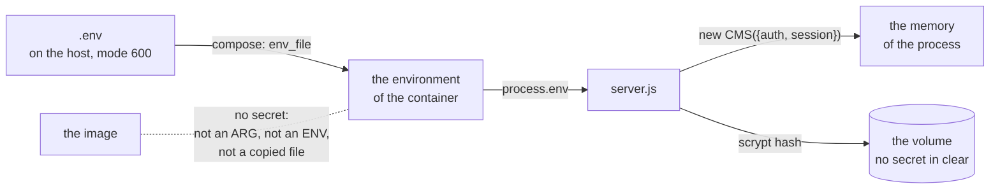

← [Examples](../README.md)

# Docker: every secret in a `.env`, an image with none, and three scripts

This example is not a site, it is a way to **run embed-cms in a container** that is safe to share: the image holds the program and no secret, the secrets are in a `.env` file on the machine that runs it, and three scripts make the file, build the image and start it. It is the smallest app that shows it (a `notes` resource, two notes, the admin and the API), and the folder is made to be copied under your own project.

| What | Where it lives |
|---|---|
| The program, its modules, its resources, its non-secret settings (`cms.json`) | the **image**: the same on every machine, and fit for a registry that others can read |
| `AUTH_SECRET`, `SESSION_SECRET`, the password of the first administrator | the **`.env`** file, on the host: never in git, never in the build, never in the image |
| The records and the files | the **volume** `embed-cms-docker_data` |

## Run it

You need Docker with Compose (`docker compose version` answers) and a bash: Linux, macOS, or WSL on Windows (run the scripts in the shell where `docker` works).

```
cd docs/examples/docker
./scripts/start.sh
```

The first start makes `.env` with random secrets, builds the image, and starts the container. When it says `up`:

```
curl http://localhost:3000/api/notes          # the two notes: they can be read by anybody
curl http://localhost:3000/healthz            # {"ok":true}
```

The admin is at `http://localhost:3000/admin`: the browser asks for a name and a password, which are `ADMIN_USERNAME` and `ADMIN_PASSWORD` in `.env` (the password was made at random: open the file to read it).

| Command | What it does |
|---|---|
| `./scripts/env.sh` | Makes `.env` from `.env.example` when there is none, fills the secrets that are empty with random values (a value that is there is never changed), and checks the file. `--check` only checks. |
| `./scripts/build.sh` | Builds the image, then checks that it holds no secret. `TAG=1.2.0 ./scripts/build.sh` tags a version. |
| `./scripts/start.sh` | Runs `env.sh`, builds the image if there is none, and does `docker compose up --wait`: the container is made, or replaced when the image or `.env` changed since (compose compares), and the script waits until it is healthy. |
| `docker compose logs -f` | What it says. |
| `docker compose stop` | Stops it properly: the databases are closed and the exit code is 0. `docker compose down` removes the container, and keeps the volume. |

| File | What it does |
|---|---|
| `server.js` | The program: the CMS, a `/healthz`, the secrets from the environment, the first administrator. |
| `cms.json` | The settings that are not secret (the [recommended production](../../../SECURITY.md#recommended-production-configuration) ones). In the image. |
| `resources/`, `content.json` | The example's content model, and two notes loaded the first time. Replace them with yours. |
| `Dockerfile`, `.dockerignore` | The image, and what the build is not given. |
| `compose.yaml` | How it runs: the `.env` it is given, the port, the volume, and the limits of the container. |
| `.env.example` | Every setting of the deployment, with the secrets empty. `.env` is made from it. |
| `.gitignore` | Leaves `.env` out of git. |
| `scripts/` | `env.sh`, `build.sh`, `start.sh`, and `common.sh` that they share. |
| `package.json`, `package-lock.json` | `embed-cms` from npm, locked: the image installs what the lock says. |

## Where a secret goes, and where it does not



A secret reaches the program in one way, the environment, and it is kept in one place, the memory of the process. The steps below say what keeps it from going anywhere else.

## Build it, step by step

### 1. The program reads its secrets from the environment

[`server.js`](server.js) gives them to the constructor and to nothing else:

```js
const cms = new CMS({
  mid: 'webnode1',
  resources: path.join(__dirname, 'resources'),
  data: DATA,
  config: path.join(__dirname, 'cms.json'),
  anonymousRead: ['notes'],
  ...(authSecret ? { auth: { secret: authSecret } } : {}),
  ...(sessionSecret ? { session: { secret: sessionSecret } } : {})
})
```

In production a secret that is missing or shorter than 32 characters stops the start, and the message names the variable (`AUTH_SECRET is missing or shorter than 32 characters: put a long random value in .env`). The CMS would refuse too, but it says that "a secret" is too short. Outside production nothing is required, so `node server.js` on a laptop works with the CMS's development defaults.

### 2. A `cms.json` that is in the image, so that the CMS does not write one

The [configuration](../../reference/CONFIG.md#where-the-configuration-comes-from) says that **the CMS writes `cms.json` on its first boot when the file is missing, with the options of the constructor in it**: the secrets too. Here the file is part of the image (it holds only the settings that are not secret), so the CMS finds it and writes nothing, and the secrets of the constructor are used and never saved. `config: path.join(__dirname, 'cms.json')` says where it is; the container's file system is read-only anyway, so a write would fail loudly.

### 3. The first administrator

With `NODE_ENV=production` the CMS makes no `localAdmin`, so a new deployment has nobody to sign in. `server.js` makes the first administrator from `ADMIN_USERNAME` and `ADMIN_PASSWORD`:

```js
const api = cms.api()
if ((await api('_users').find({ username }))?._id) {
  return
}
const admins = await api('_groups').find({ name: 'admins' })
await api('_users').create({ username, password, group: admins._id })
```

It is made once, when nobody has that name, and the password is stored as a scrypt hash (`grep` for it in the volume finds nothing). The password of an account that exists is never changed by a restart. So after the first start you can change it in the admin and **delete the `ADMIN_PASSWORD` line** from `.env`: `env.sh` does not put it back, and `server.js` makes no one.

### 4. The Dockerfile has no secret to leak

[`Dockerfile`](Dockerfile) has two stages: the first runs `npm ci --omit=dev` over the lock file, the second takes the modules and copies **the files by name** (`server.js cms.json content.json package.json resources`). No `ARG` and no `ENV` carries a secret, because a value given to a build stays in the layers, where `docker history` shows it to whoever can pull the image. It runs as `node`, not root, and has a `HEALTHCHECK` that asks `/healthz`.

`CMD ["node", "server.js"]` has no shell around it, so the `SIGTERM` that `docker stop` sends reaches the program, which closes the databases and leaves with 0.

### 5. Two files that keep `.env` out

[`.gitignore`](.gitignore) leaves `.env` out of git. [`.dockerignore`](.dockerignore) leaves it out of the build context, so even a `COPY . .` that someone adds later cannot put it in the image (`.env.example`, which has no secret, is the one `.env*` file that passes).

### 6. `scripts/env.sh` makes the file

```
$ ./scripts/env.sh
made .env from .env.example
made random values for: AUTH_SECRET SESSION_SECRET ADMIN_PASSWORD (they are in .env, and only there)
.env is ready
```

It never prints a value. The file is made with `umask 077`, so only its owner can read it. It fills only the secrets that are **empty**, so it can be run again at any time, and it keeps what a person wrote. Then it checks the file: both secrets at least 32 characters and different, a password of 12 or more if the line is there. A file saved on Windows (a line end of two characters) is read right.

Secrets of your own, from a password manager? Put them in `.env` yourself; the script keeps them.

### 7. `scripts/build.sh` builds, and checks the image

The build is given no `.env` and no argument: the image is the same everywhere. After it, the script **looks for the secrets in what it built**:

```
checking the image
  ok   no .env in the image
  ok   no secret of .env in the layers or the settings of the image
  ok   without secrets it refuses to start, and names AUTH_SECRET
```

The second line takes the values of `.env` and looks for them in `docker image inspect` and `docker history --no-trunc`. The third runs the image with nothing, and the image has to refuse. The script fails when one of them does not hold, so it can be a step of a pipeline. To push the image, name it: `IMAGE=registry.example.com/team/cms TAG=1.2.0 ./scripts/build.sh`, then `docker push`.

### 8. `compose.yaml` runs it, and `scripts/start.sh` starts it

[`compose.yaml`](compose.yaml) is one service, and everything that makes the container safe is a line of it:

```yaml
services:
  cms:
    image: ${IMAGE:-embed-cms-docker}:${TAG:-latest}
    build: .
    env_file: .env
    restart: unless-stopped
    ports:
      - "127.0.0.1:${HOST_PORT:-3000}:3000"
    volumes:
      - data:/data
    read_only: true
    tmpfs: [/tmp]
    cap_drop: [ALL]
    security_opt: [no-new-privileges:true]
    init: true
    stop_grace_period: 10s
```

| Line | Why |
|---|---|
| `env_file: .env` | The secrets go from the file to the container, and are written **in no other place**: not in `compose.yaml` (which can be committed), not on a command line (so not in `ps` or the history of the shell). `.env` is also what fills the `${IMAGE}`, `${TAG}` and `${HOST_PORT}` of the file. |
| `image` and `build` | `build.sh` builds the image and checks it. `build: .` is there for `docker compose build`, and has no `args`: a build argument stays in the layers of the image. |
| `ports: 127.0.0.1:…` | Published on this machine only. The visitors reach a reverse proxy that does the https; the CMS is not open to the network on its own. |
| `volumes: data:/data` | The one place the program writes (`DATA_DIR`). The container can be replaced, the records stay in the volume `embed-cms-docker_data`. |
| `read_only`, `tmpfs` | Nothing can be written but the volume and `/tmp`: a flaw in the app cannot change the program. |
| `cap_drop: ALL`, `no-new-privileges` | The program has no power of its own, and cannot get one. |
| `init: true` | A process that reaps the others and passes the signals on. |
| `restart: unless-stopped` | It comes back after a crash and after a reboot of the machine. |
| `stop_grace_period` | The time the program has, after `SIGTERM`, to close its databases. |

`start.sh` is `env.sh`, then `build.sh` if there is no image, then `docker compose up --detach --wait --no-build`. `--wait` returns when the `HEALTHCHECK` of the image says healthy (up to 90 seconds), and fails when the container stops: the script then shows its last lines. Run `start.sh` again after a change of `.env` or of the image: compose sees that the container is not the one it would make now, and replaces it.

One thing to know: `docker compose config` prints the file **with `.env` put in it, the secrets too**. Use `docker compose config -q` to check the file, and do not paste the other in a ticket or a CI log.

### 9. Behind a reverse proxy

`cms.json` says `"trustProxy": 1`: there is one proxy in front, so the CMS reads the address of the visitor, and `secure` cookies, from what the proxy forwards. Put a proxy (nginx, Caddy, Traefik) on the machine, give it the https certificate, and send `/` to `127.0.0.1:3000` with `X-Forwarded-For` and `X-Forwarded-Proto`. Change the number when there are more proxies. See the [hardening checklist](../../../SECURITY.md#hardening-checklist).

## Day to day

| To | Do |
|---|---|
| **Change a secret** (a leak, a person who left) | Edit `.env` (or empty the line and run `./scripts/env.sh`), then `./scripts/start.sh`: compose replaces the container with one that has the new value. Changing `AUTH_SECRET` or `SESSION_SECRET` signs everybody out, and nothing else. |
| **Upgrade embed-cms** | Raise `embed-cms` in `package.json`, `npm install --package-lock-only`, then `./scripts/build.sh` and `./scripts/start.sh`. The data in the volume stays. |
| **Back up** | Stop the container first (the databases are files that are written while it runs), then copy the volume: `docker compose stop`, `docker run --rm -v embed-cms-docker_data:/data -v "$PWD":/backup node:22-bookworm-slim tar czf /backup/data.tgz -C /data .`, then `./scripts/start.sh`. |
| **Use your own project** | Copy this folder, replace `resources/` and `content.json` (and the routes of your site in `server.js`), keep the rest. Add the variables your code reads to `.env.example`. |
| **Use another store** | PostgreSQL and MongoDB read their credentials from the environment ([storage engines](../../reference/CONFIG.md#storage-engines)): `POSTGRES_USER` and `POSTGRES_PASSWORD` go in `.env` like the others, and the database is one more service of `compose.yaml`. |

## What this example does not do

- **Whoever can run `docker` on the host can read the secrets** (`docker inspect` shows the environment of a container), as whoever can read `.env`. The `.env` keeps them out of git, of the image and of the registry; it is not a vault. For more, a secret manager that fills the environment at start (or Docker or Kubernetes secrets, with a small change of `server.js` to read a file) is the next step.
- **No https.** The proxy does it.
- **One machine.** No orchestrator and no replicas: a CMS with its data in a volume is one process. [Replication](../../operations/REPLICATION.md) is how more than one is made.

## How it is tested

[`test/unit/exampleDocker.test.js`](../../../test/unit/exampleDocker.test.js) holds what makes the example safe: that `.env` is left out of git and out of the build, that the Dockerfile has no `ARG`, no secret `ENV` and no `COPY . .`, that `compose.yaml` hands the secrets over by `env_file` and has none of its own (no `environment`, no build `args`, a port on 127.0.0.1, a read-only container), that `.env.example` names every variable the program reads and has its secrets empty, that `env.sh` makes, keeps and checks the file as described, and that the real `server.js` run in production refuses to start without the secrets, serves what it should to whom it should, writes no secret in the data it keeps, leaves with 0 on `SIGTERM`, and starts again over what it kept. It does not need Docker: the image is built and run by hand, with these scripts, when this folder changes.
