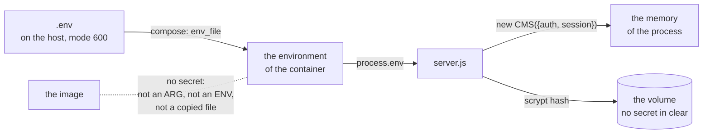

← [Examples](../README.md)

# Docker Example

This example shows how to run embed-cms in a container that is safe to share. The image holds the program and no secret. The secrets live in a `.env` file on the machine that runs the container. Three scripts make that file, build the image and start it.

The app is as small as it can be: a `notes` resource, two notes, the admin and the API. Copy the folder under your own project and replace the app with yours.

| What | Where it lives |
|---|---|
| The program, its modules, its resources and its non-secret settings (`cms.json`) | The image. It is the same on every machine, and fit for a registry that others can read. |
| `AUTH_SECRET`, `SESSION_SECRET`, and the password of the first administrator | The `.env` file on the host. Never in git, never in the build, never in the image. |
| The records and the files | The volume `embed-cms-docker_data`. |

## Run it

You need Docker with Compose (`docker compose version` should answer) and a bash. That means Linux, macOS, or WSL on Windows. Run the scripts in the shell where `docker` works.

```
cd docs/examples/docker
./scripts/start.sh
```

The first start makes `.env` with random secrets, builds the image and starts the container. When the script says `up`, try:

```
curl http://localhost:3000/api/notes          # the two notes: anybody can read them
curl http://localhost:3000/healthz            # {"ok":true}
```

The admin is at `http://localhost:3000/admin`. The browser asks for a name and a password. They are `ADMIN_USERNAME` and `ADMIN_PASSWORD` in `.env`. The password was generated at random, so open the file to read it.

| Command | What it does |
|---|---|
| `./scripts/env.sh` | Makes `.env` from `.env.example` when there is none. Fills the empty secrets with random values and never changes a value that is already there. Then checks the file. `--check` only checks. |
| `./scripts/build.sh` | Builds the image, then checks that it holds no secret. `TAG=1.2.0 ./scripts/build.sh` tags a version. |
| `./scripts/start.sh` | Runs `env.sh`, builds the image if there is none, then runs `docker compose up --wait`. Compose makes the container, or replaces it when the image or `.env` changed. The script waits until the container is healthy. |
| `docker compose logs -f` | Shows what the container says. |
| `docker compose stop` | Stops it cleanly: the databases are closed and the exit code is 0. `docker compose down` removes the container and keeps the volume. |

| File | What it does |
|---|---|
| `server.js` | The program: the CMS, a `/healthz` route, the secrets from the environment, and the first administrator. |
| `cms.json` | The settings that are not secret (the [recommended production settings](../../../SECURITY.md#recommended-production-configuration)). It is in the image. |
| `resources/`, `content.json` | The content model of the example, and two notes loaded the first time. Replace them with yours. |
| `Dockerfile`, `.dockerignore` | The image, and what the build is not given. |
| `compose.yaml` | How the container runs: the `.env` it gets, the port, the volume and the limits. |
| `.env.example` | Every setting of the deployment, with the secrets empty. `.env` is made from it. |
| `.gitignore` | Keeps `.env` out of git. |
| `scripts/` | `env.sh`, `build.sh`, `start.sh`, and `common.sh`, which they share. |
| `package.json`, `package-lock.json` | `embed-cms` from npm, locked. The image installs exactly what the lock says. |

## Where a secret goes, and where it does not



A secret reaches the program one way, through the environment. It is kept in one place, the memory of the process. The steps below show what stops it from going anywhere else.

## Build it, step by step

### 1. The program reads its secrets from the environment

[`server.js`](server.js) gives the secrets to the constructor and to nothing else:

```js
const cms = new CMS({
  mid: 'webnode1',
  resources: path.join(__dirname, 'resources'),
  data: DATA,
  config: path.join(__dirname, 'cms.json'),
  anonymousRead: ['notes'],
  ...(authSecret ? { auth: { secret: authSecret } } : {}),
  ...(sessionSecret ? { session: { secret: sessionSecret } } : {})
})
```

In production, a secret that is missing or shorter than 32 characters stops the start. The message names the variable: `AUTH_SECRET is missing or shorter than 32 characters: put a long random value in .env`. The CMS would refuse too, but its message only says that "a secret" is too short.

Outside production nothing is required. `node server.js` on a laptop works with the CMS's development defaults.

### 2. A `cms.json` in the image, so the CMS does not write one

The CMS writes `cms.json` on its first boot when the file is missing, and it puts the constructor options in it, secrets included ([configuration](../../reference/CONFIG.md#where-the-configuration-comes-from)). Here the file is part of the image and holds only settings that are not secret. The CMS finds it and writes nothing, so the secrets are used and never saved. `config: path.join(__dirname, 'cms.json')` tells the CMS where the file is. The container's file system is read-only anyway, so a write would fail loudly.

### 3. The first administrator

With `NODE_ENV=production` the CMS creates no `localAdmin`, so a new deployment has nobody who can sign in. `server.js` creates the first administrator from `ADMIN_USERNAME` and `ADMIN_PASSWORD`:

```js
const api = cms.api()
if ((await api('_users').find({ username }))?._id) {
  return
}
const admins = await api('_groups').find({ name: 'admins' })
await api('_users').create({ username, password, group: admins._id })
```

The account is created once, when nobody has that name. Its password is stored as a scrypt hash, so searching the volume for it finds nothing. A restart never changes the password of an account that exists.

So after the first start you can change the password in the admin and delete the `ADMIN_PASSWORD` line from `.env`. `env.sh` does not put it back, and `server.js` creates no one.

### 4. A Dockerfile with no secret to leak

[`Dockerfile`](Dockerfile) has two stages. The first runs `npm ci --omit=dev` over the lock file. The second takes the modules and copies the app files by name: `server.js`, `cms.json`, `content.json`, `package.json` and `resources`.

No `ARG` or `ENV` carries a secret. A value given to a build stays in the image layers, and `docker history` shows it to anyone who can pull the image. The container runs as the user `node`, not root, and has a `HEALTHCHECK` that asks `/healthz`.

`CMD ["node", "server.js"]` has no shell around it. The `SIGTERM` that `docker stop` sends reaches the program, which closes the databases and exits with 0.

### 5. Two files that keep `.env` out

[`.gitignore`](.gitignore) keeps `.env` out of git. [`.dockerignore`](.dockerignore) keeps it out of the build context. Even if someone later adds a `COPY . .`, `.env` cannot get into the image. `.env.example` has no secret, so it is the one `.env*` file allowed through.

### 6. `scripts/env.sh` makes the file

```
$ ./scripts/env.sh
made .env from .env.example
made random values for: AUTH_SECRET SESSION_SECRET ADMIN_PASSWORD (they are in .env, and only there)
.env is ready
```

The script never prints a value. It makes the file with `umask 077`, so only the owner can read it. It fills only the empty secrets, so you can run it again at any time, and it keeps whatever a person wrote.

Then it checks the file: both secrets must be at least 32 characters and different from each other, and the admin password, if the line is there, must be 12 or more. A file saved on Windows (with two-character line ends) is read correctly.

If you keep your secrets in a password manager, put them in `.env` yourself. The script leaves them alone.

### 7. `scripts/build.sh` builds the image and checks it

The build gets no `.env` and no secret argument, so the image is the same everywhere. After the build, the script looks for secrets in what it built:

```
checking the image
  ok   no .env in the image
  ok   no secret of .env in the layers or the settings of the image
  ok   without secrets it refuses to start, and names AUTH_SECRET
```

The second check takes the values from `.env` and searches `docker image inspect` and `docker history --no-trunc` for them. The third check runs the image with no secrets, and the image must refuse to start. The script fails if any check fails, so you can use it as a step in a pipeline.

To push the image, name it: `IMAGE=registry.example.com/team/cms TAG=1.2.0 ./scripts/build.sh`, then `docker push`.

### 8. `compose.yaml` runs it, and `scripts/start.sh` starts it

[`compose.yaml`](compose.yaml) is one service. Every line that makes the container safer is below:

```yaml
services:
  cms:
    image: ${IMAGE:-embed-cms-docker}:${TAG:-latest}
    build: .
    env_file: .env
    restart: unless-stopped
    ports:
      - "127.0.0.1:${HOST_PORT:-3000}:3000"
    volumes:
      - data:/data
    read_only: true
    tmpfs: [/tmp]
    cap_drop: [ALL]
    security_opt: [no-new-privileges:true]
    init: true
    stop_grace_period: 10s
```

| Line | Why |
|---|---|
| `env_file: .env` | The secrets go from the file to the container and are written nowhere else. They are not in `compose.yaml`, so you can commit it. They are not on a command line, so they are not in `ps` or in your shell history. `.env` also supplies `${IMAGE}`, `${TAG}` and `${HOST_PORT}` to the compose file. |
| `image`, `build` | `build.sh` builds and checks the image. `build: .` is there for `docker compose build`. It has no `args`, because a build argument stays in the image layers. |
| `ports: 127.0.0.1:…` | The port is published on this machine only. Visitors reach a reverse proxy that does the https. The CMS is not open to the network on its own. |
| `volumes: data:/data` | The one place the program writes (`DATA_DIR`). You can replace the container and the records stay in the volume `embed-cms-docker_data`. |
| `read_only`, `tmpfs` | Nothing can be written except the volume and `/tmp`. A flaw in the app cannot change the program. |
| `cap_drop: ALL`, `no-new-privileges` | The program has no special powers and cannot get any. |
| `init: true` | Runs a small init process that reaps child processes and passes signals on. |
| `restart: unless-stopped` | The container comes back after a crash and after a reboot of the machine. |
| `stop_grace_period` | The time the program has, after `SIGTERM`, to close its databases. |

`start.sh` runs `env.sh`, then `build.sh` if there is no image, then `docker compose up --detach --wait --no-build`. `--wait` returns when the image's `HEALTHCHECK` says healthy (up to 90 seconds). It fails if the container stops, and the script then shows the last lines of the log.

Run `start.sh` again after you change `.env` or the image. Compose sees that the running container is not the one it would make now, and replaces it.

One thing to know: `docker compose config` prints the file with `.env` already put in it, secrets included. Use `docker compose config -q` to check the file, and never paste the full output in a ticket or a CI log.

### 9. Behind a reverse proxy

`cms.json` says `"trustProxy": 1`. That means one proxy sits in front, so the CMS reads the visitor's address, and decides about `secure` cookies, from what the proxy forwards.

Put a proxy (nginx, Caddy or Traefik) on the machine and give it the https certificate. Send `/` to `127.0.0.1:3000` with `X-Forwarded-For` and `X-Forwarded-Proto`. If there is more than one proxy, change the number. See the [hardening checklist](../../../SECURITY.md#hardening-checklist).

## Day to day

| To | Do this |
|---|---|
| Change a secret (a leak, someone leaves) | Edit `.env`, or empty the line and run `./scripts/env.sh`. Then run `./scripts/start.sh`, and compose replaces the container with one that has the new value. Changing `AUTH_SECRET` or `SESSION_SECRET` signs everybody out and does nothing else. |
| Upgrade embed-cms | Raise `embed-cms` in `package.json` and run `npm install --package-lock-only`. Then run `./scripts/build.sh` and `./scripts/start.sh`. The data in the volume stays. |
| Back up | Stop the container first, because the databases are files that are written while it runs. Run `docker compose stop`, then `docker run --rm -v embed-cms-docker_data:/data -v "$PWD":/backup node:22-bookworm-slim tar czf /backup/data.tgz -C /data .`, then `./scripts/start.sh`. |
| Use your own project | Copy this folder. Replace `resources/` and `content.json` (and add your site's routes to `server.js`). Keep the rest. Add every variable your code reads to `.env.example`. |
| Use another store | PostgreSQL and MongoDB read their credentials from the environment ([storage engines](../../reference/CONFIG.md#storage-engines)). Put `POSTGRES_USER` and `POSTGRES_PASSWORD` in `.env` like the other secrets, and add the database as one more service in `compose.yaml`. |

## What this example does not do

- It is not a vault. Anyone who can run `docker` on the host can read the secrets, because `docker inspect` shows a container's environment. Anyone who can read `.env` can too. The `.env` keeps secrets out of git, the image and the registry. For more protection, use a secret manager that fills the environment at start, or Docker or Kubernetes secrets with a small change in `server.js` to read a file.
- It does no https. The proxy does.
- It runs on one machine. There is no orchestrator and no replicas. A CMS with its data in a volume is one process. [Replication](../../operations/REPLICATION.md) is how you run more than one.

## How it is tested

[`test/unit/exampleDocker.test.js`](../../../test/unit/exampleDocker.test.js) checks what makes the example safe:

- `.env` is out of git and out of the build.
- The Dockerfile has no `ARG`, no secret `ENV` and no `COPY . .`.
- `compose.yaml` hands the secrets over with `env_file` and has none of its own: no `environment`, no build `args`, a port on 127.0.0.1, a read-only container.
- `.env.example` names every variable the program reads and has its secrets empty.
- `env.sh` makes, keeps and checks the file as described.
- The real `server.js`, run in production, refuses to start without the secrets, serves each visitor only what they may see, writes no secret in its data, exits with 0 on `SIGTERM`, and starts again over what it kept.

The tests do not need Docker. When this folder changes, build and run the image by hand with the scripts.
