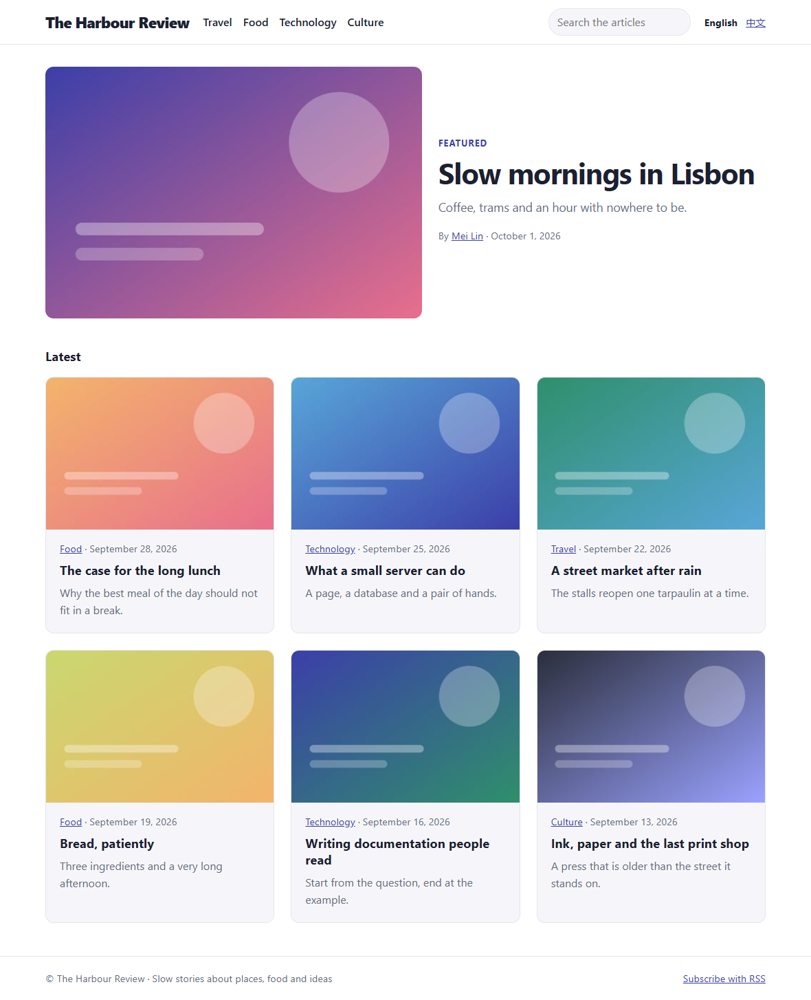
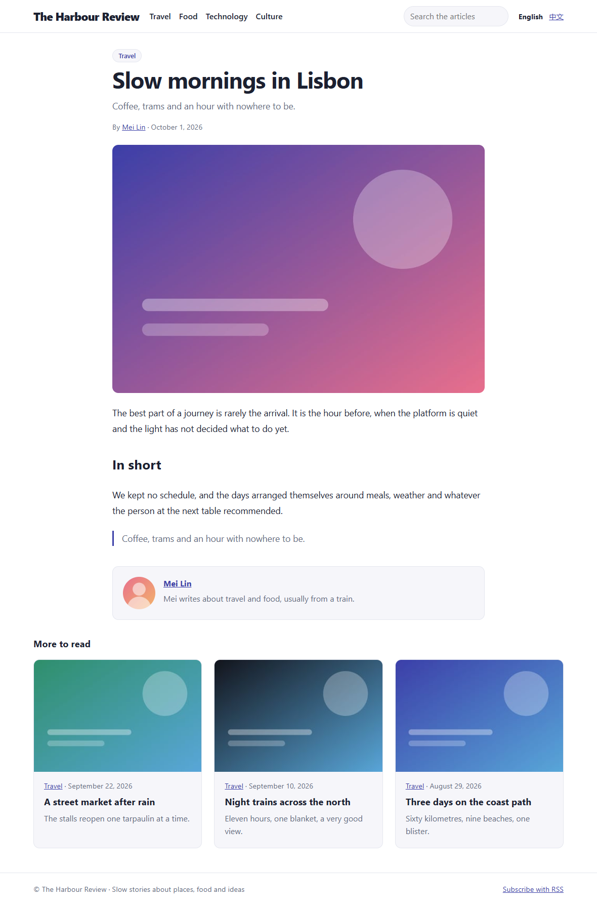
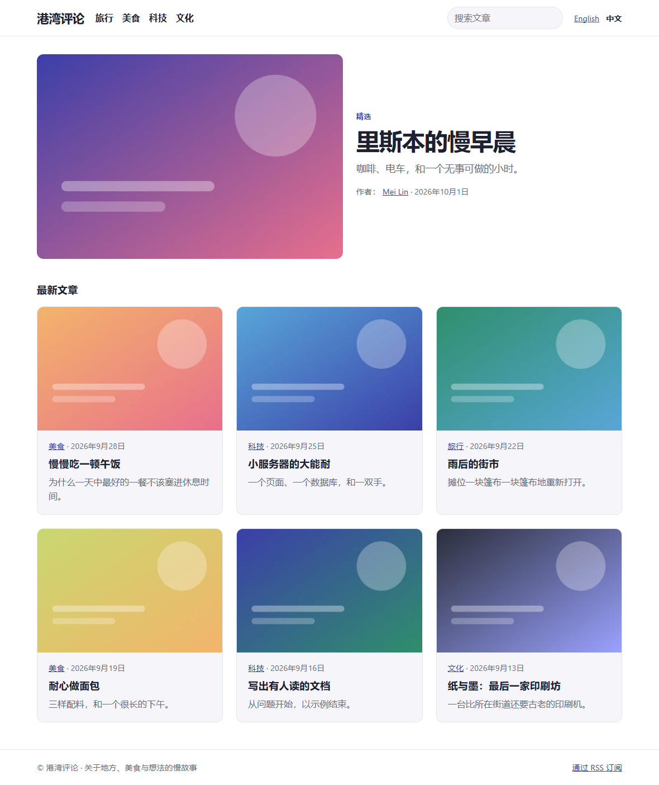
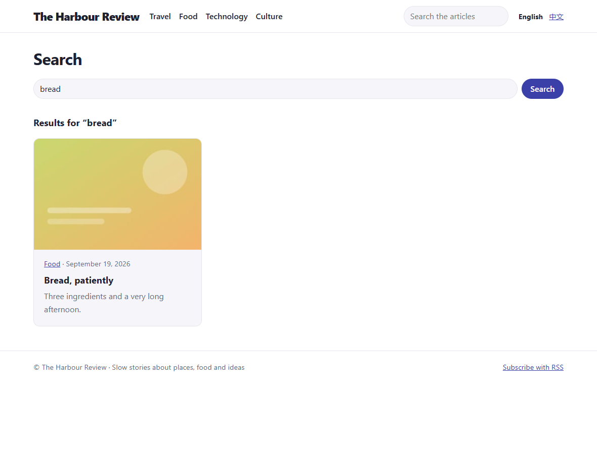
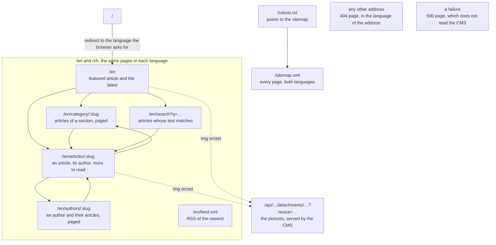

← [Examples](../README.md)

# Magazine Example

"The Harbour Review" is a bilingual magazine built the way you would build your own site on embed-cms: Express, `cms.api()` and a template engine of your own. It uses none of the CMS helpers (no [PageHelper](../../reference/PAGE_HELPER.md), no REST middleware). Each step shows what one piece does, so you can take the parts you want.

Read it with the code open beside it. The [blog](../site/README.md) is the shorter first tutorial. It teaches the same ideas, with the PageHelper doing the rendering and the keeping.





| Home in Chinese | Search |
|---|---|
|  |  |

## Run it

```
cd docs/examples/magazine
node server.js
```

`PORT=8080 node server.js` serves on another port. `STATE_DIR` keeps the data of the CMS and the kept pages somewhere other than this folder.

Open `http://localhost:3000` for the site and `http://localhost:3000/admin` for the editors (`localAdmin` / `localAdmin` on a development machine).

The first start loads the content from `content.json` and `files/` with the [ContentLoader](../../operations/CONTENT_LOADER.md). That is the settings, three authors with photos, four categories and thirteen articles with covers (one is a draft). Later starts find it all in place and change nothing. Edit an article in the admin, reload the page, and the change is there.

| File | What it does |
|---|---|
| `resources/` | The content model: `settings` (one record), `authors`, `categories`, `articles`, in two languages. |
| `content.json`, `files/` | The sample content and its pictures. `make-pictures.js` drew the pictures. The site does not need it. |
| `server.js` | The CMS and the site in one Express application, and the load of the content. |
| `magazine.js` | The site: the routes, the languages, the small functions the templates use, the 404 and error pages. |
| `content.js` | Everything the site reads from the CMS, in one place. |
| `engine.js` | The template engine: thirty lines around `_.template`. |
| `feed.js` | The RSS feed and the sitemap, written by hand. |
| `i18n.js` | The words of the pages in each language. |
| `views/` | The templates (`*.html`) and their partials. |
| `public/magazine.css` | The stylesheet. |

## The sitemap



Every page has the menu of sections and a search box in its head. One request for an article goes through these steps:

```
GET /en/articles/slow-mornings-in-lisbon
  → the CMS is asked first: /admin and /api are its;                      server.js
  → the language of the address is read, the menu and the name of the
    site are loaded, the small functions for the templates are set up;    magazine.js: prepare
  → content.read.article(slug) finds the published article, with its
    author and its categories in place of their ids;                      content.js
  → "more to read" is a query on the same category;                       content.js
  → Last-Modified is sent, and a browser that has the page gets a 304;    magazine.js: send
  → the engine fills views/article.html, which includes the partials;     engine.js
  → the browser asks the CMS for the pictures, resized.                   /api/articles/…/attachments/…
```

## Build it, step by step

### 1. The content model: a file for each resource

A file in `resources/` is a resource. Its `schema` lists the fields an editor fills in. `articles.js` has:

- text in two languages (`title`, `summary`, `body`)
- a `slug` that is `unique` and the same in both languages (`localised: false`)
- a `cover` image
- an `author` that points to `authors`
- `categories` that point to `categories`

```js
// resources/articles.js
module.exports = {
  displayname: { enUS: 'Articles' },
  locales: ['enUS', 'zhCN'],
  schema: [
    { field: 'title', input: 'string', label: 'Title', required: true },
    { field: 'summary', input: 'text', label: 'Summary' },
    { field: 'body', input: 'wysiwyg', label: 'Body' },
    { field: 'slug', input: 'string', label: 'Slug', localised: false, required: true, unique: true },
    { field: 'cover', input: 'image', label: 'Cover', localised: false, options: { maxCount: 1 } },
    { field: 'author', input: 'select', label: 'Author', localised: false, source: 'authors' },
    { field: 'categories', input: 'multiselect', label: 'Categories', localised: false, source: 'categories' },
    { field: 'publishedOn', input: 'date', label: 'Published on', localised: false },
    { field: 'featured', input: 'checkbox', label: 'Featured on the home page', localised: false },
    { field: 'published', input: 'checkbox', label: 'Published', localised: false }
  ]
}
```

`settings.js` has `maxCount: 1`: one record and no list, for the name and tagline of the site. See [Field types](../../reference/FIELDS.md).

### 2. One Express application, the CMS first

```js
// server.js
const cms = new CMS({
  mid: 'webnode1',
  resources: path.join(__dirname, 'resources'),
  data: path.join(__dirname, 'data'),
  // what a visitor's browser may read over /api: the pictures of the pages come from there. Nothing else is open, and nothing can be written.
  anonymousRead: ['settings', 'authors', 'categories', 'articles']
})

const app = express()
app.use(cms.express())      // /admin and /api first, so that the pages do not take their addresses
app.use(magazine(cms))      // the site: magazine.js returns an Express application
```

### 3. The first content is a JSON file

`content.json` is one list of records for each resource, in the order they are made. An article points to its author with `"authors://mei-lin"` and to its cover with `"attachment://…"`. The loader finds the records, puts the ids in, uploads the files, and checks everything before it writes anything. The loader has [its own page](../../operations/CONTENT_LOADER.md). Here it is two lines in `server.js`.

```json
{
  "slug": "slow-mornings-in-lisbon",
  "title": { "enUS": "Slow mornings in Lisbon", "zhCN": "里斯本的慢早晨" },
  "author": "authors://mei-lin",
  "categories": ["categories://travel"],
  "publishedOn": "2026-10-01",
  "featured": true
}
```

```js
const server = app.listen(3000, async () => {
  await cms.bootstrap(server)
  await new CMS.ContentLoader(cms).load(path.join(__dirname, 'content.json'))
})
```

### 4. Read with `cms.api()`: one file talks to the CMS

`content.js` is the only file that reads the CMS. The routes ask it for "an article" or "a search" and do not know how it is read.

`cms.api()` runs with the rights of your server and checks no user. So the filters (`published: true`) are the rules of the site, and a draft is never read for a page. Here is what to look for in the file.

**Relations followed.** If you name the related resources, an article comes with its author and categories as records, not ids ([resolving relations](../../reference/API.md#resolving-relations)). The templates write `article.author.name`.

```js
const articles = api('articles', 'authors', 'categories')
const published = async () => newestFirst(await articles.list({ published: true }))
```

**A query on a relation.** The articles of a section are a MongoDB-style filter on the ids a field holds. The CMS evaluates it ([querying](../../reference/API.md#querying-and-paging)).

```js
inCategory: async (slug) => {
  const category = await categories.find({ slug })
  return category ? { category, articles: newestFirst(await articles.list({ published: true, categories: category._id })) } : null
}
```

**No sort, so it is done here.** A resource has no sort parameter, so `newestFirst` sorts what `list` returns, using lodash. For a few hundred articles that costs nothing. A site with many more would page with `limit` and keep its own order.

**Search that cannot break on a pattern.** What a visitor types goes into a regular expression. So it is escaped and cut to 80 characters: `c++` and `(` are plain letters, not syntax. The CMS refuses a long pattern, and it is never given one.

```js
const pattern = _.escapeRegExp(String(term).trim().slice(0, 80))
const match = (field) => ({ [`${field}.${locale}`]: { $regex: pattern, $options: 'i' } })
return newestFirst(await articles.list({ published: true, $or: [match('title'), match('summary')] }))
```

**What is read most is kept, and hooks empty it.** The menu and the list of published articles are kept in a `Map`. A hook after each event on each resource clears it when a record is created, updated or removed, or when a file is added ([hooks](../../reference/API.md#hooks)). An editor's change shows at once.

```js
for (const resource of ['settings', 'authors', 'categories', 'articles']) {
  for (const event of ['create', 'update', 'remove', 'createAttachment', 'updateAttachment', 'removeAttachment']) {
    api(resource).after(event, (context) => {
      kept.clear()
      context.next()
    })
  }
}
```

### 5. The routes and the languages

The first part of the address is the language (`/en`, `/zh`). A middleware reads it and sets what every template can use. Then each route asks `content.js` and renders a template:

```js
const pages = express.Router({ mergeParams: true })
app.use('/:lang(en|zh)', pages)

pages.use(route(async (req, res, next) => {
  await prepare(req, res, language(req.params.lang))
  next()
}))

pages.get('/articles/:slug', route(async (req, res, next) => {
  const article = await read.article(req.params.slug)
  if (!article) {
    return next()                 // nothing answered: the 404 page
  }
  const related = await read.related(article, 3)
  send(req, res, 'article', { title: res.locals.text(article, 'title'), article, related }, article, related)
}))
```

`prepare` gives every template:

- the words (`t`)
- the menu
- `text(record, 'title')`: the text in the language, or English when there is none
- `date(ms)`: formatted for the language, in the time zone of the server (a date field keeps the start of the editor's day)
- `switchTo('zh')`: the same page in the other language
- the picture functions of step 7

An address without a language redirects to the language the browser asks for (`req.acceptsLanguages`).

### 6. The templates and the engine

`engine.js` is what `app.engine('html', …)` receives. For each file it keeps the function `_.template` made, along with the file's modification date. A request costs one `stat`, and an edited file shows at the next request. A template calls `include('partials/card', { article })` for a piece it shares.

```html
<!-- views/article.html -->
<h1><%- text(article, 'title') %></h1>
<p class="meta">
  <%- t.by %> <a href="/<%- lang.code %>/authors/<%- article.author.slug %>"><%- article.author.name %></a> · <%- date(article.publishedOn) %>
</p>
<div class="story-body"><%= text(article, 'body') %></div>
<% related.forEach(function (other) { %>
  <%= include('partials/card', { article: other }) %>
<% }) %>
```

`<%- value %>` prints the value escaped. `<%= value %>` prints it raw. The only raw value is the body of an article, which is the HTML of a rich text field an editor wrote. Templates are files of the project, and lodash compiles them into functions, which is code. So text from a record is never given to it as a template.

### 7. Pictures come from the CMS, at the size the page needs

The REST API of the CMS serves a record's files. It resizes images and keeps the copies: `/api/articles/<id>/attachments/<aid>.jpg?resize=640xauto` ([attachments](../../reference/API.md#attachments)). `magazine.js` builds those addresses. The templates give the browser a `srcset` (320, 640, 960 and 1280 pixels wide), so it fetches the size it needs.

```js
const imageUrl = (resource, record, file, width) =>
  `/api/${resource}/${record._id}/attachments/${file._id}${path.extname(file._fields._filename)}?resize=${width}xauto`
```

```html
" srcset="<%- srcset('articles', article, 'cover') %>" sizes="(min-width: 48rem) 46rem, 100vw" alt="">
```

The pictures are public because `server.js` lets the anonymous visitor read the four resources (`anonymousRead`). Nothing can be written. This also opens every file of those resources, drafts included. For private content, read the [docs platform](../platform/README.md), which serves its files itself.

### 8. The browser's cache

Each page carries `Last-Modified`: the latest update among the records it shows. That includes the article, and also its author and categories, because they appear in it. The browser asks again with `If-Modified-Since`, and gets `304 Not Modified` with no body if nothing changed. The date is never older than the start of the process, so a changed template (a new release) is seen too.

```js
function send (req, res, view, data, ...records) {
  const modified = new Date(Math.max(startedAt, read.modified(res.locals.site, res.locals.categories, ...records)))
  res.set({ 'Last-Modified': modified.toUTCString(), 'Cache-Control': 'public, max-age=0, must-revalidate' })
  if (req.fresh) {
    return res.sendStatus(304)
  }
  return res.render(view, data)
}
```

### 9. The feed and the sitemap

`/en/feed.xml` and `/zh/feed.xml` are RSS 2.0 feeds of the newest articles (up to twenty). `/sitemap.xml` lists the home page, each section and each article in both languages, with their last update. `/robots.txt` points to it.

The XML is written by hand in `feed.js`, and every text is escaped (`_.escape` turns `& < > " '` into entities that XML also reads). The absolute addresses come from the address of the request, or from `baseUrl` when you give one.

```js
const items = articles.slice(0, 20).map((article) => `    <item>
      <title>${xml(text(article, 'title'))}</title>
      <link>${xml(link)}</link>
      <description>${xml(text(article, 'summary'))}</description>
    </item>`)
```

### 10. A 404 and an error are pages too

An address nothing answered renders `404.html` with status 404, in the language of the address (or of the browser). An error renders `500.html` with status 500. It says nothing about the error, which goes to the log. It also does not read the CMS, because the error page must work when the CMS is what failed.

```js
app.use(route(async (req, res) => {       // nothing answered: the language of the address, or of the browser
  const code = _.get(req.path.match(/^\/(en|zh)(\/|$)/), 1) || req.acceptsLanguages(LANGUAGES.map((item) => item.code)) || 'en'
  await prepare(req, res, language(code))
  res.status(404).render('404', { title: res.locals.t.notFound })
}))

app.use((error, req, res, _next) => {     // something threw: logged, and the page does not read the CMS
  console.error(`The page ${req.originalUrl} failed:`, error)
  const lang = language(_.get(req.path.match(/^\/(en|zh)(\/|$)/), 1)) || LANGUAGES[0]
  res.status(500).render('500', { title: WORDS[lang.code].error })
})
```

## What a bigger site would change

- Many records. Page with `limit` instead of keeping everything. Sort in the store you use, or keep an index of your own.
- Many requests. Put the pages behind a cache. `Last-Modified` and `304` are what a CDN or a reverse proxy needs. Or keep finished pages the way the [PageHelper](../../reference/PAGE_HELPER.md) does.
- People who log in. The pages above are the same for everyone. For a page that depends on a person, authenticate in a middleware and read with that person's rights ([RestHelper](../../reference/REST_HELPER.md)) instead of `cms.api()`.
- Files in production. Here the pictures come from the CMS. Put them behind a CDN, or in object storage ([STORAGE.md](../../operations/STORAGE.md)).
