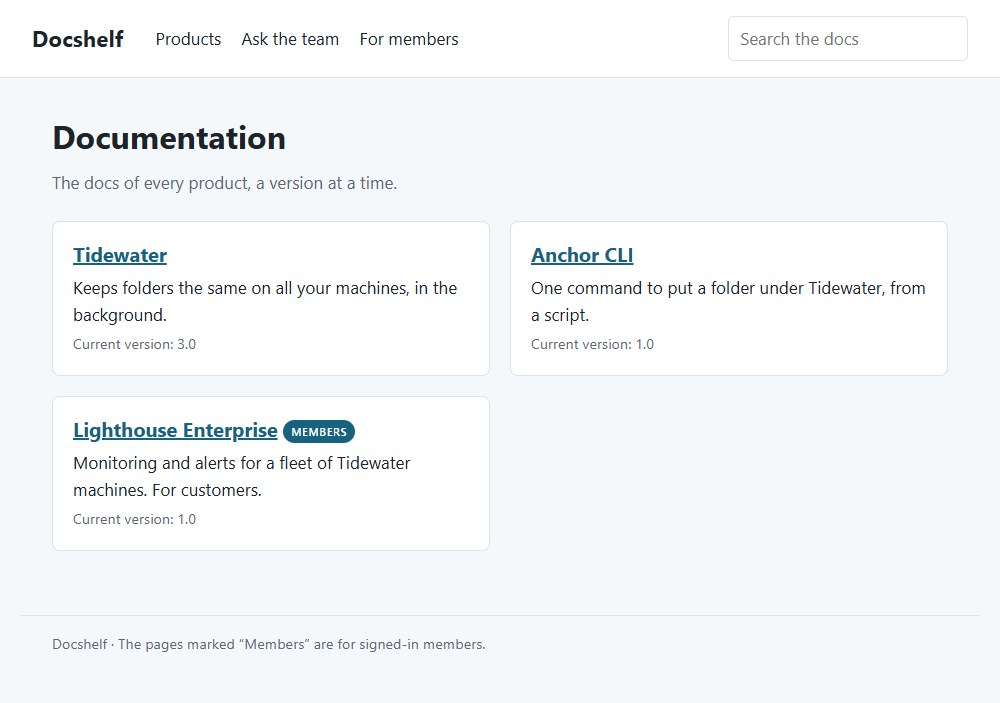
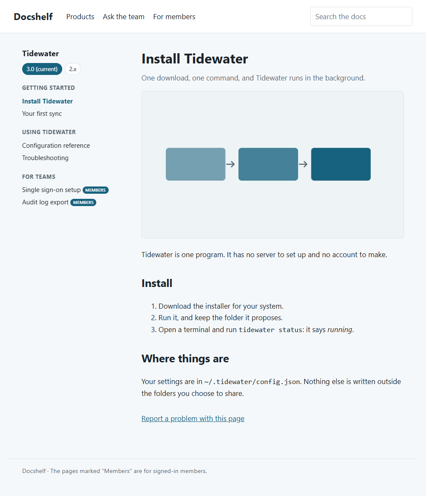
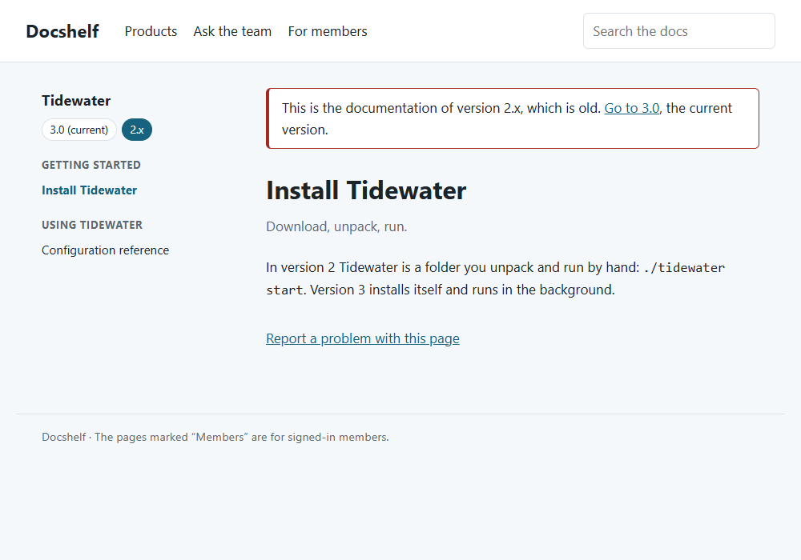
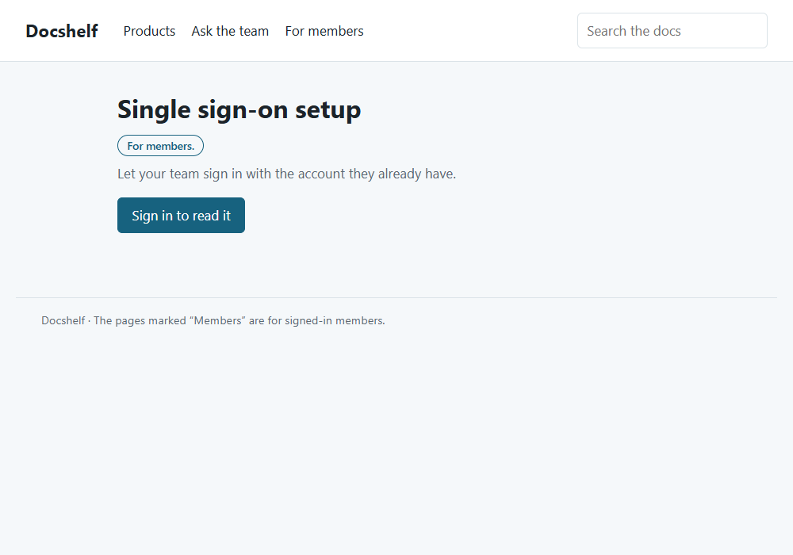
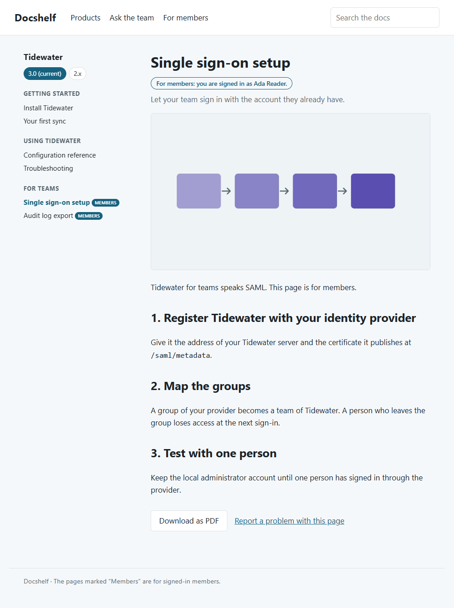
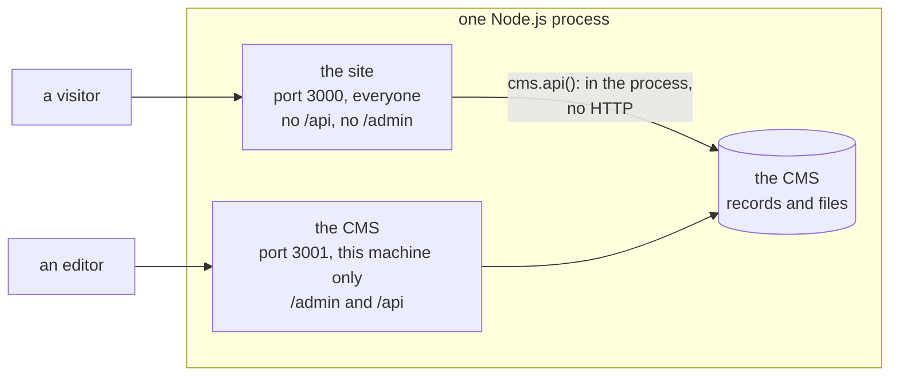
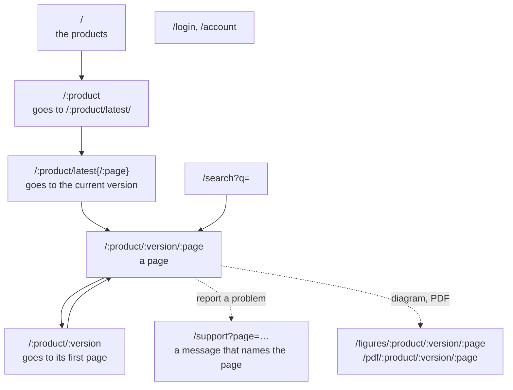

← [Examples](../README.md)

# Docs Platform Example

"Docshelf" hosts the documentation of several products, one version at a time. A product has versions (`3.0` is current, `2.x` is old, `3.1-draft` is not published yet). A version has pages in groups. `/tidewater/latest/install` always goes to the current version. Some products are for members only, and some pages are for members inside a public product.

This is the advanced example of the three sites. Read it before you put private content on embed-cms. It adds these to the [blog](../site/README.md) and the [magazine](../magazine/README.md):

- The CMS is not on the public site. `/api` and `/admin` do not exist there. The CMS has its own Express application for editors, on another port, on the machine itself. The site reads the CMS inside its own process with `cms.api()` and sends only what a visitor may see.
- One rule decides who may read what. It lives in one file and covers pages, diagrams, PDFs and search.
- Members of its own. Passwords nobody can read back, a sign-in, and protected forms.
- Content shaped as a tree. Products, their versions and their pages, linked by relations, with a menu, a version switcher and a banner for old versions.



| A page of the current version | The same page in an old version |
|---|---|
|  |  |

| A page for members, signed out | The same page, signed in |
|---|---|
|  |  |

## Run it

```
cd docs/examples/platform
node server.js
```

`PORT` and `ADMIN_PORT` choose the two ports. `STATE_DIR` keeps the data of the CMS and the kept pages somewhere other than this folder.

| Address | What it is |
|---|---|
| `http://localhost:3000` | The site, for everyone. |
| `http://127.0.0.1:3001/admin` | The CMS, for editors. It listens on this machine only (`localAdmin` / `localAdmin` on a development machine). |

The first start loads the products, versions and pages from `content.json` and `files/` with the [ContentLoader](../../operations/CONTENT_LOADER.md). It also makes one member to try the site with, and prints the address and password once: `A member to sign in with: ada@example.com / …`.

In the admin, **Products**, **Versions** and **Pages** are the docs. **Members** is where an editor adds a person, types a password, and unticks **Active** to end the access. **Messages** holds what visitors wrote in the support form.

| File | What it does |
|---|---|
| `resources/` | The content model: `products`, `versions`, `pages`, `members`, `messages`. |
| `content.json`, `files/` | The sample docs. `make-content.js` and `make-files.js` wrote them. The site does not need those two. |
| `server.js` | The two servers, and the load of the content. |
| `platform.js` | The public site: every route. |
| `catalog.js` | What the site reads of the CMS, and the one rule: `canRead`. |
| `accounts.js` | Passwords and sign-in: the hooks that hash, the hooks that hide, the check. |
| `media.js` | The diagrams and PDFs, streamed by the site. |
| `security.js` | The headers, the limit on attempts, the token of the forms. |
| `views/` | The templates (Mustache, for the [PageHelper](../../reference/PAGE_HELPER.md)). |

## What is where



The site and the admin share one process and one CMS. A change an editor makes in the admin shows on the next page of the site at once. A reverse proxy in front of the site publishes the first port and nothing else. The second port is not reachable from outside.

## The addresses



The first part of an address is a product. So the platform's own addresses (`/login`, `/search`, `/support`, `/figures`…) cannot be products. A hook refuses a product with one of those as its slug (step 5).

## Who can read what

| What | A visitor | A signed-in member |
|---|---|---|
| The list of products, with the name and summary of each | Yes. Products for members are listed too, marked. | Yes |
| A public page of a public product | Yes | Yes |
| A page for members, in a public product | Its title and summary (401), nothing else | Yes, all of it |
| Anything under a product for members | Nothing but the name and summary of the product (401). A page that exists and one that does not get the same answer. | Yes |
| The diagram and PDF of a page | Same as the page. 404 when the page is not for them. | Yes, never kept by a shared cache |
| The search | The pages they may read. A page for members shows by its title and summary only. | Everything, including the text of pages for members |
| A version or page that is not published | No one | No one |

## Build it, step by step

### 1. The model: three resources and their relations

`products.js` has a name, a slug (its address), a summary and `membersOnly`. A version points to its product, and a page points to its version. Both use a `select` field, as the articles of the magazine point to their authors:

```js
// resources/versions.js (the fields that matter)
{ field: 'key', input: 'string', label: 'Key', localised: false, required: true, unique: true },   // tidewater/3.0
{ field: 'product', input: 'select', label: 'Product', localised: false, source: 'products', required: true },
{ field: 'slug', input: 'string', label: 'Version', localised: false, required: true },            // 3.0, 2.x
{ field: 'current', input: 'checkbox', label: 'Current', localised: false },                       // where /latest/ goes
{ field: 'archived', input: 'checkbox', label: 'Archived', localised: false },                     // a banner says it is old
{ field: 'published', input: 'checkbox', label: 'Published', localised: false },
```

A page has a `group` (the heading of the menu it sits under), an `order`, a text, a diagram, a PDF, and its own `membersOnly`. `key` is a name for the loader and the editors. It is `unique`, so a content file can write `versions://tidewater/3.0` for a relation and `attachment://files/diagrams/…` for a file.

### 2. Two servers: the CMS is not on the site

`server.js` gives the CMS an Express application of its own, on its own port, on `127.0.0.1`. The site is a second application on the public port, and it is never given `cms.express()`. There is no `anonymousRead`, so nothing of the CMS is open to a visitor even if they reached it.

```js
const cms = new CMS({ mid: 'webnode1', resources: path.join(__dirname, 'resources'), data: path.join(__dirname, 'data') })

const admin = express()
admin.use(cms.express())                                  // /admin and /api: the editors' only
const adminServer = admin.listen(3001, '127.0.0.1', async () => {
  await cms.bootstrap(adminServer)
  await new CMS.ContentLoader(cms).load(path.join(__dirname, 'content.json'))

  const { app } = platform(cms, { secret: process.env.SESSION_SECRET })   // the site: no route of the CMS
  app.listen(3000)
})
```

[The tests](../../contributing/TESTING.md) check this. On the site, `/api/pages`, `/api/members`, `/admin` and a `POST` to `/api/pages` all answer 404. The CMS itself answers an anonymous visitor with 401.

### 3. The catalogue and the one rule

`catalog.js` is the only file that reads products, versions and pages, and it holds the rule. Routes and files both ask it, so a page and its diagram cannot follow two different rules.

```js
/** A member reads what is published; a visitor reads what is public, in a product that is public. */
const canRead = (member, product, page) => Boolean(member) || !(product.membersOnly || (page && page.membersOnly))
```

`catalog(cms, api)` takes the `api` to read with. A route of the PageHelper gets its own `api`, which notes the resources a kept page is made of. A page is then made again when a record of one of them changes. So a loader must read with that `api`, not with `cms.api()`. Routes that are not kept pass nothing and read with `cms.api()`.

```js
app.get('/', pages.route('home', async ({ api }) => {
  const read = catalog(cms, api)                          // the kept page depends on what is read here
  const products = await read.products()
  …
```

### 4. Versions: `latest`, the first page, the banner, the switcher

`/:product/latest{/:page}` is not a version. It finds the current version (the one marked, or the first when none is) and redirects there, to the same page. A version address without a page goes to the version's first page.

An old version (`archived`) says it is old and links to the current one. The switcher lists every published version. It keeps you on the same page when the other version has it, and goes to that version's start when it does not.

```js
app.get('/:product/latest{/:page}', underProduct(async (req, res, next, product) => {
  const current = await reads.current(product)
  return current ? res.redirect(302, `${address(product, current)}${req.params.page ? `/${enc(req.params.page)}` : ''}`) : next()
}))

const switcher = await Promise.all(versions.map(async (other) => {
  const same = await reads.page(other, page.slug)
  return { name: other.slug, selected: other._id === version._id, href: same ? address(product, other, same) : address(product, other) }
}))
```

Routes under a product go through `underProduct`. It finds the product, and a visitor who may not read it is answered right there, before anything else is looked at. A product for members therefore shows nothing of itself: no version, no page, not even whether they exist.

### 5. The platform keeps its own addresses

The first part of an address is a product. A product called `login` could never be reached, and it would hide the sign-in. A hook on `products` refuses such a slug, whoever sends it (the admin, a script, the loader). Another hook on `versions` refuses `latest`:

```js
const refuse = (what, bad) => (context) => {
  const slug = _.get(context, 'params.object.slug')
  return typeof slug === 'string' && bad(slug.toLowerCase())
    ? context.error({ code: 400, message: `"${slug}" is an address of the platform: ${what}` })
    : context.next()
}
cms.api()('products').before('create', refuse('choose another slug for the product', (slug) => RESERVED.includes(slug)))
```

### 6. One address, two kinds of answer

A public page of a public product works like a blog page. It is made once, kept, and made again when a record it read changes. A page for members is made for the member who asks and kept nowhere. Both share the address, so one handler reads the page and chooses:

```js
app.get('/:product/:version/:page', underProduct(async (req, res, next, product) => {
  const found = await reads.resolve(req.params)
  if (!found.page) return next()
  if (!canRead(null, product, found.page)) {                      // a page for members, or a product for members
    if (!req.member) return locked(req, res, text(found.page, 'title'), text(found.page, 'summary'))   // 401
    return show(res, 'page', { ...(await pageData(reads, found)), body: text(found.page, 'body'), member: req.member.name })
  }
  return publicPage(req, res, next)                               // the PageHelper route: kept
}))
```

`show` renders with `pages.render` and sends `Cache-Control: private, no-store`. The loader of the public route asks `canRead` again. If an editor makes a page private between the two reads, the visitor gets a 404, not a public page that would then be kept with its text.

The search follows the same rule. It looks only at the products the visitor may read, and at the text of the pages they may read.

### 7. Files: the site streams them, and asks the same question

`/figures/:product/:version/:page` and `/pdf/:product/:version/:page` do not point at `/api/.../attachments/...`. They resolve the page, ask `canRead`, and stream the file the CMS gives them in the process:

```js
// media.js
const { product, version, page } = await reads.resolve(req.params)
const file = page && catalog.canRead(req.member, product, page) && _.find(page._attachments, { _name: field })
return file ? { product, version, page, file } : null          // a draft, no such file, a page the visitor may not read: the same 404

const attachment = await pages().findAttachment(page._id, file._id, { resize: `${width}xauto` })
pipeline(attachment.stream, res, () => {})
```

The headers the route sets are part of the rule. The file of a public page is `public, max-age=…`, so a cache may keep it. Anything for members is `private, no-store`.

A diagram is sent in one of three widths only (`?w=480`, `800` or `1200`). Nobody can ask for a thousand sizes and fill the disk with resized copies. Its `ETag` is made of the file id and the width, so a browser that already has it gets a `304` without the file being opened.

### 8. Members: a password nobody can read back

The password field of the CMS only hides what you type. What is stored is what was typed. So the site puts hooks on the `members` resource ([hooks](../../reference/API.md#hooks)). Hooks run for every writer and every reader: the admin, a script, the loader and the REST API.

```js
// accounts.js
const prepare = async (context) => {
  const object = context.params.object
  if (object) {
    delete object.passwordHash                      // a hash in the data is dropped: nobody plants one, and the admin cannot blank it
    if (object.password) {
      object.passwordHash = await hashPassword(String(object.password))   // scrypt, with a salt of its own
      object.password = ''                           // the clear text is never kept
    }
  }
  context.next()
}
members.before('create', prepare)
members.before('update', prepare)

// after a read or a write, what is answered has neither
const hide = (context) => {
  if (!reading.getStore()) {
    for (const record of [].concat(context.getResult() || [])) {
      SECRETS.forEach((key) => delete record[key])
    }
  }
  context.next()
}
for (const event of ['read', 'find', 'list', 'create', 'update']) {
  members.after(event, hide)
}
```

The sign-in has to read the hash, so it reads inside `secretly`. That uses an [`AsyncLocalStorage`](https://nodejs.org/api/async_context.html), a flag that exists only in the chain of calls the sign-in starts. A request that comes over HTTP is another chain, so no request can turn the flag on. A read made at the same moment by someone else still gets no hash.

```js
const reading = new AsyncLocalStorage()
const secretly = (work) => reading.run(true, work)
const stored = (cms, query) => secretly(() => cms.api()('members').find(query))
```

### 9. Signing in

`signIn` finds the member by email (in lower case, so whatever was typed finds it), checks the password, and returns the member or nothing. An unknown email, a wrong password and an inactive member give the same answer, and take the same time. When there is no such member, the password is checked against a hash of a secret nobody knows.

```js
const member = await stored(cms, { email })
const ok = await verifyPassword(password, member ? member.passwordHash : await NOBODY)
return ok && member && member.active ? member : null
```

The route around it holds the protections:

```js
app.post('/login', form, async (req, res, next) => {
  if (!csrfValid(req)) { /* 403: the form is not one of ours */ }
  const rate = loginLimiter.hit(`${req.ip}|${email}`)           // 5 attempts in 15 minutes for an address and an email
  if (!rate.allowed) { /* 429, with Retry-After */ }
  const member = await accounts.signIn(cms, email, req.body.password)
  if (!member) { /* 401, one message for every reason */ }
  loginLimiter.reset(`${req.ip}|${email}`)
  await regenerate(req)                                          // a new session for a new person: no session fixation
  req.session.memberId = member._id
  return res.redirect(303, localPath(req.body.next))             // a page of this site, never another address
})
```

The session keeps only the id of the member. At every request the site asks whether that member still exists and is **Active**. An editor who unticks it ends the access at once, whatever session is open.

### 10. The support form: the only thing a visitor writes

A visitor writes into the CMS through one door, `/support`. Every page has a "Report a problem with this page" link that opens it with the page's path (`/support?page=…`). The message keeps that path, so the editor knows which page it is about. The path is checked: a path of this site, no line break, at most 200 characters, never another address. The route stands guard:

```js
const { values, errors } = readMessage(req.body)                 // every value is a text of a given length: a list or an object is nothing
if (!csrfValid(req)) { /* 403 */ }
if (clean(req.body.website, 200)) return res.redirect(303, '/support/thanks')   // a box nobody sees: a program fills it, and is thanked, and nothing is kept
const rate = supportLimiter.hit(req.ip)                          // 5 messages an hour for an address
if (!rate.allowed) { /* 429, with Retry-After */ }
if (errors.length) { /* 422: what was typed is shown again, escaped */ }
await cms.api()('messages').create({ ...values, page: pagePath(req.body.page), handled: false })
return res.redirect(303, '/support/thanks')                      // after a POST, a redirect: a reload does not send it twice
```

### 11. Headers, sessions and errors

`security.js` sets these on every answer:

- A `Content-Security-Policy` saying the site loads nothing from elsewhere, so a script put in a page finds no way to run.
- `nosniff`, `X-Frame-Options: DENY` and `Referrer-Policy: same-origin`.

The session cookie is `HttpOnly` and `SameSite=Lax`. It exists only for a visitor who has something to keep, such as a token or a sign-in. The pages everyone sees carry no cookie, and that is what lets a cache keep them.

A failure ends in a page that says nothing about the cause: the PageHelper's error page, or one line of text if even that cannot be made. Without that last handler, Express answers with the stack of the error outside production. That stack is a map of the server for whoever asked.

## Putting a site like this in production

- Publish the first port and nothing else. Put a reverse proxy in front of the site and leave the CMS port on the machine. Reach the admin through a tunnel (`ssh -L 3001:127.0.0.1:3001 server`) or a VPN.
- Serve it over HTTPS, and say so. Use `platform(cms, { secureCookies: true, trustProxy: 1 })`. The cookie is then sent over HTTPS only, and the site believes the proxy about the visitor's address (so the limits count visitors, not the proxy) and about the protocol. With `secureCookies` and no HTTPS, the browser never gets a session.
- Give it a secret that stays. Put a long random `SESSION_SECRET` in the environment. Without one, the site makes a new secret at each start and the members must sign in again.
- Change the password of `localAdmin`, or delete the account ([Security](../../../SECURITY.md)).
- Keep the sessions in a store (Redis, a database) when you run more than one process or want sessions to survive a restart. The one used here is in memory. The limits on attempts are in memory too, so each process counts its own.
- Hash with the cost your machines can pay. `scrypt` is called with its defaults here. Raise `N` as your hardware allows, and keep the cost in the hash if you want to raise it later without breaking the old hashes.
- **Many pages?** The menu and the switcher are read for each page that is made. A kept page is made once, so this costs nothing for a public page. For a large version, read the pages of the version once and keep them.

## What this example does not do

It has no forgotten-password flow (that needs an email and a token that expires), no second factor, no limit on the downloads of a member, and no CMS rights for the files of a resource (here the site decides, in code, for the files it serves). It has no page tree deeper than one group. Its search finds pages but does not rank them: results come in the order of the products.
