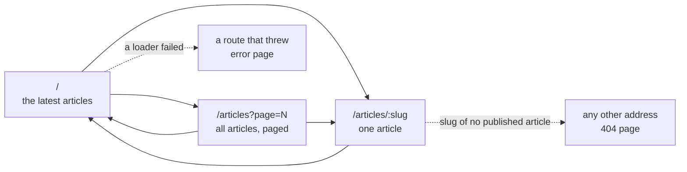

← [Examples](../README.md)

# Blog Example

This is the shortest site you can build on embed-cms, and it fits in one folder. With about a hundred lines of code and eight small templates, you get a site that visitors can read and editors can change. It has a home page, a paged list, one page per article, a 404 page and an error page.

It uses the [PageHelper](../../reference/PAGE_HELPER.md), which renders [Mustache](https://mustache.github.io/mustache.5.html) templates and keeps the finished pages. The [magazine](../magazine/README.md) is the next step. It teaches the same ideas without the helper, and adds relations, pictures and two languages.


## Run it

```
cd docs/examples/site
node server.js
```

`PORT=8080 node server.js` serves on another port. `STATE_DIR` keeps the data of the CMS and the kept pages somewhere other than this folder.

Open `http://localhost:3000` for the site and `http://localhost:3000/admin` for the editors (`localAdmin` / `localAdmin` on a development machine). The first start loads four articles from `content.json` with the [ContentLoader](../../operations/CONTENT_LOADER.md). Later starts find them in place and change nothing.

To see the loop this example is about, try this:

1. In the admin, open **Articles** and change the title of one, or tick off **Published** on another.
2. Reload the home page. The change is there. The old page had been kept, but the helper saw that a record it read was updated, and made the page again.
3. Open `views/card.html`, add a word, and reload. The same happens for a template.
4. Go to `http://localhost:3000/articles/nothing`. You get the 404 page, which is the template `views/notfound.html`.

## What is in the folder

| File | What it does |
|---|---|
| `resources/articles.js` | The content model: a title, a slug (the address of the article), a rich text body and a switch that publishes. |
| `content.json` | The four articles that the first start loads. |
| `server.js` | The CMS and the pages in one Express application, and the load of the content. |
| `site.js` | The site: the helper with its templates, and the three routes. |
| `views/*.html` | The eight templates. `header`, `footer` and `card` are partials that the others include. `home`, `articles` and `article` are pages. `notfound` and `error` are the two special ones. |
| `public/site.css` | The stylesheet, served as it is. |

## The sitemap



Every page starts with `{{> header}}` (the head of the document, and links to the home page and to all articles) and ends with `{{> footer}}`.

## Build it, step by step

### 1. A resource is a file

`resources/articles.js` is the content model. The file name is the name of the resource, and `schema` lists the fields an editor fills in. `slug` is `unique` and not `localised`: it is the address of the article, and it is the same in every language. See [Field types](../../reference/FIELDS.md).

```js
module.exports = {
  displayname: { enUS: 'Articles' },
  locales: ['enUS'],
  schema: [
    { field: 'title', input: 'string', label: 'Title', required: true },
    { field: 'slug', input: 'string', label: 'Slug', localised: false, required: true, unique: true },
    { field: 'body', input: 'wysiwyg', label: 'Body' },
    { field: 'published', input: 'checkbox', label: 'Published', localised: false }
  ]
}
```

### 2. One Express application, the CMS first

`server.js` gives the CMS the folder of the resources and mounts it first, so `/admin` and `/api` are its. Then it mounts the pages. `anonymousRead` lets a visitor's browser read `articles` over `/api`. It allows reads only. Nothing can be written.

```js
const cms = new CMS({ mid: 'webnode1', resources: './resources', data: './data', anonymousRead: ['articles'] })
const app = express()
app.use(cms.express())
app.use(site(cms, { cache: './.page-cache' }).router)

const server = app.listen(3000, async () => {
  await cms.bootstrap(server)
  await new CMS.ContentLoader(cms).load('./content.json')
})
```

### 3. The first content is a JSON file

`content.json` is a list of records for each resource. The [ContentLoader](../../operations/CONTENT_LOADER.md) checks it, writes what is missing, and changes nothing on a second run. The magazine uses the same file for relations (`authors://mei-lin`) and for pictures (`attachment://files/cover.jpg`).

### 4. Give the helper every template

You give the helper all the templates by name when you make it. It reads and parses them at that moment, so a mistake shows up before the first visitor arrives. There is no layout. A route names the template that is the root of its page, and that root includes the partials it needs.

```js
const pages = new CMS.PageHelper({
  cms,
  cache,                                   // a folder: the pages survive a restart
  templates: { header, footer, card, home, articles, article, notfound, error },
  notFound: 'notfound',
  error: 'error',
  locals: { siteName: 'My blog' }          // given to every page
})
```

### 5. A route is a template and a loader

The loader reads with `api()`, which has the rights of your server. So the filter is what keeps a draft off the site: every read says `published: true`. What the loader returns is what the template prints. Mustache has no code, so the loader prepares dates and names.

```js
router.get('/articles/:slug', pages.route('article', async ({ api, params, notFound }) => {
  const article = await api('articles').find({ slug: params.slug, published: true })
  return article ? { title: article.title.enUS, article: present(article) } : notFound()
}))
```

`notFound()` is how a loader says there is no such page. The visitor gets the 404 template with status 404. The list route adds `{ vary: ['page'] }`, so each `?page=N` is its own kept page.

### 6. Templates only print

```html
{{> header}}
<article>
  <h1>{{article.name}}</h1>
  <small>{{article.day}}</small>
  {{{article.body}}}
</article>
<p><a href="/">← All articles</a></p>
{{> footer}}
```

`{{value}}` is escaped. `{{{value}}}` is raw, and the only raw value here is the body, which is the HTML of a rich text field an editor wrote. A section (`{{#articles}}…{{/articles}}`) repeats for a list. `{{^articles}}…{{/articles}}` shows when the list is empty.

### 7. The 404 page and the error page are templates too

The last two lines of the application catch what no route answered and what a route threw. The error page says nothing about the error. The error is logged, so a visitor never reads a message meant for you.

```js
router.use(pages.notFoundHandler())
router.use(pages.errorHandler())
```

| The 404 page | The error page |
|---|---|
|  |  |

## How a request becomes a page

```
GET /articles/welcome
  → the CMS is asked first: /admin and /api are its;                       server.js
  → the route "article" is found; the page is looked up in what is kept
    (its key is the template, the address and the `vary` parameters);        PageHelper
  → kept, and no template or record it read has changed since:
    it is sent, and the loader does not run (a browser that has it
    gets a 304 and no body);
  → otherwise the loader runs, the template is filled, the page is sent
    and kept, with the update times of the records it read.                  site.js
```

How a kept page stays right (the update times of the records, the dates of the templates, the age, the folder) is explained in [Kept pages](../../reference/PAGE_HELPER.md).

## Where to go from here

- Every option of the helper, and each way a kept page is made again: [PageHelper](../../reference/PAGE_HELPER.md).
- A second language, relations between resources, pictures, a search, a feed: the [magazine](../magazine/README.md).
- Your own fields: [Field types](../../reference/FIELDS.md). Who may read and write what: [Getting started](../../start/GETTING_STARTED.md).
