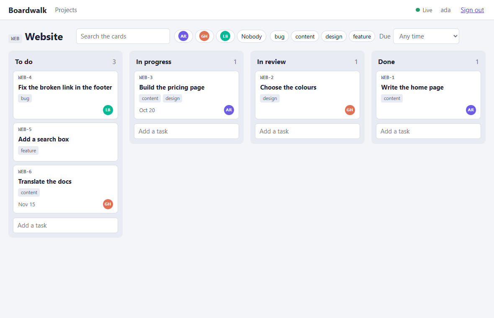
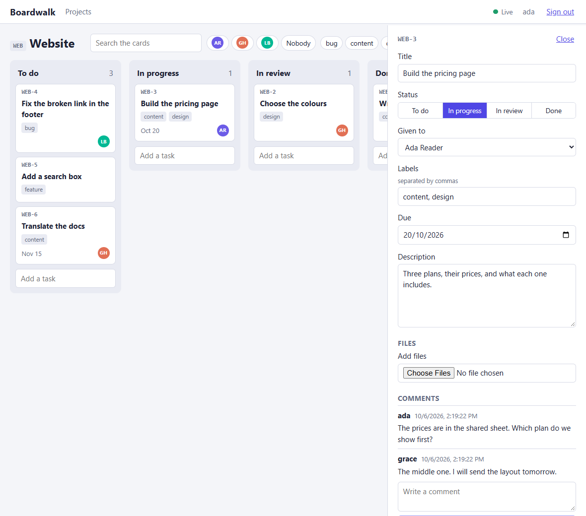
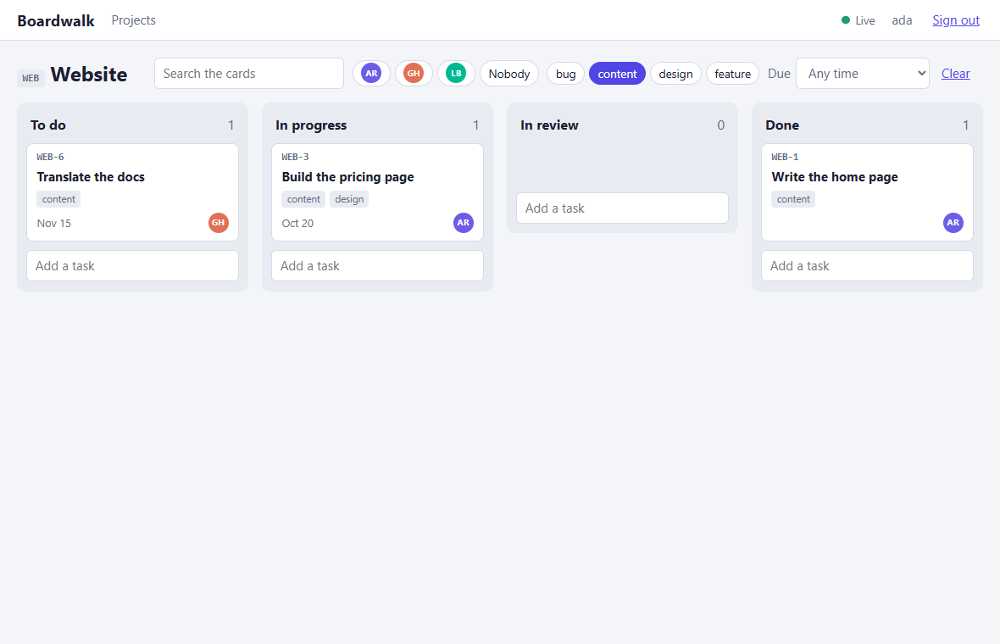
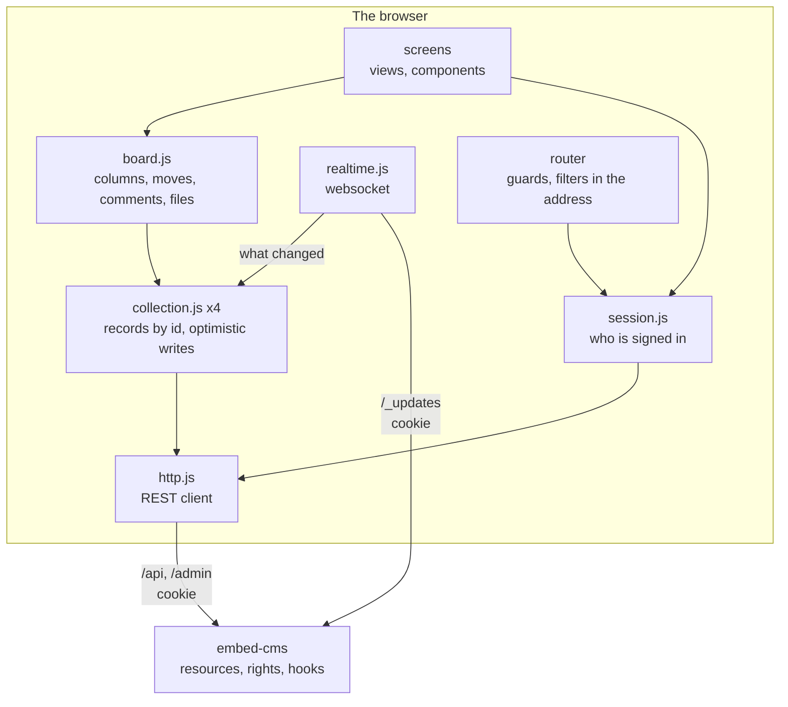

← [Examples](../README.md)

# Boardwalk: an expert Vue 3 app on embed-cms

A team task board: projects, cards in four columns, comments, files, people. It is a **single-page Vue 3 app** that uses embed-cms as its backend, the way you would use it for a product and not for a site: the CMS holds the data and the rights and says when something changes, the app does everything else. It is the one to read when your front end is an application. It is plain JavaScript with JSDoc (no TypeScript), single-file components, Vue Router, Vite, and **no state library**: the state is a few small stores made of Vue's own reactivity, which is the part worth reading.

What it shows:

- **A login that the browser keeps and the app never sees** (an HTTP-only cookie), a router that lets only signed-in people in, and a session that ends cleanly when the CMS says so.
- **One small client** for the REST API of the CMS (queries, paging, uploads with progress), and **one generic store** for the records of a resource: optimistic writes that are taken back when refused, writes of one record kept in order, answers that arrive late that do not win.
- **Real time as it really is**: what the websocket of the CMS says, what it does not say, and what the app does about each.
- **Dragging a card** between and inside columns with one write, using a position between its neighbours.
- **A filter that lives in the address**, so that a filtered board can be linked.
- **A card that other people change while you edit it**, without losing what you typed.
- **Hooks of the CMS** that give a card its number without two cards getting the same one, and that make an author what the CMS knows, not what a client says.
- **Tests at four levels**, down to the real CMS with a real websocket, and the real `server.js` run as a program.



| A card, open beside the board | A filtered board (the filter is in the address) |
|---|---|
|  |  |

## Run it

```
cd docs/examples/taskboard
node server.js
```

Open `http://localhost:3000`. The first start builds the app with Vite (a few seconds), fills the CMS (three people, two projects, ten cards, two comments), and prints one account for each person, once: `An account to sign in with: ada / …`. The next starts find everything in place. The admin of the CMS is at `/admin` of the same address (`localAdmin` / `localAdmin` on a development machine); the team has no right on the CMS itself.

`PORT` chooses another port, `STATE_DIR` keeps the data and the built app somewhere other than this folder, and `AUTH_SECRET` and `SESSION_SECRET` give the secrets that sign the login and the session (required in production, long and random). To work on the app, start the program with `DEV=1 node server.js`: Vite serves the app and reloads it as you edit. Or run the CMS on its own and `npx vite` in this folder: its proxy sends `/api`, `/admin` and the websocket to the CMS (`CMS_URL`, `http://localhost:3000` by default), so that for the browser they are one address again.

| File | What it does |
|---|---|
| `resources/` | The content model: `people`, `projects`, `tasks`, `comments`. |
| `hooks.js` | What the CMS does on its own side: the number of a task, its place, who wrote a comment. |
| `seed.js`, `content.json` | The first data, the group `team`, an account for each person. |
| `server.js` | The CMS and the app in one program; builds the app, or serves it from Vite. |
| `vite.config.mjs`, `index.html` | How the app is built, and the proxy to work on it. |
| `src/api/http.js` | The client of the REST API. |
| `src/api/session.js` | Who is signed in. |
| `src/api/realtime.js` | The websocket: kept open, answered, opened again. |
| `src/stores/collection.js` | The records of one resource. |
| `src/stores/board.js` | The four collections, and what the screens do with them. |
| `src/lib/position.js`, `src/lib/filters.js` | The order of the cards; what narrows them. Pure. |
| `src/services.js`, `src/router.js`, `src/main.js` | The services made once; the addresses and who may see them; the start. |
| `src/views/`, `src/components/`, `src/App.vue` | The screens. They load, show and say what was asked: they do not build an address or read a response. |

## How the pieces fit



Nothing above `http.js` and `realtime.js` knows that there is a CMS: a screen asks the board for the cards of a column, the board asks a collection for its records, the collection asks the client for a page. That is what lets each layer be tested alone.

## What the app uses of the CMS

| It needs | The CMS gives |
|---|---|
| To know who is signed in | `GET /admin/login`: an empty object when nobody is, else `{ username, group, rights, … }` |
| To sign in and out | `POST /admin/login` (an HTTP-only cookie), `GET /admin/logout` |
| A list, as much as it needs | `GET /api/tasks?query={"project":"…"}&limit=200&page=0`, and the total in the `numRecords` header |
| To write | `POST /api/tasks`, `PUT /api/tasks/:id` (only what changes), `DELETE /api/tasks/:id` |
| To send a file | a multipart `POST /api/tasks/:id/attachments`, the name of the part is the field |
| A small picture of a big one | `GET …/attachments/:aid?resize=96xauto` |
| To hear about changes | the websocket `/_updates`: `{ action, data: { resource, _id, _updatedBy } }` |
| Who may do what | the group of the person: `rights` lists the resources for `read`, `create`, `update`, `remove`, `attachments` |

## Build it, step by step

### 1. The model, and a group that has only what the board needs

Four resources, with relations as `select` fields (a task points to its project and to the person it is given to, a comment to its task). `tasks.js` has a unique `ref` (WEB-12), the `status` that is the column, and a `position` that is the place in it. The people who sign in are **users of the CMS in the group `team`**, and that group has `read`, `create`, `update`, `remove` and `attachments` on the four resources of the board and on nothing else (`seed.js`): the team cannot read the users, the groups or the settings, over the API or in the admin.

```js
group = await authentication.groups.create({ name: 'team', read: RESOURCES, create: RESOURCES, update: RESOURCES, remove: RESOURCES, attachments: RESOURCES })
```

The CMS is started for a login page and not for the Basic authentication of a browser prompt, which a single-page app cannot use well:

```js
const cms = new CMS({ mid: 'webnode1', resources, data, disableAuthentication: true, disableJwtLogin: false, wsRecordUpdates: true })
```

### 2. One program, one address

`server.js` mounts the CMS first (`/api`, `/admin`, `/_updates`), then the built app, with every other address answered by `index.html` so that the router of the browser reads it. The CMS and the app are **one origin on purpose**: the cookie of the login is sent to the address that set it, and the CMS refuses a write that carries its cookie when the page it comes from is not its own (the check against cross-site requests). Put the app on another address and you have to list it (`security.allowedOrigins`), and think about the cookie. While you work on it, the proxy of Vite keeps the one address.

### 3. The client: all the HTTP in one place

`createHttp` is the only thing that calls `fetch`. It turns an answer that is not a success into an `ApiError` with the reason the CMS gave in a line a person can read, says "the server cannot be reached" for a network that fails, lets a cancelled request be what it is (so that a screen can tell a fault from a person who went elsewhere), and **tells the app when the CMS says that nobody is signed in** so that a session that ended while a page was open sends the person to the login.

```js
if (!res.ok) {
  const error = new ApiError(res.status, reasonOf(res, data), data)
  if (res.status === 401) onUnauthorized(error)
  throw error
}
```

A list is a `page()` that gives the records and the total. An upload is an `XMLHttpRequest`, because `fetch` cannot say how far a file has gone: it posts the file as a part named for the field, with the cookie, and reports the progress. The module has no Vue in it and takes the `fetch` it uses, so a test gives it a false one.

### 4. The session, and who may see what

The cookie is **HTTP-only**: the app cannot read it, and holds no token. It asks the CMS who it is (`GET /admin/login`) when it starts, and again after a sign-in. What it keeps is `{ username, group, rights }`, and the stamp the CMS puts on what this person writes, `group~username`, which is how the app tells its own changes from those of others (step 7).

The router asks before every page: a person who is not signed in goes to `/login?redirect=…`, and comes back to where they were after signing in. The address to come back to is checked: **a page of this app, never another address** (`//evil.example` is not one).

```js
router.beforeEach(async (to) => {
  if (!session.state.checked) await session.check()
  const signedIn = Boolean(session.state.user)
  if (to.meta.public) return signedIn && to.name === 'login' ? { name: 'projects' } : true
  return signedIn ? true : { name: 'login', query: { redirect: to.fullPath } }
})
```

`session.can('update', 'tasks')` is used to hide what the CMS would refuse (a field that is disabled, a form that is not there). It is a courtesy: the CMS decides again at every request.

### 5. A collection: the records of a resource

`createCollection` is the part to read twice. It is generic: the same code holds the people, the projects, the tasks and the comments.

- **The records are kept by id in a `Map` that is replaced, not changed** (`shallowRef`): a screen that shows one card is not told when another changes, and a load of a thousand records is one update.
- **A write is shown at once, then sent.** `update(id, patch)` puts the change in the record with `_pending`, sends only the patch, and puts the record of the CMS in its place when it answers. If the CMS refuses, the record goes back to what it was, and the error goes to the screen, which says so.
- **The writes of one record go one after the other.** Two quick edits of a card must not cross on the way: the second is sent when the first has answered, and only the last answer is the state. Without this, the answer of the first can arrive over the second.
- **A record that is asked for twice at once is asked for once.**
- **An answer that comes late does not win.** A record that is older than the one held (by `_updatedAt`) is not kept.
- **A load knows what is gone.** Reading the tasks of a project and not finding one that was held means that someone removed it: it is dropped.

```js
const previous = writing.get(id) || Promise.resolve()
const run = previous.catch(() => {}).then(async () => {
  const record = await http.put(path(id), patch)
  if (writing.get(id) === run) commit((map) => map.set(id, record))   // only the last write's answer is the state
  return record
})
writing.set(id, run)
```

### 6. The board, and the order of the cards

`board.js` makes the four collections and the questions the screens ask: the cards of a column (of that project and that status, filtered, in their order), the labels of a project, who "me" is. All of it is `computed` from the collections, never a copy.

A column is its cards sorted by `position`. **Dropping a card gives it a number between those of its two neighbours** (`lib/position.js`), and writes only that card: the others keep theirs, so a move is one write, and two people who move different cards do not collide. When two numbers have come too close for another between them, the column is numbered again, a thousand apart, and the card is placed among the new numbers.

```js
export function place (column, movingId, index) {
  const others = column.filter((card) => card._id !== movingId)
  const at = Math.max(0, Math.min(index, others.length))
  if (crowded(others, at)) { /* number the column again, then place */ }
  return { position: between(others[at - 1]?.position, others[at]?.position), renumber: [] }
}
```

The drag is the browser's own (`draggable`, `dragover`, `drop`), with no library: a column asks where the pointer is among the boxes of its cards (`dropIndex`), draws a line there, and says "this card, at this place". A card that is dropped where the filter hides some of its neighbours is placed among the ones that are shown, which is what the person means.

### 7. Real time, as the CMS really says it

The CMS tells every signed-in client, over `/_updates`, that a record was made, changed or removed. The message is **short on purpose**: `{ action, data: { resource, _id, _updatedBy } }` says what changed, not what it became. Three things about it decide how the app listens:

- **A change says which record, so the app asks for it.** `update` and `create` carry the id: the collection reads that record (`GET /api/tasks/:id`), and a fault of a record that is gone (404) drops it.
- **A removal does not say which record**: it has no id left to say. And **a file is announced by the id of the file**, not of the record it is on. Neither tells the app which card to look at, so for those the collection **reads again what it holds** (the lists it loaded), once for a burst of messages.
- **The message of one's own write can come before the answer of the write.** `_updatedBy` is `group~username`, the stamp the app already has: a change that is its own, and that is still out or already held, is not read again.

```js
if (message.action === 'remove' || /Attachment$/.test(message.action)) { reloadSoon(); return }
if (mine && message.action === 'update' && (writing.has(data._id) || (held && !held._pending))) return
fetch(data._id)
```

The connection itself (`realtime.js`) answers the `ping` of the CMS with a `pong` (or it is closed), opens again when it is lost, waiting twice as long each time, **spread** so that a restart of the server is not met by every browser at the same moment, and says `reconnected` when it is back: **what was said while it was away was not heard**, so the collections read again what they hold. The badge in the header says whether the board is live, because when it is not, what is on the screen may be old.

### 8. The filter is the address

`/p/WEB?q=link&who=ada,grace&label=bug&due=soon`: the search, the people, the labels and the dates are in the query of the address. The screen reads it (`readFilters`), the filter bar writes it (`writeFilters`), and nothing else keeps it: a filtered board can be linked and reloaded, and the back button goes back to the board as it was. The search waits for a pause before it writes, so that a word is not an address for each letter. The card that is open (`/p/WEB/t/WEB-3`) keeps the filter when it opens and closes.

### 9. The card, edited by several people

The panel edits a **draft** and writes a field when it is left; a choice (the status, the person) is written at once. Because others use the board too, a card can change while it is open, and the panel never loses what was typed: a field nobody here touched takes the new value; **a field that is being edited keeps the typing, says that someone changed it, and lets the person choose** between theirs and their own.

Two details that a real CMS asks for. A field is written **once at a time**: what is typed while a write is out is written after it, not lost and not sent twice. And the labels are typed as `bug, urgent` and kept as a list: when the answer comes back it is the list that the field shows, and it is not taken for a change by someone else (the field that is being written is left alone until its answer arrives).

Files: the panel lists them with a small picture for an image (the CMS makes it: `?resize=96xauto`), sends the ones that are chosen one by one with a progress bar and a Cancel, and takes one away. The answer of an upload is the file, not the task, so the board reads the task again.

### 10. What the CMS does on its side

Some things must not be left to a client. `hooks.js` puts [hooks](../../reference/API.md#hooks) on the resources, so they hold for every writer: the board, the admin, a script.

- **The number of a task** (`WEB-12`) is given by the CMS, one after the other. Two people who make a card at the same moment must not get the same number, so the numbers are handed out inside a queue and counted per project; a number that a request brings is not kept (the REST API stamps what it receives with `_updatedBy`; the seed, which writes in the process, brings its own).
- **A card goes to the foot of its column** unless the request says where, and **its number never changes**.
- **The author of a comment is the account that wrote it**: the hook takes it from the stamp of the CMS, not from the request, so a client cannot write in somebody else's name.

```js
api('comments').before('create', (context) => {
  const stamp = String(_.get(context, 'params.object._updatedBy', ''))
  context.params.object.author = stamp.includes('~') ? stamp.split('~').slice(1).join('~') : 'someone'
  context.next()
})
```

### 11. How it is tested

Four levels, each with what it is for. They are in `test/frontend` and `test/unit` of the repository, and they run with the others.

| Level | What it is | What it finds |
|---|---|---|
| **Pure logic** (`taskboard.lib`) | The order of the cards and the filters, with no component and no network. | An index that is off by one; a filter that keeps what it should not. |
| **The client and the stores** (`taskboard.api`, `taskboard.stores`) | The HTTP client, the session and the websocket with a false `fetch`, XHR and WebSocket; the collection and the board over a **fake of the REST API that keeps its records in memory**, with calls that wait for the test, to make answers come in the wrong order. | A write that is taken back wrongly; an answer that wins when it should not; a reconnection that is too fast. |
| **The app** (`taskboard.components`) | The whole app mounted with its router: signing in, the board, the filter in the address, a drag, the card, the comments, the files, with what the CMS refuses. | What a person would see go wrong. |
| **The real CMS** (`exampleTaskboard`) | The very modules of the app, driven from Node over a **real CMS**: a real cookie, a real websocket, a real upload. | What a fake cannot tell: the removal message has no id, a file is announced by its own id, the message of one's own write comes before its answer, two parallel creates got the same number. |

The last level is the one that matters when you change the CMS: it holds the app to what the CMS really does. And the real `server.js` is run as a program by the suite that holds every example to the same bar (`test/unit/examples.test.js`): it builds the app, serves it, and checks that every script and stylesheet the page names is there.

## Putting a board like this in production

- **Secrets.** `AUTH_SECRET` and `SESSION_SECRET`, long and random. With `NODE_ENV=production` the CMS refuses the published defaults. And delete the account `localAdmin`, or change its password ([Security](../../../SECURITY.md)).
- **HTTPS.** The cookie is `Secure` over HTTPS by default (`security.cookies`); put a reverse proxy in front and set `trustProxy` to the number of proxies ([Security](../../../SECURITY.md)), so that `secure: "auto"` and the check of where a request comes from see what the person sees.
- **The websocket** needs the proxy to pass the `Upgrade` header for `/_updates`.
- **Size.** A board reads the tasks of the project it opens, page by page; a project with tens of thousands of cards wants a narrower filter in the query (the CMS evaluates the filter over every record, and it has no sort: `position` is sorted in the app).
- **Several servers.** The websocket tells the clients of one process. With more than one, the changes made on another are not announced here: put the replication of the CMS in place ([Replication](../../operations/REPLICATION.md)) or read the lists again now and then.

## What this example does not do

Roles inside a project (the team is one group), a history of what changed, notifications outside the board, a card in two projects, and the offline use of the board (it shows what it holds and says it is offline, but it does not queue writes). They are what you add on top, and the places to add them are the stores and the hooks.
