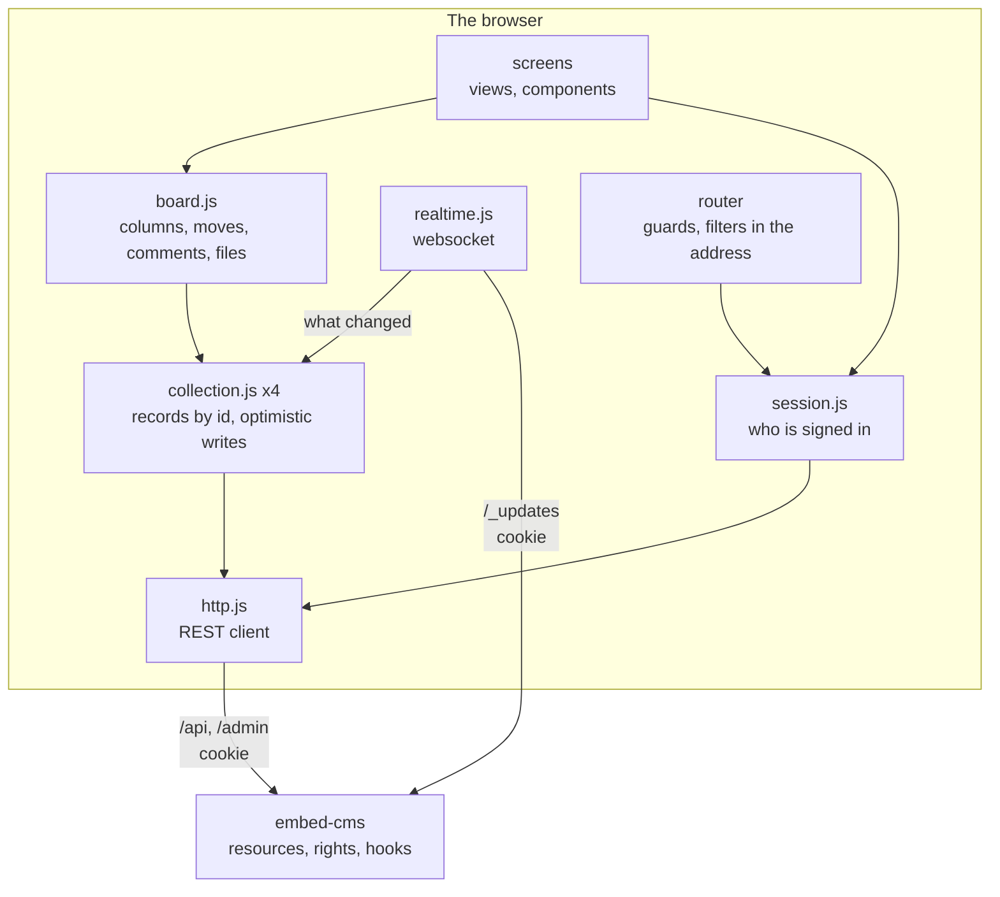

← [Examples](../README.md)

# Boardwalk Example

Boardwalk is a task board for a team: projects, cards in four columns, comments, files and people. It is a single-page Vue 3 app that uses embed-cms as its backend. The CMS keeps the data, checks who may do what, and says when something changes. The app does the rest.

Read this one when your front end is an application and not a site. It is plain JavaScript with JSDoc (no TypeScript), single-file components, Vue Router and Vite. There is no state library: the state lives in a few small stores built on Vue's own reactivity, and they are the part to read first.

What it shows:

- A login whose cookie the browser keeps and the app never sees. A router lets only signed-in people in.
- One small client for the REST API, and one generic store for the records of a resource. A write shows at once and is taken back if the CMS refuses it.
- The websocket of the CMS as it really behaves: what it says, what it leaves out, and what the app does about each.
- Dragging a card with one write.
- A filter kept in the address, so a filtered board can be linked.
- A card that other people change while you edit it, without losing what you typed.
- Hooks in the CMS that number the cards and set the author of a comment.
- Tests at four levels, down to the real CMS with a real websocket.


| A card, open beside the board | A filtered board (the filter is in the address) |
|---|---|
|  |  |

## Run it

```
cd docs/examples/taskboard
node server.js
```

Open `http://localhost:3000`.

The first start builds the app with Vite (a few seconds) and fills the CMS with three people, two projects, ten cards and two comments. It prints one account for each person, once: `An account to sign in with: ada / …`. Later starts find everything in place.

The admin of the CMS is at `/admin` on the same address (`localAdmin` / `localAdmin` on a development machine). The team group has no right on the CMS itself.

These variables change how it runs:

| Variable | What it does |
|---|---|
| `PORT` | Another port. |
| `STATE_DIR` | Keeps the data and the built app somewhere other than this folder. |
| `AUTH_SECRET`, `SESSION_SECRET` | Sign the login and the session. Required in production: long and random. |
| `DEV=1` | Vite serves the app and reloads it as you edit. |

You can also run the CMS alone and run `npx vite` in this folder. Its proxy sends `/api`, `/admin` and the websocket to the CMS (`CMS_URL`, `http://localhost:3000` by default), so the browser sees one address again.

| File | What it does |
|---|---|
| `resources/` | The content model: `people`, `projects`, `tasks`, `comments`. |
| `hooks.js` | What the CMS does on its own side: the number of a task, its place, the author of a comment. |
| `seed.js`, `content.json` | The first data, the group `team`, and an account for each person. |
| `server.js` | The CMS and the app in one program. It builds the app, or serves it from Vite. |
| `vite.config.mjs`, `index.html` | How the app is built, and the proxy for working on it. |
| `src/api/http.js` | The client of the REST API. |
| `src/api/session.js` | Who is signed in. |
| `src/api/realtime.js` | The websocket: kept open, answered, opened again when lost. |
| `src/stores/collection.js` | The records of one resource. |
| `src/stores/board.js` | The four collections, and what the screens do with them. |
| `src/lib/position.js`, `src/lib/filters.js` | The order of the cards, and what narrows them. Plain functions. |
| `src/services.js`, `src/router.js`, `src/main.js` | The services made once, the addresses and who may see them, and the start. |
| `src/views/`, `src/components/`, `src/App.vue` | The screens. They load data and show it. They never build an address or read a raw response. |

## How the pieces fit



Only `http.js` and `realtime.js` know there is a CMS. A screen asks the board for the cards of a column. The board asks a collection for its records. The collection asks the client for a page. Because of this, each layer can be tested alone.

## What the app uses of the CMS

| The app needs | The CMS gives |
|---|---|
| To know who is signed in | `GET /admin/login`: an empty object when nobody is, else `{ username, group, rights, … }` |
| To sign in and out | `POST /admin/login` (sets an HTTP-only cookie), `GET /admin/logout` |
| A list | `GET /api/tasks?query={"project":"…"}&limit=200&page=0`, and the total in the `numRecords` header |
| To write | `POST /api/tasks`, `PUT /api/tasks/:id` (only what changes), `DELETE /api/tasks/:id` |
| To send a file | A multipart `POST /api/tasks/:id/attachments`. The name of the part is the field. |
| A small picture of a big one | `GET …/attachments/:aid?resize=96xauto` |
| To hear about changes | The websocket `/_updates`: `{ action, data: { resource, _id, _updatedBy } }` |
| To know who may do what | The group of the person. Its `rights` list the resources for `read`, `create`, `update`, `remove` and `attachments`. |

## Build it, step by step

### 1. The model, and a group with only what the board needs

There are four resources. Relations are `select` fields: a task points to its project and to the person it is given to, and a comment points to its task. `tasks.js` has a unique `ref` (WEB-12), a `status` that is the column, and a `position` that is the place in the column.

The people who sign in are users of the CMS in the group `team`. That group has `read`, `create`, `update`, `remove` and `attachments` on the four resources of the board, and on nothing else (`seed.js`). Over the API or in the admin, the team cannot read users, groups or settings.

```js
group = await authentication.groups.create({ name: 'team', read: RESOURCES, create: RESOURCES, update: RESOURCES, remove: RESOURCES, attachments: RESOURCES })
```

The CMS starts with a login page, not the Basic authentication prompt of the browser, which a single-page app cannot use well:

```js
const cms = new CMS({ mid: 'webnode1', resources, data, disableAuthentication: true, disableJwtLogin: false, wsRecordUpdates: true })
```

### 2. One program, one address

`server.js` mounts the CMS first (`/api`, `/admin`, `/_updates`), then the built app. Every other address gets `index.html`, so the router in the browser can read it.

The CMS and the app share one origin on purpose. The browser sends the login cookie only to the address that set it. And the CMS refuses a write that carries its cookie when the page it came from is not its own (the check against cross-site requests). If you put the app on another address, you must list it in `security.allowedOrigins` and think about the cookie. While you work on the app, the Vite proxy keeps the one address.

### 3. The client: all the HTTP in one place

`createHttp` is the only code that calls `fetch`. It does four things:

- It turns a failed answer into an `ApiError` carrying the reason the CMS gave, in a line a person can read.
- It says "the server cannot be reached" when the network fails.
- It lets a cancelled request stay cancelled, so a screen can tell a fault from a person who went elsewhere.
- It tells the app when the CMS says nobody is signed in. A session that ends while a page is open then sends the person to the login.

```js
if (!res.ok) {
  const error = new ApiError(res.status, reasonOf(res, data), data)
  if (res.status === 401) onUnauthorized(error)
  throw error
}
```

A list is a `page()` call that returns the records and the total. An upload uses `XMLHttpRequest`, because `fetch` cannot report how far a file has gone. It posts the file as a part named for the field, with the cookie, and reports progress.

The module has no Vue in it, and it takes the `fetch` it uses as an argument, so a test can give it a fake.

### 4. The session, and who may see what

The cookie is HTTP-only, so the app cannot read it and holds no token. When it starts, and after a sign-in, the app asks the CMS who it is (`GET /admin/login`). It keeps `{ username, group, rights }`, and the stamp the CMS puts on what this person writes, `group~username`. That stamp is how the app tells its own changes from other people's (step 7).

The router asks before every page. Someone who is not signed in goes to `/login?redirect=…` and comes back to where they were after signing in. The address to come back to is checked: it must be a page of this app and never another address (`//evil.example` is refused).

```js
router.beforeEach(async (to) => {
  if (!session.state.checked) await session.check()
  const signedIn = Boolean(session.state.user)
  if (to.meta.public) return signedIn && to.name === 'login' ? { name: 'projects' } : true
  return signedIn ? true : { name: 'login', query: { redirect: to.fullPath } }
})
```

`session.can('update', 'tasks')` hides what the CMS would refuse, such as a disabled field or a missing form. It is a courtesy only. The CMS checks again on every request.

### 5. A collection: the records of a resource

`createCollection` is generic: the same code holds people, projects, tasks and comments. It follows these rules:

- Records are kept by id in a `Map` that is replaced, not changed (`shallowRef`). A screen showing one card is not told when another card changes, and loading a thousand records is one update.
- A write shows at once, then is sent. `update(id, patch)` puts the change in the record with `_pending`, sends only the patch, and swaps in the record from the CMS when it answers. If the CMS refuses, the record goes back to what it was and the error goes to the screen.
- The writes of one record go one after the other. Two quick edits of a card must not cross on the way. The second is sent when the first has answered, and only the last answer becomes the state. Otherwise the answer to the first could arrive over the second.
- A record asked for twice at once is asked for once.
- A late answer does not win. If a record is older than the one held (by `_updatedAt`), it is not kept.
- A load knows what is gone. If you read the tasks of a project and one you held is missing, someone removed it, so the collection drops it.

```js
const previous = writing.get(id) || Promise.resolve()
const run = previous.catch(() => {}).then(async () => {
  const record = await http.put(path(id), patch)
  if (writing.get(id) === run) commit((map) => map.set(id, record))   // only the last write's answer is the state
  return record
})
writing.set(id, run)
```

### 6. The board, and the order of the cards

`board.js` creates the four collections and answers the questions the screens ask: the cards of a column (this project, this status, filtered, in order), the labels of a project, and who "me" is. Everything is `computed` from the collections. Nothing is a copy.

A column is its cards sorted by `position`. When you drop a card, it gets a number between those of its two neighbours (`lib/position.js`), and only that card is written. The other cards keep their numbers. A move is therefore one write, and two people moving different cards do not collide. When two numbers get too close for another between them, the column is numbered again, a thousand apart, and the card is placed among the new numbers.

```js
export function place (column, movingId, index) {
  const others = column.filter((card) => card._id !== movingId)
  const at = Math.max(0, Math.min(index, others.length))
  if (crowded(others, at)) { /* number the column again, then place */ }
  return { position: between(others[at - 1]?.position, others[at]?.position), renumber: [] }
}
```

The drag uses the browser's own events (`draggable`, `dragover`, `drop`) and no library. A column works out where the pointer is among the boxes of its cards (`dropIndex`), draws a line there, and reports "this card, at this place". If the filter hides some neighbours, the card is placed among the ones shown, which is what the person means.

### 7. Real time, as the CMS really says it

Over `/_updates`, the CMS tells every signed-in client that a record was made, changed or removed. The message is short on purpose. `{ action, data: { resource, _id, _updatedBy } }` says what changed, not what it became. Three facts about it decide how the app listens:

- A change names the record, so the app fetches it. `update` and `create` carry the id. The collection reads that record (`GET /api/tasks/:id`). If the record is gone (404), it drops it.
- A removal has no id, and a file is announced by the id of the file. The removed record has no id left to name, and a file message names the file, not the card it belongs to. Neither tells the app which card to look at. For these, the collection reads again what it holds (the lists it loaded), once for a burst of messages.
- The message for your own write can arrive before the answer to that write. `_updatedBy` is `group~username`, the stamp the app already has. A change that is your own, and is still in flight or already held, is not read again.

```js
if (message.action === 'remove' || /Attachment$/.test(message.action)) { reloadSoon(); return }
if (mine && message.action === 'update' && (writing.has(data._id) || (held && !held._pending))) return
fetch(data._id)
```

The connection itself (`realtime.js`) behaves like this:

- It answers the CMS's `ping` with a `pong`, or the CMS closes it.
- When the connection drops, it opens again, waiting twice as long each time. The wait is spread randomly, so a server restart is not met by every browser at once.
- When it is back it says `reconnected`. Anything said while it was away was not heard, so the collections read again what they hold.

The badge in the header says whether the board is live. When it is not, what is on the screen may be old.

### 8. The filter is the address

Take `/p/WEB?q=link&who=ada,grace&label=bug&due=soon`. The search, the people, the labels and the dates are all in the query of the address. The screen reads it (`readFilters`), the filter bar writes it (`writeFilters`), and nothing else keeps it. A filtered board can therefore be linked and reloaded, and the back button returns to the board as it was.

The search waits for a pause in typing before it writes, so one word is not one address per letter. The open card (`/p/WEB/t/WEB-3`) keeps the filter when it opens and closes.

### 9. The card, edited by several people

The panel edits a draft. A field is written when you leave it, and a choice (the status, the person) is written at once. Others use the board too, so a card can change while it is open. The panel never loses what you typed:

- A field nobody here touched takes the new value.
- A field you are editing keeps your typing, says that someone changed it, and lets you choose between theirs and yours.

Two details that a real CMS forces:

- A field is written once at a time. What you type while a write is out is written after it. It is not lost and not sent twice.
- Labels are typed as `bug, urgent` and kept as a list. When the answer comes back, the field shows the list, and this is not taken for a change by someone else. The field being written is left alone until its answer arrives.

Files: the panel lists them, with a small picture for an image (the CMS makes it with `?resize=96xauto`). It sends the chosen files one by one, with a progress bar and a Cancel button, and it can remove one. The answer to an upload is the file, not the task, so the board reads the task again.

### 10. What the CMS does on its side

Some things must not be left to a client. `hooks.js` puts [hooks](../../reference/API.md#hooks) on the resources, so they apply to every writer: the board, the admin, a script.

- The number of a task (`WEB-12`) is given by the CMS, one after the other. Two people creating a card at the same moment must not get the same number. So the numbers are handed out inside a queue and counted per project. A number sent in a request is ignored. The REST API stamps what it receives with `_updatedBy`, and the seed, which writes inside the process, brings its own numbers.
- A card goes to the foot of its column unless the request says where. Its number never changes.
- The author of a comment is the account that wrote it. The hook takes it from the CMS stamp, not from the request, so a client cannot write in somebody else's name.

```js
api('comments').before('create', (context) => {
  const stamp = String(_.get(context, 'params.object._updatedBy', ''))
  context.params.object.author = stamp.includes('~') ? stamp.split('~').slice(1).join('~') : 'someone'
  context.next()
})
```

### 11. How it is tested

There are four levels. The tests are in `test/frontend` and `test/unit` of the repository and run with the others.

| Level | What it tests | What it finds |
|---|---|---|
| Pure logic (`taskboard.lib`) | The order of the cards and the filters, with no component and no network. | An index off by one. A filter that keeps what it should not. |
| The client and the stores (`taskboard.api`, `taskboard.stores`) | The HTTP client, the session and the websocket, with a fake `fetch`, XHR and WebSocket. The collection and the board, over an in-memory fake of the REST API whose calls wait for the test, so answers can arrive in the wrong order. | A write taken back wrongly. An answer that wins when it should not. A reconnection that is too fast. |
| The app (`taskboard.components`) | The whole app mounted with its router: signing in, the board, the filter in the address, a drag, the card, comments, files, and what the CMS refuses. | What a person would see go wrong. |
| The real CMS (`exampleTaskboard`) | The app's own modules, driven from Node over a real CMS with a real cookie, websocket and upload. | What a fake cannot tell: a removal message has no id, a file is announced by its own id, the message for your own write comes before its answer, two parallel creates got the same number. |

The last level matters most when you change the CMS, because it holds the app to what the CMS really does. The real `server.js` is also run as a program by the suite that holds every example to the same bar (`test/unit/examples.test.js`). It builds the app, serves it, and checks that every script and stylesheet the page names is there.

## Putting a board like this in production

- Secrets. Set `AUTH_SECRET` and `SESSION_SECRET`, long and random. With `NODE_ENV=production` the CMS refuses the published defaults. Delete the `localAdmin` account or change its password ([Security](../../../SECURITY.md)).
- HTTPS. Over HTTPS the cookie is `Secure` by default (`security.cookies`). Put a reverse proxy in front and set `trustProxy` to the number of proxies ([Security](../../../SECURITY.md)). Then `secure: "auto"` and the origin check see what the person sees.
- The websocket. The proxy must pass the `Upgrade` header for `/_updates`.
- Size. The board reads the tasks of the project it opens, page by page. For a project with tens of thousands of cards, use a narrower filter in the query. The CMS evaluates the filter over every record, and it has no sort, so `position` is sorted in the app.
- Several servers. The websocket only reaches the clients of one process. With more than one server, changes made on another are not announced here. Set up the [replication](../../operations/REPLICATION.md) of the CMS, or read the lists again now and then.

## What this example does not do

It has no roles inside a project (the team is one group), no history of changes, no notifications outside the board, and no card in two projects. It does not work offline either: it shows what it holds and says it is offline, but it does not queue writes. You would add these on top. The places to add them are the stores and the hooks.
