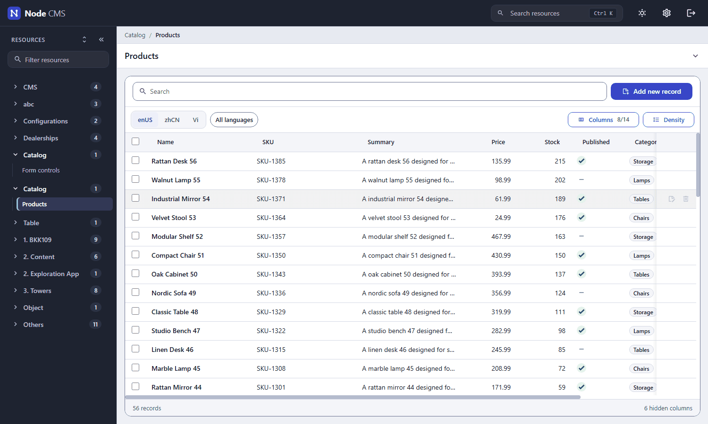
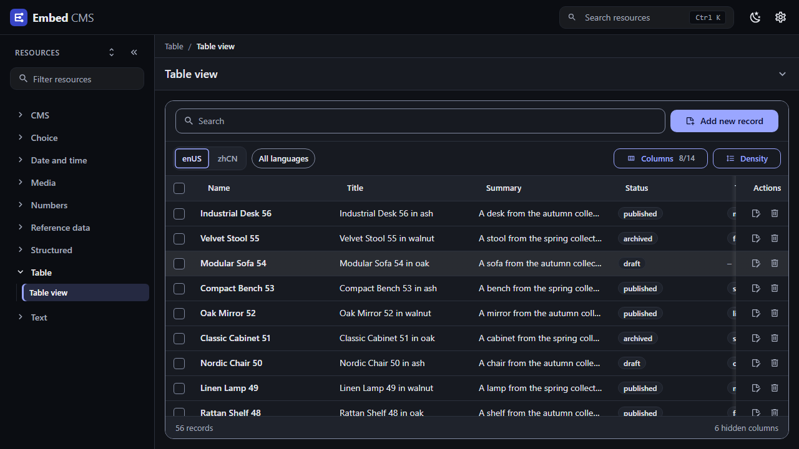
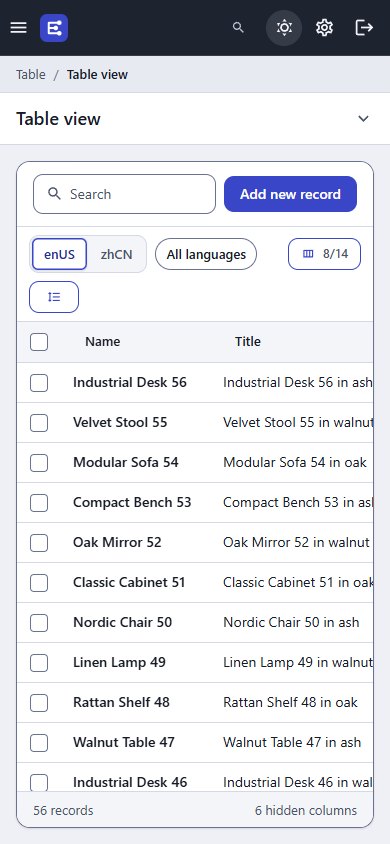
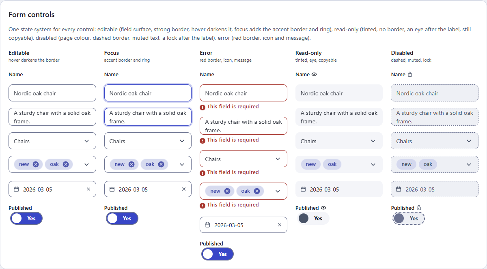
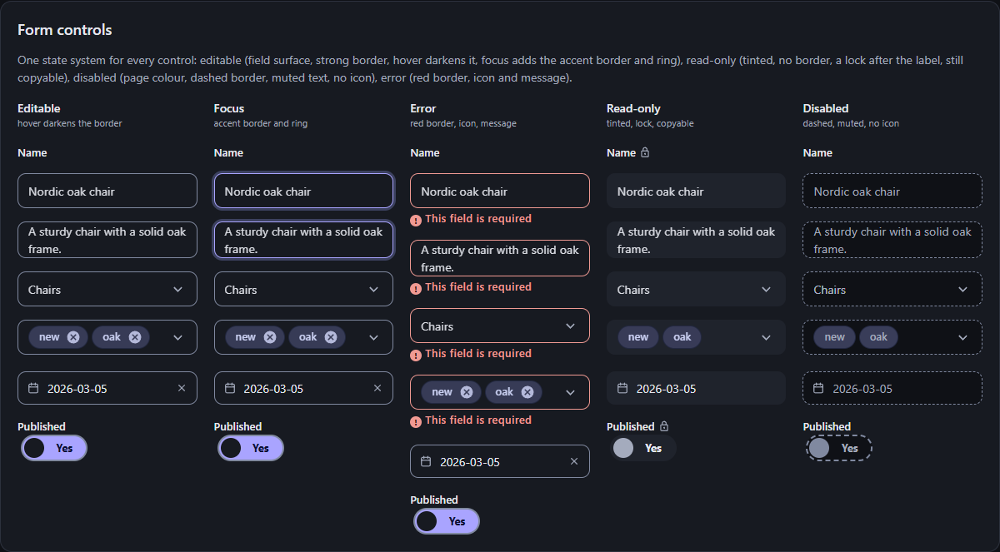
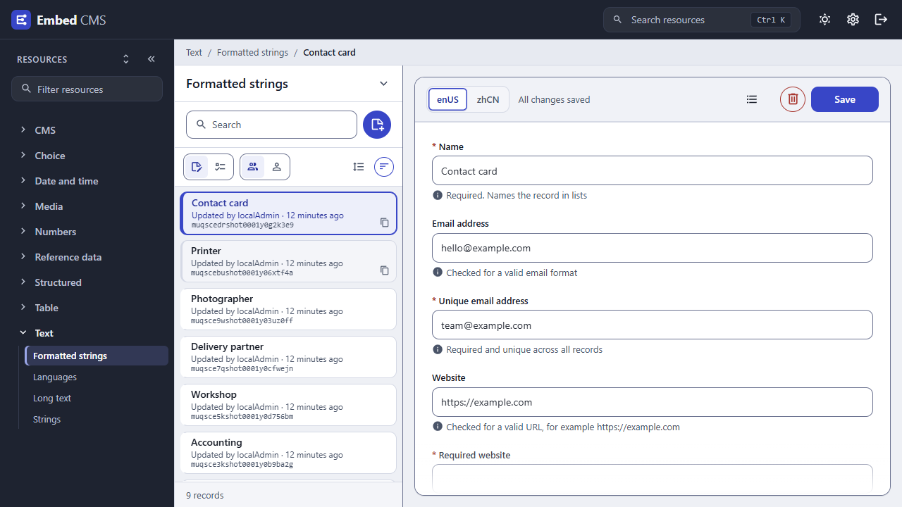
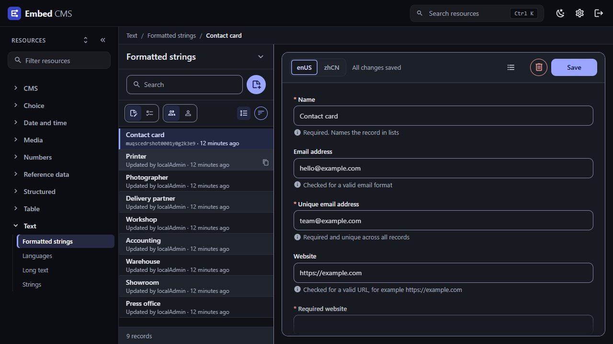
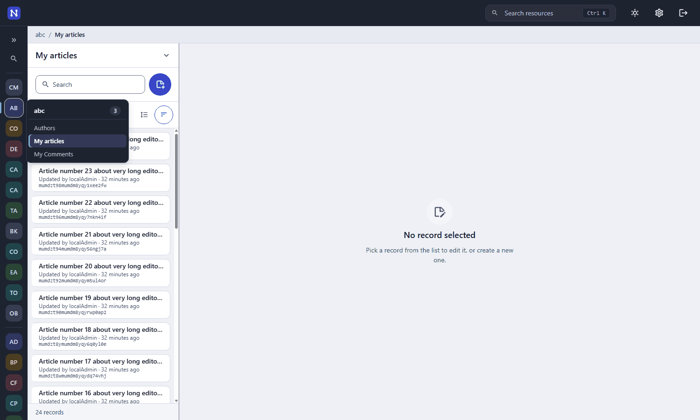
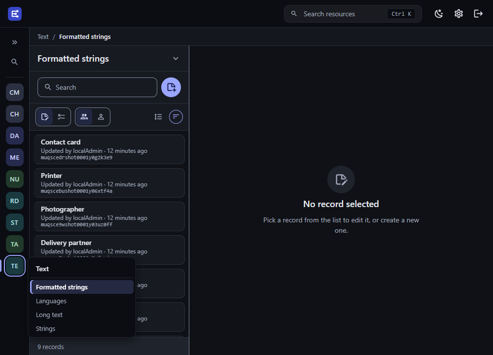
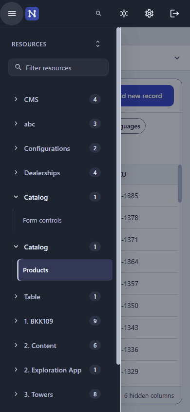

← [Documentation](../README.md)

# Design system

How the admin looks, and the rules that keep it looking that way: the palette and why it is the way it is, the components every page shares, and the checks a test makes so nobody sneaks in a stray colour. If you build an admin page of your own (see [Plugins](../start/CONCEPTS.md#plugin)), start here and your page will fit in.

You don't have to take our word for it: the admin has a living reference page, open `#/?id=design-system`, with every button, chip, dialog, toast, dropdown and form control in both themes.

## In short

- **One palette, from the logo.** Everything is a tint or shade of the logo's indigo plus four muted status colours, with text contrast at WCAG AA or better in both themes. Colours, sizes and spacing are CSS tokens in `src/styles/tokens.scss`; components never hard-code a colour, and `test/frontend/designSystem.test.js` fails if one does.
- **Layout.** A top bar, then a sidebar of collapsible resource groups that becomes a 60px rail on tablets and a drawer on phones. The record list and the editor sit side by side from 768px wide, one after the other below that.
- **Editing.** A fixed action bar with Save and Discard, a dot on every changed field, per-locale markers for unsaved and missing values, a confirmation before you leave unsaved work, and a toast naming the required fields that are still empty.
- **Shared pieces.** One button system, one dialog component, one toast host, one state system for form fields (editable, read-only, disabled, error). The living reference is in the admin itself: open `#/?id=design-system`.
- **Dark mode** is opt-in: set `disableDarkMode: false` and the top bar gets a theme switch.

To re-theme the admin, change the values in `tokens.scss` and the two colour maps at the top of `src/vuetify.js`. To build a component, follow the [rules at the end](#design-system-rules-enforced-by-testfrontenddesignsystemtestjs).

The screenshots in `docs/ui/` show the admin with the field catalogue of `resources/`, in both themes. Only the ones this page shows are checked at every change; the others are retaken when the part of the admin they show changes.

## Design direction

- Palette: derived from the three logo colours (see "Palette derivation" below). One hue only, plus muted functional status colours.
- Type: system font stack (no font download), token scale 12/13/14/16/18/22/28 px in rem, weights 400/500/600/700, no italics for UI text, fixed sizes (no vw scaling). Inputs are 16px on phones so iOS does not zoom.
- Shape and space: 4px spacing scale, radii 4/6/10/14/pill, two-level shadows.
- Layout: app bar (menu, logo, resource search, theme, system/links, logout; the language is the user's own setting, not a switch) plus a persistent left navigation of collapsible resource groups on desktop (at least 1280px). Below that the navigation is an off-canvas drawer with scrim, Escape to close and focus management. List + editor sit side by side from 768px; below that they are two steps (list, then editor with a Back button).
- Field forms: labels above controls, uniform 40px (44px on touch) controls, one focus ring style, dirty fields marked with a dot and a warning border.
- States: skeleton rows while loading, empty states for no resource selection, empty resources and no search results; toasts stay 2.5s (errors stay until closed) and are announced with `role="status"`.

## Palette derivation

The logo is an "E" whose three arms end in node dots, on an indigo badge (the dots echo the network-style mark it replaced), next to the wordmark "Embed CMS". It lives in `BrandLogo.vue`, `src/assets/logo.svg` and `public/favicon.svg`, with the PNG and ICO favicons and the touch icon generated from the same drawing. The logo (`src/assets/logo.svg`) has three colours: indigo badge `#3846C7`, near-black text `#161B26`, slate `#4A5468`. Everything else is a tint or shade of that indigo (hue about 234 degrees) or a muted status colour. The app bar and sidebar ("chrome") use a deep shade of the indigo with light text; `BrandLogo` has an `on-dark` variant (light wordmark), and the on-dark colours come from the same tokens.

Three surface levels: page (`--cms-bg`) below panels (`--cms-list-bg`, `--cms-bar-bg`, `--cms-crumb-bg`) below cards and fields (`--cms-surface`).

| Role | Light | Dark |
| --- | --- | --- |
| Primary | `#4540A8` | `#A9A4FF` |
| Primary hover / soft / text on soft | `#37338C` / `#E7EAFB` / `#2E2A8A` | `#C0BCFF` / `#262D5E` / `#D6DBFF` |
| Text / muted (logo near-black, logo slate) | `#161B26` / `#4A5468` | `#E8EAF6` / `#A7ADCB` |
| Page / list column / action bar / breadcrumb band | `#E8EBF6` / `#F1F3FB` / `#E9ECFA` / `#DCE0F3` | `#0D0F1D` / `#111428` / `#1E2447` / `#141833` |
| Card and field surface / surface 2 / surface 3 | `#FFFFFF` / `#EDEFFA` / `#DDE1F3` | `#171B33` / `#202650` / `#2B3266` |
| Border / strong (controls) | `#C5CBE6` / `#6B7290` | `#2E3568` / `#7F87B5` |
| Chrome (app bar, sidebar) / text / muted / hover | `#1B2052` / `#F1F3FF` / `#C3C9F2` / `#2A3175` | `#070914` / `#E8EAF6` / `#A7ADCB` / `#171B3A` |
| Selected nav item | `#4540A8` + accent bar `#B4BCFF` | `#4540A8` + accent bar `#A9A4FF` |
| Error / warning / success / info | `#A8362F` / `#85560A` / `#2D6B52` / `#2C5DA3` | `#F09A93` / `#E6B565` / `#7BCBA5` / `#8DB4F0` |

Contrast ratios (WCAG 2.x relative luminance; required 4.5:1 for text, 3:1 for UI boundaries):

| Pair | Light | Dark |
| --- | --- | --- |
| Text on page / card / list column / action bar / breadcrumb | 14.48 / 17.23 / 15.55 / 14.64 / 13.13 | 15.89 / 14.13 / 15.18 / 12.54 / 14.51 |
| Muted on page / card / list column / action bar / breadcrumb | 6.40 / 7.61 / 6.87 / 6.47 / 5.80 | 8.60 / 7.64 / 8.21 / 6.78 / 7.85 |
| Muted on surface 3 | 5.85 | 5.42 |
| Strong border on card / list column / action bar (3:1) | 4.74 / 4.27 / 4.02 | 4.86 / 5.23 / 4.32 |
| On-primary on primary (buttons) | 8.23 | 8.31 |
| Primary on card / list column / action bar | 8.23 / 7.43 / 6.99 | 7.61 / 8.18 / 6.75 |
| Text on soft (selected rows) | 10.10 | 10.62 |
| Chrome text / muted on chrome | 13.82 / 9.42 | 16.57 / 8.96 |
| Chrome text / muted on chrome hover | 10.59 / 7.22 | 13.98 / 7.56 |
| White on selected nav item | 8.23 | 8.23 |
| Chrome badge text on badge / muted on badge | 8.68 / 6.55 | 9.64 / 6.66 |
| Error on card / soft / action bar | 6.49 / 5.70 / 5.52 | 7.86 / 6.95 / 6.97 |
| Warning on soft | 5.63 | 7.68 |
| Error button (white / dark text) | 6.49 | 8.58 |

The dark theme is opt-in through the existing `disableDarkMode: false` server option.

## Button system

Defined once: Vuetify props map to variants (`src/vuetify.js` defaults plus `src/styles/base.scss`), no per-component overrides. Living reference: open `#/?id=design-system` in the admin.

| Variant | How | Use |
| --- | --- | --- |
| Primary | `<v-btn>` (filled indigo, white text) | one main action per view (Save, Confirm, Create) |
| Secondary | `variant="outlined"` | Cancel, Discard, Keep editing, supporting actions |
| Tertiary | `variant="text"` (icon-only for toolbars, with aria-label and title) | low emphasis |
| Destructive | `color="error"` filled / `variant="outlined" color="error"` | final confirmation / entry point such as Delete |

Sizes: default 36px, compact (`size="small"`) 32px, 44px on coarse pointers. Sentence case, medium weight, no letter spacing or uppercase anywhere. States: hover, pressed, focus ring, disabled (neutral fill, muted text, still readable), loading (spinner before the label, label kept). Toggles and chips (`.toggle-mode-btn`, `.filter-chip`, locale switchers, Vuetify chips) share the pill shape and the soft-indigo selected state.

Dialogs: one component, `components/AppDialog.vue` (discard, delete, config restart, replicator), with `DialogService.ask()` for promise based confirmations. Icon (info, warning, destructive), semibold title, body, footer with cancel left and primary right, `alertdialog` role with `aria-labelledby/describedby`, the safe button focused first on destructive dialogs, Escape cancels, focus returns to the trigger. Toasts (`components/ToastHost.vue`): bottom right (400px wide, the full width on a phone, above the uploads panel while files are uploading), max 3, named messages (no raw ids), pause on hover or focus, errors persist and can hold an action.

## Dirty tracking and locale markers

`src/utils/dirtyTracker.js` is the single source of truth: a normalised snapshot of the record (taken when it loads or is saved) is compared with the current model by a deep watcher, so every field type is covered. Empty rich text (`""`, `

`, `
 
`), blanks, empty arrays/objects and unchecked booleans are equivalent, so an untouched WYSIWYG is clean and typing then deleting returns to clean. Per-locale results drive the locale tabs: an amber dot only on tabs whose own localised values changed, a red circle with `!` (and a count) on tabs with missing required fields, shared required fields are flagged on the field and in the "Jump to field" menu. Discard remounts the form, so rich text goes back to what was saved too.

## Frontend tests

The pure logic behind the UI (dirty tracker, table model, sidebar model, preferences, date formats, highlight) and the design-system rules have tests in `test/frontend`, next to component tests that mount real components. How to run them and what they cover: [TESTING.md](../contributing/TESTING.md).

## Editorial workflow features

- List: dense rows with title, updated-by, updated-at and a read-only badge; the id appears on hover, focus and selection. Search stays focused while typing; `/` jumps to search from anywhere outside a field; Up/Down/Home/End move between rows and Enter opens one; sort, a density switch and an All / Me toggle (records created or updated by you) are always visible; the table view keeps the same toolbar. In the multi-select mode a click on a row adds or removes that record (like its box), and the chips of the selected records are never faded: the fade that hints at more records below only shows when the list really overflows. Rows have no colour transition, because the list recycles its rows and a fade would show a record as selected for a split second after a filter or a sort.
- Editor: the action bar stays fixed above the scrolling form and shows "Unsaved changes" / "All changes saved", Discard and Save. Leaving the record, the resource, logging out or closing the tab with unsaved changes asks first (dialog buttons "Keep editing" / "Leave without saving", native prompt for the tab). Required and invalid fields show an inline message and a red boundary once the field is left or a save is attempted; dirty fields carry a dot. The locale switcher marks locales that still miss a required field. Forms with more than six fields get a "Jump to field" outline menu.
- Navigation: the sidebar has a resource filter, collapsible groups whose state is remembered in `localStorage`, and a breadcrumb (group / resource / record) above the content. Ctrl/Cmd+K opens the quick switcher from anywhere, including inside form fields; it is a modal dialog, so Tab walks its results (Shift+Tab walks back) instead of leaving for the page behind.
- Feedback: save, delete and error results are toasts (2.5s, errors persist until closed). Deleting one or many records opens a dialog that names the record(s) and says it cannot be undone. Loads show list skeletons and a thin progress bar under the app bar instead of dimming the page.
- Attachments: a drop area that is a field like the others (a dashed accent outline over a tinted surface only while a file is dragged over it), one card per file (a grip to drag it, its position as 1/3, the picture across the card with a bin in its corner, the name and the size at the foot; a file without a picture has a View button and a Remove button side by side), and a Reorder mode that lists them with buttons to move each one place. The grip is shown when there are two files or more.

## Table view

Resources with `view: 'table'` use `RecordTable.vue` (state, toolbar, bulk bar, footer) around `VueTableGenerator.vue` (the grid) and `TableCell.vue` (one cell per column kind). All pure logic lives in `src/utils/tableModel.js` and is covered by `test/frontend/tableModel.test.js` and `tableView.test.js`.

 

- Toolbar: the same look as the list. Resource selector (`ResourceSelector.vue`), `SearchField` with clear button, "Add new record" as the primary button. A second row holds the locale switcher, the "All languages" toggle, the column menu and the density menu; it turns into the bulk bar (count, clear, "Delete selected") while rows are selected.
- Locales: only the selected locale's columns are shown; "All languages" expands every locale of every localised field. The header carries a small locale badge only while several locales are visible, and a missing translation shows a muted dash with the title "Not translated".
- Columns: widths per input type (`WIDTHS` in tableModel), narrow tables stretch the flexible columns, a header label is never clipped, cell text ends in an ellipsis and gets a title tooltip only when it really overflows. Sticky header row, sticky checkbox and first column, sticky actions column, soft edge shadows while scrolled.
- Column menu: show, hide, reorder with up/down buttons, Reset. Choices are remembered per resource in `localStorage` (`embed-cms.table.columns.<resource>`: hidden, order, showAllLocales, sortBy). A resource author can pick and order the default columns with `options.index`; wide schemas without indexes start with the first 8 columns.
- Sorting: click a header (`aria-sort`, arrow), click again for descending, again to clear, shift-click adds a secondary sort (rank shown next to the arrow). Empty values always sort last.
- Rows: 32 / 40 / 48px (compact, default, comfortable, tokens `--cms-table-row-*`, 44px minimum on touch), hover tint, selected tint with a thin accent bar, windowed rendering (fixed row height, spacer rows) so hundreds of records stay light. Keyboard: Tab enters the grid (one tab stop), arrows move between rows and cells, Home/End, Ctrl+Home/End, PageUp/PageDown, Enter opens, Space selects, Ctrl+A selects all, Escape clears the selection. Shift-click on a checkbox selects a range.
- Actions: small ghost icon buttons (`.cms-icon-btn`), visible on hover, focus and always on touch devices.
- Cells by type: check or dash for booleans, chips with "+n" for multi values, thumbnails with a muted placeholder, ISO dates as `YYYY-MM-DD` / `YYYY-MM-DD HH:mm`, tabular numbers, links only for `http(s)` and `mailto`.
- States: skeleton rows while loading, compact empty states (title plus one hint line, no button) for "Nothing here yet!" and "No results", footer with the record count ("12 of 60 records" when filtered) and the number of hidden columns.
- Phones (under 560px of grid width): the grid scrolls horizontally, the first column keeps a short sticky width and the actions column scrolls with the row.

## Form field states

One state system for every control (`base.scss`, tokens `--cms-field-*`), shown in the design-system page under "Form controls".

 

| State | Surface | Border | Text | Icon | Cursor | Focus | Contrast |
| --- | --- | --- | --- | --- | --- | --- | --- |
| Editable | `--cms-field-bg` (surface) | 1px `--cms-border-strong`, hover `--cms-text-muted` | `--cms-text`, placeholder `--cms-text-muted` | none | text | accent border plus 3px ring `--cms-field-ring` | border 4.7:1 (light) / 5.0:1 (dark) on surface, text 17.2:1 / 14.2:1 |
| Read-only | `--cms-field-readonly-bg` (surface 2) | none (transparent) | `--cms-text`, selectable and copyable | lock icon after the label, `aria-readonly` | default | accent border and ring when focused | text 15.8:1 (light), 12.8:1 (dark) |
| Disabled | `--cms-field-disabled-bg` (page) | 1px dashed `--cms-border-strong` | `--cms-text-muted` | no icon | not-allowed | not focusable | text 6.7:1 (light), 8.2:1 (dark) |
| Error | as editable | 1px `--cms-error` | inline message in `--cms-error` with a "!" icon | "!" before the message, `*` on the label when required | text | accent ring | error 6.5:1 / 8.1:1 on surface |
| Loading or computed | skeleton or spinner in the field | as editable | muted | spinner | progress | n/a | n/a |

Every control height is `--cms-field-h` (40px, 44px on touch and phones), labels are 13px semibold above the control, helper and error text are 13px. Read-only means the value is real but cannot be edited; disabled means the field is not available (dashed, muted). Controls: inputs and textarea (`CustomInput`, `CustomTextarea`), selects, multi selects and pillbox (Vuetify fields), date, datetime and time (`CustomDatetimePicker`), switch (`CustomCheckbox`, `role="switch"`, keyboard operable), JSON viewer, wysiwyg, code and colour keep their own surface but use the same border, radius and focus tokens; file and image drop zones are fields like the others.

Date and time fields: a leading calendar icon inside a white 40px field, muted format placeholder, typing and picking both work (typed text is parsed with the schema format, dayjs tokens are translated by `src/utils/dateFormat.js`), clear button, a "Now" shortcut for datetime and time, the popup follows the dropdown surface, radius and elevation. Read-only shows the eye after the label, disabled the dashed style and a lock after the label.

## Pictures and their tools

The preview of a picture or a file in a field is a card (`PreviewAttachment.vue`, `ShowAttachment.vue`), 200px wide: a grip and the position (`1/3`) on top when there are two or more (nothing to put in order with one), the picture across the card with a bin in its corner, the name and the size at the foot. A file with no picture has **View** and **Remove** side by side. The bin sits on a translucent disc (`--cms-image-control-bg`, with `--cms-on-image-control` for the icon, defined in both palettes, so it reads on any picture). A picture keeps the card's own shape (16:10, cut to fit); a picture with a crop or a map has its own, whole, as high as its width says (at most 220px), and a circle crop is round.

The crop tool (`CropDialog.vue`) and the image map tool (`ImageMapDialog.vue`) are modals with the same frame, so they feel alike: a title, a body with the picture on the left (on the checker `--cms-checker`) and the tools in a column on the right (320px and 340px), and a foot with the extra actions on the left and Cancel then the primary action on the right, as in the other dialogs. The card has a height of its own, `min(92vh, 820px)`, so that it does not grow and shrink with what is selected: the column of tools scrolls inside it, and the picture is fitted to the room the stage has (a small picture up to four times its size). Vuetify gives the card of a dialog a flex basis that a height does not beat, so the card overrides it (`&.v-dialog > .v-overlay__content > .card`). Under 900px the picture and the tools are one under the other and the modal scrolls.

The rules these two follow, for any tool of the kind:
- A choice among a few things is a row of small rounded buttons: the chosen one is `variant="flat"` in the primary colour with `aria-pressed="true"`, the others outlined. Icon buttons have an `aria-label` and a `title`.
- A field has a real `<label for>` above it, with an `id` of `<input id>-label` (Vuetify points the input at that id with `aria-labelledby`), an `id` and a `name` on the input, and no label of Vuetify's own: its floating label is not tied to the input, which the browser's DevTools Issues report for every field. The tests check this.
- What is drawn over a picture uses tokens only: the shapes `--cms-primary` at low opacity with a `--cms-on-image-control` outline, the numbers on them outlined with `--cms-image-control-bg`, the handles a `--cms-on-image-control` square with a `--cms-primary` border. The outline keeps its width at any zoom (`vector-effect: non-scaling-stroke`); sizes that do not follow the picture (handles, numbers) are computed from how wide it is shown.
- Everything that can be done with a pointer can be done without one: the shapes of a map have numbers for their position, **Add** puts one in the middle of the picture, the arrow keys move the selected one, Delete removes it and Escape lets go.
- Nothing is lost in silence: a link the server would refuse is shown in red and stops Apply, a record that is gone is shown by its id with "not found", and the list of records is asked for again each time the tool opens.

## Links

A link is the primary colour with no underline at rest. It is underlined on hover and on keyboard focus (with the focus ring), and a visited link is a slightly darker shade. `cms-link is-muted` is the same in the muted text colour, for secondary links, and a link with `target="_blank"` gets a small arrow after it. Links to the admin itself use its addresses: `#/?id=articles` for a resource and `#/?id=articles&record=<id>` for a record. The same class styles a link in a page, in a table and in a plugin, so the three look alike (the links in the record grid follow the same rule); Vuetify's own `v-btn` and `v-list-item` are not links in this sense and keep their component styles. The classes are listed in [PLUGIN_UI_KIT.md](PLUGIN_UI_KIT.md#links), and the Design system page of the admin draws them.

## Dropdowns

Menus, selects and autocompletes share `base.scss` and the Vuetify defaults. `CustomMultiSelect` adds: match highlighting in the option text (`highlightSegments`), a secondary line (`options.subtitle` Mustache template, or the id for options that come from another resource), group headings (`options.groupBy`, `withGroupHeadings`), a "No matches" state, a clear button on non-required single selects. The type-ahead search is the field's own input; role, `aria-expanded`, `aria-activedescendant` and keyboard support are the Vuetify combobox ones.

## List rows

Rows have three lines: title (semibold, one line, ellipsis and tooltip), meta ("Updated by localAdmin · a few seconds ago", 12px, muted, wraps instead of truncating, a lock icon marks read-only records) and the full record id on its own line (11px monospace, muted, `overflow-wrap: anywhere`). Sizes are tokens: `--cms-record-title-fs`, `--cms-record-title-fw`, `--cms-record-meta-fs`, `--cms-record-id-fs` (the table's first column uses the same title weight), row heights `--cms-list-row` (68px) and `--cms-list-row-compact` (48px). The density button in the controls row switches to compact rows: plain full-width rows separated by a hairline, not cards (title and meta, the id in the tooltip and shown instead of the meta line on the selected row; the selected row has the soft fill and an accent bar on its left edge); the choice is remembered (`embed-cms.ui.list.density`). A ghost copy button appears on hover and focus (also the `c` key on a focused row) and shows an "ID copied" toast. Semantics: `listbox` with `option` rows and `aria-selected`.

 

## Sidebar rail

The sidebar has three modes (`resolveNavMode` in `src/utils/navModel.js`): expanded (default from 1280px), rail (default from 768px to 1279px) and the off-canvas drawer under 768px. The toggle sits at the top of the sidebar (`aria-label`, `aria-expanded`, `aria-controls`) and Ctrl/Cmd+B toggles it too (ignored inside text fields, where Ctrl+B means bold); the choice is remembered (`embed-cms.ui.nav.mode`). The width changes in 160ms (`--cms-motion-nav`, none with reduced motion) and the content is clipped so nothing jumps.

- Rail (`NavRail.vue`, 60px): one badge per group with the initials (`groupInitials`: "2. Exploration App" is EA) on one of six calm tints (`--cms-rail-tint-*`, chosen from a hash of the group name so a group always keeps its colour, text on tint at least 4.5:1, tested), an accent bar at the left edge for the group that holds the current resource, the mark of the logo alone in the app bar (the wordmark is hidden), a search icon that opens the quick switcher, and the resources of the regular "Others" group as separate badges in a bottom section.
- Flyout: opens on hover, keyboard focus, click and Enter; header with the group name and count, active item highlighted; Up/Down/Home/End move between items, Escape or Left closes and returns focus to the badge, outside click and focus-out close it. Every icon has a `title` and an `aria-label`; the nav landmark is labelled "Resources".
- Expanded: a drag handle on the right edge (`role="separator"`, `aria-valuenow` 200 to 360, arrows change it by 16px, double-click resets to 248, remembered as `embed-cms.ui.nav.width`).

  

The sticky title and filter block of the expanded sidebar uses 12 to 16px padding, sits on the opaque sidebar surface and shows a divider and shadow only once the list has scrolled. Scrollbars everywhere are thin and palette coloured with no arrow buttons (`base.scss`; WebKit pseudo-elements for Chromium and Safari, `scrollbar-width` for Firefox). The breadcrumb truncates its middle segments first and keeps the last one readable, every segment has a title, the last has `aria-current`. Auto-selection of the first resource moved from `ResourceList` to `App` (it does not run on the design-system page).

## Where things live

| Concern | File |
| --- | --- |
| Colour, radius, spacing, type, layout, motion tokens (light + dark) | `src/styles/tokens.scss` |
| Vuetify palette (light + dark) and component defaults | `src/vuetify.js` |
| Global element, focus, reduced-motion and Vuetify overrides | `src/styles/base.scss` |
| SCSS aliases onto the tokens (the names older component styles use) | `src/assets/scss/variables.scss` |
| Typography mixins (built on the tokens) | `src/assets/scss/mixins.scss` |
| Theme switching helper (sets `data-theme` on `<html>`) | `src/utils/theme.js` |
| Table model, sidebar model, persisted preferences, date formats, highlight | `src/utils/tableModel.js`, `navModel.js`, `preferences.js`, `dateFormat.js`, `highlight.js` |
| Table, rail, list | `RecordTable.vue`, `VueTableGenerator.vue`, `TableCell.vue`, `TableColumnMenu.vue`, `NavRail.vue`, `ResourceSelector.vue`, `RecordList.vue` |
| Picture previews, the crop tool and the image map tool | `src/components/attachments/` (`PreviewAttachment.vue`, `ShowAttachment.vue`, `CropDialog.vue`, `ImageMapDialog.vue`, `ImageMapOverlay.vue`), `src/utils/cropRecipe.js`, `src/utils/imageMap.js`, `src/assets/scss/components/ImageView.scss` |
| Logo (inline component and standalone SVG) | `src/components/layout/BrandLogo.vue`, `src/assets/logo.svg`, `public/favicon.svg` |

To re-theme: change values in `tokens.scss` and the two colour maps at the top of `src/vuetify.js`. Dark mode is opt-in through the existing `disableDarkMode: false` server option; the choice is applied via `data-theme` on `<html>` so teleported overlays follow it.

## Accessibility summary

WCAG AA text contrast, visible `:focus-visible` rings everywhere, forced-colors fallback, skip link, `aria-label`s on icon buttons, `aria-pressed`/`aria-expanded`/`aria-current` on toggles and navigation, labelled inputs, `role="alert"` login errors, `prefers-reduced-motion` disables animations and the spinner rotation, 44px touch targets on coarse pointers (every button, including the icon buttons of the app bar, the toggles, the sort and copy-id buttons, the locale buttons, the search boxes and the date boxes; the breadcrumb links grow their hit area without moving), and 16px text in every input on coarse pointers, so that iOS does not zoom in on focus (`src/assets/scss/main.scss`, the touch block at its end).

On a phone (under 600px wide) the record editor keeps its room for the form: the breadcrumb is hidden (the Back button, the title and the app bar say where you are), the card has no margin and no border, and the action bar is two lines, with "Unsaved changes" shortened to its dot (the text stays for screen readers). The form gets 636px of an 812px screen, where it had 520px, and 224px of a 400px one (the keyboard up), where it had 148px. Tablets and computers keep the card.

A phone on its side has the width of a tablet and 375px of height, so it gets the phone layout too: the phone layout starts under 768px wide, or on a touch screen under 500px high (`$phone-query` in `src/assets/scss/variables.scss`, and `DRAWER_QUERY` in `App.vue`, which a test keeps the same). One column (the list, then the editor with its Back button), the navigation in the drawer, and, in landscape, no breadcrumb anywhere, the title of the list on the row of the search, and the action bar of the editor on one line: the form gets 251px of a 375px screen (it had 179px beside the list).

The language of a record on a phone (the phone layout, see below) is one button of 44px next to Back, not a row of tabs: it shows the language that is edited with its markers (the amber dot for unsaved edits, the red circle for missing required fields) and a dot on its corner when another language needs a look. With two languages a press changes the language (the button says which, to a screen reader as well); with more, it opens the list of them, one line of 44px each with its own markers and a check on the language that is shown. Ten languages take one row of the bar where the tabs took four (`TopBarLocaleList.vue`). The tabs also give way to the button off a phone, where they would take more than half of the bar (84px a language, `src/utils/localeBar.js`): five languages in an editor of the usual width, or four in a narrow one. On a phone Back is its arrow alone, Discard is its icon (the name stays for a screen reader), the text "Unsaved changes" is left out, and the bar is one line for a new record (Back, the language, the jump menu, Save); after a failed save what is missing has a row of its own under the bar, the width of the screen.

In a paragraph field, on a phone the type of block and the Add button share one row (Add multiple goes to a row of its own), the sticky bar stays one line over the blocks, and on a touch screen the bar of a block and its grip are 44px (the Reorder button moves blocks without dragging).

A dialog on a phone keeps its title and its foot in view and scrolls its middle (the map of a geopoint field, the crop and image map tools); in landscape the picture and the tools stand side by side. The calendar popup of a touch screen is never taller than the screen and scrolls inside, with Cancel and Select fixed at its foot. A field that has the cursor is left when a block is dragged.

In an image or file field the previews are 200px cards; in an editor under 480px wide (a phone, a tablet beside the list) each takes the whole line instead of leaving the rest of it empty, and on a touch screen the grip that drags a preview is a 44px target and the line of the preview is as tall as a button. A finger drags as soon as it moves from the grip (the grip has `touch-action: none`, so a swipe on it never scrolls the page, and there is nothing to wait for); the blocks, the images and the files share the options in `src/mixins/DragList.js`. While one is dragged the page is not restyled as a whole: the grabbing cursor and the ban on selecting text are for a mouse only, and the previews and the blocks have no transition. On a touch screen the others do not slide aside either, and the blocks that are folded while one is carried are hidden with `content-visibility: hidden`, which keeps their boxes (where `display: none` throws them away, and showing them again at the drop built every box of every editor again); a browser without it folds them with `display: none`.

## Design choices

- The dropdown type-ahead is the field's own input: there is no separate search box inside the menu.
- Every field type has a read-only look (a tinted surface, no border, the lock after the label) and a disabled look (dashed and muted, no icon). The input, select, date, switch, JSON, code, rich text and colour controls draw them from the same tokens.
- The syslog filter keeps its terminal styling, with its own clear button and Escape handling.
- `Ctrl/Cmd+B` doesn't toggle the sidebar inside a text field, on purpose: there it means bold.

## Design system rules (enforced by `test/frontend/designSystem.test.js`)

- Every colour, radius, spacing, type, shadow and density value comes from `src/styles/tokens.scss`. Vuetify's own palette in `src/vuetify.js` mirrors the key colours (the test checks primary, surface-2 and background stay in step).
- Components never hard-code a colour (`#hex`, `rgb()`, `hsl()`). The test fails on any literal outside `tokens.scss` and `vuetify.js`. If a colour is missing, add a token, in both palettes when it changes with the theme.
- Interaction states use tokens too: `--cms-overlay-hover` and `--cms-overlay-strong` on content surfaces, `--cms-chrome-hover` on the dark chrome (a faint translucent lift, never a solid block), `--cms-nav-active-bg` for the selected navigation item.
- Density is a token: `--cms-nav-group-row` and `--cms-nav-item-row` set the height of the resources column rows.
- Code blocks and the log viewer use the `--cms-code-*`, `--cms-syntax-*`, `--cms-terminal-*` and `--cms-log-*` tokens.
- `!important` is a patch. The test allows the current number at most and fails if it grows; lower the baseline in the test when you remove some.
- Every `--cms-*` variable that is used must be defined, and every colour token defined for the light palette must also be defined for the dark one.
