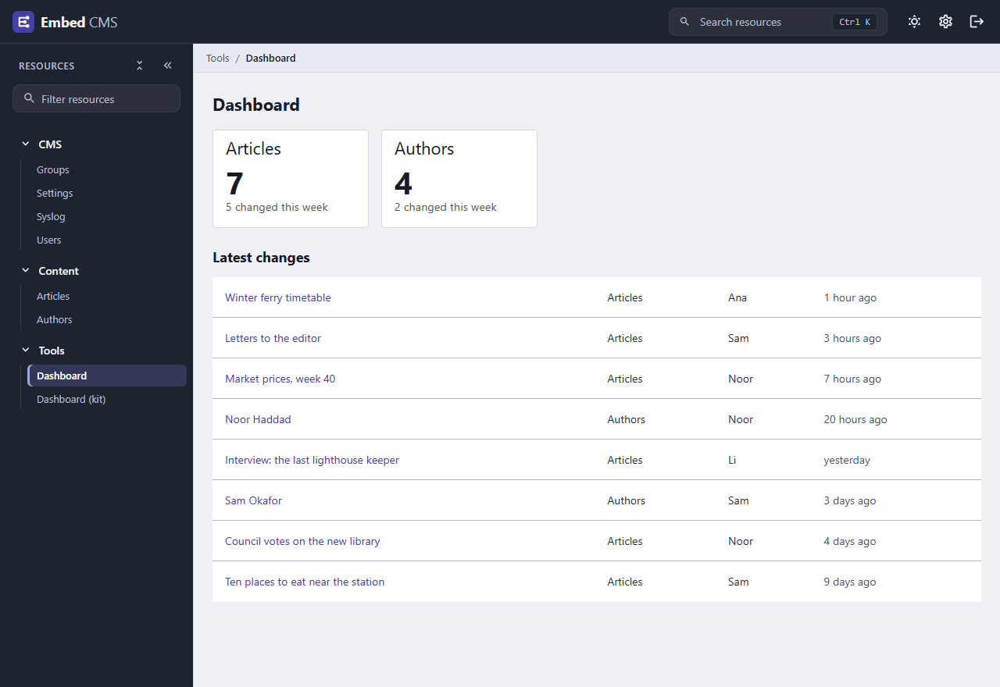
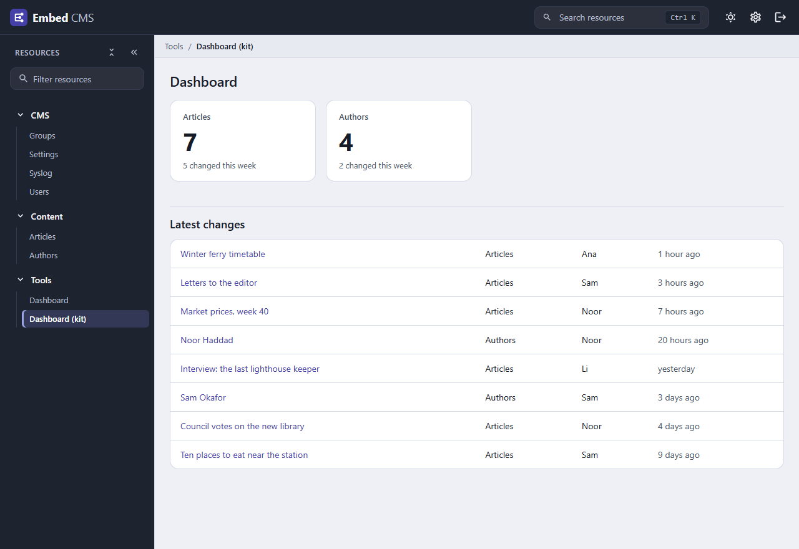
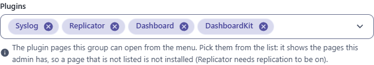

← [Documentation](../README.md)

# Writing your own plugin

embed-cms is built from plugins: REST, the admin, replication, sync, import and the Excel export are all plugins that the CMS installs at start-up. You can write yours the same way, and there are two kinds, which often work as a pair:

- a **server plugin** adds routes, a resource of its own, hooks, or work to do at start-up;
- an **admin page** adds a screen to the admin's menu, written in Vue.

Both halves below build a small **content dashboard** for the `articles` and `authors` resources of the [getting started guide](../start/GETTING_STARTED.md#3-describe-your-content): a server route that adds up what's in several resources and lists the latest changes across them, and an admin page that shows the result as cards and a table.



Where this could go next, with plugins that load without rebuilding the admin, get the theme for free and can add widgets and field types, is designed in [PLUGIN_SYSTEM_DESIGN.md](PLUGIN_SYSTEM_DESIGN.md).

The best teacher is the code that's already there: `lib/plugins/anonymousRead/index.js` is the smallest server plugin, `lib/plugins/sync/index.js` is a full one, and `src/components/pages/` holds the admin pages of the built-in plugins.

## A server plugin

A plugin is a class. The CMS calls `new Plugin(cms, options, configPath)` when you install it with `cms.use`:

```js
// dashboard.js
const express = require('express')

// a text, or one text per language: the first one will do
const text = (value) => (value && typeof value === 'object' ? Object.values(value)[0] : value)
const DAY = 24 * 60 * 60 * 1000

class Dashboard {
  static pluginName = 'dashboard'             // the name the instance is kept under (default: the class name)

  constructor (cms, options = {}) {
    this.cms = cms
    cms.$dashboard = this                      // a habit of the built-ins: other code can find the plugin on `cms`
    const names = options.resources || ['articles', 'authors']

    const app = express()
    app.get('/summary',
      (req, res, next) => cms.$authentication.dispatchAuth(req, res, next),   // only for people who are logged in
      async (req, res, next) => {
        try {
          const resources = []
          const activity = []
          for (const name of names) {
            const resource = cms.resource(name)
            const records = await cms.api()(name).list()
            const title = text(resource.options.displayname) || name
            const labelField = resource.options.schema[0].field        // the first field names a record
            resources.push({
              name,
              title,
              total: records.length,
              recent: records.filter((record) => Date.now() - record._updatedAt < 7 * DAY).length
            })
            for (const record of records) {
              activity.push({
                resource: name,
                resourceTitle: title,
                id: record._id,
                label: text(record[labelField]) || record._id,
                by: (record._updatedBy || '').split('~').pop() || 'API',
                at: record._updatedAt
              })
            }
          }
          activity.sort((a, b) => b.at - a.at)
          res.json({ resources, activity: activity.slice(0, 8) })
        } catch (error) {
          next(error)
        }
      })
    cms.express().use(options.mount || '/dashboard', app)
  }
}

module.exports = Dashboard
```

Install it in your server, **before** you mount the CMS and call `bootstrap`:

```js
const express = require('express')
const CMS = require('embed-cms')
const Dashboard = require('./dashboard')

const cms = new CMS({ mid: 'webnode1' })
cms.use(Dashboard, { resources: ['articles', 'authors'] })   // the second argument is what the constructor receives as `options`

const app = express()
app.use(cms.express())
const server = app.listen(3000, () => cms.bootstrap(server))
```

`GET /dashboard/summary` answers `401` without a login, and with one it answers the totals and the eight latest changes as JSON:

```json
{
  "resources": [
    { "name": "articles", "title": "Articles", "total": 7, "recent": 5 },
    { "name": "authors", "title": "Authors", "total": 4, "recent": 2 }
  ],
  "activity": [
    { "resource": "articles", "resourceTitle": "Articles", "id": "…", "label": "Hello", "by": "Ana", "at": 1790814595146 }
  ]
}
```

(It reads every record of the resources it watches, which is fine for thousands. For much bigger resources, count with `list(query, { limit })` or keep running totals in hooks.)

### What a plugin can do

| You want to | Do this |
|---|---|
| Add routes | Make an Express app and mount it with `cms.express().use('/mount', app)`, as above. |
| Require a login on a route | Put `cms.$authentication.dispatchAuth` in front of the handler. It answers `401` itself when there is no valid login. |
| Read or write records | `cms.api()('resource')`: the [JavaScript API](../reference/API.md), with every right. |
| Read what a resource looks like | `cms.resource('articles').options` is its declaration: the schema, the `displayname`, the locales. |
| Add a resource | `cms.resource(name, definition)`, in the constructor, before bootstrap. A name starting with `_` is a system resource: it is listed under the heading you give it, and its changes aren't broadcast over the update websocket. |
| React to records | `cms.api()('articles').before('create', fn)` or `.after(...)`: see [Hooks](../reference/API.md#hooks). |
| Run code at start-up | Push an async function to `cms.bootstrapFunctions`. It receives a `done` callback, the functions run one after the other, and `bootstrap` resolves when the last one is done. |
| Read the options | `cms.options` has everything of [CONFIG.md](../reference/CONFIG.md), so a block of your own in `cms.json` (`"dashboard": { ... }`) is available as `cms.options.dashboard`. |
| Send something to open admins | `cms.broadcast({ action: 'my-event', data: { ... } })`. |

A plugin that keeps its own settings, and guards them with a hook once the stores are open, looks like this (the pieces are all in the table above):

```js
cms.resource('_dashboard', {                    // edited in the admin, in the CMS menu
  displayname: 'Dashboard settings',
  group: 'CMS',
  maxCount: 1,                                  // a single record: the admin opens it without a list
  schema: [{ field: 'resources', input: 'pillbox', label: 'Resources to show', localised: false }]
})

cms.bootstrapFunctions.push(async (done) => {   // runs once the stores are open
  cms.api()('_dashboard').before('remove', (context) => context.error({ code: 403, message: 'The settings cannot be removed' }))
  done()
})
```

### Good to know

- **Install the plugin before `cms.bootstrap`.** Resources and bootstrap functions added after it are never started.
- **Errors in your routes.** The CMS answers its own errors as JSON, but its error handler sits before your plugin in the chain. An error you pass to `next(error)` reaches your Express app's error handler (or Express's HTML default), so add one, or answer the error in the route with `res.status(500).json(...)`.
- **A plugin name** (`pluginName`) is only a label; two plugins with the same name replace each other in the CMS's list.
- **Everything is typed.** In TypeScript, the class you pass to `cms.use` is checked against `CMS.PluginClass`: see [TYPESCRIPT.md](../reference/TYPESCRIPT.md).

## An admin page

The admin is a Vue 3 app that's built with Vite. A page of your own lives in a folder called `embed-cms/plugins/` at the root of your project, next to `resources/`, and gets built into the admin:

```
my-site/
├── embed-cms/
│   └── plugins/
│       ├── js/
│       │   ├── main.js                    the list of your pages
│       │   └── DashboardPage.vue          a page
│       └── scss/
│           └── main.scss                  styles (it can be empty, but the file must exist)
```

The admin imports `js/main.js` and `scss/main.scss` from that folder, so both have to be there.

`js/main.js` says which pages there are:

```js
import { markRaw, defineAsyncComponent } from 'vue'

window.plugins = window.plugins || []
window.plugins.push({
  title: 'DashboardPage',               // the name of the page: it is what the address bar shows (#/?id=DashboardPage)
  displayname: 'Dashboard',             // what a user group lists in its Plugins to be allowed in. It never changes.
  label: 'Dashboard',                   // the text in the menu: plain text or a translation key
  group: 'Tools',                       // the menu heading it is listed under (a new heading is created if needed)
  component: markRaw(defineAsyncComponent(() => import('./DashboardPage.vue'))),
  pluginComponent: 'DashboardPage'
})
```

`js/DashboardPage.vue` is an ordinary Vue component. It calls your server plugin through the host object (`this.$admin`, see below): the page is served from `/admin/`, so `../dashboard/summary` is `/dashboard/summary`, and `host.fetch` sends the login cookie. Its links use the admin's own addresses, `#/?id=articles` for a resource and `#/?id=articles&record=<id>` for a record:

```vue
<template>
  <div class="dashboard-page">
    <h1>Dashboard</h1>
    <p v-if="error" class="error">{{ error }}</p>

    <div class="cards">
      <v-card v-for="item in resources" :key="item.name" :href="`#/?id=${item.name}`" variant="outlined" class="card">
        <v-card-title>{{ item.title }}</v-card-title>
        <v-card-text>
          <div class="total">{{ item.total }}</div>
          <div class="hint">{{ item.recent }} changed this week</div>
        </v-card-text>
      </v-card>
    </div>

    <h2>Latest changes</h2>
    <v-table>
      <tbody>
        <tr v-for="item in activity" :key="item.id">
          <td><a class="cms-link" :href="`#/?id=${item.resource}&record=${item.id}`">{{ item.label }}</a></td>
          <td>{{ item.resourceTitle }}</td>
          <td>{{ item.by }}</td>
          <td class="when">{{ ago(item.at) }}</td>
        </tr>
      </tbody>
    </v-table>
  </div>
</template>

<script>
  const UNITS = [['day', 86400000], ['hour', 3600000], ['minute', 60000]]
  const relative = new Intl.RelativeTimeFormat('en', { numeric: 'auto' })

  export default {
    data () {
      return { resources: [], activity: [], error: '' }
    },
    methods: {
      ago (time) {
        const elapsed = time - Date.now()
        const [unit, size] = UNITS.find(([, size]) => Math.abs(elapsed) >= size) || ['minute', 60000]
        return relative.format(Math.round(elapsed / size), unit)
      }
    },
    async mounted () {
      try {
        const res = await this.$admin.fetch('../dashboard/summary')
        if (!res.ok) {
          throw new Error(`The server answered ${res.status}`)
        }
        Object.assign(this, await res.json())
      } catch (error) {
        this.error = error.message
      }
    }
  }
</script>

<style>
.dashboard-page { padding: var(--cms-space-6); }
.dashboard-page h1 { margin-block: 0 var(--cms-space-4); font-size: var(--cms-fs-xl); }
.dashboard-page h2 { margin-block: var(--cms-space-6) var(--cms-space-3); font-size: var(--cms-fs-lg); }
.dashboard-page .cards { display: flex; flex-wrap: wrap; gap: var(--cms-space-4); }
.dashboard-page .card { min-width: 200px; text-decoration: none; color: var(--cms-text); background: var(--cms-surface); border-color: var(--cms-border); }
.dashboard-page .total { font-size: 2.5rem; font-weight: 700; line-height: 1.1; }
.dashboard-page .hint, .dashboard-page .when { color: var(--cms-text-muted); }
.dashboard-page .error { color: var(--cms-error); }
</style>
```

The admin's Vuetify components (`v-card`, `v-table`, `v-btn`, `v-text-field`, `v-dialog`...) are available in a page without importing them, so it looks like the rest of the admin. For colours, spacing and type, use the `--cms-*` variables of the [Design system](DESIGN_SYSTEM.md#design-system-rules-enforced-by-testfrontenddesignsystemtestjs): your page then follows the light and dark themes by itself.

### The host object

A page reaches the admin through one object: `this.$admin` in an options API component, `useAdmin()` in a `<script setup>` one, and `window.embedCms.host` anywhere else.

| Member | What it gives |
|---|---|
| `host.api(resource)` | `list`, `find`, `create`, `update` and `remove` over REST, with the login of the person |
| `host.fetch(url, init)` | `fetch` to the CMS: a relative URL is counted from the admin page, and the login cookie goes along |
| `host.user` | `{ username, group, language, theme }`, or null |
| `host.can(right, resource)` | Whether the group of the person has `read`, `create`, `update`, `remove` or `attachments` on a resource (the server decides in the end) |
| `host.config` | The public part of the configuration |
| `host.t(key, params)` and `host.locale` | The translations of the admin and the current language |
| `host.notify(message, kind)` | A toast: `success`, `info`, `warn` or `error` |
| `host.confirm(options)` | The shared dialog, resolving to true or false |
| `host.navigate({ resource, record })` | Opens a resource or a record |
| `host.theme` | Reactive: `{ mode: 'light' \| 'dark' }` |
| `host.icon(name)` | The SVG of an icon the admin uses |
| `host.kitStyles()` | The [UI kit](PLUGIN_UI_KIT.md) as a stylesheet to adopt in a shadow root |
| `host.on(event, listener)` | `record:saved`, `record:removed`, `locale:changed` and `theme:changed`; returns a function that stops listening |

It is typed in [TYPESCRIPT.md](../reference/TYPESCRIPT.md#plugins-of-the-admin) (`EmbedCMS.Host`). The older `window.DialogService` and `window.TranslateService` keep working.

### The same page with no Vuetify

Everything above works with plain HTML too. The [UI kit](PLUGIN_UI_KIT.md) is a set of `cms-` classes that draw cards, tables, grids and forms from the same tokens, so the page below looks like the Vuetify one, in both themes, with no component library:

```vue
<template>
  <div class="cms-page">
    <div class="cms-page-inner">
        <header class="cms-page-header"><h1 class="cms-page-title">Dashboard</h1></header>
        <div v-if="error" class="cms-callout is-error" role="alert">{{ error }}</div>

        <div class="cms-grid">
          <a v-for="item in resources" :key="item.name" class="cms-col-3 cms-card is-interactive cms-link-card" :href="`#/?id=${item.name}`">
            <div class="cms-card-body cms-stat">
              <span class="cms-stat-label">{{ item.title }}</span>
              <span class="cms-stat-value">{{ item.total }}</span>
              <span class="cms-stat-hint">{{ item.recent }} changed this week</span>
            </div>
          </a>
        </div>

        <section class="cms-section">
          <h2 class="cms-h3">Latest changes</h2>
          <div class="cms-datatable-scroll">
            <table class="cms-datatable is-hover">
              <tbody>
                <tr v-for="item in activity" :key="item.id">
                  <td><a class="cms-link" :href="`#/?id=${item.resource}&record=${item.id}`">{{ item.label }}</a></td>
                  <td>{{ item.resourceTitle }}</td>
                  <td>{{ item.by }}</td>
                  <td class="cms-text-muted">{{ ago(item.at) }}</td>
                </tr>
              </tbody>
            </table>
          </div>
        </section>
    </div>
  </div>
</template>
```



The script is the same as above, and the `<style>` block goes away. A plugin written in React or Svelte uses the same classes, and in a shadow root it adopts `await host.kitStyles()`.

### Build it, then let people in

1. **Build the admin again**, so that your pages are included (a minute or two):

   ```sh
   cd node_modules/embed-cms
   npm install --include=dev
   npm run build
   cd ../..
   ```

   Working in a clone of the embed-cms repository instead? The admin takes its pages from `src/.plugins/` there, and `npm run serve-backend` with `npm run dev` rebuilds them as you type (see [CONTRIBUTING.md](../../CONTRIBUTING.md#running-it)).
2. **Give a group the right.** Open **Groups** in the admin's **CMS** menu, and pick `Dashboard` (the `displayname`) in the **Plugins** list of the group: the list shows every page the admin has built in. The `admins` group keeps the plugins you add by hand.

   
3. Reload the admin: **Dashboard** is in the menu under *Tools*.

A page can also have an `allowed` list: `allowed: ['admins']` limits it to those user groups, on top of the Plugins right.

### When the page doesn't show up

| Symptom | Why |
|---|---|
| Not in the menu | The group of the user doesn't have the `displayname` in its **Plugins** list, or `allowed` leaves the group out. The admin reads the rights when it starts, so reload it after changing a group. |
| The build fails with `Could not load ... scss/main.scss (imported by src/main.js): ENOENT` (or the same for `js/main.js`) | One of the two required files is missing in `embed-cms/plugins/`. |
| The page doesn't change after an edit | The admin wasn't built again. |
| `401` from `fetch` | The route doesn't know the login: put `dispatchAuth` in front of it, or send credentials. |
| `404` from `fetch('../dashboard/summary')` | The plugin isn't installed, or its `mount` is different. Check the order: `cms.use` before `bootstrap`. |
| There are no plugin pages at all | With both [login switches](../reference/CONFIG.md#authentication) on there is no user, so no plugin pages: log in with a real group. |

## Where the built-in ones are

| Plugin | Code | What to look at |
|---|---|---|
| `anonymousRead` | `lib/plugins/anonymousRead/index.js` | The smallest: one bootstrap function. |
| `xlsx`, `import`, `importFromRemote` | `lib/plugins/xlsx`, `import`, `importFromRemote` | Routes with uploads, a resource for settings. |
| `sync` | `lib/plugins/sync/index.js` | Routes, a settings resource, hooks, and an admin page (`src/components/pages/SyncResource.vue`). |
| `replicator` | `lib/plugins/replicator/` | A TCP protocol next to the HTTP routes, and the **Replicator** page. |

The built-in server plugins are switched on by the options in [CONFIG.md](../reference/CONFIG.md#features-you-can-switch). Yours are installed in code with `cms.use`: they don't need an option, and the CMS doesn't look for plugin files by itself.
