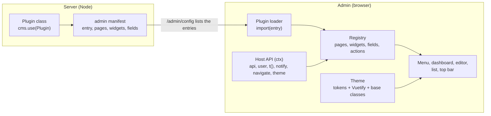

← [Documentation](../README.md)

# Design: a plugin system for the admin

> **Status.** Phase 0 is built: the public tokens, the [UI kit](PLUGIN_UI_KIT.md) and the host object. The later phases are designed and not scheduled. How to write a plugin today is in [PLUGINS.md](PLUGINS.md).

A plugin author can add a page to the admin, and that is all. Three things limit it:

- The page has to be compiled into the admin (a rebuild from `node_modules`, with the dev dependencies).
- It reaches the admin through a handful of untyped globals on `window`.
- It has no way to add a custom field type, a button in the editor, or a card on a dashboard.

This page describes the system that fixes that, with three goals:

1. A plugin looks native without trying. It gets the admin's theme (light and dark, the design tokens, Vuetify's theme) for free, whichever way it's written.
2. It's generic. A plugin can use Vuetify, plain HTML, or another framework, and pick the layout it needs: a padded page, an edge-to-edge canvas, a dashboard of widgets.
3. It's small to write and safe to run. One manifest, a typed host API, no admin rebuild when it can be avoided, and a plugin that breaks takes down its own card, not the admin.

## Without this system

| What | How it works | The problem |
|---|---|---|
| Adding a page | A Vue file in `embed-cms/plugins/`, listed in `window.plugins`, compiled with the admin | A rebuild of the admin for every change; needs the dev dependencies on the server |
| Talking to the admin | `window.DialogService`, `window.TranslateService`, `window.embedCms` | No access to the user, the config, toasts, the request layer or navigation; nothing is versioned |
| Theme | CSS tokens (`--cms-*`) everywhere, Vuetify's theme in a `v-theme-provider`, `data-theme` on `<html>` | It works, but only because the page is compiled in and its author read the Design system page |
| Components | Vuetify, auto-imported at build time | A plugin written without Vuetify has no native look to fall back on |
| Extending the admin | Pages only. Field types are a fixed map in `FormService`, the editor and list have no slots | Everything else means forking |
| Server and admin halves | Installed separately (`cms.use` and a folder) and linked by name | Two things to keep in step, and the right to see the page is granted by hand |

## The design in one picture



A plugin ships **one module** that exports a manifest. The server says which modules exist, the admin loads them when it starts, and each thing the plugin contributes (a page, a widget, a field type, a button) lands in a registry that the admin's own screens read. Everything a plugin contributes gets the same host API and the same theme.

## 1. The manifest

A plugin is a call to `definePlugin`, from a small package, `@embed-cms/plugin-sdk`, that holds the types and nothing else:

```js
// embed-cms/plugins/dashboard/index.js
import { definePlugin } from '@embed-cms/plugin-sdk'

export default definePlugin({
  id: 'dashboard',
  apiVersion: 1,                                   // the version of the admin API it was written for

  pages: [{
    id: 'overview',
    label: 'Dashboard',                            // plain text, or a translation key
    group: 'Tools',
    layout: 'dashboard',                           // see "Layouts"
    right: 'plugins',                              // who sees it (see "Rights")
    component: () => import('./OverviewPage.vue')
  }],

  widgets: [{
    id: 'latest-changes',
    slots: 6,                                      // of 12, like a paragraph block in a dynamic layout
    component: () => import('./LatestChanges.vue')
  }],

  fields: [{
    input: 'rating',                               // usable in a schema: { field: 'stars', input: 'rating' }
    component: () => import('./RatingField.vue'),
    validate: (value, field) => (value >= 1 && value <= 5) || 'Pick 1 to 5'
  }],

  actions: [{
    slot: 'record.toolbar',                        // see "Extension points"
    resources: ['articles'],
    label: 'Preview',
    run: (ctx, record) => window.open(`/preview/${record._id}`)
  }]
})
```

Pages, widgets, fields and actions are all optional, and each has the same three properties: an `id`, a lazy `component` (so an unused plugin costs nothing), and who may use it.

**Declarative widgets, for plugins that need no code.** Many dashboards are only "a number" or "a list". The admin could ship a few widget types that a plugin (or the `cms.json`) just configures:

```js
widgets: [
  { type: 'count', resource: 'articles', label: 'Articles', filter: { published: true }, slots: 3 },
  { type: 'recent', resources: ['articles', 'authors'], limit: 8, slots: 12 }
]
```

The dashboard example in [PLUGINS.md](PLUGINS.md) would then be about ten lines of configuration, and the same widgets work in light and dark, in every language, with the user's rights, because the admin draws them.

## 2. The host API

Every component a plugin contributes receives the same `ctx`. It is the host object that phase 0 ships as `window.embedCms.host`, also `useAdmin()` in a Vue component and `this.$admin` in an options API one. It replaces the loose globals, and it's the only thing a plugin may rely on:

| `ctx` | What it gives | Without it |
|---|---|---|
| `ctx.api(resource)` | `list`, `find`, `create`, `update`, `remove` over REST, with the login and the error handling of the admin | `fetch('../api/...')` by hand |
| `ctx.fetch(url, init)` | `fetch` to the CMS, with the right base path and credentials | the same, by hand |
| `ctx.user` | `{ username, group, language, theme }`, and `ctx.can('update', 'articles')`, answered from the rights of the person's group that `/admin/login` returns (the server decides in the end) | not available |
| `ctx.config` | The public part of the configuration (title, locales, features) | not available |
| `ctx.t(key, params)` and `ctx.locale` | The admin's translations, plus the plugin's own (`i18n: { enUS: {...} }` in the manifest) | `window.TranslateService` |
| `ctx.notify(message, kind)` | A toast | not available |
| `ctx.confirm(options)` | The shared dialog, resolving to a boolean | `window.DialogService.ask` |
| `ctx.navigate({ resource, record })` | Opens a resource, or a record, without building a hash by hand | `#/?id=...` |
| `ctx.theme` | Reactive: `{ mode: 'light' \| 'dark', tokens }` | read the `data-theme` attribute |
| `ctx.icon(name)` | The SVG of any icon the admin uses (Material Design Icons) | not available |
| `ctx.kitStyles()` | Resolves to the UI kit as a constructable stylesheet, for a plugin in a shadow root (null where the browser has none) | not available |
| `ctx.on(event, fn)` | `record:saved`, `record:removed`, `locale:changed`, `theme:changed` | `window.DialogService.events` |

It's typed (the types ship with the SDK), versioned (`apiVersion`), and **additive within a version**: a new method never breaks a plugin written for the same `apiVersion`.

## 3. Theme reuse

The admin already has the ingredients: design tokens, Vuetify's theme, and a theme provider. The design guarantees them to plugins, in three layers, so a plugin picks the one that matches how it's written. **The layers add up, they don't compete:** Vuetify stays fully supported, the kit is there for whoever doesn't want a framework, and both can be used on the same page, because both read the same tokens.

**Layer 1: public tokens (any plugin).** A documented, stable subset of the `--cms-*` variables: colours (`--cms-bg`, `--cms-surface`, `--cms-text`, `--cms-primary`, the status colours), spacing, radii, type, shadows. They change with the light and dark themes, so anything that uses them follows the theme. The Design system page already lists them; the change is a promise: **public tokens don't get renamed inside a major version**, and the rest stay free to change.

**Layer 2: Vuetify (plugins written in Vue).** A plugin component is mounted *inside* the admin's Vue application and its `v-theme-provider`. So `v-card`, `v-table`, `v-btn` and the rest simply work, with the admin's colours, density and defaults, and follow the light and dark switch with no code. Vuetify is shared with the admin (see "Loading"), so a plugin doesn't ship a second copy. Any `v-*` component is supported, and a Vue plugin can freely mix them with kit classes: a `v-card` next to a `cms-datatable`, or a `v-btn` inside a `cms-toolbar`.

**Layer 3: the UI kit (no UI library).** For plugins written in plain HTML, or in another framework, the admin ships a CSS-only kit built from the tokens: typography, links, layout (stack, row, 12-slot grid, split), boxes (card, panel, callout, stat), tables, lists, forms, buttons, badges and more. A `<table class="cms-datatable is-hover">` looks like the admin's own tables without Vuetify or JavaScript. The whole kit, class by class, is in [PLUGIN_UI_KIT.md](PLUGIN_UI_KIT.md).

**Other frameworks and isolation.** A contribution can be a function instead of a Vue component:

```js
component: { mount (el, ctx) { /* React, Svelte, plain DOM... */ return () => { /* unmount */ } } }
```

With `isolation: 'shadow'` it's mounted in a shadow root: the plugin's CSS can't leak into the admin and the admin's can't leak into it, while custom properties (the tokens) still pass through, so it follows the theme anyway. The kit isn't inherited across a shadow boundary, so `ctx.kitStyles()` hands the plugin the stylesheet to adopt. Shadow isolation is the default for anything that isn't Vue.

## 4. Layouts

A page says which layout it wants, and the admin supplies the frame (title, breadcrumb, scrolling, responsive behaviour):

| `layout` | What you get | Typical use |
|---|---|---|
| `page` (default) | A padded, scrolling area under the breadcrumb | Reports, forms, settings screens |
| `full` | Edge to edge, no padding, no title | A map, a canvas, an embedded tool |
| `split` | A list on the left and a detail on the right, with the admin's list styling and the same responsive stacking | A custom browser of records |
| `dashboard` | A 12-slot grid of widgets, wrapping and shrinking like the blocks of a [dynamic layout](../reference/DYNAMIC_LAYOUT.md) | Overviews, status pages |
| `settings` | Titled sections with a sticky save bar, like the editor | Plugin configuration |

The slots are the same idea as dynamic layout (a widget takes `slots` of 12, full width on a phone), so people who know one know the other. Host components expose the frame to Vue plugins: `<cms-page>`, `<cms-grid>`, `<cms-widget>`.

## 5. Extension points

A small, deliberate list. Each is a named slot that the admin renders, and a contribution says which slot (and, where it makes sense, which resources) it's for:

| Slot | Where | Gets |
|---|---|---|
| `menu` | The sidebar | A link, or a page |
| `topbar.actions` | The top bar | A button or a menu |
| `dashboard.widgets` | Any `dashboard` page, and a built-in home page | A widget |
| `record.toolbar` | The editor's action bar | A button, given the record |
| `record.panel` | A collapsible panel beside the form | A component, given the record |
| `list.toolbar` | The row of controls above the record list | A button or a filter |
| `field:<input>` | The form | A custom field type for `input: '<input>'` |

Field types are the most requested thing, and without this system they mean editing `FormService`. Registering `input: 'rating'` would add it to the type map with its component, validator and default options, and the docs page for field types would list it.

## 6. Loading, without rebuilding the admin

A plugin is part of the admin's build. The design loads plugins **at run time**, as ES modules:

1. The server knows its admin plugins (below) and lists their entry URLs in `/admin/config`.
2. The admin starts, then `import()`s each entry and registers what the manifest declares.
3. Each plugin is served by the CMS from its own folder, same origin, so a strict `script-src 'self'` still holds.

The one real design question is **sharing libraries**. A plugin must use the admin's copy of Vue and Vuetify, or components and the theme provider won't match. Two ways to do it:

| | How | Good | Catch |
|---|---|---|---|
| **A. Import map** | The admin build also emits small modules (`/admin/shared/vue.js`, `vuetify.js`) that re-export its copies, and the page declares them in an import map. A plugin is built with `vue` and `vuetify` as externals. | Standard, works with any bundler, no globals | Vuetify's whole component set has to be reachable, which costs some size |
| **B. Window globals** | The admin exposes `window.__embedCms.vue` and `.vuetify`, and the SDK's build preset maps the imports to them. | Simple | Globals again, and tied to the SDK's build preset |

The decision is **A**, because it's the web's own mechanism and keeps plugins buildable with plain Vite or esbuild. Phase 1 has a size budget for it (see "Phases"). The current way, compiling into the admin, stays available for anyone who prefers it.

## 7. One package for both halves

The server plugin and the admin page are two things that have to be kept in step. The design lets the server class declare its admin half:

```js
class Dashboard {
  static pluginName = 'dashboard'
  static admin = { entry: './admin/index.js', right: 'plugins' }   // an ES module, relative to the package
  constructor (cms, options) { /* routes, resources, hooks, as today */ }
}
```

`cms.use(Dashboard)` then does the rest: it serves the entry, lists it in `/admin/config`, and adds the plugin to the `admins` group's Plugins list (as the built-in plugins do now), so the page shows up with no manual step. A plugin becomes one npm package, `embed-cms-plugin-dashboard`, that a project installs and `cms.use`s.

## 8. Rights, safety and failure

- Rights. A page (or widget, or action) appears only for groups that list it, as now. Its REST calls are checked by the server like any other, so hiding a button is a convenience, not the protection. `ctx.can` mirrors the server's answer.
- Trust. A plugin runs in the admin's origin with the user's session, like any code in the project. There is no sandbox, and the docs should say so plainly: install plugins you'd be happy to run on the server. The shadow-root option isolates styles, not privileges.
- Failure. Every contribution is wrapped in an error boundary: a plugin that throws shows a small error card with its name and the version it declared, and the rest of the admin keeps working.
- Versions. `apiVersion` is checked when the plugin loads. A plugin written for a version the admin doesn't support isn't loaded, and the admin says which one and why, instead of failing in a strange place.

## 9. Writing and testing a plugin

- Scaffold. `npx cms plugin new dashboard` creates the package: manifest, a page, a widget, a build script, and a `README`.
- Develop. `npm run dev` in the plugin serves it with hot reload into a running admin (the admin's own `npm run dev` already proxies the CMS), so changing a Vue file updates the open page.
- Test. The SDK includes `mountPage(manifest, pageId, { ctx })`. It mounts a contribution with a fake `ctx` in the tests of the plugin, with the theme applied. The same visual rules the admin tests enforce (no hard-coded colours) can then run on a plugin too.
- Types. `@embed-cms/plugin-sdk` carries every type: the manifest, `ctx`, the slots.

## 10. Existing plugins

Nothing breaks on day one. The loader keeps reading `window.plugins` and wraps each entry as a page of a compatibility plugin, with a console note that says what to change. The globals (`window.DialogService`, `window.TranslateService`) keep working and gain a note in their types. After a major version the compatibility layer goes.

## Phases

Each phase is useful on its own, and none needs the later ones.

| Phase | What | Why this order |
|---|---|---|
| 0 | **Foundation**: the public tokens, the UI kit in CSS, and the typed host object (below) | No breaking change, and it helps every plugin written from now on |
| 1 | `definePlugin`, the registry, run-time loading of pages through an import map, the `page` and `full` layouts | The core: pages without an admin rebuild |
| 2 | Widgets and the `dashboard` layout, with the declarative `count` and `recent` widgets, and a built-in home page | The most visible win, and it turns the example in PLUGINS.md into configuration |
| 3 | Custom field types, `record.toolbar`, `list.toolbar`, `topbar.actions` | The extension points people ask for |
| 4 | Shadow-root isolation and the `mount` contract, for non-Vue plugins | Needed once someone writes a plugin without Vue |
| 5 | `static admin` and the optional server manifest, the SDK package, scaffolding and the test helper | Packaging and developer experience, once the API has settled |

### Phase 0, in detail

Phase 0 is three deliverables. None changes how a plugin or the admin behaved before.

**0.1 The public tokens.** One page lists the stable subset of the `--cms-*` variables a plugin may rely on:

- Colours: `--cms-bg`, `--cms-surface`, `--cms-surface-2`, `--cms-surface-3`, `--cms-text`, `--cms-text-muted`, `--cms-border`, `--cms-border-strong`, `--cms-primary` and its `-hover`, `-soft` and `on-` pairs, and the four status colours with their `-soft` pairs.
- Spacing: `--cms-space-1` to `-6`, `-8`, `-10` and `-12`.
- Radii: `--cms-radius-xs` to `-lg`, and `-pill`.
- Type: `--cms-fs-xs` to `-2xl`, `--cms-fw-*`, `--cms-lh-*`.
- Shadows: `--cms-shadow-1` to `-3`.
- Motion: `--cms-motion-*` and `--cms-ease`.
- The focus ring, and the three breakpoints (`--cms-bp-sm`, `--cms-bp-md`, `--cms-bp-lg`).

Every other token stays private and free to change.

*Done when:*

- the list is in the [Design system](DESIGN_SYSTEM.md) page, with what each token is for;
- a test fails if a public token is missing from the light or the dark palette;
- the page states that public tokens keep their names inside a major version.

**0.2 The UI kit.** The kit is `src/styles/kit.scss`. It is plain CSS once compiled (a layer would lose to the element rules of `base.scss`). It holds the classes of [PLUGIN_UI_KIT.md](PLUGIN_UI_KIT.md): foundations, links, layout, boxes, tables, lists, forms, buttons, feedback and icons. The classes the admin already uses move into it with the same names. The Design system page gets a "Plugin UI kit" section that draws all of it in both themes.

*Done when:*

- the kit is built from tokens only (the existing design tests pass on it);
- every class named in the kit page exists;
- every variant passes AA contrast in both themes;
- the dashboard of [PLUGINS.md](PLUGINS.md) has a second version written with kit classes only, and it looks the same as the Vuetify one;
- the admin looks as it did before.

**0.3 The host object.** `window.embedCms.host` is one typed object, the `ctx` of the table above: `api`, `fetch`, `user`, `can`, `config`, `t`, `locale`, `notify`, `confirm`, `navigate`, `theme`, `icon`, `kitStyles`, `on`. It is a thin facade over what the admin already has (`RequestService`, `LoginService`, `ConfigService`, `TranslateService`, `NotificationsService`, `DialogService`, the router), so no behaviour changes. A page registered the way plugins are today also receives it as a prop and through `useAdmin()`. The loose globals keep working.

*Done when:*

- every member is in `types/global.d.ts` and documented;
- each one has a test against the real service it wraps;
- the dashboard example uses `ctx.fetch`, `ctx.navigate` and `ctx.t` instead of hand-built URLs and strings.

**Not in phase 0:** the manifest, run-time loading, widgets, layouts beyond the kit's CSS, custom field types.

### Phase 1's size budget

Run-time loading shares the admin's copies of Vue and Vuetify through an import map. A plugin that uses Vuetify may add at most **20 kB** of its own compressed code on top of the admin's, and the admin's own bundle must not change for people who use no plugin: if a build that emits the shared modules would change it, the shared modules are built as a separate step instead.

## Decisions

The questions this design raised, and what was decided:

- Vuetify. Every `v-*` component is supported in a Vue plugin, at the Vuetify major the admin ships. A Vuetify major upgrade is announced as a plugin API change (a new `apiVersion`).
- Plugin translations. A plugin may declare its strings per language in the manifest (`i18n`), merged into the admin's dictionary under `plugin.<id>.`; it may equally use plain text and skip translation.
- Widget data. A declarative widget reads through REST with the viewer's rights. A widget can name a route of the plugin's server half instead, for heavy aggregations; that route does its own rights check.
- Server plugins. A server plugin may declare an optional manifest (routes, resources, rights) so the CMS and the admin can list what it does. A class without one keeps working.
- Library sharing. An import map, with the size budget above.

## Non-goals

- A marketplace, or installing a plugin from the admin. Plugins are installed by the project's developer, in code, with `cms.use`. Anything installable from a browser would need signing and a sandbox, and this design provides neither.
- A sandbox. A plugin runs in the admin's origin with the user's session, like any code in the project. Shadow roots isolate styles, not privileges.
- A second component library. The kit has no JavaScript and no behaviour; behaviour stays in Vuetify and the admin's components.
