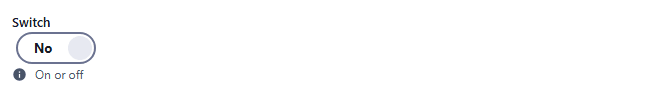
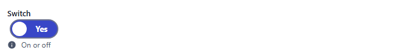
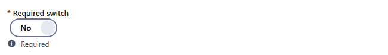
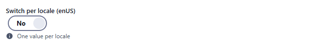
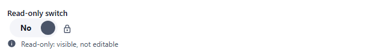
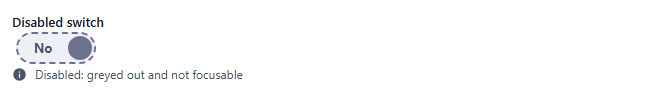

# checkbox

On/off switch (a toggle labelled No / Yes). Component: `CustomCheckbox` (`src/components/fields/CustomCheckbox.vue`). Click it, or focus it and press Space or Enter.

Catalogue: `resources/choice_boolean.js` (group **Choice**, resource **Booleans**).

## Declaration

```js
{ field: 'active', input: 'checkbox', label: 'Active', localised: false }
```

## Options

| Option | Type | Default | Description |
|---|---|---|---|
| `field`, `input`, `label`, `localised`, `unique` | | | As for [string](string.md). |
| `required` | boolean | `false` | Adds `*` to the label only. A switch that was never touched is not reported as missing (see Validation). |
| `options.hint` | string | none | Help text under the switch. |
| `options.readonly` | boolean | `false` | The switch cannot be toggled; a lock icon is shown, no border. |
| `options.disabled` | boolean | `false` | The switch cannot be toggled and is removed from the tab order; dashed border, muted colours. |

The labels are always the translated `No` / `Yes`; there is no `textOn` / `textOff` option (older docs mention them, the component does not read them).

## Variations

### Default

`resources/choice_boolean.js`, field `flag`. Off:



On:



### Required

`resources/choice_boolean.js`, field `requiredFlag`. Only the `*` mark is shown.



### Localised

`resources/choice_boolean.js`, field `localisedFlag` (one value per locale).



### Read-only

`resources/choice_boolean.js`, field `readOnlyFlag`.



### Disabled

`resources/choice_boolean.js`, field `disabledFlag`.



## Stored value

A boolean:

```json
{ "flag": true, "localisedFlag": {} }
```

- A switch that was never touched is **not saved** (the key is absent, not `false`); read it as `false`. After being switched on and off again it is stored as `false`.
- A localised switch that was not touched is saved as `{}`.
- A read-only or disabled switch keeps its value; it cannot be changed from the form.

## Validation and behaviour

- UI: none. There is no validator, so `required: true` does not stop a save while the switch is off or untouched: saving the catalogue record with `requiredFlag` untouched succeeded.
- Server: only `unique`.
