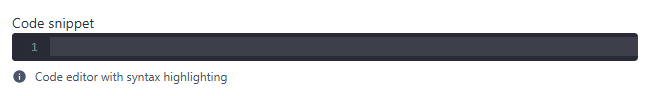
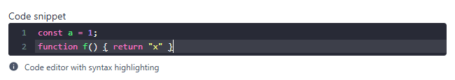
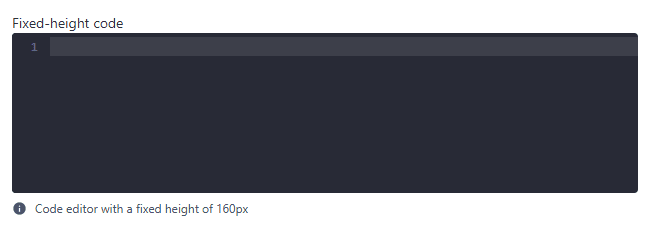

# code

Code editor with line numbers and syntax highlighting (CodeMirror 5, dark "dracula" theme). Component: `CustomCode` (`src/components/fields/CustomCode.vue`).

Catalogue: `resources/text_long.js`, fields `snippet` and `sizedSnippet`.

## Declaration

```js
{ field: 'snippet', input: 'code', label: 'Code snippet', localised: false, options: { mode: 'text/javascript' } }
```

## Options

| Option | Type | Default | Description |
|---|---|---|---|
| `field`, `input`, `label`, `unique`, `localised` | | | As for [string](string.md). The label is plain (not bold, no `*` mark). |
| `options.hint` | string | none | Help text under the editor. |
| `options.mode` | string | `'text/javascript'` | CodeMirror mode. Loaded modes: JavaScript (`text/javascript`; `'json'` is mapped to it), HTML (`htmlmixed`), CSS (`css`). |
| `options.height` | CSS length | `'100%'` (grows with content) | Fixed height of the editor, e.g. `'160px'`. |
| `options.width` | CSS length | `'100%'` | Width of the editor. |
| `options.css` | object | none | Extra inline styles merged into the editor style. |
| `options.tabSize` | number | `2` | |
| `options.lineNumbers` | boolean | `true` | |
| `options.styleActiveLine` | boolean | `true` | |
| `options.foldGutter` | boolean | `true` | |
| `options.matchBrackets` | boolean | `true` | |
| `options.styleSelectedText` | boolean | `true` | |
| `options.showCursorWhenSelecting` | boolean | `true` | |
| `options.line` | boolean | `true` | |
| `options.readonly` | boolean | `false` | The editor is read-only (text can be selected and copied, not changed). Implemented in the component (CodeMirror `readOnly`); the catalogue has no read-only code field, so it is not shown or verified in the UI. |
| `options.disabled` | boolean | `false` | Read-only and without a cursor (CodeMirror `readOnly: 'nocursor'`). Same remark as above. |
| `required` | boolean | `false` | **Not implemented**: the component has no validator, a `required` code field can be saved empty. |

## Variations

### Default

`resources/text_long.js`, field `snippet`. Typing `const a = 1;` highlights it:




### Fixed height

`resources/text_long.js`, field `sizedSnippet` (`options: { height: '160px' }`). Long content scrolls inside the editor.



## Stored value

A plain string, with `\n` line breaks:

```json
{ "snippet": "const a = 1;\nfunction f() { return \"x\" }" }
```

An object found in the record is replaced by an empty string when the editor mounts.

## Validation and behaviour

- No client validation: a `required` code field can be saved empty.
- Server: only `unique`.
- The editor is not part of the tab order (`tabindex="-1"`): click into it.

Known issue: the editor always uses the dark theme, also in the light UI.
