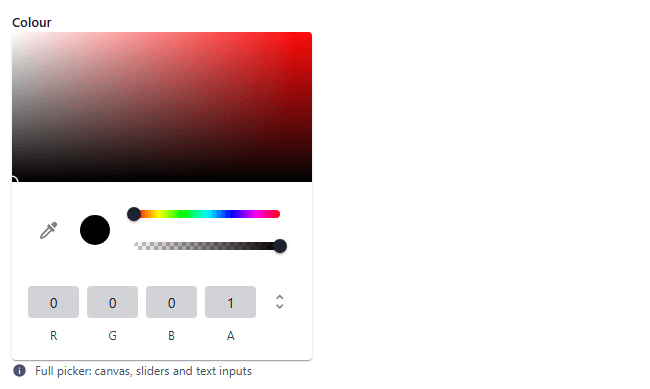
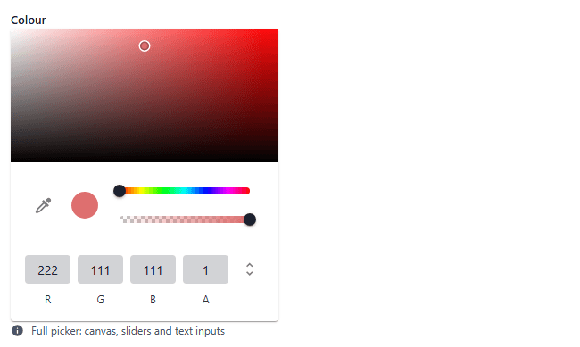
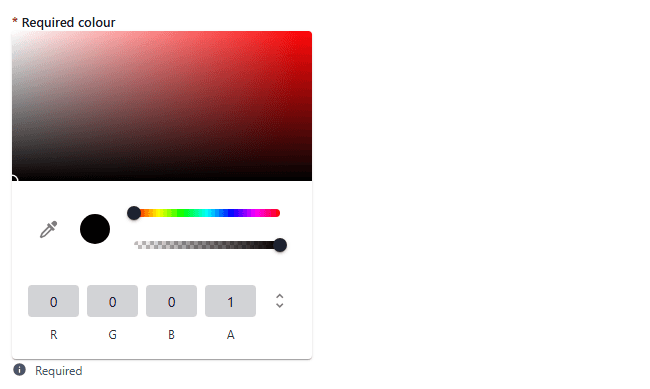
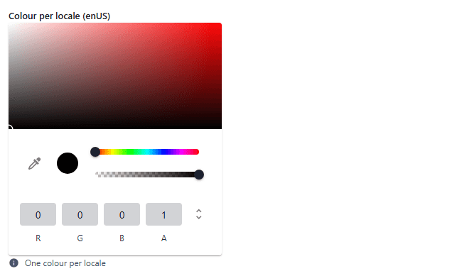
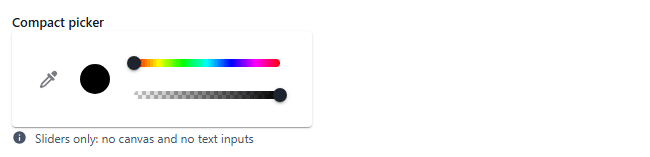
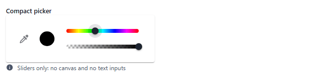
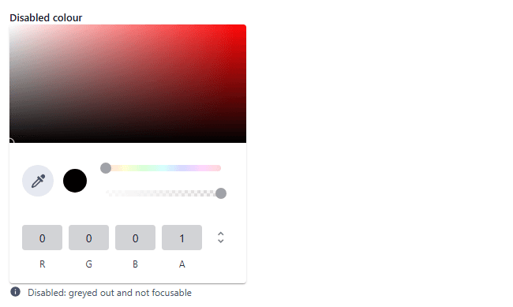

# color

Colour picker: gradient canvas, hue and alpha sliders, RGBA inputs and an eyedropper. Component: `ColorPicker` (`src/components/fields/ColorPicker.vue`, Vuetify `v-color-picker`).

Catalogue: `resources/choice_color.js` (group **Choice**, resource **Colors**).

## Declaration

```js
{ field: 'color', input: 'color', label: 'Colour', localised: false }
```

## Options

| Option | Type | Default | Description |
|---|---|---|---|
| `field`, `input`, `label`, `localised`, `unique` | | | As for [string](string.md). |
| `required` | boolean | `false` | Adds `*` to the label only (see Validation). |
| `options.hint` | string | none | Help text under the picker. |
| `options.hideCanvas` | boolean | `false` | Hides the gradient canvas. |
| `options.hideSliders` | boolean | `false` | Hides the hue and alpha sliders. |
| `options.hideInputs` | boolean | `false` | Hides the numeric inputs. |
| `options.dotSize` | number | Vuetify default (10) | Size of the canvas dot. |
| `options.outputModel` | `'hexa'` \| `'rgba'` \| `'hsla'` \| `'hex'` \| `'rgb'` | `'hexa'` | Validated by the component (an invalid value logs a warning and falls back to `'hexa'`) and passed to the picker; the values saved in the verified records were hex strings. |
| `options.readonly` | boolean | `false` | The picker cannot be changed: the canvas ignores clicks and the sliders are greyed. |
| `options.disabled` | boolean | `false` | Same as `readonly` (the two look identical). |

The old options `picker`, `menuPosition`, `draggable`, `enableAlpha` and `rgbSliders` are not read by the component.

## Variations

### Default

`resources/choice_color.js`, field `color`. Initial display: opaque black. Click the canvas or drag the sliders to choose:




### Required

`resources/choice_color.js`, field `requiredColor`. The picker always shows a colour (black), so an untouched required colour is not reported as missing.



### Localised

`resources/choice_color.js`, field `localisedColor`: one colour per locale.



### Compact picker

`resources/choice_color.js`, field `swatch`, labelled **Compact picker** (`hideCanvas: true, hideInputs: true`): only the preview and the hue and alpha sliders remain.




Hiding the canvas, the sliders and the inputs together would leave nothing to click, so keep at least one.

### Read-only and disabled

`resources/choice_color.js`, fields `readOnlyColor` and `disabledColor`. The sliders are greyed and clicking the canvas changes nothing; the two look the same.




## Stored value

A hex string, `{ enUS, zhCN }` of hex strings when localised:

```json
{ "color": "#DE6F6F", "localisedColor": { "enUS": "#CD8989" } }
```

A picker that was never touched is not saved (the key is absent) although it displays black. Values typed by other clients, such as `#ff0000FF`, are kept as they are.

## Validation and behaviour

- UI: none. `required` is not checked: a record was saved without touching `requiredColor`.
- Server: only `unique`.
