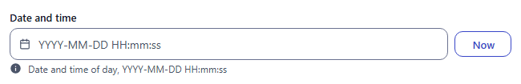
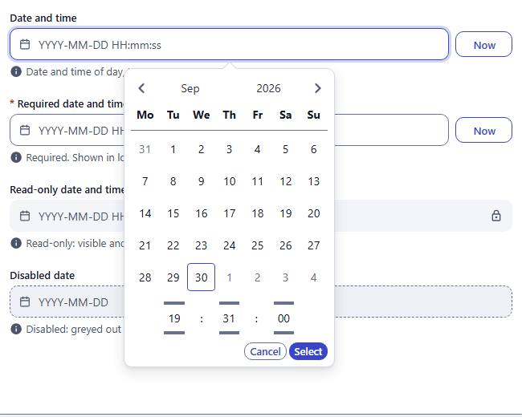
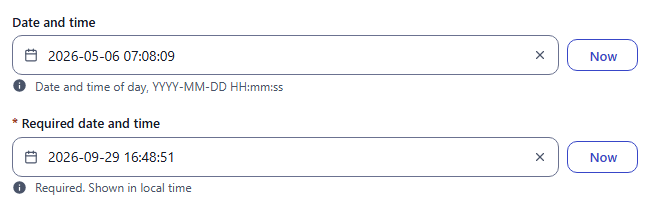
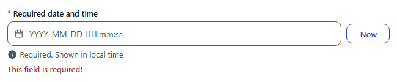
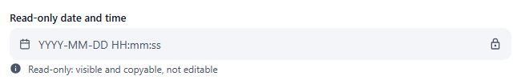

# datetime

Date and time picker: a calendar with an inline time spinner and a **Now** button. Component: `CustomDatetimePicker`, like [date](date.md) and [time](time.md).

Catalogue: `resources/dates.js`, fields `datetime`, `requiredDatetime`, `readOnlyDatetime`.

## Declaration

```js
{ field: 'publishedAt', input: 'datetime', label: 'Published at', localised: false }
```

## Options

Same as [date](date.md), with these defaults:

| Option | Type | Default | Description |
|---|---|---|---|
| `options.format` | string | `'YYYY-MM-DD HH:mm:ss'` | Display and typing format (dayjs tokens). Not used by the catalogue. |
| `options.customDatetimePickerOptions.placeholder` | string | `'YYYY-MM-DD HH:mm:ss'` | Placeholder text. |
| `options.readonly`, `options.disabled` | boolean | `false` | As for [date](date.md); the Now button is hidden when locked. |

## Variations

### Default

`resources/dates.js`, field `datetime`.



The popup combines the calendar and the time spinner:




### Required

`resources/dates.js`, field `requiredDatetime` (hint: "Shown in local time"). See [date](date.md#required-error) for the error behaviour.



### Read-only

`resources/dates.js`, field `readOnlyDatetime`.



## Stored value

A timestamp in milliseconds (UTC epoch). The editor enters the local time of the browser; the stored number is absolute:

```json
{ "datetime": 1778022489000, "requiredDatetime": 1790671731288 }
```

`1778022489000` is `2026-05-05T23:08:09Z`, typed as `2026-05-06 07:08:09` in UTC+8. Display it in the reader's time zone.

## Validation and behaviour

- UI: the required check only.
- Server: only `unique`.
