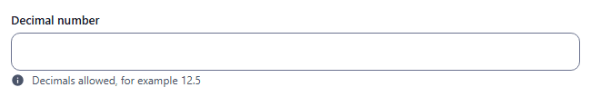
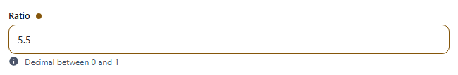
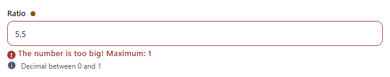

# double

Numeric input for decimal values, stored as a number. Component: `CustomInput` with `type="number"`.

Catalogue: `resources/numbers.js`, fields `double` and `boundedDouble`. Options are those of [number](number.md).

## Declaration

```js
{ field: 'ratio', input: 'double', label: 'Ratio', localised: false, options: { min: 0, max: 1 } }
```

## Options

Same as [number](number.md): `field`, `input`, `label`, `required`, `unique`, `localised`, `options.hint`, `options.readonly`, `options.disabled`, plus `options.min` / `options.max` (minimum / maximum value).

## Variations

### Default

`resources/numbers.js`, field `double`. Whole numbers are accepted too.



### Bounded

`resources/numbers.js`, field `boundedDouble` (`min: 0, max: 1`).



The bounds are enforced: `5.5` gives `The number is too big! Maximum: 1`.



## Stored value

A number (`3`, `12.5`, `0.5`). An empty field stores nothing.

```json
{ "double": 12.5, "boundedDouble": 0.5 }
```

## Validation and behaviour

- UI: `required`, then a numeric check, then `min` / `max` (value), on blur and on Create/Save (blocked while invalid). An empty optional field is valid.
- Server: only `unique`.
