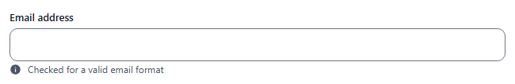
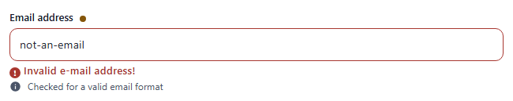
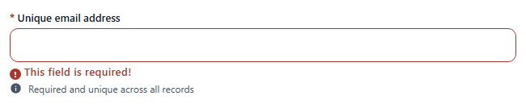
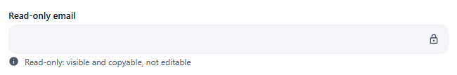

# email

Single-line input checked for an email format. Component: `CustomInput` with `type="email"`.

Catalogue: `resources/text_formats.js`, fields `email`, `requiredEmail`, `readOnlyEmail`.

## Declaration

```js
{ field: 'email', input: 'email', label: 'Email address', localised: false }
```

## Options

| Option | Type | Default | Description |
|---|---|---|---|
| `field`, `input`, `label`, `required`, `localised`, `unique` | | | As for [string](string.md). |
| `options.hint` | string | none | Help text under the input. |
| `options.readonly` | boolean | `false` | Not editable, lock icon. |
| `options.disabled` | boolean | `false` | Greyed out, not focusable. |
| `options.min` / `options.max`, `options.regex` | | none | Length and pattern rules, as for [string](string.md); they run before the email check. |

## Variations

### Default (optional)

`resources/text_formats.js`, field `email`. An empty value is valid.



An invalid value shows `Invalid e-mail address!` when the field loses focus and when Create/Save is clicked:



### Required and unique

`resources/text_formats.js`, field `requiredEmail` (`required: true, unique: true`).



### Read-only

`resources/text_formats.js`, field `readOnlyEmail`.



## Stored value

```json
{ "email": "a@b.co" }
```

## Validation and behaviour

- UI: `required`, then length / `regex` rules, then a regular expression (`local@domain.tld`, a tld of 2+ letters; an IPv4 in brackets is accepted). An **empty optional value is valid**. The browser's own `type="email"` is only a keyboard hint. A field emptied after typing is saved as `""`.
- Server: only `unique` (`400 Field 'requiredEmail' is duplicated`). An invalid address sent over REST (`"bad"`) is stored.
