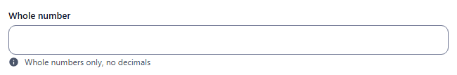
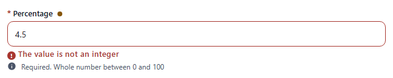
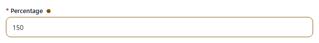
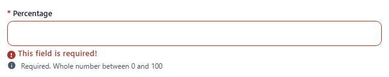
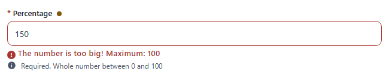
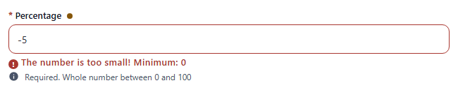

# integer

Numeric input that accepts whole numbers only, stored as a number. Component: `CustomInput` with `type="number"`.

Catalogue: `resources/numbers.js`, fields `integer` and `boundedInteger`. Options are those of [number](number.md).

## Declaration

```js
{ field: 'percentage', input: 'integer', label: 'Percentage', localised: false, required: true, options: { min: 0, max: 100 } }
```

## Options

Same as [number](number.md): `field`, `input`, `label`, `required`, `unique`, `localised`, `options.hint`, `options.readonly`, `options.disabled`, plus `options.min` / `options.max` (minimum / maximum value: `The number is too big! Maximum: 100`, `The number is too small! Minimum: 0`).

## Variations

### Default

`resources/numbers.js`, field `integer`.



A value with a decimal point is refused with `The value is not an integer`:



### Required and bounded

`resources/numbers.js`, field `boundedInteger` (`min: 0, max: 100`).




The bounds are enforced. `150` and `-5`:




## Stored value

A number when entered in the admin (`4`), as sent over REST. An empty field stores nothing.

```json
{ "integer": 7, "boundedInteger": 50 }
```

## Validation and behaviour

- UI: `required`, then whole-number check, then `min` / `max` (value), on blur and on Create/Save (blocked while invalid). An empty optional field is valid.
- Server: only `unique`; `"abc"` and `999` sent over REST were stored.
