# multiselect

Pick **several** values from a list; chosen values are shown as removable chips. Same list sources and label options as [select](select.md). Component: `CustomMultiSelect` (`src/components/fields/CustomMultiSelect.vue`).

Catalogue: `resources/choice_multi.js` (group **Choice**, resource **Multiple choice**), fields `flags`, `requiredFlags`, `channels`, `items`, `localisedItems`, `readOnlyItems`, `disabledItems`. The resource-backed examples need records in **Reference items**.

## Declaration

```js
{ field: 'flags', input: 'multiselect', label: 'Colour flags', localised: false, source: ['red', 'green', 'blue'] }
```

## Options

Same as [select](select.md) (`source`, `options.labels`, `options.customLabel`, `options.extraSources`, `options.hint`, `options.readonly`, `options.disabled`, `required`, `localised`), plus:

| Option | Type | Default | Description |
|---|---|---|---|
| `options.listBox` | boolean | `false` | Adds a **Select all / Deselect all** button next to the label. Read by the component; the catalogue does not use it, not verified in the UI. |

Behaviour that differs from `select`: several chips, each with a remove button; a `N selected` counter next to the label. Right-click a chip to copy its value.

## Variations

### Static list

`resources/choice_multi.js`, fields `flags` and `requiredFlags`.

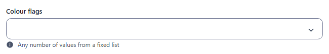
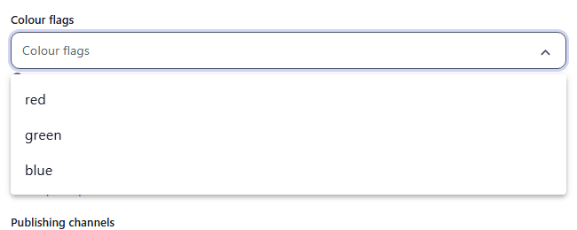
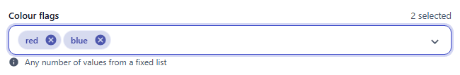

### Required

`resources/choice_multi.js`, field `requiredFlags`: at least one value.

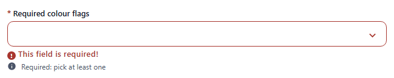

### Readable labels

`resources/choice_multi.js`, field `channels` (`labels: { web: 'Website', mobile: 'Mobile app', print: 'Print' }`). Stored: `web`, `print`.

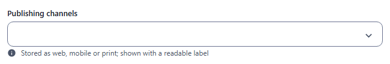

### Values from another resource

`resources/choice_multi.js`, field `items` (`source: 'reference_items'`, `customLabel: '{{name}}'`).

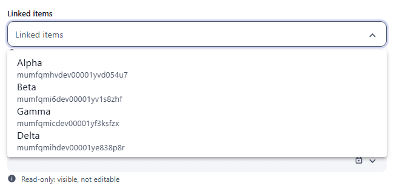
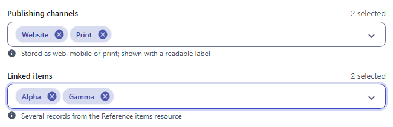

### Localised

`resources/choice_multi.js`, field `localisedItems`: one selection per locale. The list labels follow the current locale.

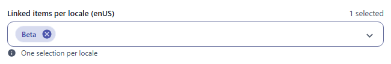
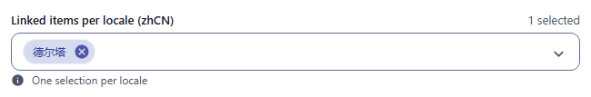

### Read-only

`resources/choice_multi.js`, field `readOnlyItems`. The list does not open.

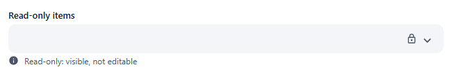

### Disabled

`resources/choice_multi.js`, field `disabledItems`.

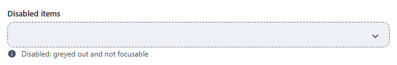

## Stored value

An array of values (strings from `source`, or record `_id`s); localised: one array per locale.

```json
{
  "flags": ["red", "blue"],
  "channels": ["web", "print"],
  "items": ["mumfqmhvdev00001yvd054u7", "mumfqmicdev00001yf3ksfzx"],
  "localisedItems": { "enUS": ["mumfqmi6dev00001yv1s8zhf"], "zhCN": ["mumfqmihdev00001ye838p8r"] }
}
```

## Validation and behaviour

- UI: `required` means at least one value (`This field is required!`).
- Server: only `unique`; membership in `source` is not checked.
