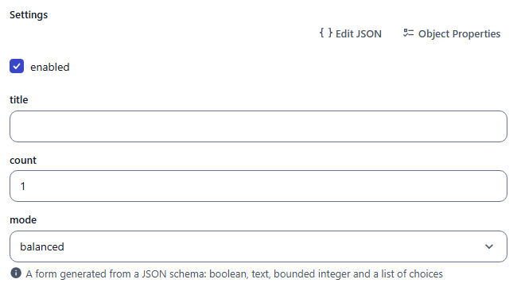
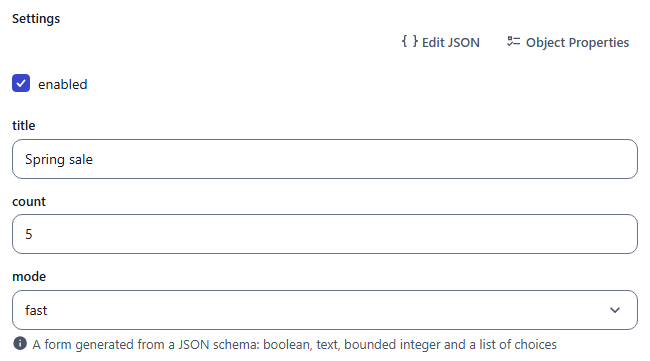
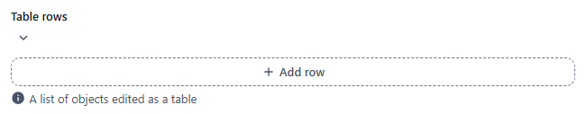
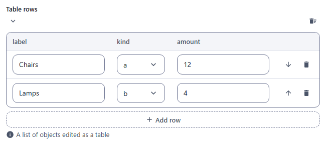
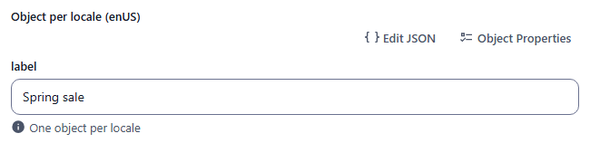

# object

Structured editor whose form is generated from a JSON schema (booleans, text, numbers, lists of choices, arrays as tables). Component: `JsonEditor` (`src/components/fields/JsonEditor.vue`, built on `@json-editor/json-editor` with a CMS theme).

Catalogue: `resources/structured_data.js`, fields `settings`, `rows`, `localisedObject`.

## Declaration

```js
{
  field: 'settings',
  input: 'object',
  label: 'Settings',
  localised: false,
  options: {
    jsonEditorOptions: {
      type: 'object',
      properties: {
        enabled: { type: 'boolean', format: 'checkbox', default: true },
        title: { type: 'string' },
        count: { type: 'integer', minimum: 0, maximum: 10, default: 1 },
        mode: { type: 'string', enum: ['fast', 'balanced', 'thorough'], default: 'balanced' }
      },
      required: ['title']
    }
  }
}
```

## Options

| Option | Type | Default | Description |
|---|---|---|---|
| `field`, `input`, `label`, `localised`, `unique` | | | As for [string](string.md). |
| `options.jsonEditorOptions` | JSON schema | **required** | The schema given to json-editor (`type`, `properties`, `items`, `enum`, `default`, `minimum`, `maximum`, `format: 'table'`, ...). Without it the field cannot render (`this.schema.jsonEditorOptions.title` is set on it at mount). The top-level `title` is blanked, the label of the field is used instead. |
| `options.hint` | string | none | Help text under the editor. |
| `required` | boolean | `false` | Refuses the save while the object is empty, like the other types. The catalogue has no required object field, so this is not verified in the UI. |
| `options.readonly` | | | No effect: json-editor is not switched to read-only. |
| `options.disabled` | boolean | `false` | Only disables deleting array rows when the whole form is disabled; the inputs stay editable. |

## Variations

### Object form

`resources/structured_data.js`, field `settings` (a boolean shown as a checkbox, a text, a bounded integer and a list of choices). Defaults from the schema are applied immediately; **Edit JSON** and **Object Properties** sit above the fields.




### Array as a table

`resources/structured_data.js`, field `rows` (`type: 'array', format: 'table'`). **Add row** appends a row; each row has its own move and delete icons, and **Delete All** (an icon on the header line of the list) empties it.




### Localised

`resources/structured_data.js`, field `localisedObject`: one object per locale.



## Using the editor

Objects and lists share one look. Each is a **header line** (a chevron that folds it, its name, and its actions as small icon buttons
with a tooltip) over its **body**, which is indented under a thin rule: nesting never nests boxes. The top-level object has no box
and no chevron, only **Edit JSON** and **Object Properties** above its fields.

- **Edit JSON** opens the object as text in a code editor, with highlighting; **Save** applies it, **Copy** copies it.
- **Object Properties** is a checklist of the properties of the object: untick one to remove it (properties the schema
  `required`s are locked), or type a new name and press **Add** to create a property the schema does not know. An added
  property takes any type: a small type chip next to its name (`string`, `number`, `integer`, `boolean`, `object`, `array`,
  `null`) changes it.
- **Lists** show one row per item: its position, its field, and icons to move it up or down and to delete it. **Add item** is the
  dashed button under the rows, and **Delete All** the icon on the header line. An item that is an object or a list has its own
  header line (chevron, `item N`, its icons) over its body.
- Dropdowns use the same list as the other fields of the admin; booleans are a checkbox when the schema says `format: 'checkbox'`,
  and a `true` / `false` choice otherwise.

## Stored value

The JSON produced by the editor, with the schema defaults, `{ enUS, zhCN }` when localised:

```json
{
  "settings": { "enabled": true, "title": "My title", "count": 5, "mode": "fast" },
  "rows": [ { "label": "", "kind": "a", "amount": 0 }, { "label": "", "kind": "a", "amount": 0 } ],
  "localisedObject": { "enUS": { "label": "" } }
}
```

Numbers are stored as numbers (unlike the `number` field type). A locale whose tab was never opened is not created.

## Validation and behaviour

- The JSON schema is used to build the form and its defaults only. Its constraints are **not connected to the form**: `required: ['title']` and `minimum` / `maximum` did not stop a save with an empty `title` (saved as `""`).
- Server: only `unique`.
