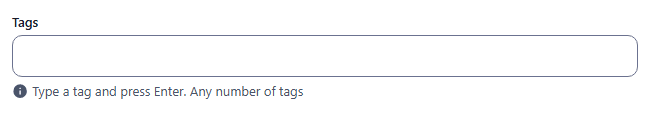
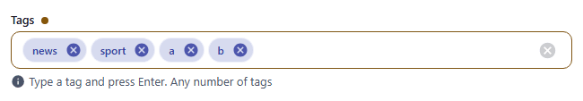
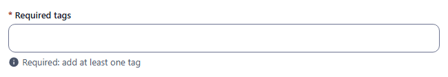
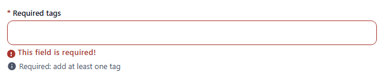
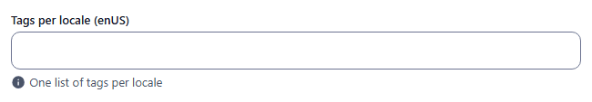
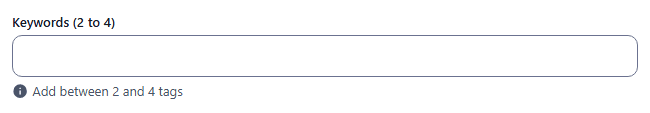
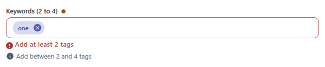
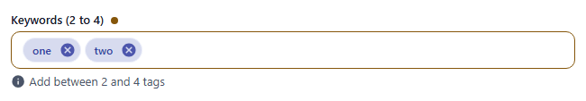
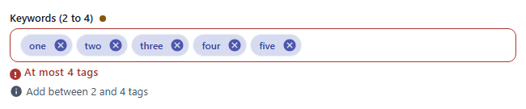

# pillbox

Free-form tags: type a value and press Enter, it becomes a chip. Component: `CustomInputTag` (`src/components/fields/CustomInputTag.vue`, a Vuetify combobox). Unlike [multiselect](multiselect.md) the values are not taken from a list.

Catalogue: `resources/choice_multi.js`, fields `tags`, `requiredTags`, `localisedTags`, `boundedTags`.

## Declaration

```js
{ field: 'tags', input: 'pillbox', label: 'Tags', localised: false }
{ field: 'keywords', input: 'pillbox', label: 'Keywords (2 to 4)', localised: false, min: 2, max: 4 }
```

## Options

| Option | Type | Default | Description |
|---|---|---|---|
| `field`, `input`, `label`, `localised`, `unique` | | | As for [string](string.md). |
| `required` | boolean | `false` | At least one tag: an empty required pillbox refuses the save (`This field is required!`). |
| `min` / `max` | number | none | Minimum / maximum number of tags, declared at field level (next to `input`, not in `options`). Messages: `Add at least 2 tags` / `At most 4 tags`, under the field, on blur and on save. |
| `options.hint` | string | none | Help text under the field. |
| `options.readonly` | boolean | `false` | Passed to the combobox as `readonly`. Not used by the catalogue, not verified. |
| `options.disabled` | boolean | `false` | Greyed out. Not used by the catalogue. |

An untouched optional pillbox is stored as `[]`.

Typing behaviour:
- Enter turns the text into a chip; a value with commas (`a,b`, also when pasted) is split into one chip per part, trimmed, empty parts dropped.
- Duplicates are removed.
- Right-click a chip to copy its value; each chip has a close button and the field a clear button.

## Variations

### Default

`resources/choice_multi.js`, field `tags`.




### Required

`resources/choice_multi.js`, field `requiredTags`. With no tag the save is refused: red outline and `This field is required!`.




### Localised

`resources/choice_multi.js`, field `localisedTags`: one list per locale.



### Bounded

`resources/choice_multi.js`, field `boundedTags` (`min: 2, max: 4`). The count is checked when the field loses focus and when saving; an invalid count refuses the save (`Form is invalid`).






## Stored value

An array of strings; localised: one array per locale.

```json
{ "tags": ["news", "sport", "a", "b"], "localisedTags": { "enUS": ["en1"], "zhCN": ["zh1"] }, "boundedTags": ["one"] }
```

## Validation and behaviour

- UI: `required` (at least one tag) and `min` / `max` (number of tags). One keyword in `boundedTags` (`min: 2`) refused the save; two were saved; five showed `At most 4 tags`.
- Server: only `unique`; arrays of any length are stored over REST.
- The old `inputtag` type no longer exists; use `pillbox`.
