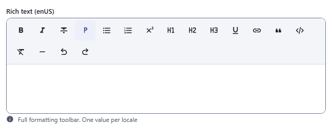
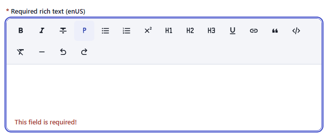
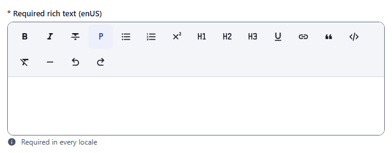
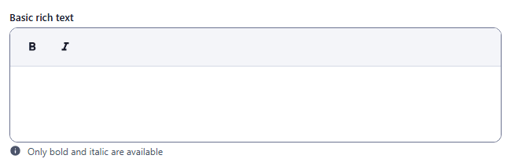
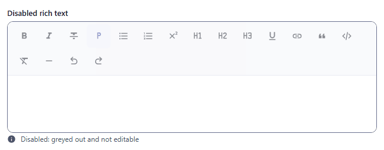
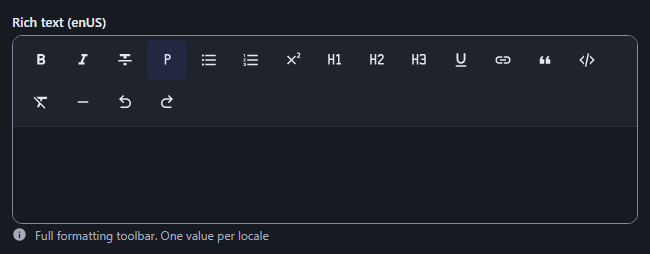

# wysiwyg

Rich text editor that stores HTML. Component: `Wysiwyg` (`src/components/fields/Wysiwyg.vue`, built on Tiptap with the StarterKit, superscript and highlighted code blocks).

Catalogue: `resources/text_long.js`, fields `body`, `requiredBody`, `basicBody`, `disabledBody`.

## Declaration

```js
{ field: 'body', input: 'wysiwyg', label: 'Rich text' }
```

## Options

| Option | Type | Default | Description |
|---|---|---|---|
| `field`, `input`, `label`, `unique`, `localised` | | | As for [string](string.md). |
| `required` | boolean | `false` | The editor must contain text (`''` and `<p></p>` count as empty). In a localised field every locale must be filled. |
| `options.hint` | string | none | Help text under the editor (replaced by the error message when there is one). |
| `options.buttons` | string[] | all buttons | Restricts the toolbar. Ids: `bold`, `italic`, `strike-through`, `paragraph`, `bullet-list`, `ordered-list`, `superscript`, `heading-1`, `heading-2`, `heading-3`, `underline`, `link`, `quote`, `code`, `clear-format`, `horizontal-rule`, `undo`, `redo`. An empty or missing list shows every button. |
| `options.readonly` | boolean | `false` | The editor is not editable; the toolbar stays visible but greyed and inactive. |
| `options.disabled` | boolean | `false` | Same as `readonly`: not editable, toolbar greyed. |

## Variations

### Default, full toolbar

`resources/text_long.js`, field `body` (localised).

```js
{ field: 'body', input: 'wysiwyg', label: 'Rich text' }
```



### Required

`resources/text_long.js`, field `requiredBody`. The message `This field is required!` appears under the editor as soon as the content is emptied after an edit:



On an untouched required editor, clicking Create blocks the save and marks the locale tab, but no message is shown under the editor:



### Restricted toolbar

`resources/text_long.js`, field `basicBody`.

```js
{ field: 'basicBody', input: 'wysiwyg', localised: false, options: { buttons: ['bold', 'italic'] } }
```



### Disabled

`resources/text_long.js`, field `disabledBody`. The text cannot be edited and the toolbar is greyed.



### Dark theme



## Stored value

An HTML string, one per locale for a localised field:

```json
{
  "body": { "enUS": "<p><strong>Some text</strong></p>" },
  "requiredBody": { "enUS": "<p>req rich en</p>", "zhCN": "<p>req rich zh</p>" }
}
```

A field that was never edited is not saved. An editor emptied after typing keeps `<p></p>`.

## Validation and behaviour

- UI: `required` only. On Create/Save the required check also marks the locale tab with an error badge.
- Server: only `unique`. The HTML is stored as sent; sanitise it when you render it.
- Link button asks for the URL with a browser prompt; an empty answer removes the link.

Known issue (verified in the running admin): the required message only appears after the editor has been edited; clicking Create on an untouched required field blocks the save but shows no message under the editor.
