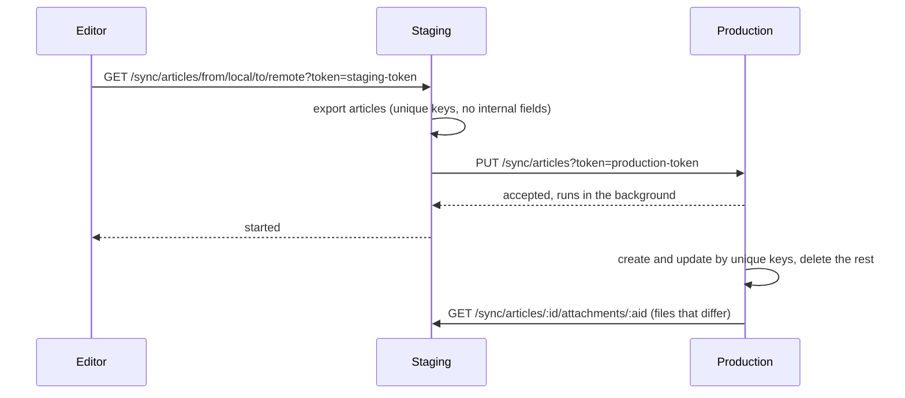
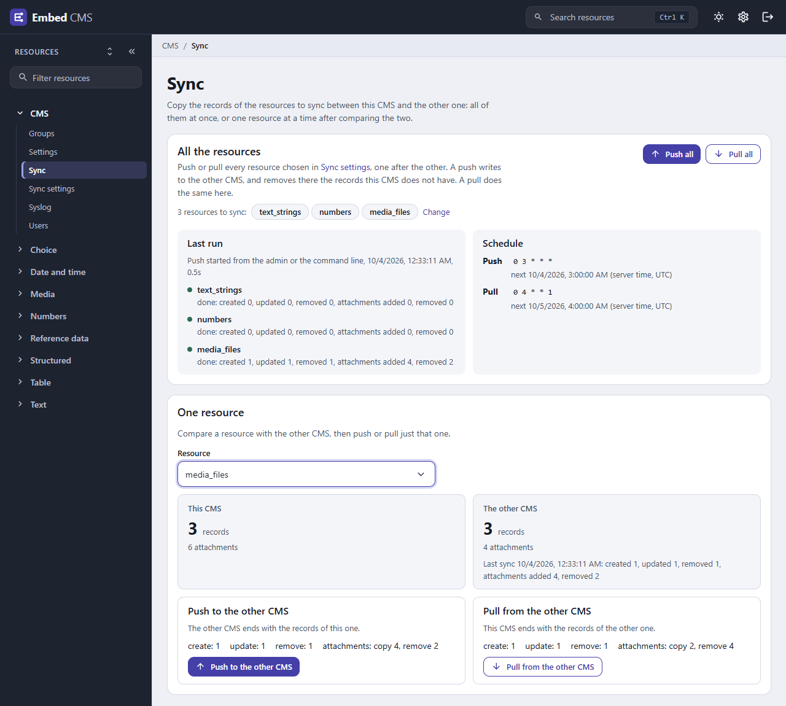

← [Documentation](../README.md)

# Sync

The sync plugin copies the records of chosen resources from one embed-cms to another, on demand. The typical case is staging and production: editors prepare content on staging, check it, and then push it to production in one go.

Sync is simpler than [replication](REPLICATION.md). It talks plain HTTP, matches records by their `unique` fields rather than by id, and makes the target look like the source: records that exist only on the target are removed. Use replication for a fleet that stays in step continuously; use sync for occasional, deliberate copies.

## Turning it on

Give the configuration a `sync` block. An empty one is enough, and you then choose the resources in the admin (see below):

```json
{
  "sync": {}
}
```

Any `sync` block turns the plugin on. To turn it off, leave the block out or set it to `null`. `sync.disablePlugin: true` keeps the routes but hides the admin page.

The block can also list the resources that may be synced, which is the list used until some are chosen in the admin:

```json
{
  "sync": { "resources": ["articles", "authors"] }
}
```

## Pairing two servers

The rest of the setup happens in the admin, in **Sync settings** (CMS group), on both servers. It holds:

| Setting | What to put there |
|---|---|
| What the other CMS may do here | `read` to let the other server read the synced resources, `write` to let it change them. |
| This CMS > Token | A long random secret. The other server must send it to sync with this one; without it, sync is refused. |
| This CMS > Address | How the other server reaches this one, e.g. `https://staging.example.com`. |
| The other CMS > Token | The other server's own token. |
| The other CMS > Address | The other server's address, e.g. `https://production.example.com`. |
| Resources to sync | The resources of this CMS that may be synced: pick them in the list, which shows the resources you can see without the system ones, or type their names. A name that is not a resource of this CMS is refused when you save. Until some are chosen, the `sync.resources` list of the configuration is used. A change applies at once, without a restart. |

For the staging-to-production case: on staging, allow `read`; on production, allow `write`. Each side gets the other's token and address.

## What a sync does



For each resource, the source exports its records with the internal fields removed, relations turned into the `unique` values of the related records, and attachments as download links. The target then:

- creates records it doesn't have and updates those it has, matching them by their **`unique` fields**;
- **deletes its records that are not in the export**;
- copies the **attachments** (the files): file by file, a file it already has (same content and same name) is left alone, the ones the source no longer has are removed, and only the missing ones are downloaded, so syncing twice copies nothing the second time; the files of a record it deletes go with it.

A file that cannot be downloaded does not stop the sync: the records are still written, but the sync ends as an **error** (`N attachments could not be copied`) rather than as done, and a second sync copies what is missing. The report, the Sync page and `cms-sync` count the attachments copied (`attachmentsAdded`) and removed (`attachmentsRemoved`) next to the records.

The work runs in the background; the request answers at once.

A sync also starts on its own: 5 seconds after the last change to a synced resource, this server asks the other one to pull it (`GET <other address>/sync/:resource/from/remote/to/local`). Changes that arrive through a sync don't trigger a push back.

A sync sends a whole resource in one JSON body, so the target's `security.limits.json` (100 KB by default) must be larger than the export of the biggest synced resource; otherwise the target answers `413` with a message naming the setting. Raise it on the target, to a size you are comfortable accepting from the other server.

Because records are matched by their `unique` fields, every synced resource needs at least one, and so does every resource a synced `select` or `multiselect` points to.

## The Sync page

The admin has a **Sync** page in the **CMS** group of the menu, next to **Sync settings**. A group opens it when its **Plugins** list has `Sync Resource`. It has two parts:



- **All the resources** runs every resource at once, and shows the last run and the schedule (see below).
- **One resource** compares a resource with the other CMS: how many records each one has, and what a push or a pull would create, update and remove, matching the records by their `unique` fields. A push or a pull of just that resource starts from there. When a resource has attachments, each CMS also shows how many it has, and a push or a pull says how many attachments it would copy and remove. A button is missing when the CMS it would write to does not allow writing.

## Syncing all the resources at once

Besides syncing a resource at a time on the Sync page, you can run a **push** (this server writes to the other one) or a **pull** (the other server writes here) for every resource to sync, one after the other. A resource that fails does not stop the others, and the run says how each one went. Only one run goes on at a time: a second one is refused while the first runs.

There are four ways to start one, and they all do the same thing.

- **From the Sync page.** The **All the resources** section has **Push all** and **Pull all**. Each asks first, because it removes the records the target has and the source does not. It shows the resource the run is on, then how each one went, and the schedule (see below).
- **From code.** `cms.$sync` is the sync plugin. `run` syncs one resource and answers when the other server has finished with it, and `runAll` does all of them:

  ```js
  const result = await cms.$sync.run('articles', 'push')
  // { resource: 'articles', status: 'done', created: 2, updated: 1, removed: 0, attachmentsAdded: 3, attachmentsRemoved: 0, attachmentsFailed: 0, startedAt: ..., finishedAt: ... }
  // or { resource: 'articles', status: 'error', error: 'token is not match', ... }: a failure is a result, not an exception

  const run = await cms.$sync.runAll('pull', { resources: ['articles', 'authors'] })   // resources: left out, all of them
  // { direction: 'pull', trigger: 'api', status: 'done' | 'error', resources: [...], results: [...], startedAt, finishedAt }
  ```

  They throw only when the run cannot start: an error with `code: 400` for a resource that is not among the resources to sync, or `code: 409` when a run is going on.
- **From the command line**, with `cms-sync` (below).
- **Over HTTP**, with the token of this server, which is the **Token** under **This CMS** in its Sync settings: `POST /sync/run/push` or `POST /sync/run/pull`, with `?resources=a,b` to name some. It answers `202` at once with `{ started, direction, startedAt, resources }`, `409` when a run is going on and `400` for a resource that is not one to sync. `GET /sync/runs?token=…` says what is going on (`running`), how the last run went (`last`) and what is scheduled (`schedule`). Both also accept a logged-in person of the admin instead of the token. A `GET` never starts a run.

### The command

`cms-sync` asks a running server to run, waits, and prints how each resource went:

```bash
npx cms-sync push --url https://staging.example.com
npx cms-sync pull articles authors --url https://staging.example.com
```

The token is the **Token** under **This CMS** of the server you ask. Pass it with `--token`, or better with the environment variable `EMBED_CMS_SYNC_TOKEN`, which keeps it out of the list of processes. `--url` can be `EMBED_CMS_URL` as well, and is `http://localhost:9990` when left out. `--no-wait` starts the run and returns.

```
push: articles, authors
  articles: done, created 2, updated 1, removed 0, attachments added 4, removed 2
  authors: error: write data is not allowed
```

The exit code is `0` when every resource is done, `1` when one failed, `2` for a wrong command, and `3` when the server could not be reached or refused to start the run (a wrong token, a resource that is not one to sync, a run going on). That makes it fit a script or a CI job.

### Syncing on a schedule

Give `sync` a `schedule` to run a push or a pull of all the resources on its own:

```json
{
  "sync": {
    "schedule": { "push": "0 3 * * *", "pull": "*/30 * * * *" }
  }
}
```

Each is a cron expression of five fields, `minute hour day-of-month month day-of-week`, read in the time zone of the server. A field takes `*`, a number, a range (`1-5`), a list (`1,15`) and a step (`*/10`, `0-30/5`); the day of the week is `0` to `6` with `0` and `7` for Sunday; there are no names and no seconds. When both the day of the month and the day of the week are set, a day that fits either is chosen, as in Unix cron. A direction left out is not scheduled.

- The server checks the expressions when it starts, and refuses to start on one that is not valid, with the setting and the field in the message (`sync.schedule.push: the minute "60" is out of range (0-59)`).
- A run that falls due while another is going on is skipped, and logged. A run missed while the server was stopped is not made up for: the next one is the next time of the schedule.
- A scheduled run counts as one run like the others: it shows as **Last run** on the Sync page, by the schedule.
- The Sync page lists the schedules in its **Schedule** section, with the expression and when it comes next, in the time zone of the server (the one the cron is read in). Without one it says so, and shows how to set one up.

## Routes

The routes the other server calls check the token in `?token=` (or a `token` field of the body) against **Token** under **This CMS**:

| Route | What it does |
|---|---|
| `POST /sync/run/push`, `POST /sync/run/pull` | Run all the resources to sync, or the ones in `?resources=a,b`, and answer `202` at once. Needs the token, or a logged-in person. |
| `GET /sync/runs` | What is going on, how the last run went, and the schedule. Needs the token, or a logged-in person. |
| `GET /sync/:resource` | Export the records (needs `read`). |
| `PUT /sync/:resource` | Make this server's records match the array in the body (needs `write`). |
| `GET /sync/:resource/status` | Progress of the last sync. |
| `GET` or `POST /sync/:resource/from/local/to/remote` | Read here, write there; `from/remote/to/local` does the reverse. `POST` also accepts a logged-in user of the admin instead of the token: that is what the **Push** and **Pull** buttons of the Sync page use. |
| `GET /sync/:resource/:id/attachments/:aid` | A file, for the other server to download. |

`GET /sync/local/:resource` and `GET /sync/remote/:resource` (and their `/status`) read through the stored settings, for the admin's Sync page. They need a logged-in user of the admin, not a token. So does `GET /sync/resources`, which answers the names of the resources this server may sync (the choice of the Sync settings, else the list of the configuration), for the same page. A resource cannot be called `resources` or `runs` for sync: those are routes.

A refused read or write answers `403`. A failed sync is logged, and `GET /sync/:resource/status` reports it as `error` with the reason.

## Trying it on one machine

Two folders, each with its own `cms.json` (`"sync": {}`) and its own port, are enough to see a sync work:

```bash
PORT=9990 npx cms        # in the first folder
PORT=9991 npx cms        # in the second one
```

In **Sync settings** of each, give **This CMS** a token and its address (`http://localhost:9990`, `http://localhost:9991`), give **The other CMS** the token and address of the other, allow `read` and `write`, and pick the same resources. Fill the resource on one side, open **Sync** and choose it: the page shows what a push or a pull would change before you press the button. Set the address of **The other CMS** only on the server you start the runs from, or the other one will pull each change you make there.

## What can go wrong

- **`401 token is not match`.** The tokens are crossed: **Token** under **The other CMS** on one side must equal **Token** under **This CMS** on the other.
- **Records vanished on the target.** That is what a sync does with records the source doesn't have. Sync the other way first, or keep target-only records in a resource that isn't synced.
- **Duplicates instead of updates.** The resource has no `unique` field, or its values differ between the two servers.
- **Changes don't sync on their own.** The automatic push asks the other server to pull a resource 5 seconds after the last change to it. It only happens when the resource is ticked in **Resources to sync** and **Address** under **The other CMS** is set, and only works when the other server's own settings point back at this one.
