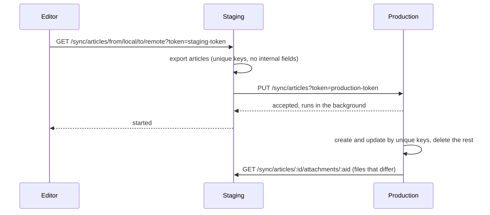

← [Documentation](../README.md)

# Sync

The sync plugin copies the records of chosen resources from one embed-cms to another, on demand. The typical case is staging and production: editors prepare content on staging, check it, and then push it to production in one go.

Sync is simpler than [replication](REPLICATION.md). It talks plain HTTP, matches records by their `unique` fields rather than by id, and makes the target look like the source: records that exist only on the target are removed. Use replication for a fleet that stays in step continuously; use sync for occasional, deliberate copies.

## Turning it on

Give the configuration a `sync` block. An empty one is enough, and you then choose the resources in the admin (see below):

```json
{
  "sync": {}
}
```

Any `sync` block turns the plugin on. To turn it off, leave the block out or set it to `null`. `sync.disablePlugin: true` keeps the routes but hides the admin page.

The block can also list the resources that may be synced, which is the list used until some are chosen in the admin:

```json
{
  "sync": { "resources": ["articles", "authors"] }
}
```

## Pairing two servers

The rest of the setup happens in the admin, in **Sync settings** (CMS group), on both servers. It holds:

| Setting | What to put there |
|---|---|
| What the other CMS may do here | `read` to let the other server read the synced resources, `write` to let it change them. |
| This CMS > Token | A long random secret. The other server must send it to sync with this one; without it, sync is refused. |
| This CMS > Address | How the other server reaches this one, e.g. `https://staging.example.com`. |
| The other CMS > Token | The other server's own token. |
| The other CMS > Address | The other server's address, e.g. `https://production.example.com`. |
| Resources to sync | The resources of this CMS that may be synced: pick them in the list, which shows the resources you can see without the system ones, or type their names. A name that is not a resource of this CMS is refused when you save. Until some are chosen, the `sync.resources` list of the configuration is used. A change applies at once, without a restart. |

For the staging-to-production case: on staging, allow `read`; on production, allow `write`. Each side gets the other's token and address.

## What a sync does



For each resource, the source exports its records with the internal fields removed, relations turned into the `unique` values of the related records, and attachments as download links. The target then:

- creates records it doesn't have and updates those it has, matching them by their **`unique` fields**;
- **deletes its records that are not in the export**;
- downloads attachments whose files differ.

The work runs in the background; the request answers at once.

A sync also starts on its own: 5 seconds after the last change to a synced resource, this server asks the other one to pull it (`GET <other address>/sync/:resource/from/remote/to/local`). Changes that arrive through a sync don't trigger a push back.

A sync sends a whole resource in one JSON body, so the target's `security.limits.json` (100 KB by default) must be larger than the export of the biggest synced resource; otherwise the target answers `413` with a message naming the setting. Raise it on the target, to a size you are comfortable accepting from the other server.

Because records are matched by their `unique` fields, every synced resource needs at least one, and so does every resource a synced `select` or `multiselect` points to.

## Routes

The routes the other server calls check the token in `?token=` (or a `token` field of the body) against **Token** under **This CMS**:

| Route | What it does |
|---|---|
| `GET /sync/:resource` | Export the records (needs `read`). |
| `PUT /sync/:resource` | Make this server's records match the array in the body (needs `write`). |
| `GET /sync/:resource/status` | Progress of the last sync. |
| `GET` or `POST /sync/:resource/from/local/to/remote` | Read here, write there; `from/remote/to/local` does the reverse. `POST` also accepts a logged-in user of the admin instead of the token: that is what the **Deploy** button of the Sync page uses. |
| `GET /sync/:resource/:id/attachments/:aid` | A file, for the other server to download. |

`GET /sync/local/:resource` and `GET /sync/remote/:resource` (and their `/status`) read through the stored settings, for the admin's Sync page. They need a logged-in user of the admin, not a token. So does `GET /sync/resources`, which answers the names of the resources this server may sync (the choice of the Sync settings, else the list of the configuration), for the same page. A resource cannot be called `resources` for sync.

A refused read or write answers `403`. A failed sync is logged, and `GET /sync/:resource/status` reports it as `error` with the reason.

## What can go wrong

- **`401 token is not match`.** The tokens are crossed: **Token** under **The other CMS** on one side must equal **Token** under **This CMS** on the other.
- **Records vanished on the target.** That is what a sync does with records the source doesn't have. Sync the other way first, or keep target-only records in a resource that isn't synced.
- **Duplicates instead of updates.** The resource has no `unique` field, or its values differ between the two servers.
- **Changes don't sync on their own.** The automatic push asks the other server to pull a resource 5 seconds after the last change to it. It only happens when the resource is ticked in **Resources to sync** and **Address** under **The other CMS** is set, and only works when the other server's own settings point back at this one.
