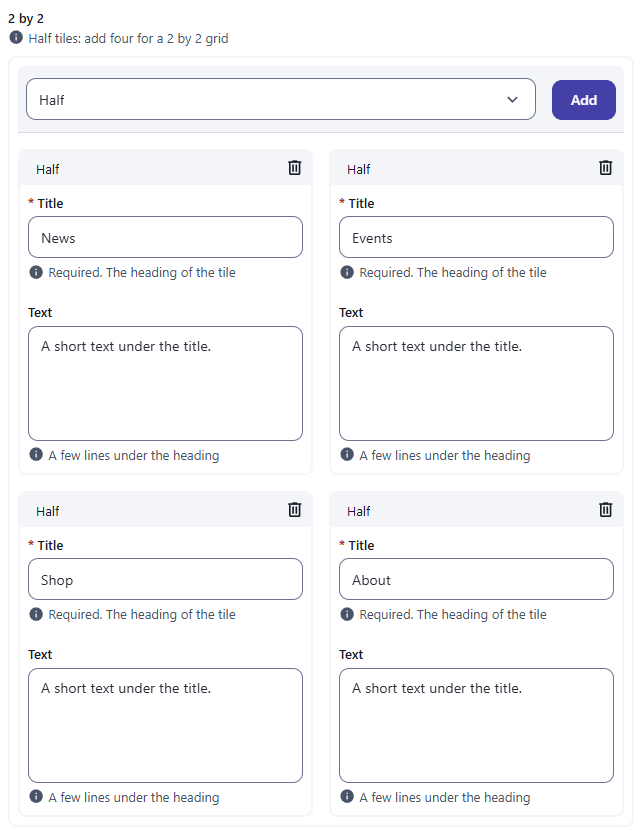
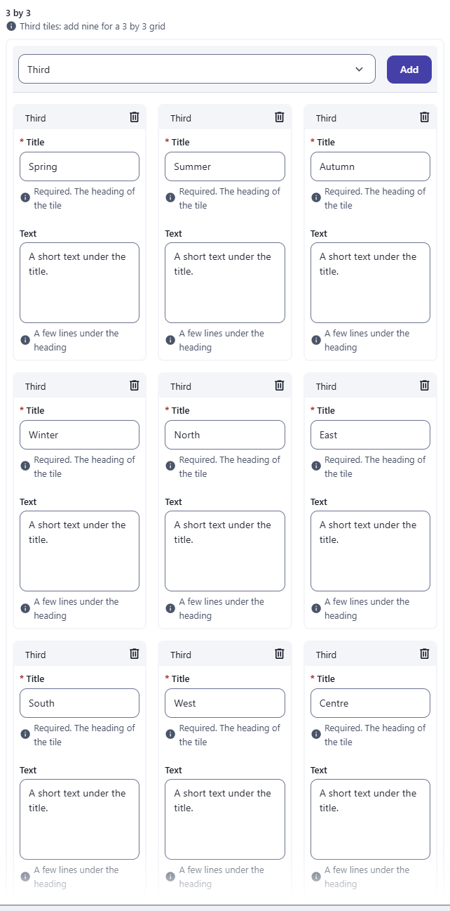
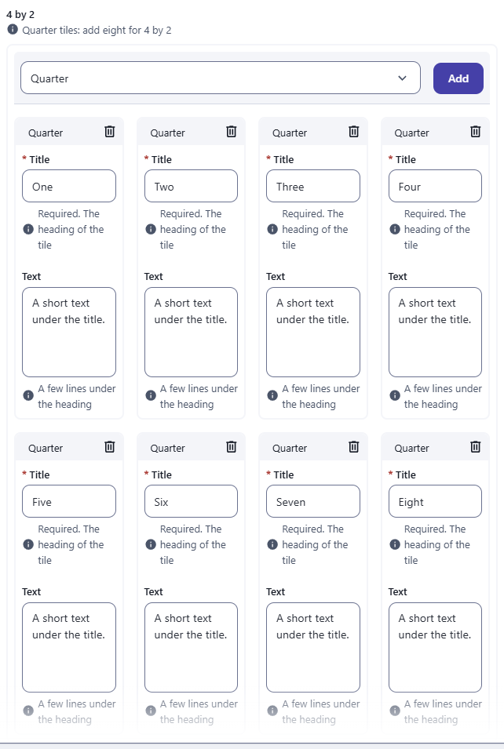
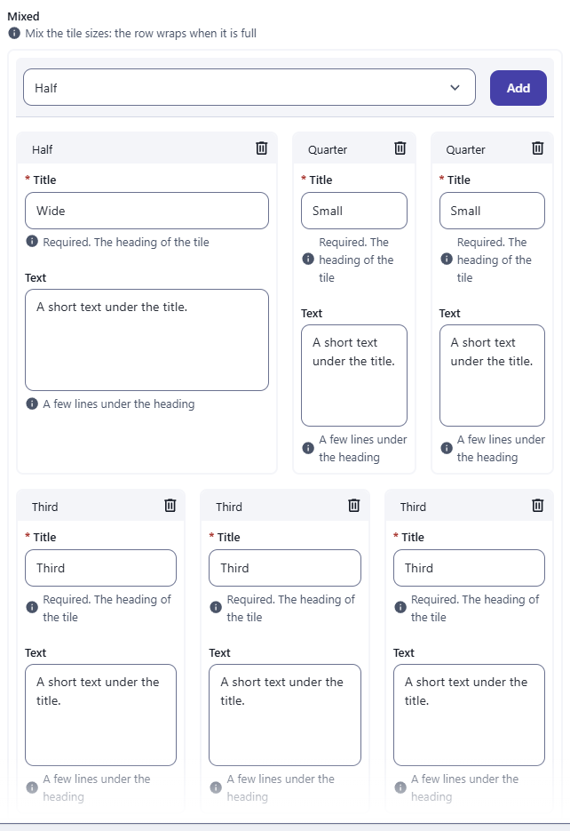

← [Documentation](../README.md)

# Dynamic layout for paragraph fields

(To put the fields of a resource side by side, see [Form layout](FORM_LAYOUT.md).)

A [paragraph field](fields/paragraph.md) normally stacks its blocks one under the other. With dynamic layout the blocks sit side by side in the editor, each taking a share of the width, the way they will on the page. It helps editors who build a row of cards, a gallery or a report line, because they see the arrangement while they write.

This is an editing aid only. It changes how the admin draws the blocks. What's stored, and how your site renders it, is up to you.

## How widths are computed

Think of a 12-column grid. Each block takes a number of **slots**, and the row has a number of slots too:

- A block's slots come from a `slots` value in the block itself (a field named `slots` in its paragraph type). If the block has none, the paragraph type's `layout.slots` is used, then 2.
- The row's slots come from a `slots` value on the record (or the block) that holds the paragraph field, or 12.

A block is `slots / rowSlots` of the width, minus its share of the 16px gaps. Blocks wrap when a row is full: in an 8-slot row, blocks of 3 + 3 + 3 put two on the first line and one on the second. On screens 768px wide or narrower every block takes the full width.

## Turning it on

It switches on by itself as soon as one block has a `slots` value. You can also turn it on with `options.dynamicLayout: true` on the paragraph field, so that blocks without `slots` (2 slots each) are laid out too.

```js
// resources/paragraphs/card.js: a paragraph type whose blocks choose their width
module.exports = {
  displayname: 'Card',
  schema: [
    { field: 'title', input: 'string', label: 'Title', required: true, options: { hint: 'Required. The heading of the tile' } },
    { field: 'image', input: 'image', label: 'Image' },
    { field: 'slots', input: 'integer', label: 'Width (of 12)', options: { min: 1, max: 12 } }
  ]
}
```

```js
// resources/landing.js
module.exports = {
  displayname: 'Landing pages',
  schema: [
    { field: 'title', input: 'string', label: 'Title' },
    { field: 'cards', input: 'paragraph', label: 'Cards', options: { types: ['card'], dynamicLayout: true } }
  ]
}
```

An editor who adds three cards with widths 3, 6 and 3 sees them on one line at 25%, 50% and 25%.

## Grids: 2 by 2, 3 by 3 and more

A fixed grid is a paragraph type whose `layout.slots` says how wide its blocks are. The row has 12 slots, so 6 slots make two blocks per row, 4 make three and 3 make four:

```js
// resources/paragraphs/tile_third.js: a row holds three of these
module.exports = {
  displayname: 'Third',
  layout: { slots: 4 },
  schema: [
    { field: 'title', input: 'string', label: 'Title', required: true, options: { hint: 'Required. The heading of the tile' } },
    { field: 'text', input: 'text', label: 'Text', options: { hint: 'A few lines under the heading' } }
  ]
}
```

| Type | `layout.slots` | Blocks per row | Four blocks make | Nine blocks make |
|---|---|---|---|---|
| `tile_half` | 6 | 2 | 2 by 2 | 2 by 5 (the last row has one) |
| `tile_third` | 4 | 3 | 3 by 2 (the last row has one) | 3 by 3 |
| `tile_quarter` | 3 | 4 | 4 by 1 | 4 by 3 (the last row has one) |

The catalogue has all three in `resources/structured_grid.js` (resource **Grid layouts**, group **Structured**), one paragraph field per grid, with `dynamicLayout: true` so that blocks without a `slots` value are laid out too:

```js
{ field: 'twoByTwo', input: 'paragraph', label: '2 by 2', localised: false, options: { types: ['tile_half'], dynamicLayout: true } }
{ field: 'threeByThree', input: 'paragraph', label: '3 by 3', localised: false, options: { types: ['tile_third'], dynamicLayout: true } }
```







A field can offer several tile types. The row wraps when its 12 slots are full, so a half tile and two quarter tiles share a row, and the three third tiles after them fill the next one:

```js
{ field: 'mixed', input: 'paragraph', label: 'Mixed', localised: false, options: { types: ['tile_half', 'tile_third', 'tile_quarter'], dynamicLayout: true } }
```



For a grid with a different row size, give the record a `slots` field. Blocks then take their share of that number: in a record with `slots: 4`, blocks of 2 slots make two per row (2 by 2), and blocks of 1 make four.

## Things to know

- Between 769 and 1024px wide, blocks of a quarter of the row or less widen to a third, so they stay readable.
- Keep each block's slots at or below the row's, or the block takes a whole line.
- The layout lives in `src/components/fields/ParagraphView.vue` (`isDynamicLayoutContainer`, `getItemStyles`).
