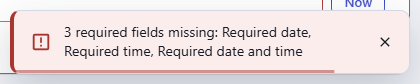
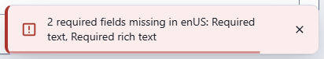
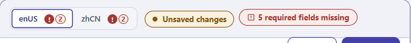

← [Documentation](../README.md)

# Fields

Every field in a resource's schema has an `input` type, and it's the input that decides what the editor looks like, what gets stored and what gets checked. Each type has a page of its own with the declaration, every option, the variations shown in the field catalogue (`resources/`), the stored JSON and the validation rules:

| Type | Component | Stored value | Page |
|---|---|---|---|
| `string` | `CustomInput` | string | [string](fields/string.md) |
| `transliterate` | `Transliterate` | string (slug of another field) | [transliterate](fields/transliterate.md) |
| `text` | `CustomTextarea` | string | [text](fields/text.md) |
| `phone` | `PhoneField` | international number, `+442071838750` | [phone](fields/phone.md) |
| `password` | `CustomInput` | string, not hashed | [password](fields/password.md) |
| `email` | `CustomInput` | string | [email](fields/email.md) |
| `url` | `CustomInput` | string | [url](fields/url.md) |
| `number` | `CustomInput` | number | [number](fields/number.md) |
| `integer` | `CustomInput` | as `number` | [integer](fields/integer.md) |
| `double` | `CustomInput` | as `number` | [double](fields/double.md) |
| `checkbox` | `CustomCheckbox` | boolean | [checkbox](fields/checkbox.md) |
| `date` | `CustomDatetimePicker` | timestamp in ms (local midnight) | [date](fields/date.md) |
| `time` | `CustomDatetimePicker` | timestamp in ms (today at that time) | [time](fields/time.md) |
| `daterange` | `DateRangeField` | `{ start, end }`, in milliseconds | [daterange](fields/daterange.md) |
| `geopoint` | `GeopointField` | `{ lat, lng }`, in degrees | [geopoint](fields/geopoint.md) |
| `datetime` | `CustomDatetimePicker` | timestamp in ms | [datetime](fields/datetime.md) |
| `pillbox` | `CustomInputTag` | array of strings | [pillbox](fields/pillbox.md) |
| `select` | `CustomMultiSelect` | string, or record `_id` | [select](fields/select.md) |
| `radio` | `ChoiceField` | the chosen value of `source` | [radio](fields/radio.md) |
| `segmented` | `ChoiceField` | the chosen value of `source` | [segmented](fields/segmented.md) |
| `multiselect` | `CustomMultiSelect` | array of strings or record `_id`s | [multiselect](fields/multiselect.md) |
| `json` | `CustomTreeView` | any JSON (viewer only) | [json](fields/json.md) |
| `code` | `CustomCode` | string | [code](fields/code.md) |
| `wysiwyg` | `Wysiwyg` | HTML string | [wysiwyg](fields/wysiwyg.md) |
| `image` | `ImageView` | array of attachment descriptors | [image](fields/image.md) |
| `imagemap` | `ImageView` | array of attachment descriptors, with a map | [imagemap](fields/imagemap.md) |
| `cropimage` | `ImageView` | array of attachment descriptors, with a crop | [cropimage](fields/cropimage.md) |
| `file` | `AttachmentView` | array of attachment descriptors | [file](fields/file.md) |
| `paragraph` | `ParagraphView` | array of blocks (`_type` + fields) | [paragraph](fields/paragraph.md) |
| `object` | `JsonEditor` | JSON built from a JSON schema | [object](fields/object.md) |
| `duration` | `DurationField` | number of seconds | [duration](fields/duration.md) |
| `markdown` | `MarkdownField` | Markdown text | [markdown](fields/markdown.md) |
| `money` | `MoneyField` | `{ amount, currency }` | [money](fields/money.md) |
| `rating` | `RatingField` | number (1 to `max`, or halves) | [rating](fields/rating.md) |
| `color` | `ColorPicker` | hex string | [color](fields/color.md) |

`group` is an internal type used by the form to group dotted keys (`address.city`) and is not declared in schemas.

The catalogue in `resources/` (see [`resources/README.md`](../../resources/README.md)) has one resource per family of fields, with every variation. The pages above point to it by file and field name, and show a screenshot of each.

## Common options

Declared next to `input` in the schema entry:

| Option | Type | Default | Description |
|---|---|---|---|
| `field` | string | required | Key of the value. A dotted key (`address.city`) nests the value and groups the fields in the form. |
| `input` | string | required | One of the types above. |
| `label` | string \| `{ enUS, zhCN }` | `field` | Label. A string, a translation key, or one text per language; the text of the admin language is shown. A localised field shows the locale in brackets, `Name (enUS)`. |
| `required` | boolean | `false` | Adds `*` to the label. Saving is refused while the field is empty, whatever its type (see [Required fields](#required-fields)). Checked by the admin only. |
| `unique` | boolean | `false` | Checked by the server on create and update (`400 Field 'x' is duplicated`). |
| `localised` | boolean | `true` when the resource declares `locales` | See below. |
| `source` | array \| resource name | none | The values of `select` and `multiselect`. |
| `sources` | array of resource names | none | `select` and `multiselect`: the records of several resources in one list; the value is `{ resource, id }`. |
| `min`, `max` | number | none | On `pillbox` only, at field level: minimum / maximum number of tags (enforced). For the other types use `options.min` / `options.max`. |
| `hint` | string \| `{ enUS, zhCN }` | none | Same as `options.hint`; it may be declared at the top of the field. |

Declared in `options`:

| Option | Type | Default | Description |
|---|---|---|---|
| `options.hint` | string \| `{ enUS, zhCN }` | none | Help text under the label (above the box for `paragraph`), hidden while an error is shown. One text per language is allowed: `hint: { enUS: 'Shown in the top bar', zhCN: '显示在顶部栏' }`; the text of the admin language is shown (the built-in Settings resource uses this). |
| `options.readonly` | boolean | `false` | Not editable, with a lock icon after the label (a disabled field has no icon: it is greyed out with a dashed border). Honoured by `string`, `text`, `password`, `email`, `url`, `number`, `integer`, `double`, `checkbox`, `date`, `time`, `datetime`, `select`, `multiselect`, `transliterate`, `wysiwyg`, `color`, `image` and `file` (no uploads), `code` and `pillbox`. Ignored by `paragraph`, `object`, `json`. |
| `options.disabled` | boolean | `false` | Greyed out and not focusable (also accepted as `disabled` next to `input`). Honoured like `readonly`; a disabled `image` or `file` shows only its label and previews, without the hint. Ignored by `object`, `json`. |
| `options.min` / `options.max` | number | none | Length for `string`, `text`, `password`, `email`, `url`, `transliterate`; value for `number`, `integer`, `double`. Enforced by the admin. |
| `options.regex` | `{ value, description }` or one per locale | none | Pattern for the text types (`'/pattern/flags'`). Enforced by the admin. |
| `options.mask` | string | none | `string` only: a template the box keeps while it is typed in, `(___) ___-____`, `AA-___-AA`, `F__-AAAA` (`_` or `#` a digit, `A` a letter, `*` a letter or a digit, a backslash makes the next character itself). See [string](fields/string.md#mask). |
| `options.template` | string | the usual one | `duration` only: its own template, `_h __m`, `___ days`. See [duration](fields/duration.md#your-own-template). |

Every key of `options` is also copied onto the component schema, which is how type-specific options such as `regex`, `min`, `max`, `labels`, `customLabel`, `accept`, `maxCount`, `limit`, `types` or `jsonEditorOptions` reach the component. Type-specific options are described on each type's page.

## Localisation

- A resource declares `locales: ['enUS', 'zhCN']`. Every field is then localised unless it has `localised: false`. A resource without `locales` has no localised fields.
- A localised value is stored per field, then per locale: `{ "title": { "enUS": "Hello", "zhCN": "你好" } }`. A non-localised value is stored as is: `{ "code": "A1" }`. Files are stored per locale as `{ "banner": { "enUS": [ ... ] } }`.
- The form has a switch for the locales: a button per language, and with exactly two languages a click anywhere on it flips to the other one. `required` must be satisfied in **every** locale. The language that has an error shows a badge, and the save is blocked.
- An untouched localised field is saved as `{}`.
- `unique` on a localised field is checked per locale (`name.enUS`).
- Over REST, `?locale=enUS` lets a client send plain values for one locale; they are stored field first like the admin's (see [API.md](API.md#localised-records-over-rest)).

## Required fields

Click Create or Save with a required field empty and the save is refused, whatever the type: text, numbers, dates, times, datetimes, colour, select, multiselect, pillbox, wysiwyg, image, file, paragraph, code and object. Then:
- the empty fields get a red outline and `This field is required!` under them (image and file say `Image is mandatory` / `File is mandatory`; a required paragraph only outlines its type drop-down; an untouched wysiwyg shows neither until it is edited);
- the first empty field is focused and scrolled into view;
- a locale tab that holds errors shows a red badge with their number;
- a toast names the fields: `3 required fields missing: Required date, Required time, Required date and time`, or `2 required fields missing in enUS: Required text, Required rich text` for localised fields.

What counts as an answer: `false` (a checkbox turned off) and `0` count; an untouched checkbox or colour picker does not. In a localised field every locale must be filled.

  

One detail: when a text or number field fails its own rules (for example an empty required `Name`), the empty required dates and colours are listed in the toast but are not outlined until the text field is fixed and Create is clicked again; select-like fields are outlined at once.

## Jump to a field

The list button in the top bar of the record form opens **Jump to field**: one row for each field of the form, in the order of the form. A click scrolls to the field and tints it for a moment, a little past its edges, so the eye finds it (with reduced motion on, it scrolls without animation and the tint stays for the same time).

- A required field that is still empty has a red mark, and a field that changed since the record was loaded or saved has an amber dot, the same dot as on its label.
- Under a [paragraph field](fields/paragraph.md) there is a row for each of its blocks, in the order they have now, named by the type and the first text the block holds (`Half · News`), or by the type and its place (`Half 3`) when it holds none. Under each block there is a row for each of its fields. A click scrolls to that block or field. A block or field that changed has the amber dot, and so does the paragraph field around it. A block that moved to another place counts as changed.
- Blocks inside a block are not listed.

The button is there on every form, long or short.

## What is checked where

| Rule | Admin (UI) | Server (REST) |
|---|---|---|
| `required` | yes, every type (see above) | no |
| Format (`email`, `url`, `integer`, numeric) | yes | no |
| `min`, `max` | yes: length for text, value for numbers, number of tags for `pillbox` | no |
| `regex` | yes for text types, also per locale | no |
| `unique` | no | yes |
| `accept`, `limit` (files) | yes, on selection | no |
| `maxCount` | yes | `image` fields only |

The admin runs its rules on blur and when Create/Save is clicked; an invalid field blocks the save. An empty optional value is always valid. Messages: `This field is required!`, `The text is too short! Length: N, minimum: M`, `The text is too long! Length: N, maximum: M`, `The number is too small! Minimum: M`, `The number is too big! Maximum: M`, `The value is not an integer`, `Invalid e-mail address!`, `Invalid URL!`, `Invalid format! (description)`, `Add at least N tags`, `At most N tags`. The text and number rules live in `src/utils/fieldValidation.js`.

The server stores what it receives, so if you write over REST, validate your own input.

## Nested and other notes

- Nested fields: `{ label: 'City', field: 'address.city', input: 'string' }` stores `{ address: { city: ... } }` and groups the fields under an `address` heading (`groups.address.label` in the resource sets its title).
- Import and sync files reference records of a `select` / `multiselect` source by their first `unique` field.
- The look of the form is in the [Design system](../extending/DESIGN_SYSTEM.md); fields side by side in the form are in [Form layout](FORM_LAYOUT.md), and blocks side by side in a paragraph field in [Dynamic layout](DYNAMIC_LAYOUT.md).
- A field label shows a small lock when the field is read-only. A disabled field has no icon: it is greyed out with a dashed border.
