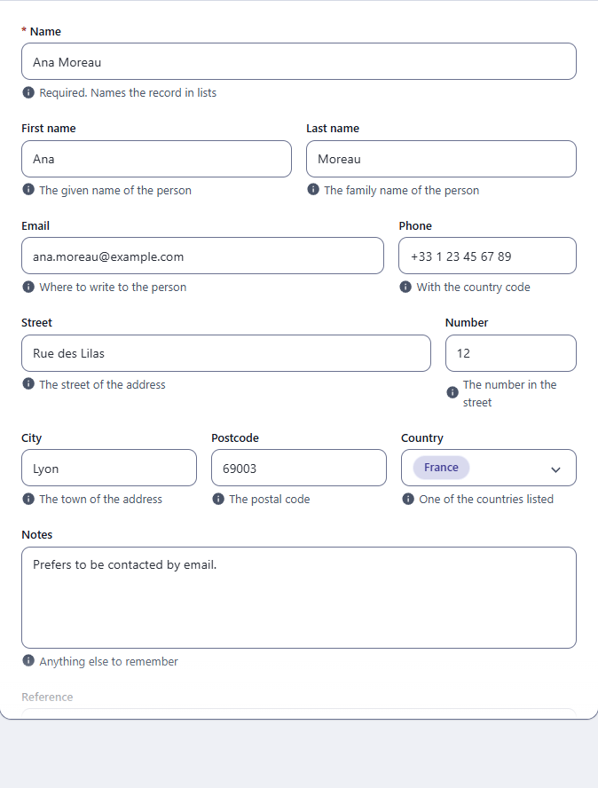

← [Field types](FIELDS.md) · [Documentation](../README.md)

# Form layout

A record form stacks its fields, one per line, in the order of the `schema`. A `layout` on the resource puts fields side by side on a line, so a short form (a name, an address) stays short.



The resource is `resources/structured_layout.js`:

```js
module.exports = {
  displayname: 'Form layout',
  schema: [
    { field: 'name', input: 'string', label: 'Name', required: true },
    { field: 'firstName', input: 'string', label: 'First name' },
    { field: 'lastName', input: 'string', label: 'Last name' },
    { field: 'email', input: 'email', label: 'Email' },
    { field: 'phone', input: 'string', label: 'Phone' },
    { field: 'reference', input: 'string', label: 'Reference' }
  ],
  layout: {
    lines: [
      { slots: 1, fields: [{ model: 'name' }] },
      { slots: 2, fields: [{ model: 'firstName' }, { model: 'lastName' }] },
      { slots: 3, fields: [{ model: 'email', width: 2 }, { model: 'phone' }] }
    ]
  }
}
```

## Lines, slots and widths

`layout.lines` is a list of lines, drawn in order. Each line names its fields and says how many **slots** it is divided into.

| Key | Meaning |
|---|---|
| `slots` | How many equal parts the line is divided into. `1` when left out. |
| `fields` | The fields on the line, in order. |
| `fields[].model` | The `field` name of a field of the `schema`. |
| `fields[].width` | How many slots the field takes. `1` when left out. |

A field takes `width / slots` of the line, less its share of the 16px gap between fields. `{ slots: 3, fields: [{ model: 'email', width: 2 }, { model: 'phone' }] }` gives the email two thirds and the phone one third. Make the widths add up to the slots, or the line wraps (a line is a row that wraps when it is full) or ends short.

A localised field is named by its `field` name, the same as any other: the line shows the field of the locale being edited.

## Fields left out of the layout

A field that is in the `schema` and in no line is added at the end, each on a line of its own, so no field is lost when a layout is written for some of them. In the picture, `reference` is in no line.

A field named in a line that is not in the `schema` is ignored, and the console reports it.

## What it changes

The layout is how the admin draws the form: nothing is stored differently, the REST API and the JavaScript API do not see it, and the order of the fields in lists and in the records does not change. A line keeps its fields side by side only where the editor is at least 480px wide. In a narrower editor (a phone, and a tablet beside the list) every field of the line takes a whole line of its own, in the order of the line, so nothing is squeezed to a few letters. Computers keep the columns.

For paragraph blocks side by side, see [Dynamic layout](DYNAMIC_LAYOUT.md).
