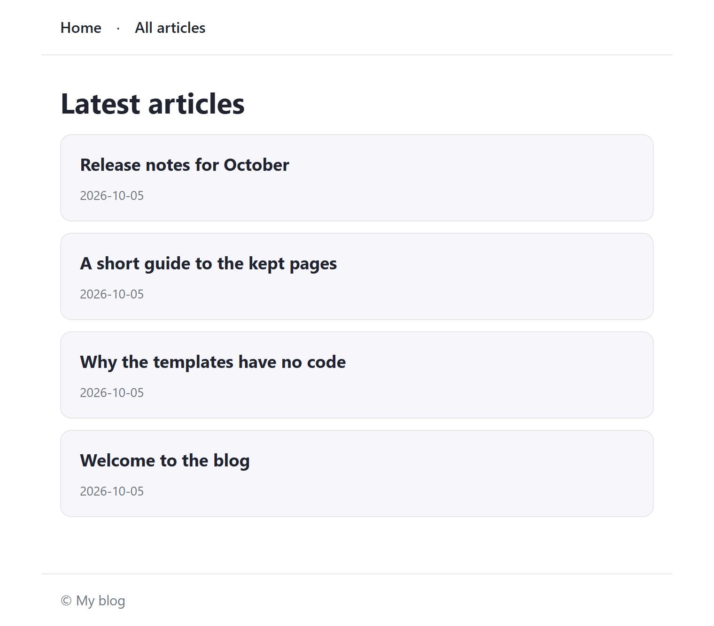
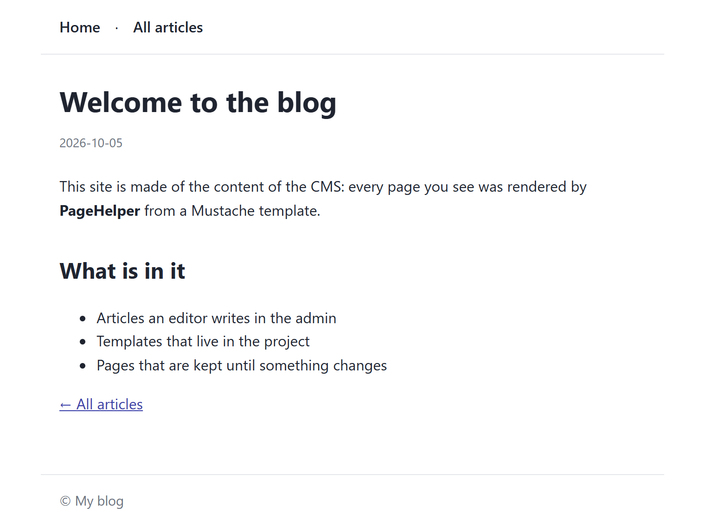

← [Documentation](../README.md)

# PageHelper: the pages of your public site

The admin is for editors. The pages your visitors see are yours to build, and `CMS.PageHelper` builds them from the content.

You give it the CMS and every template of the site. A route names the template it shows, and a loader that reads the records. The helper renders the page with [Mustache](https://mustache.github.io/mustache.5.html) and keeps the finished page. The next visitor gets it without the loader or the template running again. A kept page is made again when a template file, or a record it read, changes. The helper is typed too: see [TYPESCRIPT.md](TYPESCRIPT.md).

To see a site built without this helper, with relations, pictures, two languages, a search and a feed, read [the magazine example](../examples/magazine/README.md). The [examples page](../examples/README.md) compares both sites.

A runnable site that uses everything on this page is in [`docs/examples/site`](../examples/site/README.md). It is a tutorial in one folder: its resource, its eight templates, a small stylesheet, `site.js` (the routes) and `server.js` (the CMS and the pages in one Express application). This is what its home page and an article look like:





```js
const path = require('path')
const express = require('express')
const CMS = require('embed-cms')

const cms = new CMS({ mid: 'webnode1', anonymousRead: ['articles'] })
const view = (file) => path.join(__dirname, 'views', file)
// what the templates print of an article: Mustache computes nothing, so the loader prepares it
const present = (article) => ({
  slug: article.slug,
  name: article.title.enUS,
  day: new Date(article._createdAt).toISOString().slice(0, 10),
  body: article.body.enUS
})

const pages = new CMS.PageHelper({
  cms,
  templates: {                               // every template, by name → its file
    header: view('header.html'),
    footer: view('footer.html'),
    card: view('card.html'),
    home: view('home.html'),
    article: view('article.html'),
    notfound: view('notfound.html'),         // the page of a 404
    error: view('error.html')                // the page of an error
  },
  notFound: 'notfound',
  error: 'error',
  locals: { siteName: 'My blog' }            // given to every page
})

const app = express()
app.use(cms.express())                        // /admin, /api and the files the CMS serves

app.get('/', pages.route('home', async ({ api }) => {
  const articles = await api('articles').list({ published: true })
  return { title: 'Latest', articles: articles.map(present) }
}))

app.get('/articles/:slug', pages.route('article', async ({ api, params, notFound }) => {
  const article = await api('articles').find({ slug: params.slug, published: true })
  return article ? { title: article.title.enUS, article: present(article) } : notFound()
}))

app.use(pages.notFoundHandler())              // an address no route answered
app.use(pages.errorHandler())                 // what a route threw

const server = app.listen(3000, () => cms.bootstrap(server))
```

## The options

| Option | Type | Default | Description |
|---|---|---|---|
| `cms` | CMS | required | The CMS the content comes from. Pages read it through `cms.api()`: the server's own access, so **no rights are checked**. |
| `templates` | object | required | Every template, by name. A value is the path of its file, or `{ source: '<p>{{x}}</p>' }` for one written in the code. See [Templates](#templates). |
| `cache` | string \| `false` | the memory of the process | Where the finished pages are kept: a **folder** (they survive a restart), nothing for the memory, `false` for nowhere. See [Kept pages](#kept-pages). |
| `maxPages` | number | `500` | With the memory: how many pages it keeps, the least asked for going first. |
| `maxAge` | number | `3600` | Seconds a kept page lives at most, whatever has not changed. `0` for no limit. |
| `revalidate` | number | `0` | Seconds between two checks of a kept page. With `0` it is checked on every request (a few file dates and a comparison), with `60` a change shows up within a minute. |
| `locals` | object | none | Given to every page. The data of a page is over it: a page that gives `title` wins over a local `title`. |
| `notFound` | string | none | The name of the template of the 404 page. |
| `error` | string | none | The name of the template of the page of an error. |

## Templates

You give the helper all the templates when you make it, and it reads and parses each one then. Nothing is looked for later, and a mistake shows up before the first visitor arrives:

- a file that cannot be read stops the start: `Template "home": cannot read /…/home.html (ENOENT)`;
- a template that does not parse (a section that is never closed) stops it, naming the template;
- a `{{> partial}}` that is not in the list stops it: `Template "home" includes "cardd", which is not in templates`;
- `route('nope')`, `notFound: 'nope'` and `error: 'nope'` stop it when they are made.

A name is made of letters, digits, `_`, `-`, `.` and `/` (so `partials/card` is fine), and cannot contain `..`.

There is no layout and no root template to configure. **The route says which template is the root of its page**, and the templates that root includes with `{{> name}}` are looked up in the same list, any of them. The top and the bottom that every page shares are two partials, `header` and `footer`, that each page includes.

### Mustache in a minute

Mustache has no code: a template shows the data it is given, and the loader prepares the data (dates, names, anything computed).

| You write | It does |
|---|---|
| `{{name}}` | prints the value, **escaped**: `<`, `>`, `&`, `"`, `'` and `` ` `` become entities. A missing value prints nothing. |
| `{{{html}}}` | prints the value **raw**, for HTML you trust (the body of a rich text field). |
| `{{article.name}}` | a value inside a value. |
| `{{#articles}}…{{/articles}}` | a section: for a list, once for each item (inside it, `{{name}}` is the item's); for an object or `true`, once; for nothing, `false`, `0`, `""` or an empty list, not at all. |
| `{{^articles}}…{{/articles}}` | the opposite: only when there is nothing. |
| `{{> card}}` | the partial `card`, with the data of the place it is written in. |
| `{{! a comment }}` | nothing. |

Two things that surprise people: a section is skipped for `0`, so a page number `0` needs a flag of its own (`hasPrevious`, as `site.js` does); and the loader must give what the template prints, `articles.map(present)`, not the records as they are.

`views/home.html` of the example:

```html
{{> header}}
<h1>Latest articles</h1>
{{#articles}}
  {{> card}}
{{/articles}}
{{^articles}}
  <p>No articles yet.</p>
{{/articles}}
{{> footer}}
```

### When a template file changes

Each template remembers the modification date of its file. Whenever a page is made, or a kept page is checked, the dates of the templates it uses are read again (one `stat` each). A file with another date is read and parsed again, and only that template. So when you edit a file, the next request shows it, with no restart.

- A changed file that does not parse is refused with its name. The last text stays in use, and the next request tries again.
- A file that has gone is reported once in the log, and the last text stays in use.

## Routes

```js
app.get('/articles/:slug', pages.route('article', loader, options))
```

`route(name, loader, options)` answers `GET` and `HEAD` (any other method is made for every request and not kept) with the template `name`, which must be in `templates`.

The **loader** is optional (a page of text needs none). It gets one object, and returns the data of the page, or `notFound()`:

| Key | What it is |
|---|---|
| `api` | `cms.api()`, noting which resources it is used on: they are what the kept page depends on. Use this one, not `cms.api()`, in the loader. |
| `params`, `query` | `req.params` and `req.query`. |
| `req`, `res`, `cms` | The request, the response and the CMS. |
| `notFound()` | Return it to answer the 404 page. |

A loader that returns nothing, or something that is not an object, is a mistake the helper reports (`The loader of the page "home" gave nothing: it returns the data of the page, or notFound()`).

The options of a route:

| Option | Default | Description |
|---|---|---|
| `vary` | `[]` | The query parameters that change the page, `['page']`. A kept page is one for each **path** and each combination of these parameters: without `vary`, `?page=2` and `?utm_source=x` are the same page as the path. |
| `maxAge` | the helper's | Seconds this page is kept. |
| `cache` | `true` | `false`: this page is made for every request and kept nowhere. |
| `headers` | none | Response headers. `Cache-Control` is `no-cache` unless it is here. |

## Kept pages

A kept page is sent without running the loader and without rendering. `cache` says where it is kept:

- The memory of the process (the default). It is the fastest, and it is lost when the process stops. `maxPages` bounds it.
- A folder. Each page is one `.html` file and one `.json` file with what the page was made of. It survives a restart. The folder is made if it is not there.
- **Nowhere** (`cache: false`).

### When a kept page is made again

A kept page is sent as it is only while all of this is true. Nothing is hashed. The check only compares dates, so it costs a few `stat` calls and comparisons.

1. The templates have the date they had. For the template of the route and every partial the page used, the file has the modification date it had when the page was made.
2. No record it read was updated since. The loader reads through the `api` it is given, which notes each resource it is used on, with the update time of the resource at that moment (the latest `_updatedAt` of its records). A resource whose update time is later than that makes the page old.
3. It is not older than `maxAge`.
4. With `revalidate`, none of this is looked at again before that many seconds have passed.

How the update time of a resource is known: the first time a resource is asked for, its records are read once and the latest `_updatedAt` is kept. After that the helper puts a hook on the resource (create, update, remove and the attachment operations), and each change moves the time forward. So the check is a comparison in memory.

When the process starts again with a folder of pages, the records are read once more. A record updated since the page was made makes the page old, even if the change was made while the server was not running.

### What to know

- A deleted record leaves no `_updatedAt` behind. It is seen by the hooks while the process runs; a record deleted by another process (or while this one was stopped) is seen when `maxAge` passes, and by `invalidate('articles')` at once.
- Data that did not come through `api` (a file read, a call to another service, `cms.api()` used directly) is not noted. If it changes, the page is made again only by `maxAge`, or by `clear()` / `invalidate()`.
- A kept page is the same for everyone. Do not read cookies, the user or headers in the loader of a kept page: the first visitor's version would be sent to all. Give such a route `cache: false`, or answer in a middleware before it. A loader that answers the request itself (`res.redirect`) on a kept page is refused, with a message that says so.
- Many asking at once make it once. When a page is old and ten requests come, one runs the loader and the others wait for its page.
- A page that is damaged is made again. A kept page whose file cannot be read, that was written by another version of the helper, or that does not say what it was made of, is not sent: it is made again and written over.
- Only a 200 is kept. The 404 and error pages are made for each request, so an address that does not exist cannot fill the cache.
- One page for each address. A route that gives a page for any value of a parameter (`/search/:q`) would keep a page for each one: give it `cache: false`, or `maxPages` and `maxAge` that fit.
- The **keys** are the template, the path and the `vary` parameters. In a folder the file is named after the path, `articles_hello.<16 digits>.html`, the digits being a hash of the whole key, so no address can name a file outside the folder.

### The browser

Every page is sent with `Cache-Control: no-cache` and an `ETag`: the browser keeps its copy and asks each time, and the answer is `304 Not Modified`, with no body, when the page has not changed. Give a route `headers: { 'Cache-Control': 'public, max-age=60' }` to let the browser and a proxy keep it for a minute.

### Without the kept pages

`pages.render(name, data)` returns the page as a string: use it when you load the data yourself, in a form handler or an email, or for a page that depends on the person. Only the templates are cached then (the data is yours, so the helper cannot know what the page depends on).

```js
app.post('/contact', async (req, res, next) => {
  try {
    res.type('html').send(await pages.render('thanks', { name: req.body.name }))
  } catch (error) {
    next(error)
  }
})
```

## 404 and errors

Give the helper the names of two templates and it answers with them, in the style of your site. The templates are ordinary ones: they include `header` and `footer` like the others.

`views/notfound.html`, given `status`, `title` and `url`:

```html
{{> header}}
<h1>{{title}}</h1>
<p>There is nothing at <code>{{url}}</code>.</p>
<p><a href="/">Back to the articles</a></p>
{{> footer}}
```

`views/error.html`, given `status`, `title` and `message`:

```html
{{> header}}
<h1>{{title}}</h1>
{{#message}}<p>{{message}}</p>{{/message}}
{{^message}}<p>We could not show this page. Try again in a moment.</p>{{/message}}
<p><a href="/">Back to the articles</a></p>
{{> footer}}
```


Where they are used:

| What happens | The page |
|---|---|
| A loader returns `notFound()` | the 404 template, status 404 |
| No route answers the address, and `app.use(pages.notFoundHandler())` is the last middleware | the 404 template, status 404 |
| A loader or a template throws | the error template, status 500, and the error is logged |
| A middleware before the routes throws, and `app.use(pages.errorHandler())` comes after the routes | the error template |
| An error that has a `status` of 400 to 599 (as the ones of `http-errors` do) | the error template, with that status |

- The text of an error is not shown. `message` is empty for a 5xx, and for a 4xx unless the error has `expose: true` (as `http-errors` sets on a 4xx). A database message or a path never reaches a visitor; it goes to the log.
- Without a `notFound` template the 404 is `Not found` as plain text. Without an `error` template, or if it fails too, **Express** answers the error as it would have: `next(error)`.
- The 404 and error pages are sent with `Cache-Control: no-store` (from the handlers) or `no-cache` (from a route) and are never kept.

## The methods

| Method | What it does |
|---|---|
| `route(name, loader?, options?)` | An Express handler, see [Routes](#routes). |
| `render(name, data?)` | The page as a string; a promise. |
| `notFoundHandler()` | The middleware for an address no route answered. |
| `errorHandler()` | The error middleware (four arguments, so Express knows it is one). |
| `invalidate(resource)` | Makes every page that read the resource old, at once. For a change the hooks cannot see. |
| `clear()` | Drops every kept page; resolves to how many. In a folder it deletes only the files the helper wrote (`<name>.<16 digits>.html` and `.json`). |
| `names()`, `has(name)` | The names of the templates, and whether one is there. |

## Safe by what it is

- The templates come from files (or the code) of **your** project, and Mustache cannot run code, so a template cannot do more than print what it is given. Text from a record is data, never a template: it is never compiled.
- `{{value}}` escapes, and the loader of the example gives titles that way. `{{{value}}}` does not: use it only for HTML that an editor of yours wrote (a rich text field), never for text a visitor sent.
- A template name is checked when the helper is made, and no address takes part in a file name except through a hash.
- The helper reads with `cms.api()`, which checks no rights. A page shows what its loader gives it: filter (`published: true`) in the loader, as the example does.

## What can go wrong

- The site never changes. The loader read the records through `cms.api()` and not through the `api` it was given, so the page does not know what it depends on. Use the given `api`, or call `pages.invalidate('articles')` from a hook.
- A page shows something old for a while. `revalidate` is set, or the change was a deletion made by another process: it is seen at `maxAge`. Call `invalidate`.
- `{{name}}` prints nothing. The loader did not give `name` (Mustache says nothing for a missing value), or the value is inside a section that is skipped for `0`, `""` or `false`.
- Every request shows the same user's page. The loader reads the person. Give the route `cache: false`.
- The first request after a restart is slow. With a folder of pages, the records of each resource a page read are read once to know their update time.
- The 404 page has no style. It is a template like the others: include `header` and `footer` in it, as the example does.

## Running the example

```
cd docs/examples/site
node server.js
```

The pictures of this page are made by `npm run docs:site-screenshots`. The first start loads the four articles of `content.json` with the [ContentLoader](../operations/CONTENT_LOADER.md), so the home page already has something to show. Add an article in the admin at `http://localhost:3000/admin` (`localAdmin`, `localAdmin` on a development machine), tick **Published**, and reload `http://localhost:3000`. Change `views/card.html` and reload: the new template shows at once. Open `/articles/nothing` for the 404 page.
