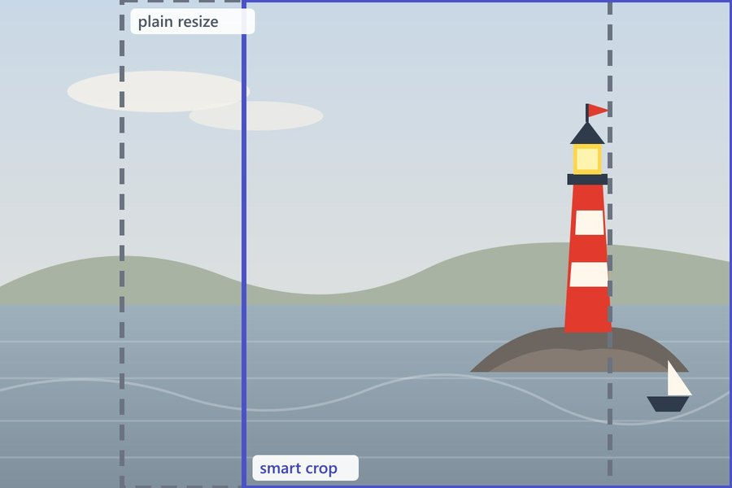
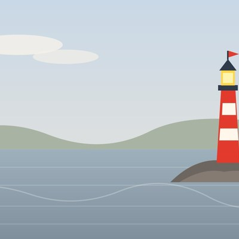
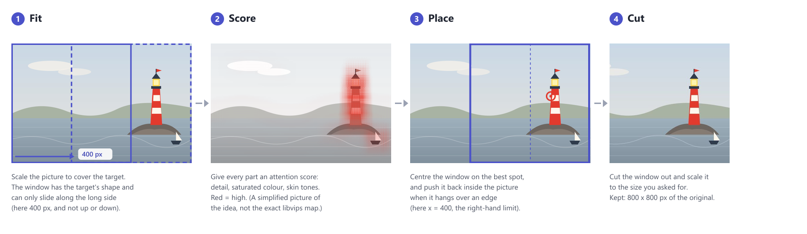
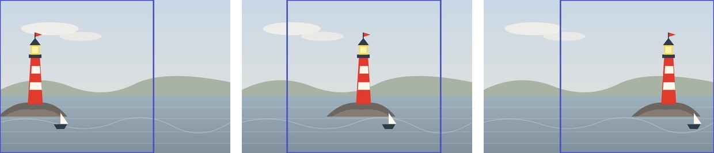

← [Documentation](../README.md)

# Smart cropping

Resize a picture to another aspect ratio and something has to go. A plain resize cuts around the centre, which loses whatever isn't there: the face in a portrait taken off-centre, the product at the edge of a shot. Smart cropping keeps the most interesting part of the picture instead.

It uses the *attention* strategy of [sharp](https://sharp.pixelplumbing.com/api-resize), the image library embed-cms already uses for every resize. It looks for skin tones, saturated colours and fine detail, and frames the crop around them. There's nothing to install or configure, no model to load, and nothing leaves your server.

## What it looks like

Take a wide picture with its subject off to one side, like this lighthouse, and ask for a square. The dashed box is what a plain resize keeps (the centre), the solid box is what smart cropping keeps:



| Plain resize, `400x400` | Smart crop, `400x400&smart=true` |
|---|---|
|  |  |

The plain resize cuts the lighthouse in half and keeps a lot of empty sky. Smart cropping notices the saturated red, the bright lamp and the detail around it, and frames those. (The pictures are a drawn scene, cropped with the real code, so there's nobody's photo in the docs.)

## How the magic works

There's no AI here, and nothing is learned. It's four plain steps, done by [sharp](https://sharp.pixelplumbing.com/api-resize) (and libvips under it), in about 12 ms for a small picture and about 55 ms for a 12-megapixel one (measured on a development machine):



Step by step:

1. **Fit.** The picture is scaled until it *covers* the size you asked for, the way CSS `object-fit: cover` does. One side matches exactly and the other overflows, and the overflow is what has to be cut. The part you keep is a window with the shape of your target, and it can only slide along the side that overflows. Ask for a square from a 1200x800 picture and the window is 800x800: it can slide 400 pixels sideways and not at all up or down.
2. **Score.** Every part of the picture gets an *attention* score, from three things that draw a human eye: **detail** (edges and contrast, so a sharp subject beats a smooth sky), **saturated colour** (the red lighthouse beats the grey sea), and **skin tones** (faces and hands). Flat, pale, even areas score close to nothing.
3. **Place.** The window is centred on the best-scoring spot, then pushed back inside the picture if it hangs over an edge.
4. **Cut.** The window is cut out and scaled to the target size. The kept part comes back as `cropResult` (see below), in pixels of the original.

Nothing else changes: the window is never zoomed or tilted, and your original file is left as it was.

### Watching it follow the subject

Here is the same drawing three times, with the lighthouse moved to three places. The box is the window smart cropping chose for a `400x400` square:



The window sits at `x: 0` when the lighthouse is on the left, at `x: 236` when it's in the middle, and at `x: 400`, as far right as the picture allows, when it's on the right. (These are the real numbers from `cropResult`.)

### What that means in practice

How it behaves on simple pictures:

- **It moves along one axis only.** A wide picture cut to a square slides sideways. A wide target taken from a tall subject slides up and down: with a bright subject near the top of a 1200x800 picture, a `800x300` crop kept the top, and with the subject near the bottom it kept the bottom.
- **It picks one place, not a compromise.** With two subjects, the window goes to one of them, the stronger one: a big red circle on the left beat a small one on the right. With two equal ones it picked the right-hand one, so don't count on a tie going your way.
- **Detail counts without colour.** A patch of grey stripes attracted the crop just as a colourful subject does.
- **When nothing stands out, it doesn't pick the centre.** On a picture with no peak at all (a flat colour) the window ended up in the top-left corner. If your pictures can be plain, such as a logo on a white background, check how they come out, or set the crop yourself.

## Asking for a smart crop

Over REST, add `smart=true` to an image download that has a `resize`:

```
/api/articles/<id>/attachments/<aid>?resize=400x300&smart=true
```

`smart=false`, `smart=0` or an empty value give a plain resize. Without `resize`, `smart` does nothing.

From code, the same option on `findAttachment`:

```js
const articles = cms.api()('articles')

const thumb = await articles.findAttachment(articleId, attachmentId, { resize: '400x300', smart: true })
thumb.stream.pipe(res)
```

To crop an image you have in memory, without storing it, use `applyCrop`:

```js
const fs = require('fs/promises')

const result = await cms.api()('articles').applyCrop(await fs.readFile('./portrait.jpg'), '300x300')
await fs.writeFile('./thumb.jpg', result.buffer)
// result.cropResult is the part of the original that was kept: { x, y, width, height }, in pixels of the original
// result also has mimeType, contentLength, originalSize and targetSize
```

The size is `WIDTHxHEIGHT`, `WIDTHxauto` or `autoxHEIGHT` (`auto` keeps the aspect ratio, so nothing needs cropping). The output keeps the format of the original. JPEG, PNG and GIF can be smart cropped.

A file uploaded with `smart: true` and a `resize` (the `createAttachment` options) is stored already cropped.

## Caching

Smart crops are cached next to the original file, under `<aid>-smart-<size>`, and plain resizes under `<aid>-<size>`, so the two never get each other's image. The cached copies are removed when the attachment or its record changes or goes.

## What to expect

The attention strategy is a clever guess, not face recognition. It does well on portraits, products and most photos with a clear subject. On a busy picture with several subjects, or a flat low-contrast one, it may pick a different region than a person would. When the framing really matters, set the crop by hand in the admin's crop tool of a crop image field, served as `/attachments/:aid/cropped` (see [API.md](API.md#attachments)). The tool has an **Auto** button that puts its frame where smart cropping would (`/attachments/:aid/crop-suggestion`), for you to adjust.

## Tests

`test/unit/smartcrop.test.js` checks that the crop moves to a colourful subject near the edge of a picture, rather than staying in the centre, and checks the sizes. `test/integration/smartCropping.test.js` (part of `npm test`) checks that an image cropped on upload and on download comes out the same size.
