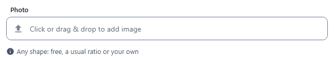
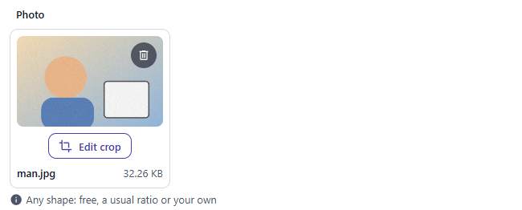
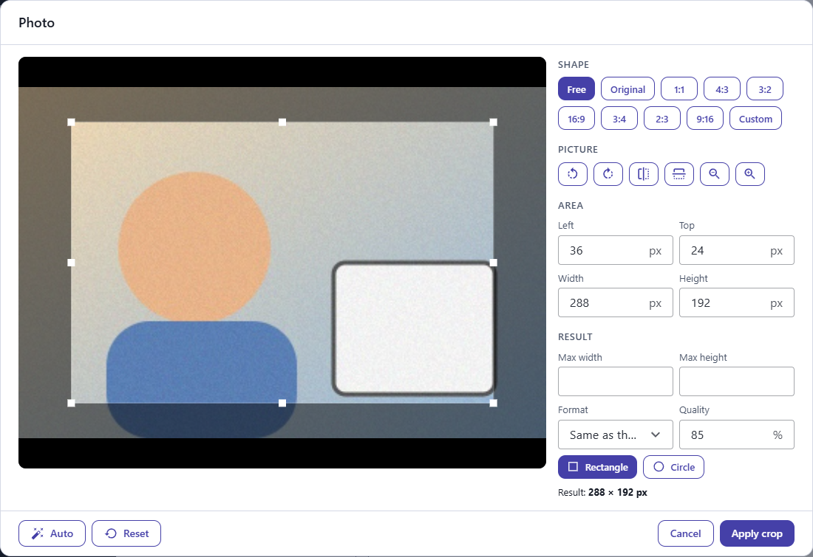
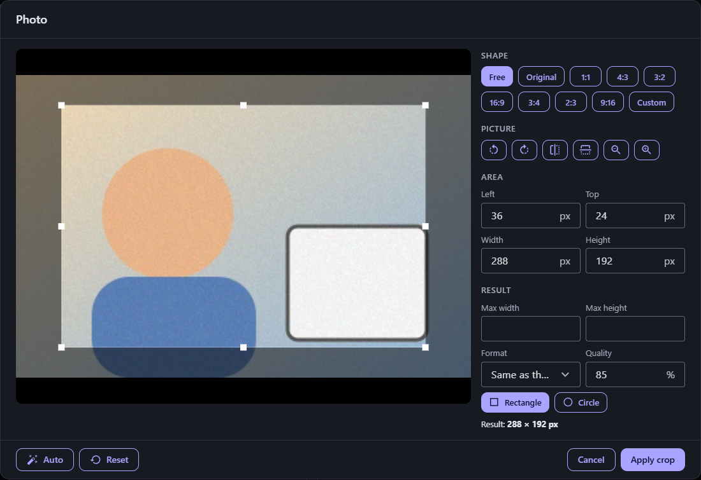
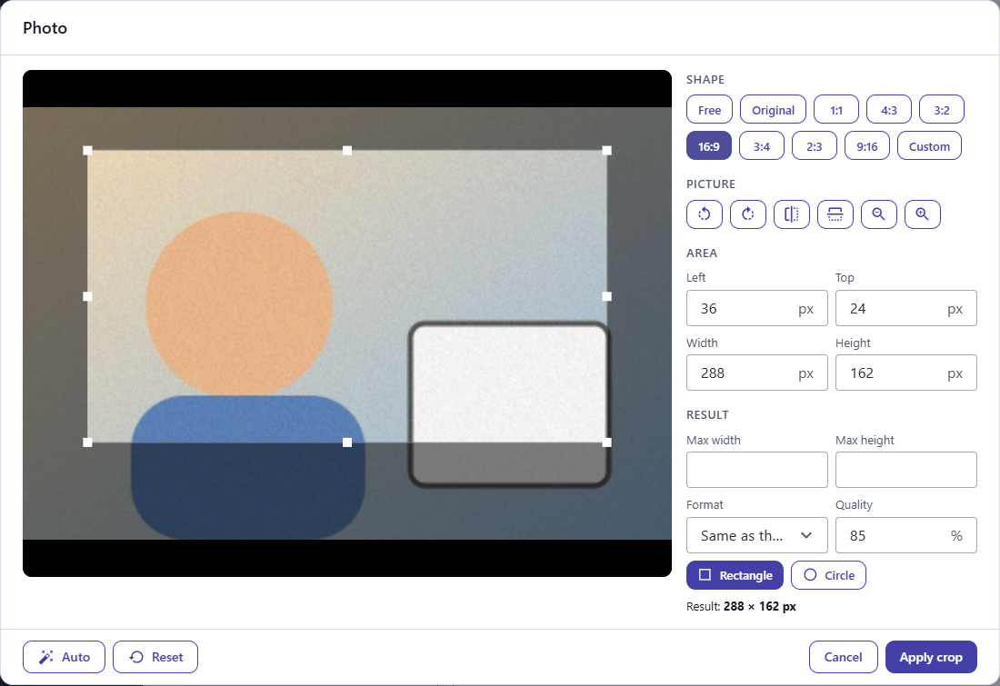
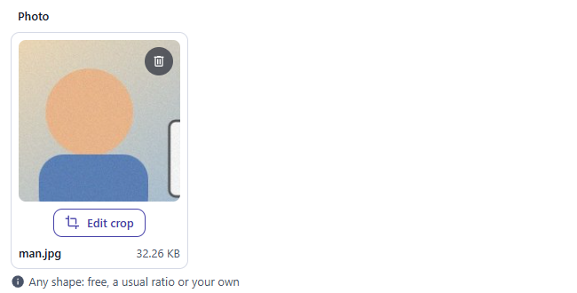
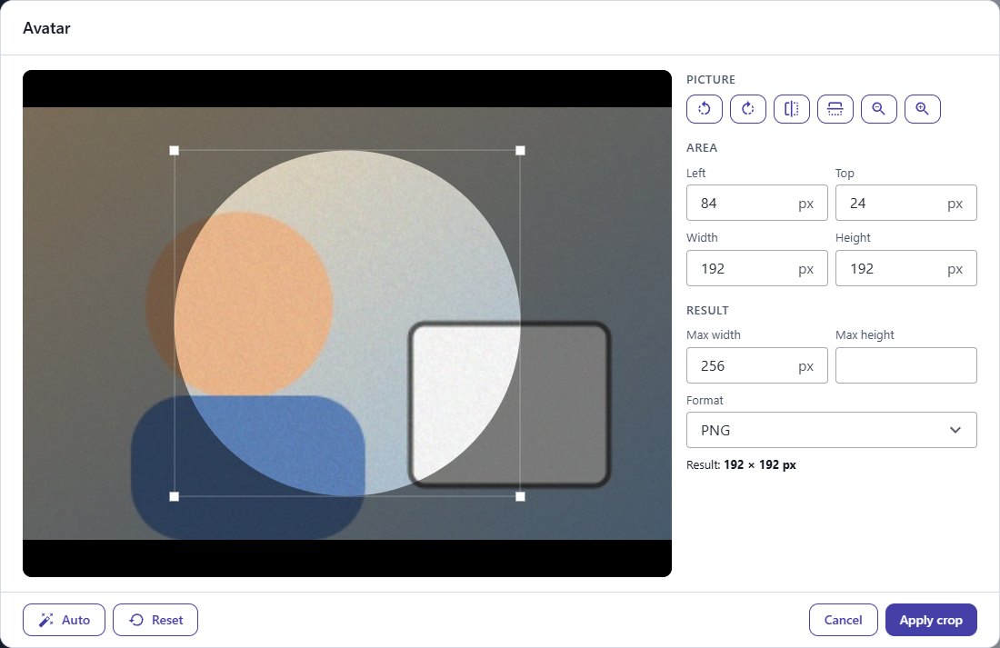
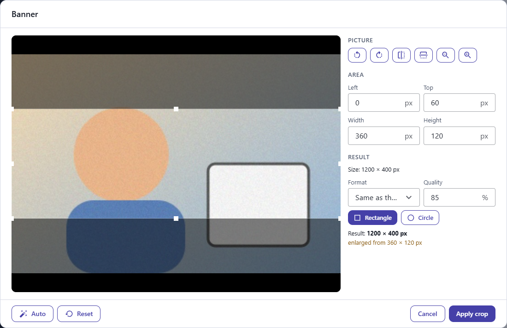
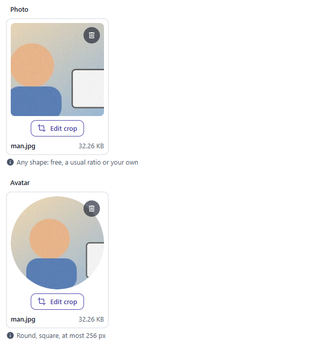

← [Field types](../FIELDS.md) · [Documentation](../../README.md)

# cropimage

An [image](image.md) field with a crop tool. Choose or drop a picture, click **Edit crop**, and a window opens with the picture, a frame to place on it, and the tools to get the shape you need. Component: `ImageView` (`src/components/fields/ImageView.vue`), the crop tool is `CropDialog` (`src/components/attachments/CropDialog.vue`).

Catalogue: `resources/media_crop.js` (group **Media**, resource **Crop images**), fields `photo`, `avatar`, `banner`, `social`, `gallery`, `readOnlyCrop`.

The picture you upload is kept as it is. The crop is stored with it as a small recipe (the `cropOptions` of the attachment). The API cuts the image when it is asked for. So you can change the crop at any time, and the same picture can be served at any size.

## Declaration

```js
{ field: 'avatar', input: 'cropimage', label: 'Avatar', options: { maxCount: 1, aspectRatio: '1:1', shape: 'circle', output: { maxWidth: 256, format: 'png' } } }
```

## Options

Everything of [image](image.md) applies (`required`, `maxCount`, `accept`, `limit`, `hint`, `localised`, `readonly`, `disabled`). Then:

| Option | Type | Default | Description |
|---|---|---|---|
| `options.width` + `options.height` | number | none | Fixes the size of the result: the crop has this shape (the frame keeps the ratio), and the result is cut to this size. The field takes a single picture. Unlike on an `image` field, the uploaded picture is not resized. |
| `options.aspectRatio` | number \| string | none | Fixes the shape without fixing the size: `1.5`, `'3:2'`, `'16/9'`. |
| `options.aspectRatios` | array | the usual ones | The shapes to choose from: ratios (`1.5`, `'3:2'`, `[3, 2]`, `{ ratio: '4:5', label: 'Portrait' }`) and the words `'free'` and `'original'`. A custom ratio is always offered unless the shape is fixed. Without this option the choice is free, original, 1:1, 4:3, 3:2, 16:9, 3:4, 2:3 and 9:16. |
| `options.shape` | `'rect'` \| `'circle'` | the person chooses | `'circle'` leaves the corners of the result transparent (a PNG or a WebP; a JPEG becomes a PNG). The option fixes the shape and hides the choice. |
| `options.output` | object | none | What the result starts with: `maxWidth`, `maxHeight` (the result is made smaller to fit, never larger), `format` (`jpeg`, `png` or `webp`; the format of the picture when unset) and `quality` (1 to 100, for JPEG and WebP; 85 when unset). The person can change them in the tool, unless `width` and `height` fix the size. |

## The tool

- **Shape:** free, the shape of the picture, one of the ratios, or a custom `W:H`. The frame keeps the ratio while you resize it.
- **Picture:** turn it a quarter left or right, flip it, zoom. The wheel zooms and dragging the picture moves it.
- **Area:** the position and the size of the frame in pixels of the picture, to the pixel.
- **Result:** the maximum size, the format and the quality, and a rectangle or a circle. The size of the result is shown, with a note when it is larger than the part of the picture kept.
- **Auto:** puts the frame where [smart cropping](../SMART_CROPPING.md) would, for the shape that is chosen. It asks the server, which sends back the position (nothing is cut or stored).
- **Reset** goes back to what the tool had when it opened, **Remove crop** serves the picture as it was uploaded.

## In the form

The picture of the field shows the cut, in the shape of the crop and whole (round for a circle), with an **Edit crop** button under it. A click on the picture opens the cut in a new tab: the small picture of the crop while it is not saved, the cut the API makes once it is. Until the record is saved the field shows the crop as the tool made it.

Apply keeps the crop with the picture. A new picture is uploaded with it when the record is saved; the crop of a saved picture is an update of the attachment.

## Variations

### Any shape

`resources/media_crop.js`, field `photo`: no option, so the shape is free, and the usual ratios and a ratio of your own are there to choose.

 

The tool opens with **Edit crop**: the picture with the frame, the shapes, the turns, the position in pixels and the result. In the dark theme:

 

A ratio keeps the frame to its shape while you resize it:



After **Apply crop** the field shows the cut, in its shape:



### Round and square

`resources/media_crop.js`, field `avatar` (`aspectRatio: '1:1'`, `shape: 'circle'`, `output: { maxWidth: 256, format: 'png' }`): the frame is a circle that stays square, and there is no choice of shape.



### A size the field fixes

`resources/media_crop.js`, field `banner` (`width: 1200, height: 400`): the frame keeps the shape of the size, and the result is cut to it.



### Saved

The picture keeps the crop, and the field shows the cut the API makes:



## Stored value

The same attachment descriptors as for [image](image.md), with the recipe under `cropOptions` and the address of the cut under `cropUrl`. `url` stays the address of the original, which is never replaced: read `cropUrl` for the cropped picture (it is only there when the picture has a crop).

```json
{
  "_id": "mumg3moydev00001ytssnnoi",
  "_filename": "harbour.jpg",
  "url": "/api/media_crop/<recordId>/attachments/mumg3moydev00001ytssnnoi",
  "cropUrl": "/api/media_crop/<recordId>/attachments/mumg3moydev00001ytssnnoi/cropped",
  "cropOptions": { "left": 120, "top": 40, "width": 900, "height": 600, "rotate": 90, "flipX": true, "shape": "circle", "output": { "maxWidth": 256, "format": "png" }, "ratio": "3:2" }
}
```

The recipe is applied in this order:

1. Flipped (`flipX`, `flipY`).
2. Turned (`rotate`, clockwise: 0, 90, 180 or 270).
3. Cropped. `left`, `top`, `width` and `height` are in pixels of the picture once flipped and turned, as a browser shows it, with its EXIF orientation applied.
4. Sized and formatted (`output`).
5. Shaped (`shape`).

`ratio` is only the choice the tool shows again when it opens. The coordinates the first crop tool stored (`{ "data": { "coordinates": { "left", "top", "width", "height" } } }`) are still read.

`GET <cropUrl>` answers the cut image, and `?resize=300xauto` (or `autox300`, `300x200`) gives it at that size. A picture with no crop, and a file that is not a JPEG, PNG, WebP or GIF picture, is sent as it is. The cuts are kept next to the original and go with it. See [API](../API.md#attachments).

## Limits

- The result is never larger than 8192 px on a side, nor than 50 million pixels, whatever the recipe asks.
- A crop that hangs over the picture is cut to the picture.
- An SVG has no crop tool; the server cuts JPEG, PNG, WebP and GIF (the first frame of an animated GIF).
- The turn is in quarters; there is no free angle.
