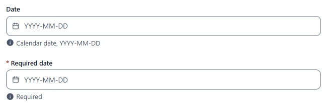
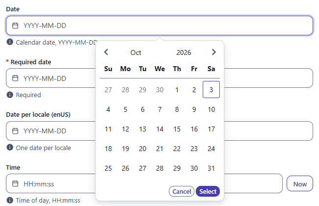
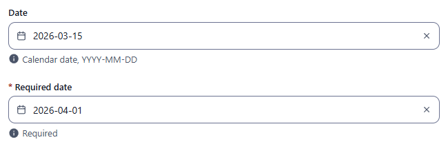
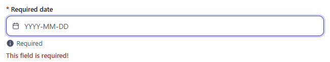
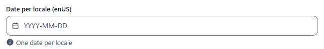
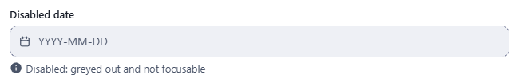

← [Field types](../FIELDS.md) · [Documentation](../../README.md)

# date

Calendar date picker. The value can be typed or picked. Component: `CustomDatetimePicker` (`src/components/fields/CustomDatetimePicker.vue`, wraps `@vuepic/vue-datepicker`). [time](time.md) and [datetime](datetime.md) use the same component.

Catalogue: `resources/dates.js` (group **Date and time**, resource **Dates and times**), fields `date`, `requiredDate`, `localisedDate`, `disabledDate`.

## Declaration

```js
{ field: 'publishedOn', input: 'date', label: 'Published on', localised: false }
```

## Options

| Option | Type | Default | Description |
|---|---|---|---|
| `field`, `input`, `label`, `localised`, `unique` | | | As for [string](string.md). |
| `required` | boolean | `false` | Adds `*` to the label. An empty value refuses the save: red outline and `This field is required!` under the field. |
| `options.hint` | string | none | Help text under the field. |
| `options.readonly` | boolean | `false` | Not editable, no clear button, a lock icon after the label. |
| `options.disabled` | boolean | `false` | Greyed out with a dashed border, not focusable. |
| `options.format` | string | `'YYYY-MM-DD'` | Display and typing format (dayjs tokens). |
| `options.customDatetimePickerOptions.placeholder` | string | `'YYYY-MM-DD'` | Placeholder text. |

The calendar speaks the language of the person (the **Language** of their user, see [CONFIG.md](../CONFIG.md)), not the language of the field being edited: an English reader gets an English calendar on the `zhCN` tab too. Tomorrow is highlighted with a marker.

## Variations

### Default and required

`resources/dates.js`, fields `date` and `requiredDate`.



Click the field to open the calendar and press Select, or type a date and press Enter or Tab:

 

### Required error

Clicking Create with an empty required date refuses the save: the field gets a red outline and `This field is required!`, and a toast names the fields (`3 required fields missing: Required date, Required time, Required date and time`).

 

### Localised

`resources/dates.js`, field `localisedDate` (one date per locale).



### Disabled

`resources/dates.js`, field `disabledDate`.



## Stored value

A **timestamp in milliseconds since the Unix epoch** (a number), `{ enUS, zhCN }` of timestamps when localised. The picked day is stored as **local midnight of the browser's time zone**:

```json
{ "date": 1773504000000, "localisedDate": { "enUS": 1767196800000, "zhCN": 1767283200000 } }
```

`1773504000000` is `2026-03-14T16:00:00Z`, which is 2026-03-15 00:00 in UTC+8 (the time zone of the screenshots). Read it with `new Date(value)` and format it in the same time zone, or expect a one-day shift.

## Validation and behaviour

- UI: the required check only; there is no format error message.
- Clearing with the `x` button empties the value.
- Server: only `unique`; any value sent over REST is stored.
