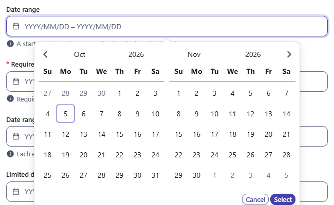
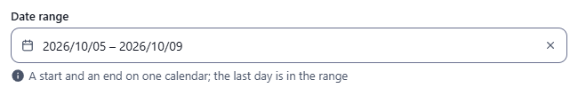
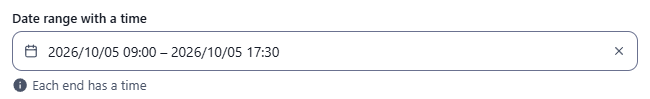
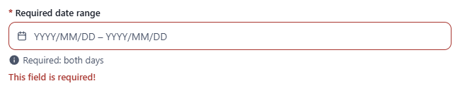
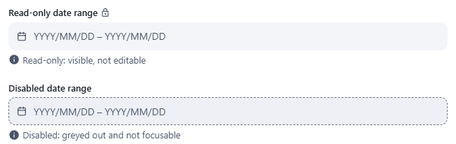

← [Field types](../FIELDS.md) · [Documentation](../../README.md)

# daterange

A start and an end picked on one calendar. Component: `DateRangeField` (`src/components/fields/DateRangeField.vue`), the rules and the words are in `src/utils/dateRange.js`. The calendar is the one of the [date](date.md) fields.

Catalogue: `resources/dates.js` (group **Date and time**, resource **Dates and times**), fields `range`, `requiredRange`, `timeRange`, `limitedRange`, `localisedRange`, `readOnlyRange`, `disabledRange`.

## Declaration

```js
{ field: 'stay', input: 'daterange', label: 'Stay', localised: false, options: { minDate: 'today', minDays: 2, maxDays: 14 } }
```

## Options

| Option | Type | Default | Description |
|---|---|---|---|
| `field`, `input`, `label`, `localised` | | | As for [string](string.md). |
| `required` | boolean | `false` | Adds `*` to the label; a save with no range is refused (`This field is required!`). |
| `options.time` | boolean | `false` | Each end has a time as well as a day. |
| `options.format` | string | `YYYY/MM/DD` (`YYYY/MM/DD HH:mm` with a time) | How the two moments are written in the box, with dayjs tokens. Typed text is read with it. |
| `options.minDate`, `options.maxDate` | string \| number | none | The first and the last day the field takes: a date (`'2026-10-05'`), a number of milliseconds, or `'today'`. The calendar does not offer a day outside. |
| `options.minDays`, `options.maxDays` | number | none | The fewest and the most days a range has, the first and the last included (from the 1st to the 3rd is 3 days). The calendar does not let a shorter or a longer range be picked. |
| `options.hint` | string | none | Help text under the box. |
| `options.readonly` | boolean | `false` | Shows the range, changes nothing, with the lock icon after the label. |
| `options.disabled` | boolean | `false` | Greyed out with a dashed border. |

## The widget

- One box, with two months side by side in the calendar. Picking the first day and then the last makes the range; picking in the other order gives the same range. The box can also be typed in (`2026/10/01 – 2026/10/05`).
- On a touch screen the calendar opens in the middle of the screen, over the page, with its Cancel and Select buttons in view (on a computer it opens under the box). On a phone it shows one month at a time.
- A range is both days or none: while the end is not picked nothing is written to the record.
- With `time`, the calendar has a time for each end, to the minute.
- The box has a clear button. A range the record already holds that the field does not take (too few days, a day outside `minDate` and `maxDate`, an end before the start) is shown with the reason in red under the box.

## Variations

### Default

`resources/dates.js`, field `range`. Two months side by side; picking the first day and then the last makes the range.

 

### With a time

Field `timeRange` (`time: true`).



### Limited

Field `limitedRange` (`minDate: 'today'`, `minDays: 2`, `maxDays: 14`): the days before today are not offered, and a range of one day or of more than fourteen cannot be picked.

### Required

Field `requiredRange`: an empty range is refused when the record is saved.



### Read-only and disabled

Fields `readOnlyRange` and `disabledRange`.



## Stored value

An object with the start and the end in milliseconds, as the date fields keep a moment; the key is absent when there is no range. A range of days has both at the start of their day in the time zone of the browser (the end day is in the range); with `time` each is the moment picked. A localised field holds one range per locale.

```json
{ "range": { "start": 1790812800000, "end": 1791158400000 } }
```

## Validation and behaviour

- UI: `required`, a start and an end that are moments, the end not before the start, `minDate`, `maxDate`, `minDays` and `maxDays`.
- Server: only `unique`, as for any field; the object is not checked.
- In the table the range is written `2026-10-01 → 2026-10-05` (with the times when it has them), and sorted by its start.
- In an xlsx export the value is written as JSON.
