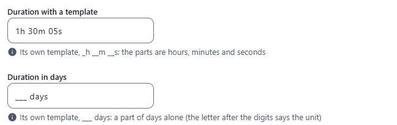
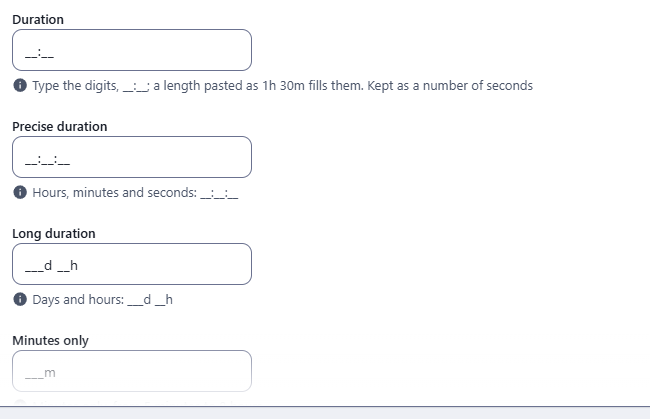
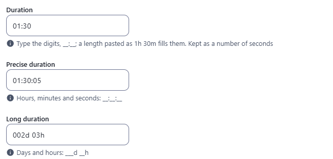
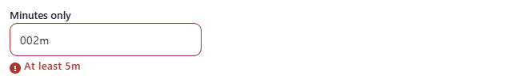
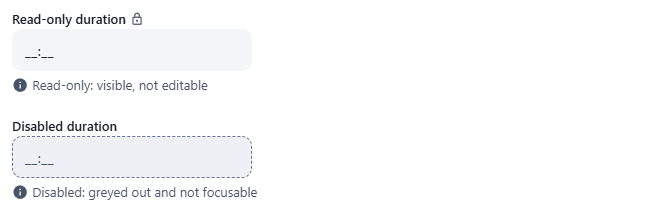

← [Field types](../FIELDS.md) · [Documentation](../../README.md)

# duration

A length of time, typed in one box that keeps its template (`__:__`) and kept as a number of seconds. Component: `DurationField` (`src/components/fields/DurationField.vue`), the reading of what is typed, the arithmetic and the words are in `src/utils/duration.js`.

Catalogue: `resources/numbers_quantities.js` (group **Numbers**, resource **Quantities**), fields `duration`, `preciseDuration`, `longDuration`, `minutesOnly`, `requiredDuration`, `localisedDuration`, `readOnlyDuration`, `disabledDuration`.

## Declaration

```js
{ field: 'cookingTime', input: 'duration', label: 'Cooking time', localised: false, options: { units: ['hours', 'minutes'], max: 8 * 3600 } }
```

## Options

| Option | Type | Default | Description |
|---|---|---|---|
| `field`, `input`, `label`, `localised` | | | As for [string](string.md). |
| `required` | boolean | `false` | Adds `*` to the label; a save with an empty box is refused (`This field is required!`). A length of zero is a length. |
| `options.units` | array | `['hours', 'minutes']` | The units of the field, from `'days'`, `'hours'`, `'minutes'` and `'seconds'`, always largest first whatever the order you list them in. At least one: a list with no unit it knows gives the default. They decide the template of the box (see below) and the unit a pasted bare number is in: the smallest. A length is rounded to the smallest unit (with `['hours', 'minutes']` a length of 5430 seconds is 01:31). |
| `min`, `max` | number | none | The shortest and the longest length it takes, **in seconds** (also accepted in `options`). A length outside is refused with `At least 15m` or `At most 2h`, written in the units of the field. |
| `options.template` | string | the usual one for the units | The template of the box, `__:__`, `_h __m`, `___ days` (see [Your own template](#your-own-template)). Its parts give the units. |
| `options.hint` | string | none | Help text under the box. |
| `options.readonly` | boolean | `false` | Shows the length, changes nothing, with the lock icon after the label. |
| `options.disabled` | boolean | `false` | Greyed out and not focusable. |

## The widget

One box that keeps its template, with a slot for each digit: `__:__` for hours and minutes, `__:__:__` for hours, minutes and seconds, `__:__` for minutes and seconds, `___d __h` for days and hours, `___m` for minutes alone. The digits fill the slots from the left as you type (`1`, `3`, `4`, `5` give `1_:__`, `13:__`, `13:4_`, `13:45`), and the length is written to the record as it goes.

- A colon, a space or a letter ends the part you are typing and fills it from the left with zeros: `1`, `:`, `3`, `0` give `01:30`.
- Backspace takes the last digit away. When the box is entered its whole text is selected, so that what you type replaces it; Backspace then clears it. The caret always goes where the next digit goes, wherever the box is clicked.
- A length pasted in the way people write it fills the slots: `1h 30m`, `1 hour 30 minutes`, `1.5h`, `2d 3h`, `1小时30分`, `1:30` (from the smallest unit up: `1:30` is 1 min 30 s in a field of minutes and seconds), and a number alone, in the smallest unit of the field (`90` is 90 minutes in hours and minutes). A pasted text that is not a length is left out. It is rounded to the smallest unit.
- A part takes as many digits as its size needs: two for minutes and seconds after hours, three for days. The first part has two digits in a clock and three for days or a unit alone, and as many as the field's `max`, or the length shown, needs: `100:00` is shown with `___:__` ready.
- When the box is left what is typed is carried up (`00:90` becomes `01:30`), and a part that was not finished counts as typed (`1` is `01:00`).
- An empty box (every slot an underscore) holds nothing. `00:00` is a length of zero.
- The message of the rules is shown under the box when you leave it, and when the record is saved.

## Your own template

`options.template` gives the box a template of its own, written the way a [string mask](string.md#mask) is: `_` is a digit, and the characters in between are written for you. Every place must be a digit, and there are from one to four parts.

```js
{ field: 'cookingTime', input: 'duration', label: 'Cooking time', localised: false, options: { template: '_h __m __s' } }
{ field: 'holiday', input: 'duration', label: 'Holiday', localised: false, options: { template: '___ days' } }
```

`resources/numbers_quantities.js`, fields `templateDuration` and `daysDuration`.

- The units come from the template: the letter that follows each part says its unit (`d`, `h`, `m` or `s`, in any case, with or without a space before it), so `_h __m __s` is hours, minutes and seconds and `___ days` is days alone. Without letters (`__-__`) the units are the ones of `options.units` when there are as many, else the usual ones for that many parts: one is minutes, two hours and minutes, three hours, minutes and seconds, four days to seconds. The parts go from the largest unit to the smallest.
- A part keeps the width the template gives it, and the box holds as many digits as the template has places. The first part is widened when `max`, or the length shown, needs more digits (a value of 120 hours shows `___h __m` rather than losing a digit).
- A template that is not a template for a length (a letter or a digit-or-letter place, no place at all, more than four parts, parts in the wrong order) is ignored: the box has the usual template for the units of the field.
- What is typed, pasted and carried up when the box is left works as described above, whatever the template.



## Variations

### The template

`resources/numbers_quantities.js`, fields `duration` (`__:__`), `preciseDuration` (`__:__:__`) and `longDuration` (`___d __h`). The box shows its template while it is empty and keeps it while it is typed in; typing `0130` is 01:30.

 

### Limits

Field `minutesOnly` (`units: ['minutes']`, `min: 300`, `max: 28800`). A length outside is refused when the box is left, in the units of the field.



### Read-only and disabled

Fields `readOnlyDuration` and `disabledDuration`.



## Stored value

A whole number of seconds; the key is absent when there is no length. A localised field holds one per locale.

```json
{ "duration": 5400, "localisedDuration": { "enUS": 3600, "zhCN": 7200 } }
```

## Validation and behaviour

- UI: `required`, the least and the most (`min` and `max`, in seconds), and a whole number of seconds from zero.
- Server: only `unique`, as for any field; the number is not checked.
- In the table the length is written in the units of the field in the language of the admin (`1h 30m`, `1小时 30分`), right aligned, sorted as a number.
