← [Field types](../FIELDS.md) · [Documentation](../../README.md)

# file

File upload for any file type, with drag and drop and a list of chosen files. Component: `AttachmentView` (`src/components/fields/AttachmentView.vue`), same logic as [image](image.md) (`src/mixins/FileInputField.js`) without the thumbnail requirement and cropping.

Catalogue: `resources/media_files.js` (group **Media**, resource **Files**), fields `attachments`, `contract`, `manual`, `media`, `small`, `localisedBrochure`, `readOnlyFile`, `disabledFile`.

## Declaration

```js
{ field: 'manual', input: 'file', label: 'User manual', localised: false, options: { accept: '.pdf,.docx', maxCount: 1 } }
```

## Options

Same as [image](image.md) for `required`, `options.maxCount`, `options.accept`, `options.limit` (bytes), `options.hint`, `localised`. Differences:

| Option | Type | Default | Description |
|---|---|---|---|
| `options.maxCount` | number | unlimited | `1` gives a single-file field (the zone disappears once a file is chosen). The server does **not** enforce `maxCount` for `file` fields (it does for `image`). |
| `required` | boolean | `false` | Error `File is mandatory`. |
| `options.disabled` | boolean | `false` | No drop zone and no upload; only the label and the existing files are shown. The hint is not shown. |
| `options.readonly` | boolean | `false` | No drop zone and no upload; the hint is shown. |
| `options.width`, `options.height` | | | Have no meaning for files. |

## Variations

### Any number of files

`resources/media_files.js`, field `attachments`. Non-image files show a name and size chip; images also show a thumbnail.

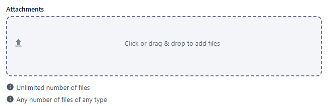 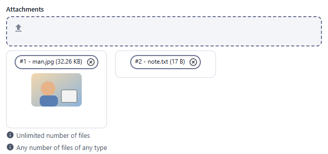

### Single file, required

`resources/media_files.js`, field `contract`.

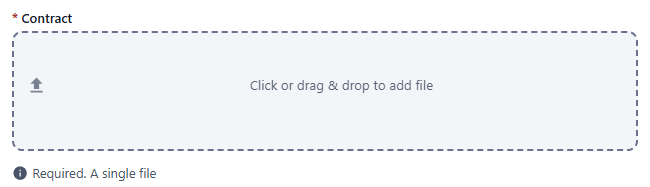 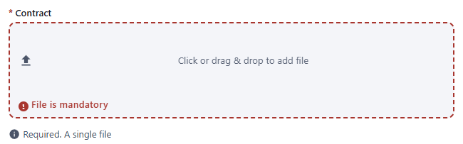 

### Accepted formats

`resources/media_files.js`, fields `manual` (`accept: '.pdf,.docx'`) and `media` (`accept: 'video/*,audio/*'`). A text file is refused with `Invalid file type`.

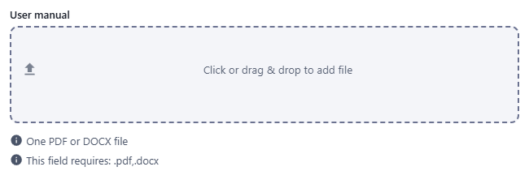 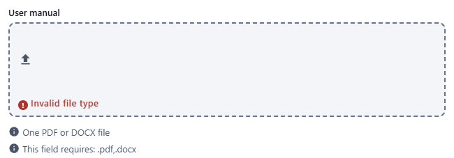 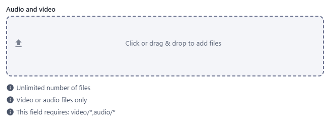 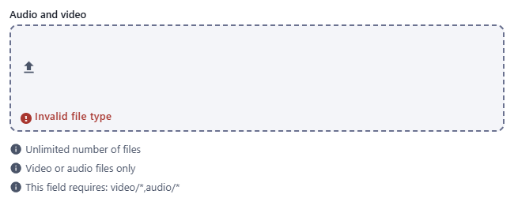

### Size limit

`resources/media_files.js`, field `small` (`limit: 5 * 1024 * 1024`; the value is a number of bytes, displayed as `5 MB`). A 6 MB file is refused with `File is too big`; a small file is accepted.

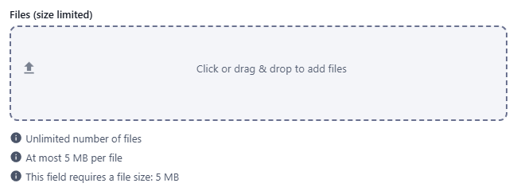 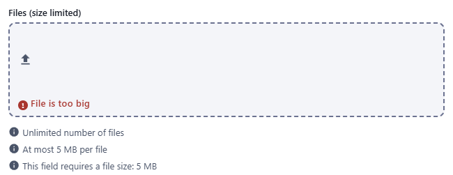 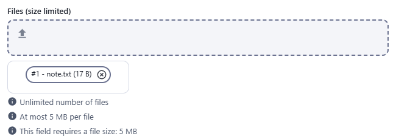

### One file per locale

`resources/media_files.js`, field `localisedBrochure`.

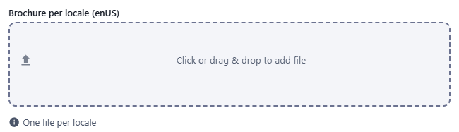

### Read-only

`resources/media_files.js`, field `readOnlyFile`: no drop zone.

 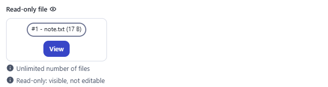

### Disabled

`resources/media_files.js`, field `disabledFile`: the label is shown, with the existing files if any; there is no drop zone.

 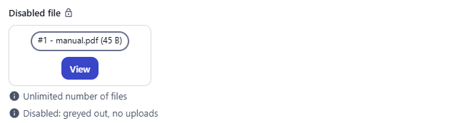

## Stored value

As for [image](image.md#stored-value): an array of attachment descriptors per field (`{ enUS: [...] }` when localised), uploaded after the record is created.

```json
{
  "contract": [
    {
      "_id": "mumg53csdev00001ycyhuazi",
      "_filename": "manual.pdf",
      "_contentType": "application/pdf",
      "_size": 45,
      "_md5sum": "…",
      "_fields": { "_filename": "manual.pdf" },
      "url": "/api/media_files/<recordId>/attachments/mumg53csdev00001ycyhuazi",
      "_isAttachment": true
    }
  ]
}
```

`GET` on `url` (with authentication) returns the bytes with the stored content type (`application/pdf` for a PDF).

## Validation and behaviour

- UI: `required`, `accept`, `limit`, `maxCount` at selection time. The hint line of a multiple field reads `Unlimited number of files` (or `Maximum number of files: N`); the size error reads `File is too big`.
- A read-only or disabled field has no remove button on its files (same as [image](image.md#validation-and-behaviour)).
- Server: nothing is validated for files except access rights; `accept`, `limit`, `required` and `maxCount` can all be bypassed over REST.
- A record removal removes its files.
