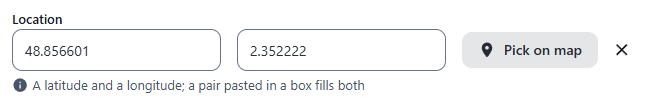
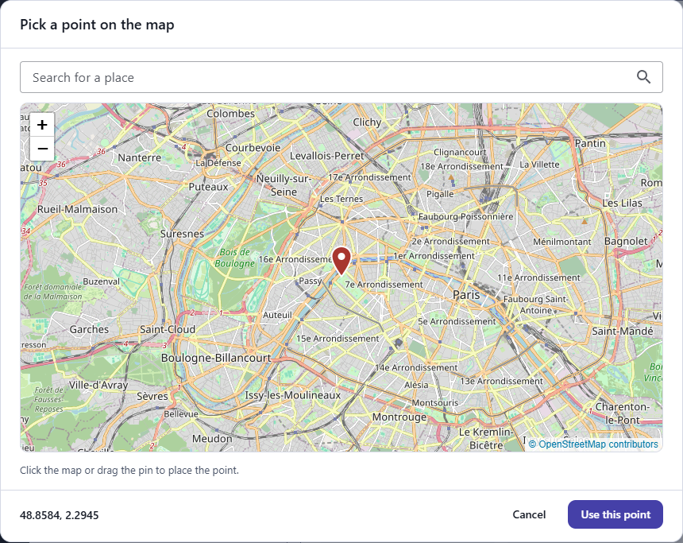
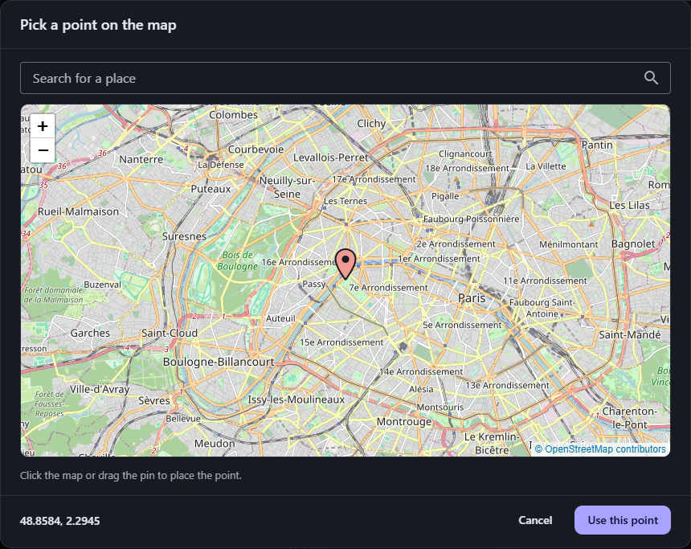
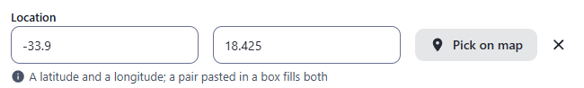
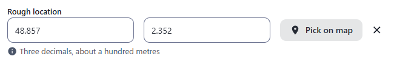
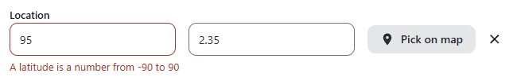
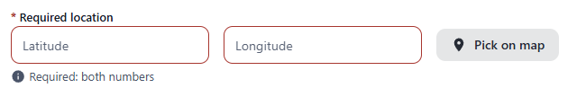
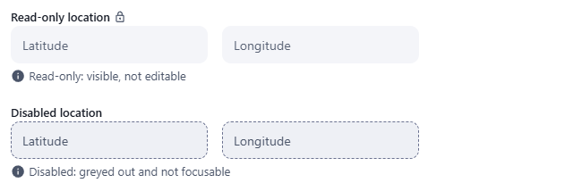

← [Field types](../FIELDS.md) · [Documentation](../../README.md)

# geopoint

A place on Earth: a latitude and a longitude, in two boxes, and a **Pick on map** button that opens a map (OpenStreetMap, no key needed; see the [`maps` option](../CONFIG.md#maps)) where the point is clicked, or the pin is dragged, or an address is searched. Component: `GeopointField` (`src/components/fields/GeopointField.vue`) and, for the map, `GeoPickerDialog`; the reading of the numbers and the rules are in `src/utils/geopoint.js`, the map in `src/utils/maps/`.

Catalogue: `resources/places.js` (group **Place**, resource **Places**), fields `location`, `requiredLocation`, `roughLocation`, `shanghai`, `readOnlyLocation`, `disabledLocation`.

## Declaration

```js
{ field: 'office', input: 'geopoint', label: 'Office', localised: false, options: { precision: 5, center: { lat: 31.2304, lng: 121.4737 }, zoom: 11 } }
```

## Options

| Option | Type | Default | Description |
|---|---|---|---|
| `field`, `input`, `label`, `localised` | | | As for [string](string.md). A place is the same in every language: use `localised: false`. |
| `required` | boolean | `false` | Adds `*` to the label; a save with no point is refused (`This field is required!`). |
| `options.precision` | number | `6` | The decimals kept, from 0 to 10. 6 is about 10 cm, 3 about 100 m. What is typed or picked is rounded to it. |
| `options.zoom` | number | `12` | How far the map is zoomed in when it is opened on a point or on `center`, from 1 to 20. |
| `options.center` | `{ lat, lng }` | none | Where the map is opened when the field has no point yet. Without it the map shows the world. |
| `options.hint` | string | none | Help text under the boxes. |
| `options.readonly` | boolean | `false` | Shows the point, changes nothing, with the lock icon after the label. |
| `options.disabled` | boolean | `false` | Greyed out with a dashed border. |

## The widget

- Two boxes, latitude and longitude. A number is written as it is (`48.8566`, `-2.35`, a comma for the decimals is read too: `48,8566`); a side can be written with a letter, before or after (`33.9 S`, `W 2.35`); degrees, minutes and seconds are read (`48°51'24"N`). When a box is left the number is written the way it is kept (`33.9 S` becomes `-33.9`).
- A pair pasted in either box fills both: `48.8566, 2.3522` (what Google Maps copies), `48.8566 2.3522`, `48,8566; 2,3522`, `(48.8566, 2.3522)`, `N 48.8566 E 2.3522`, `48°51'24"N 2°21'8"E`. With the sides written the longitude may come first.
- The point is both numbers or none: while one box is empty or is not a number nothing is written to the record, and the box that is wrong or missing is red with the reason under the boxes.
- A clear button takes the point away.
- On a phone the map dialog keeps its title and its foot (Cancel, Use this point) in view and scrolls its middle, whatever the height of the screen or the keyboard; the zoom buttons, the search box and the pin are 44px for a finger, and in landscape the map takes the room.
- **Pick on map** opens the map on the point (or on `center`). A click, or the pin dragged, places the point; the search box looks an address up (Enter) and the map goes there; **Use this point** writes it to the boxes, Cancel leaves them as they were. When the map cannot be loaded (no connection, a tile server that does not answer) the dialog says so and the boxes still work. With `maps: false` there is no button.





In the dark theme:



## Variations

### Default

`resources/places.js`, field `location`. A pair pasted in a box fills both.

### Sides, degrees, minutes and seconds

The latitude `33.9 S` is kept `-33.9`; the longitude `18°25'30"E` is kept `18.425`.



### Precision

Field `roughLocation` (`precision: 3`).



### A box that is wrong



### Required

Field `requiredLocation`: an empty field is refused when the record is saved.



### Where the map opens

Field `shanghai` opens the map on Shanghai when it has no point (`center`, `zoom: 11`).

### Read-only and disabled

Fields `readOnlyLocation` and `disabledLocation`. Neither has the button for the map.



## Stored value

An object with the latitude and the longitude in degrees, in WGS-84 (the system of GPS and of the map tiles); the key is absent when there is no point.

```json
{ "location": { "lat": 48.8566, "lng": 2.3522 } }
```

## Validation and behaviour

- UI: `required`, a latitude from -90 to 90 and a longitude from -180 to 180, both numbers.
- Server: only `unique`, as for any field; the object is not checked.
- In the table the point is written `48.8566, 2.3522` (with the decimals of the field) and sorted by its latitude.
- In an xlsx export the value is written as JSON.
- The map is given to the people who are logged in to the admin, not to `/admin/config`; see [Maps](../CONFIG.md#maps) for the tile server, the search, the usage policies and the content security policy.
