← [Field types](../FIELDS.md) · [Documentation](../../README.md)

# image

Image upload with thumbnail previews, drag and drop, reordering and per-file remove. Component: `ImageView` (`src/components/fields/ImageView.vue`) with the shared upload logic of `src/mixins/FileInputField.js`. [file](file.md) is the same control for any file type, [cropimage](cropimage.md) is this field with a crop tool, and [imagemap](imagemap.md) with areas laid over the picture.

Catalogue: `resources/media_images.js` (group **Media**, resource **Images**), fields `gallery`, `cover`, `icon`, `photo`, `localisedBanner`, `readOnlyImage`, `disabledImage`. Test images: any JPG, PNG or SVG.

## Declaration

```js
{ field: 'cover', input: 'image', label: 'Cover image', localised: false, required: true, options: { maxCount: 1 } }
```

## Options

| Option | Type | Default | Description |
|---|---|---|---|
| `field`, `input`, `label`, `localised`, `unique` | | | As for [string](string.md). `unique` makes no sense for attachments. |
| `required` | boolean | `false` | At least one image (existing or newly chosen). Error `Image is mandatory`. |
| `options.maxCount` | number | `-1` (unlimited) | Maximum number of images. `1` makes a single-image field: the drop zone disappears once an image is present (remove it to pick another). The hint line then reads `Maximum number of images: N` when N > 1 and `Unlimited number of images` when unset. |
| `options.accept` | string | any | Comma-separated extensions (`.png`), MIME groups (`image/*`) or MIME types (`image/jpeg`). Sets the file dialog filter, is checked on selection (`Invalid image type`) and is listed under the field (`This field requires: .png,.svg`). |
| `options.limit` | number | none | Maximum size **in bytes** of one file (`Image is too big`). Displayed as `B`, `KB` or `MB` with 1024 units: `2 * 1024 * 1024` reads `2 MB`. |
| `options.width` + `options.height` | number \| string | none | When both are set the field takes a single image, the size is shown as a requirement (`...size: 800x300`) and the image can be cropped to it. |
| `options.hint` | string | none | Help text under the field, translated with the CMS translations when it is a key. |
| `options.disabled` | boolean | `false` | No drop zone and no upload; only the label and the existing previews remain (the hint is not shown). |
| `options.readonly` | boolean | `false` | Same as `disabled`, with the hint shown: no drop zone, no upload. |

## Variations

### Any number of images

`resources/media_images.js`, field `gallery`.

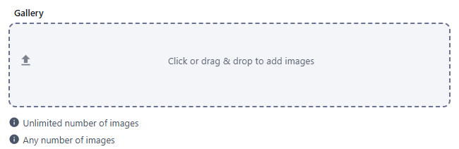

Choose several files at once or drop them. Previews show name, size and a 100 px thumbnail; drag the row handle to reorder, use the round button to remove. After saving:

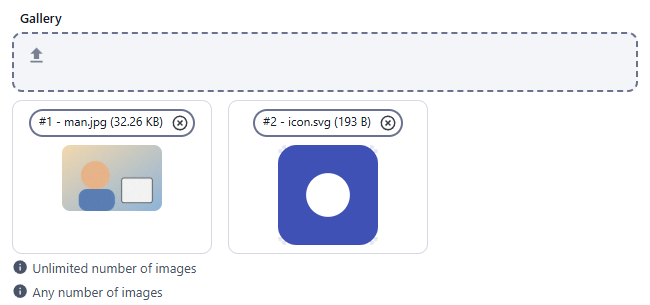 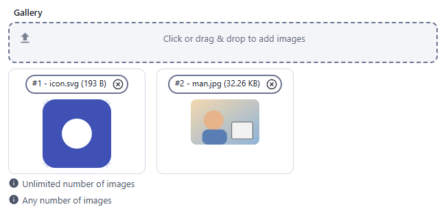

### Single image, required

`resources/media_images.js`, field `cover` (`required: true`, `maxCount: 1`).

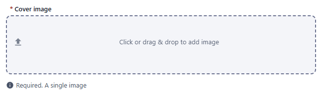 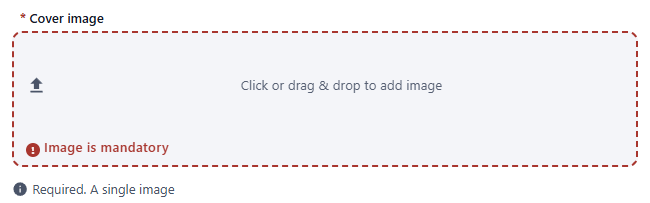 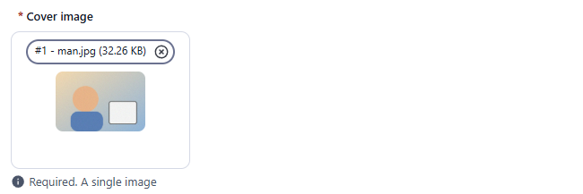

### Accepted formats

`resources/media_images.js`, field `icon` (`accept: '.png,.svg'`, `maxCount: 1`). A JPG is refused:

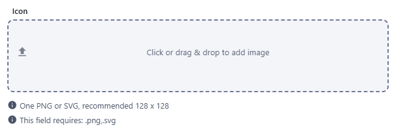 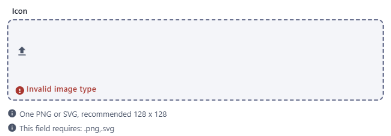 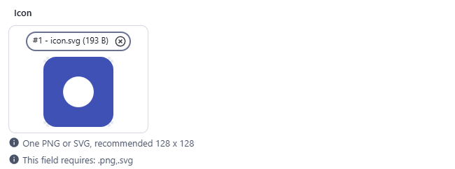

### Size limit

`resources/media_images.js`, field `photo` (`limit: 2 * 1024 * 1024`, that is 2 MB; the value is a number of bytes). The requirement is listed under the field. A 33 KB image is accepted; a 3 MB file is refused with `Image is too big` and not added.

```js
{ field: 'photo', input: 'image', label: 'Photos (size limited)', localised: false, options: { limit: 2 * 1024 * 1024 } }
```

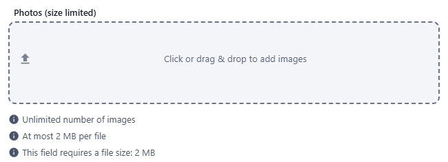 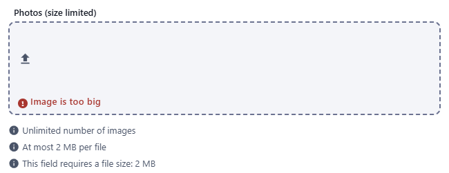 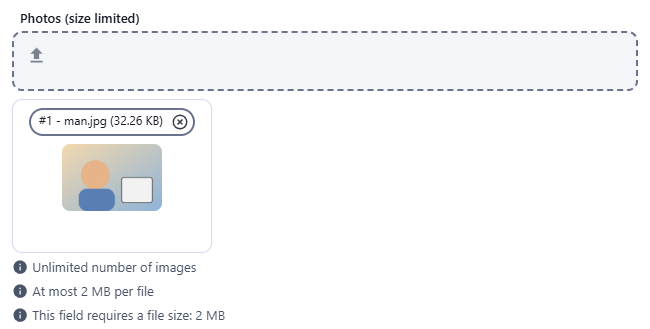

### One image per locale

`resources/media_images.js`, field `localisedBanner`: each locale tab has its own upload.

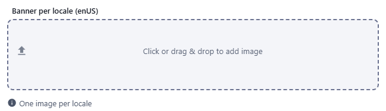 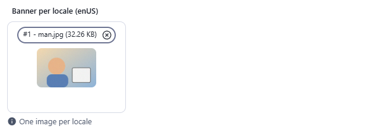 

### Read-only

`resources/media_images.js`, field `readOnlyImage`: no drop zone, so nothing can be uploaded.

 

### Disabled

`resources/media_images.js`, field `disabledImage`: only the label (and the existing previews) are shown.

 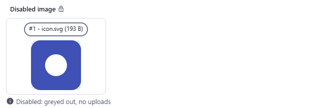

## Stored value

Files are not part of the JSON you send: the admin first creates the record, then uploads each file to `POST /api/<resource>/<id>/attachments` (multipart, the part name is the field key). Reading the record returns, for each image field, an array of attachment descriptors; a localised field returns `{ enUS: [...] }`:

```json
{
  "cover": [
    {
      "_id": "mumg3moydev00001ytssnnoi",
      "_filename": "man.jpg",
      "_contentType": "image/jpeg",
      "_size": 34578,
      "_md5sum": "3e912ef376ec993cb7d2b02e281ec5e7",
      "_meta": { "width": 612, "height": 408 },
      "_fields": { "_filename": "man.jpg" },
      "url": "/api/media_images/<recordId>/attachments/mumg3moydev00001ytssnnoi",
      "_isAttachment": true
    }
  ],
  "localisedBanner": { "enUS": [ { "_fields": { "locale": "enUS", "_filename": "man.jpg" }, "...": "..." } ] }
}
```

`_meta` (pixel size) is present for raster images (not for SVG). Append `?resize=autox100` (width x height, `auto` for either) to `url` for a resized version.

## Validation and behaviour

UI:
- `required`, `accept` (extension case-insensitive), `limit` and the maximum number of images are checked when files are chosen; an invalid file is not added.
- After a refused file the field keeps its error and Create stays blocked.
- Reordering renumbers the images (`#1`, `#2`); the order is saved as `order` on each attachment.

Server (`lib/Resource.js`, `createAttachment`):
- `maxCount` is enforced for `input: 'image'` only: with `maxCount: 1` a new upload **replaces** the previous image (three uploads to `cover` leave one image); with `maxCount: N > 1` an upload beyond N fails with `Adding one more attachment would exceed the limit`.
- `required`, `accept` and `limit` are **not** checked by the server: a JPG posted to `icon` (`accept: '.png,.svg'`) is stored.
- Removing a record removes its attachments.
- A read-only or disabled field has no remove button on its images.
- Images of a multiple field keep the order in which they were added, whichever upload finishes first.
