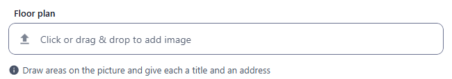
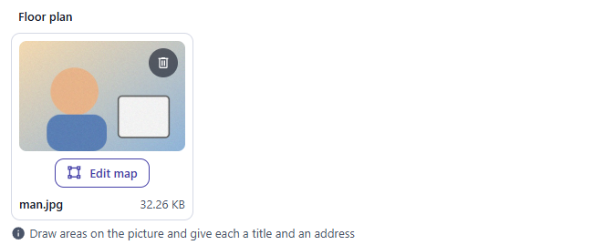
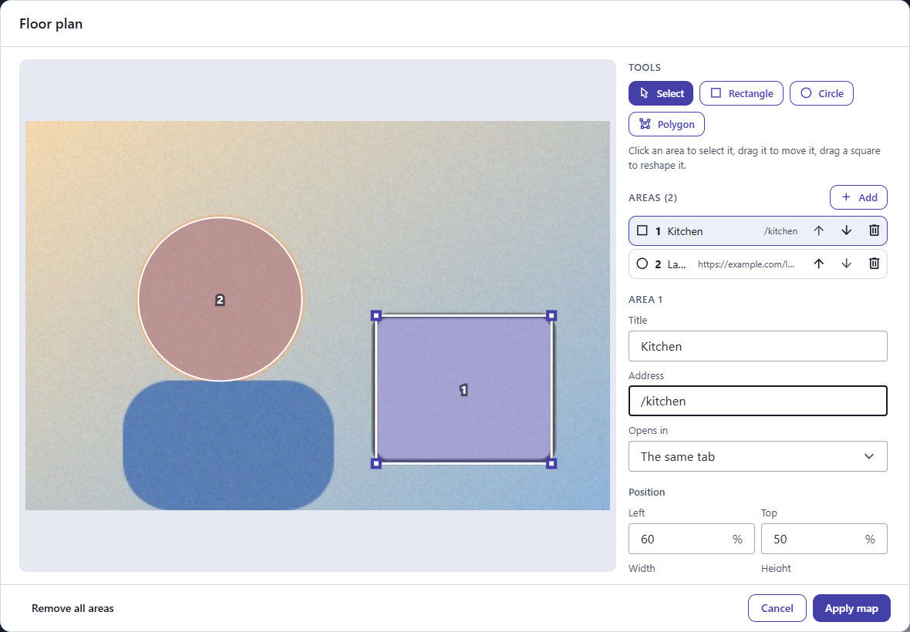
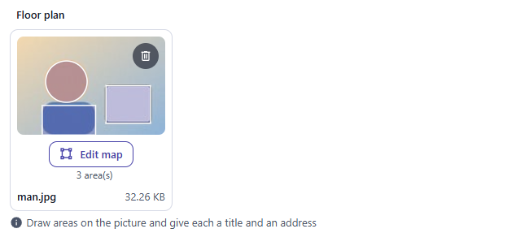
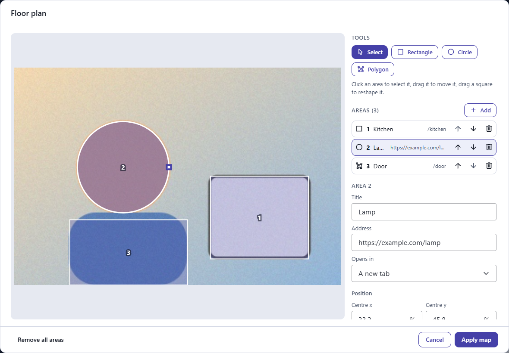
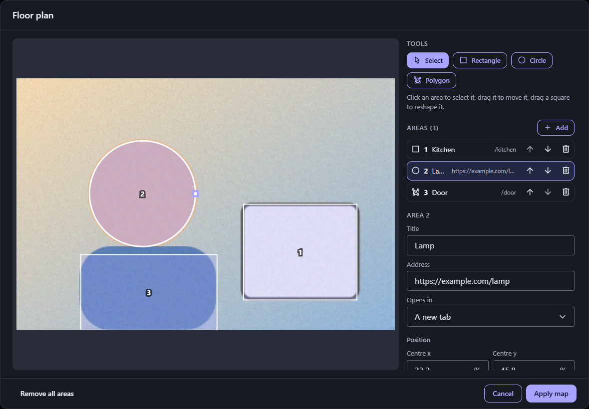
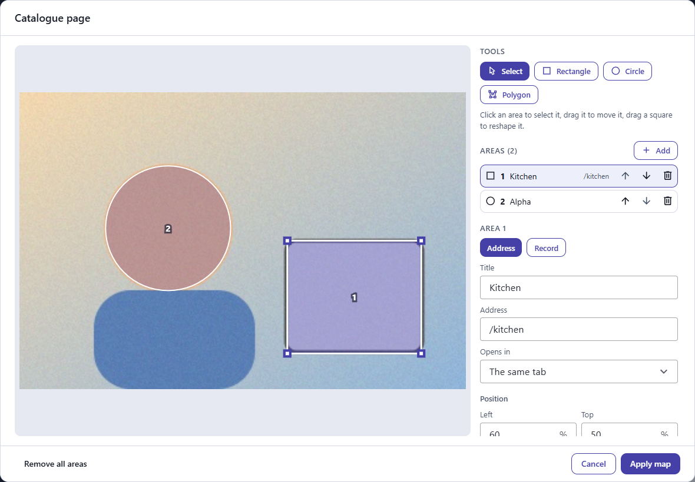
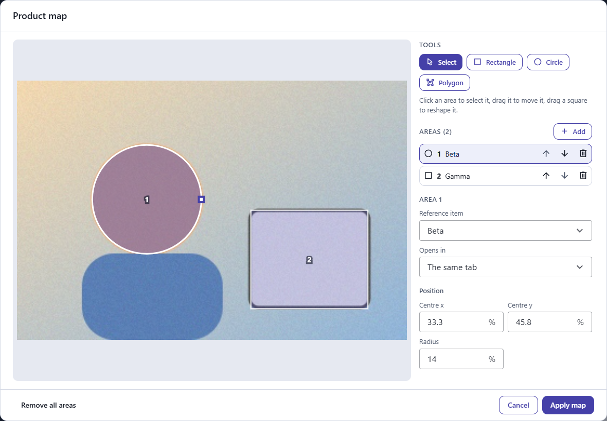
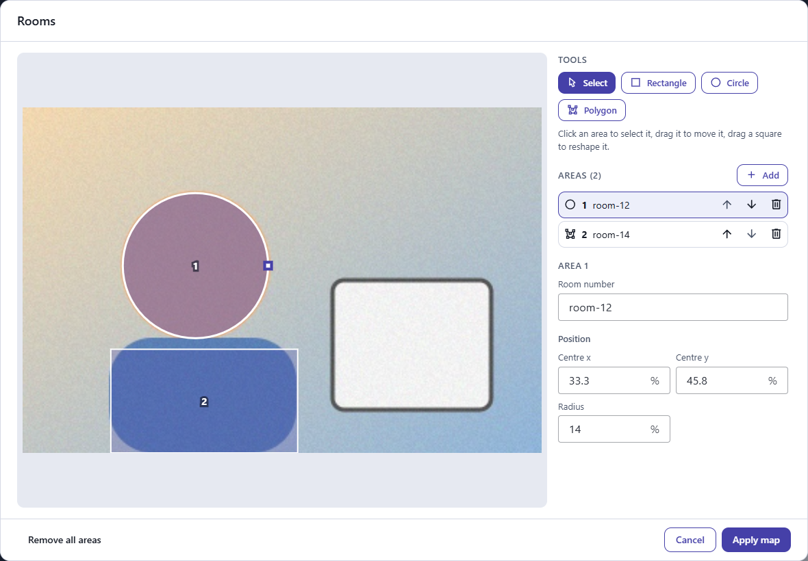
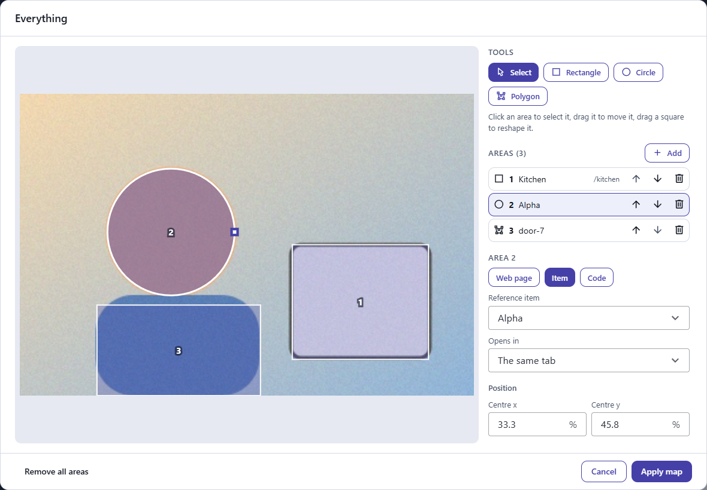

← [Field types](../FIELDS.md) · [Documentation](../../README.md)

# imagemap

An [image](image.md) field with an image map: areas laid over the picture, each linking to an address, to a record, or holding a value. Choose or drop a picture, click **Edit map**, draw rectangles, circles and polygons on it, and say where each one goes. Component: `ImageView` (`src/components/fields/ImageView.vue`), the tool is `ImageMapDialog` (`src/components/attachments/ImageMapDialog.vue`).

Catalogue: `resources/media_map.js` (group **Media**, resource **Image maps**), fields `floorPlan` (addresses), `catalogue` (an address or a record), `productMap` (records only, with where they open), `multiMap` (records of several resources), `roomMap` (values only), `everything` (all three, with the words of the field), `localisedMap`, `readOnlyMap`.

The map is kept with the picture (the `imageMap` of the attachment) and comes back with it in the record. The picture is not changed.

## Declaration

```js
{ field: 'catalogue', input: 'imagemap', label: 'Catalogue page', options: { maxCount: 1, references: [{ resource: 'pages', label: '{{title}}' }] } }
```

## Options

Everything of [image](image.md) applies (`required`, `maxCount`, `accept`, `limit`, `hint`, `localised`, `readonly`, `disabled`). A map belongs to one picture, so `maxCount: 1` is what you usually want. Then:

| Option | Type | Default | Description |
|---|---|---|---|
| `options.links` | string \| array | `['url', 'record']` | What an area can link to: `'url'` (an address), `'record'` (a record of another resource) and `'value'` (a text the person types). A string allows one, a list several, and with several the person chooses for each area. `'record'` needs `references`; without them an address is offered in its place. By default an area links to an address, and to a record when the field has `references`. |
| `options.references` | array | none | The resources a record can be from: one, or several (the person picks the resource, then the record). Each is a name (`'pages'`) or `{ resource, label, title }`. `label` is a Mustache template that names a record in the list (`'{{title}}'`; the first field of the resource when unset). `title` is what the kind of record is called to the person (`'Product'`, or one text per language): it replaces the word Record on the picker, on the button when there is one resource, and in the choice of resource. |
| `options.openIn` | boolean | `false` | Asks where a record opens (the same tab or a new one). An address always does. |
| `options.labels` | object | none | Changes the words of the tool: `{ url, record, value }` are the words of the three kinds of link, on their buttons and on the fields (`{ value: 'Room number' }`), each a text or one text per language. |

## The tool

- **Draw:** pick Rectangle, Circle or Polygon and draw on the picture. A rectangle and a circle are dragged (a circle from its centre); a polygon is made of clicks, ended by a click on its first point, Enter, a double click or **Finish polygon**.
- **Select:** click an area to select it. Drag it to move it, drag a square to reshape it (a corner of a rectangle, the radius of a circle, a point of a polygon; a double click on a point of a polygon takes it away). The arrow keys move it (Shift for larger steps), Delete removes it, Escape lets go.
- **Without a pointer:** **Add** puts a rectangle, a circle or a polygon in the middle of the picture, to be placed with the numbers (the position of a rectangle or a circle, in percent of the picture) and the arrow keys.
- **List:** each area with its number and what it is called (its title, the record, the value). The first area is on top: where areas overlap a click gets the first, as in an HTML image map. The arrows put an area above or below the others.
- **What an area links to** (the field says which are offered, and with several the person chooses for each area):
  - an **address** (`https://…`, `mailto:`, `tel:`, a path of the site such as `/pricing`, `#top`), with a **title** (also what a screen reader says) and where it opens (the same tab or a new one). An address that could run a script (`javascript:`, `data:`…) is shown in red and refused.
  - a **record**, picked from one resource or from several. It has no title, since the record is what it is called, and no choice of where it opens, unless the field has `openIn`. The tool asks for the records each time it opens, so what you have just created is there.
  - a **value**: a text the person types, for your site to make of (a code, a room number, an id). It has no title and no choice of where it opens, and is not checked as a link.

Apply keeps the map with the picture. A new picture is uploaded with its map when the record is saved; the map of a saved picture is an update of the attachment.

## Variations

### Addresses

`resources/media_map.js`, field `floorPlan`: the default, an area links to an address, with a title and where it opens.

 

Draw with the tools: a circle dragged from its centre, a rectangle dragged across, a polygon of clicks. The area that is drawn is selected, and its title and address are asked for.



The field shows the areas over the picture, with how many there are:



Selecting an area in the list or on the picture shows its title, address, where it opens and its position. In the dark theme:

 

### An address or a record

`resources/media_map.js`, field `catalogue` (`references: [{ resource: 'reference_items', label: '{{name}}' }]`): the person chooses, for each area, an address or a record of the resource. A record has no title, since the record is what it is called.



### Records only

`resources/media_map.js`, field `productMap` (`links: 'record'`, `openIn: true`, one reference with a `title`): nothing to choose but the record, which is named by the title the field gives its resource, and where it opens, which the field asks for.



### Values only

`resources/media_map.js`, field `roomMap` (`links: 'value'`, `labels: { value: 'Room number' }`): each area holds a text the person types, with the word the field gives it. No title, no address, no choice of where it opens.



### All three, with the words of the field

`resources/media_map.js`, field `everything` (`links: ['url', 'record', 'value']`, `labels`, `openIn`): the buttons carry the words of the field.



## Stored value

The same attachment descriptors as for [image](image.md), with the map under `imageMap`:

```json
{
  "_id": "mumg3moydev00001ytssnnoi",
  "_filename": "floor-plan.png",
  "url": "/api/plans/<recordId>/attachments/mumg3moydev00001ytssnnoi",
  "imageMap": {
    "areas": [
      { "id": "area-3", "shape": "poly", "coords": [0.6, 0.6, 0.9, 0.6, 0.75, 0.95], "title": "Door", "href": "/door", "target": "_self" },
      { "id": "area-2", "shape": "circle", "coords": [0.7, 0.3, 0.1], "ref": { "resource": "pages", "id": "mumg3moydev00001ytssnnoi" }, "target": "_blank" },
      { "id": "area-4", "shape": "rect", "coords": [0.1, 0.7, 0.3, 0.9], "value": "room-12", "target": "_self" },
      { "id": "area-1", "shape": "rect", "coords": [0.1, 0.1, 0.4, 0.5], "title": "Kitchen", "href": "/kitchen", "target": "_self" }
    ]
  }
}
```

An area is:

| Key | Description |
|---|---|
| `id` | A name of the area, different for each area of the map. |
| `shape` | `rect`, `circle` or `poly`. |
| `coords` | Fractions (0 to 1) of the width and of the height of the picture, so the map is right at any size it is shown. `rect`: `[x1, y1, x2, y2]`, two opposite corners. `circle`: `[cx, cy, r]`, the radius is a fraction of the **width**, so a circle stays round on a wide picture. `poly`: `[x1, y1, x2, y2, x3, y3, …]`, three points or more. |
| `title` | The title of the area, at most 200 characters (the tool asks for it for an address). |
| `href` | Where it links: `http://`, `https://`, `mailto:`, `tel:`, or a path starting with `/`, `#` or `?`. |
| `ref` | Or a record it points to, `{ "resource": "pages", "id": "…" }`. Your site knows what address such a record has. |
| `value` | Or a text the person typed, at most 500 characters. Not a link, and not checked as one. |
| `target` | `_self` (the default) or `_blank`. The tool asks for it for an address, and for a record when the field has `openIn`. |

The areas come in the order of the list, the first on top.

## Showing the map on a site

An SVG laid over the picture is the simplest, and it needs no pixel size, because the coordinates are fractions. The box has the shape of the picture and the circle's radius is in units of the width:

```js
const { width, height } = picture._meta // the size of the picture, in pixels
const shape = (area) => {
  const [x, y] = area.coords
  if (area.shape === 'rect') return `<rect x="${x}" y="${y}" width="${area.coords[2] - x}" height="${area.coords[3] - y}" />`
  if (area.shape === 'circle') return `<ellipse cx="${x}" cy="${y}" rx="${area.coords[2]}" ry="${area.coords[2] * width / height}" />`
  return `<polygon points="${area.coords.join(' ')}" />`
}
const svg = `<svg viewBox="0 0 1 1" preserveAspectRatio="none">${picture.imageMap.areas.map(area => `<a href="${area.href || '#'}"><title>${area.title}</title>${shape(area)}</a>`).join('')}</svg>`
```

For an HTML `<map>`, multiply the fractions by the size in pixels the picture is shown at (`area.coords[0] * shownWidth`, `[1] * shownHeight`, and the radius of a circle by `shownWidth`). An area that points to a record (`ref`) has no `href`: give it the address your site has for that record. Write the title and the link as text, never as HTML, and take a link only from the stored map: the server refuses the schemes that run a script, but what you build from it is yours.

## Writing it from the API

Send the map with the file when you upload it, or change it later. See [API](../API.md#attachments).

```
POST /api/plans/<id>/attachments        multipart: the file, and a text part imageMap = {"areas":[…]}
PUT  /api/plans/<id>/attachments/<aid>  {"imageMap": {"areas": [ … ]}}      replaces the areas as a whole
PUT  /api/plans/<id>/attachments/<aid>  {"imageMap": null}                  takes the map away
```

The map is checked before anything is written, whoever sends it (REST, the code API, a sync): an unknown shape, coordinates that are not numbers, a link that is not one of the kinds above, or a map with more than 200 areas or a polygon with more than 100 points answers `400` and changes nothing. Coordinates are kept inside the picture and to five decimals, the corners of a rectangle in order, unknown keys dropped, and an area with no `id` is given one.

## Records and sync

A link to a record keeps its `resource` and `id`. When records are synced to another CMS, the record has another id there: the sync writes the id as the same record found by its unique value (as it does for the `select` fields, and for the ids written in texts), and an area that points to a record the other CMS does not have yet keeps a `cms-ref://resource/value` reference until the record comes. The record needs a field with `unique: true` for this.

## Limits

- One map per picture; a localised field has a picture and a map for each language.
- The shapes are rectangles, circles and polygons, with no curves.
- A map is not shown in the table of records, only the picture.
