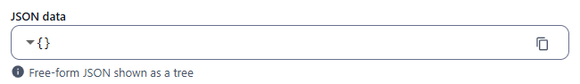
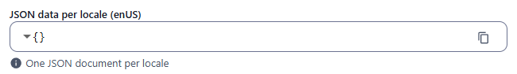
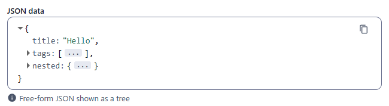
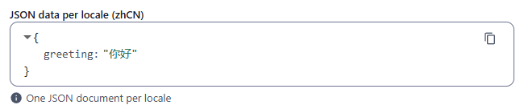

← [Field types](../FIELDS.md) · [Documentation](../../README.md)

# json

Read-only tree view of a JSON value, with a copy button. Component: `CustomTreeView` (`src/components/fields/CustomTreeView.vue`, a `json-viewer`). The value is **displayed, not edited**: the admin has no way to type into it. Fill it from REST, import or code, and use [object](object.md) or [code](code.md) when editors must change JSON.

Catalogue: `resources/structured_data.js` (group **Structured**, resource **Structured data**), fields `json` and `localisedJson`.

## Declaration

```js
{ field: 'payload', input: 'json', label: 'JSON data', localised: false }
```

## Options

| Option | Type | Default | Description |
|---|---|---|---|
| `field`, `input`, `label`, `localised`, `unique` | | | As for [string](string.md). |
| `options.hint` | string | none | Help text under the viewer. |
| `required`, `options.readonly`, `options.disabled` | | | No effect: the viewer has no input and no validator. |

The tree shows the first level expanded; nested objects and arrays are collapsed (`...`) and open with the arrow. Each viewer has a copy button that copies the JSON.

## Variations

### Empty value

`resources/structured_data.js`, fields `json` and `localisedJson` on a new record: an empty object `{}`.

 

### A record with data

Created over REST (`POST /api/structured_data` with `json: { title: 'Hello', tags: ['a', 'b'], nested: { count: 3, ok: true, none: null } }`) and opened in the admin:



### Localised

`resources/structured_data.js`, field `localisedJson`: one document per locale, shown for the current locale tab.



## Stored value

Any JSON value, exactly as sent; `{ enUS: <json>, zhCN: <json> }` when localised.

```json
{
  "json": { "title": "Hello", "tags": ["a", "b"], "nested": { "count": 3, "ok": true, "none": null } },
  "localisedJson": { "enUS": { "greeting": "hi" }, "zhCN": { "greeting": "你好" } }
}
```

Saving a new record in the admin stores `"json": {}` and `"localisedJson": { "enUS": {}, "zhCN": {} }` when nothing was provided.

## Validation and behaviour

- No validation in the UI or on the server (only `unique`).
- The admin never modifies the value: opening and saving a record keeps the JSON sent over REST.
