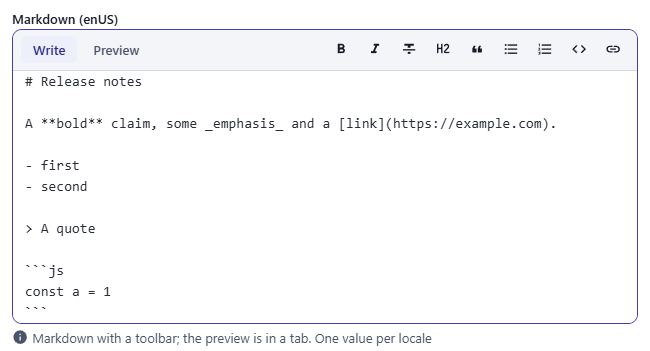
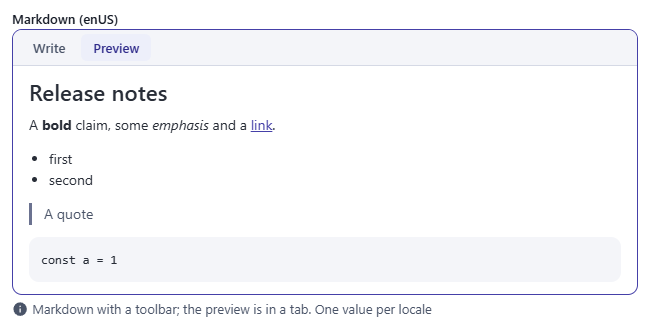
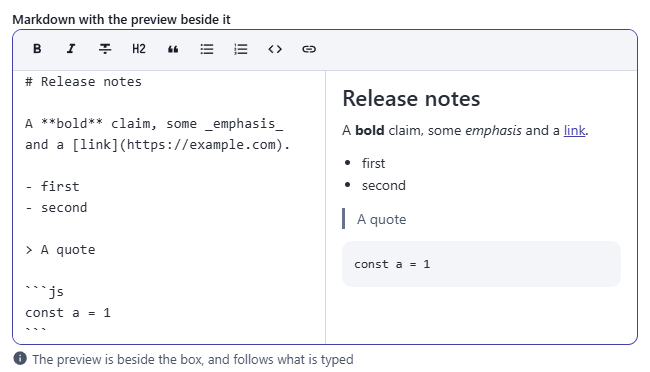
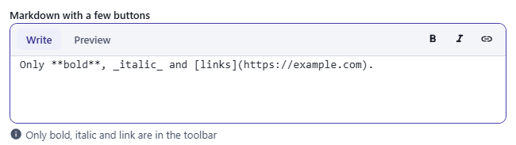
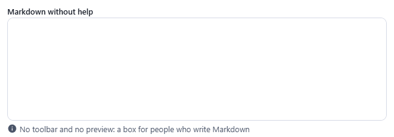
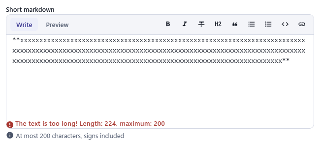
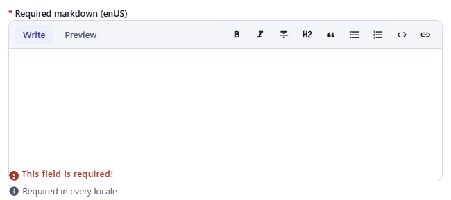
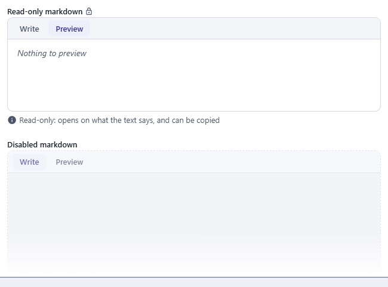

← [Field types](../FIELDS.md) · [Documentation](../../README.md)

# markdown

A text written in Markdown, in a box with a toolbar that writes the signs and a preview of what it makes. Component: `MarkdownField` (`src/components/fields/MarkdownField.vue`), the renderer, the plain text and the buttons are in `src/utils/markdown.js`.

Catalogue: `resources/text_long.js` (group **Text**, resource **Long text**), fields `markdown`, `requiredMarkdown`, `splitMarkdown`, `miniMarkdown`, `plainMarkdown`, `limitedMarkdown`, `readOnlyMarkdown`, `disabledMarkdown`.

## Declaration

```js
{ field: 'body', input: 'markdown', label: 'Body', options: { toolbar: ['bold', 'italic', 'link'], preview: 'split', rows: 10 } }
```

## Options

| Option | Type | Default | Description |
|---|---|---|---|
| `field`, `input`, `label`, `localised`, `unique` | | | As for [string](string.md). A field is localised by default when the resource has locales. |
| `required` | boolean | `false` | Adds `*` to the label; an empty text is refused (`This field is required!`). |
| `options.toolbar` | array \| boolean | all of them | The buttons to show, from `'bold'`, `'italic'`, `'strike'`, `'heading'`, `'quote'`, `'ul'`, `'ol'`, `'code'` and `'link'`, always in that order whatever the order you list them in. A name it does not know is left out. `false` for no toolbar (the keys Ctrl+B, Ctrl+I and Ctrl+K then do nothing either). |
| `options.preview` | `'tabs'` \| `'split'` \| `false` | `'tabs'` | Where the preview is: in a tab beside the Write tab, beside the box and following what is typed, or nowhere. |
| `options.rows` | number | `8` | The height of the box in lines, from 2 to 60. |
| `options.maxRows` | number | none | How many lines the box grows to before it scrolls (more than `rows`). |
| `options.min`, `options.max` | number | none | The least and the most characters of the text, signs included. Error: `The text is too long! Length: 12, max: 10`. |
| `options.regex` | `{ value, description }` | none | A pattern the text must match, as for [string](string.md). |
| `options.hint` | string | none | Help text under the box. |
| `options.readonly` | boolean | `false` | The box cannot be changed and has no toolbar; the field opens on the preview, with the lock icon after the label. |
| `options.disabled` | boolean | `false` | Greyed out with a dashed border. |

## The widget

- **The box** takes the text as it is written. The buttons of the toolbar write the signs around the selection and select what they wrote, so the next button works on it; pressed again on a selection that already has the signs, they take them away. **Heading** goes through `##`, `###`, `####` and none, on every line of the selection; **Quote**, **Bulleted list** and **Numbered list** do the same for the start of each line, and change one kind of list into the other.
- **Keys:** Ctrl+B (Cmd on a Mac) is bold, Ctrl+I italic, Ctrl+K a link, with the address selected to be written. Enter at the end of an item of a list starts the next one (`- `, `2. `, and `- [ ] ` after a task); Enter on an item with nothing in it ends the list.
- **The preview** shows what the text makes, as it is typed. The tabs are a tab list, with the arrow keys to go from one to the other; the toolbar is only there while the box is.
- **The text is never run.** The renderer is the project's own, and it escapes the text first. HTML written in the text is shown as text, and a script or an event handler cannot be made. The result then goes through DOMPurify once more.
  - A link or a picture goes only to `http`, `https`, `mailto`, `tel` or an address with no scheme (a path, `#anchor`). With any other scheme (`javascript:`, `data:`), the text of the link is shown and there is no link.
  - An external link opens in another tab and is not given the page.

## What it reads

| Written | Made |
|---|---|
| `# Title` to `###### Title`, or a line with `===` or `---` under it | Headings |
| `**bold**` or `__bold__`, `*italic*` or `_italic_`, `~~strikethrough~~` | Bold, italic, strikethrough (an underscore inside a word, `snake_case`, is not a sign) |
| `` `code` `` and a fence of three backticks or tildes, with a language | Code, shown as it is written |
| `- one`, `* one`, `+ one`, `1. one`, indented under an item for a list inside it, `- [x] done` | Lists and task lists (the boxes cannot be clicked) |
| `> quote` | Quote, with other blocks inside it |
| `---`, `***`, `___` | A rule |
| `[text](https://example.com "title")`, `<https://example.com>` | A link |
| `` | A picture |
| A table with a row of `\|---\|:--:\|--:\|` under its head | A table, aligned as the second row says |
| A backslash before a sign, `\*`, | The sign itself |
| Two spaces or a backslash at the end of a line | A line break (a single line break inside a paragraph is a space) |

It is Markdown as it is used in a README, not all of CommonMark: no raw HTML, no reference links (`[text][id]`), no footnotes, no indented code blocks. A text longer than 200,000 characters is cut in the preview (not in the record).

## Variations

### Default

`resources/text_long.js`, field `markdown`: the toolbar, and the preview in a tab.

 

### The preview beside the box

Field `splitMarkdown` (`preview: 'split'`, `rows: 6`).



### A few buttons

Field `miniMarkdown` (`toolbar: ['bold', 'italic', 'link']`, `rows: 4`).



### No help

Field `plainMarkdown` (`toolbar: false`, `preview: false`): a box for people who write Markdown.



### Limited

Field `limitedMarkdown` (`max: 200`): the signs count.



### Required

Field `requiredMarkdown`: an empty text is refused when the record is saved.



### Read-only and disabled

Fields `readOnlyMarkdown` (opens on the preview) and `disabledMarkdown`.



## Stored value

The Markdown text, a string. A localised field holds one per locale. The key is absent when no text was ever written.

```json
{ "body": { "enUS": "# Hello\n\nSome **bold** text.", "zhCN": "# 你好" } }
```

## Validation and behaviour

- UI: `required`, `min` and `max` (characters), `regex`.
- Server: only `unique`, as for any field; the text is not checked and is never rendered by the server. Whoever shows it on a site renders it with their own Markdown library and must sanitise the result: the admin's renderer is only for the preview.
- In the table the text is shown as what it says, without the signs (`Title Some bold text.`), cut to the width of the column, and sorted by that text.
