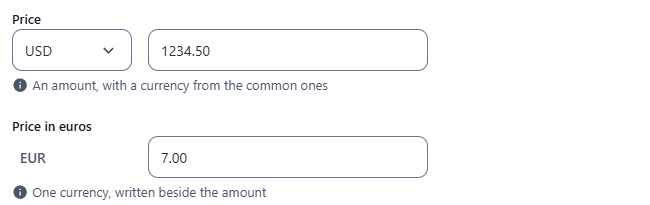
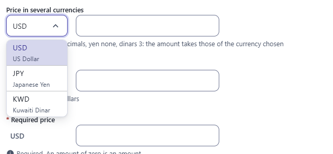
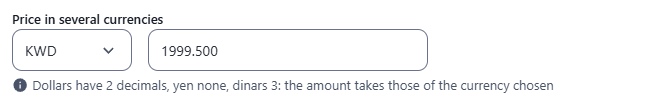
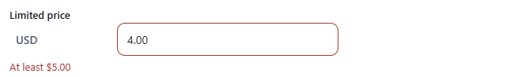
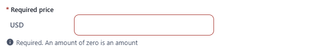
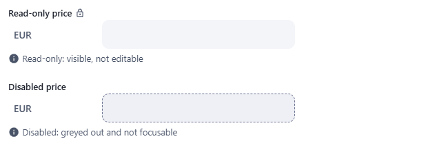

← [Field types](../FIELDS.md) · [Documentation](../../README.md)

# money

An amount in a currency: a box for the amount and the currency beside it, kept as `{ amount, currency }`. Component: `MoneyField` (`src/components/fields/MoneyField.vue`), the reading of what is typed, the decimals of each currency and the words are in `src/utils/money.js`.

Catalogue: `resources/numbers_quantities.js` (group **Numbers**, resource **Quantities**), fields `price`, `euroPrice`, `mixedPrice`, `limitedPrice`, `requiredPrice`, `localisedPrice`, `readOnlyPrice`, `disabledPrice`.

## Declaration

```js
{ field: 'price', input: 'money', label: 'Price', localised: false, options: { currencies: ['EUR', 'USD', 'GBP'], min: 0 } }
```

## Options

| Option | Type | Default | Description |
|---|---|---|---|
| `field`, `input`, `label`, `localised` | | | As for [string](string.md). |
| `required` | boolean | `false` | Adds `*` to the label; a save with no amount is refused (`This field is required!`). An amount of zero is an amount. |
| `options.currency` | string | none | The one currency the field takes, an ISO 4217 code (`'EUR'`). It is written beside the amount and is not chosen. |
| `options.currencies` | array | `USD EUR GBP JPY CNY CAD AUD CHF HKD SGD INR KRW` | The currencies to choose from; the first is the one the field starts with. A code the browser does not know is left out. Used when there is no `currency`. |
| `min`, `max` | number | none | The least and the most the amount takes, **in the major unit** (`5` is five dollars; also accepted in `options`). An amount outside is refused with `At least $5.00` or `At most $500.00`, written in the currency chosen. There is no least by default, so a negative amount (a refund) is allowed; `min: 0` refuses it. |
| `options.hint` | string | none | Help text under the boxes. |
| `options.readonly` | boolean | `false` | Shows the amount, changes nothing, with the lock icon after the label. |
| `options.disabled` | boolean | `false` | Greyed out and not focusable. |

## The widget

- The currency is a list with the code and the name of each currency (`EUR`, Euro) in the language of the admin; with one currency the code is written beside the amount. Both have a real label, so a screen reader says which box it is on.
- The amount is read as a person writes it: `19.99`, `19,99`, `1,234.56`, `1.234,56` and `1 234,56` are all understood. When you leave the box it is written with the decimals of the currency (`19.5` becomes `19.50`) and an amount with more decimals is rounded (`1.005` is `1.01`).
- A currency has the decimals it has: 2 for dollars, none for yen, 3 for dinars. Changing the currency of an amount rounds it to the decimals of the new one.
- A currency chosen with no amount is no value: the field holds nothing, so `required` is not met.
- A box that is not an amount (`abc`) holds nothing and says `An amount, like 19.99` under the boxes. The message of the rules is shown there too, when you leave the box and when the record is saved.

## Variations

### A list of currencies, and one currency

`resources/numbers_quantities.js`, fields `price` (the common currencies) and `euroPrice` (`currency: 'EUR'`: the code is written beside the amount). The amount is written with the decimals of the currency when the box is left.



### Currencies with their names

Field `mixedPrice` (`currencies: ['USD', 'JPY', 'KWD']`): the list shows the code and the name in the language of the admin.



### Decimals follow the currency

Typing `1999.5` and choosing `KWD` gives `1999.500` (dinars have three decimals; yen have none, dollars two).



### Limits

Field `limitedPrice` (`currency: 'USD'`, `min: 5`, `max: 500`): the message is written in the currency.



### Required

Field `requiredPrice`: an amount of zero is an amount, an empty box is refused when the record is saved.



### Read-only and disabled

Fields `readOnlyPrice` and `disabledPrice`.



## Stored value

An object with the amount, a number in the major unit of the currency, and the code of the currency; the key is absent when there is no amount. A localised field holds one per locale.

```json
{ "price": { "amount": 19.99, "currency": "EUR" }, "localisedPrice": { "enUS": { "amount": 19.99, "currency": "USD" }, "zhCN": { "amount": 139, "currency": "CNY" } } }
```

## Validation and behaviour

- UI: `required`, a currency among the ones of the field, a number for the amount below ten to the fifteenth, the least and the most (`min` and `max`).
- Server: only `unique`, as for any field; the object is not checked.
- In the table the amount is written with its currency in the language of the admin (`$19.99`, `19,99 €`, `¥1,999`), right aligned, and sorted by the amount whatever the currency.
- In an xlsx export the value is written as JSON.
