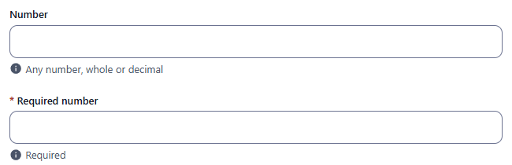
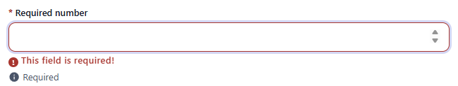
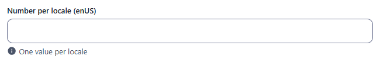
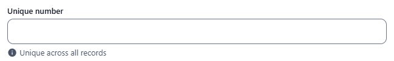
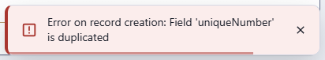
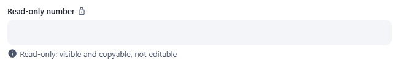
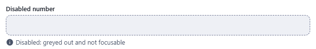

← [Field types](../FIELDS.md) · [Documentation](../../README.md)

# number

Numeric input (integer or decimal). The value is stored as a real number. Component: `CustomInput` with `type="number"` (spinner arrows, only numeric characters accepted by the browser).

Catalogue: `resources/numbers.js` (group **Numbers**, resource **Numbers**). Related types: [integer](integer.md) (whole numbers), [double](double.md) (decimals).

## Declaration

```js
{ field: 'price', input: 'number', label: 'Price', localised: false }
```

## Options

| Option | Type | Default | Description |
|---|---|---|---|
| `field`, `input`, `label`, `localised`, `unique` | | | As for [string](string.md). Numbers are usually `localised: false`. |
| `required` | boolean | `false` | Empty input shows `This field is required!`. `0` counts as filled. An empty optional number is valid and stores nothing. |
| `options.hint` | string | none | Help text under the input. |
| `options.readonly` | boolean | `false` | Not editable, a lock icon after the label. |
| `options.disabled` | boolean | `false` | Greyed out, not focusable. |
| `options.min` / `options.max` | number | none | Minimum / maximum **value**. Errors: `The number is too small! Minimum: 0` / `The number is too big! Maximum: 100`. |

## Variations

### Default

`resources/numbers.js`, fields `number` and `requiredNumber`.



### Required



### Localised

`resources/numbers.js`, field `localisedNumber` (one value per locale, all locales required only if `required` is set).



### Unique

`resources/numbers.js`, field `uniqueNumber`.



The server refuses a duplicate:



### Read-only and disabled

`resources/numbers.js`, fields `readOnlyNumber` and `disabledNumber`.

 

## Stored value

A **number** (`12.5`, not `"12.5"`), `{ enUS, zhCN }` of numbers when localised:

```json
{ "number": 12.5, "localisedNumber": { "enUS": 7, "zhCN": 8 } }
```

An empty number field stores nothing (the key is absent), also when it was emptied after typing.

## Validation and behaviour

- UI: `required`, then the value must be numeric, then `min` / `max`; shown on blur and on Create/Save, which is blocked while a field is invalid. An empty optional field is valid.
- Server: only `unique`. Values are not converted or range-checked, so `"abc"` and `999` sent over REST were stored.
- `9` and `"9"` are different values for the unique check: a record with `uniqueNumber: 9` and one with `"9"` were both accepted, then another `9` was refused. Send numbers, not strings.
