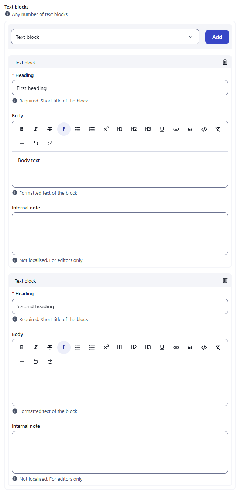
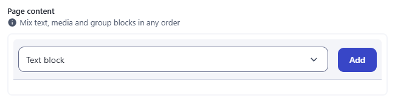
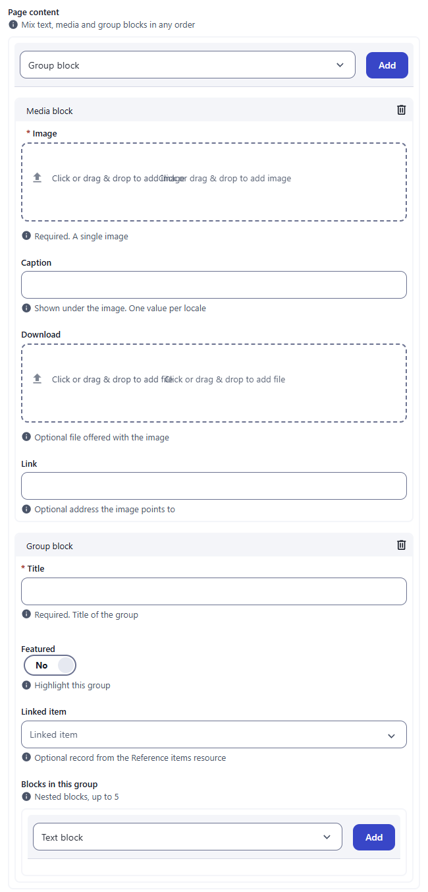
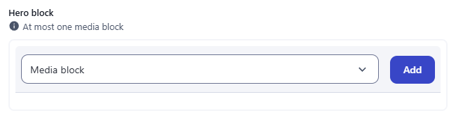
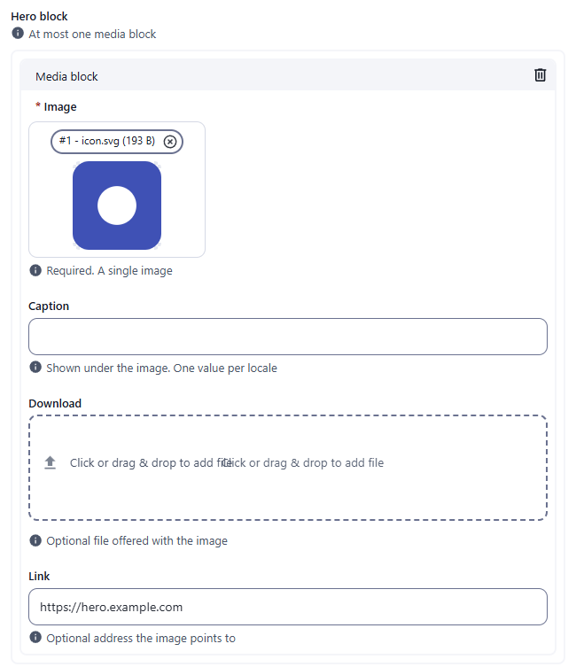
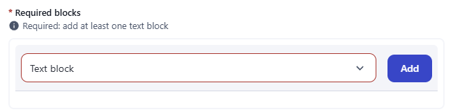
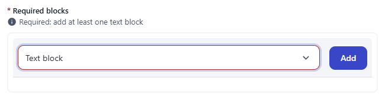
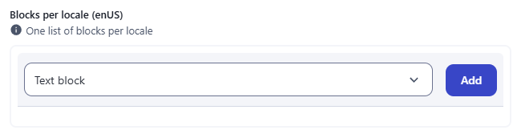

← [Field types](../FIELDS.md) · [Documentation](../../README.md)

# paragraph

An ordered list of typed blocks. Each block type is a small resource (a schema without records) declared in `resources/paragraphs/`; blocks can hold any field type, including files, images and other paragraphs. Component: `ParagraphView` (`src/components/fields/ParagraphView.vue`).

Catalogue: `resources/structured_blocks.js` (group **Structured**, resource **Blocks**) with the block types `resources/paragraphs/block_text.js` (heading, wysiwyg body, note), `block_media.js` (image, caption, download, link) and `block_group.js` (title, switch, select, and a nested paragraph field).

## Declaration

```js
// resources/page.js
{ field: 'content', input: 'paragraph', label: 'Page content', localised: false, options: { types: ['block_text', 'block_media'] } }

// resources/paragraphs/block_text.js
module.exports = {
  displayname: { enUS: 'Text block', zhCN: '文本块' },
  schema: [
    { field: 'heading', input: 'string', label: 'Heading', required: true },
    { field: 'body', input: 'wysiwyg', label: 'Body' }
  ]
}
```

## Options

| Option | Type | Default | Description |
|---|---|---|---|
| `field`, `input`, `label`, `localised` | | | As for [string](string.md). `unique` has no meaning. |
| `options.types` | string[] | none | **Names of the block types** allowed (file names in `resources/paragraphs/`). A drop-down lists their `displayname`. |
| `options.maxCount` | number | unlimited | Maximum number of blocks. When it is reached the drop-down, its label and the Add button disappear. |
| `required` | boolean | `false` | At least one block. With none the save is refused: the type drop-down is outlined in red and focused, and the toast names the field. No text message is shown under it. |
| `options.hint` | string | none | Help text under the type selector. |
| `options.disabled` | boolean | `false` | Disables the selector, the Add button and the delete buttons. |
| `options.dynamicLayout` | boolean | `false` | Lays the blocks out on a 12-column grid (see `docs/reference/DYNAMIC_LAYOUT.md`). |
| `options.mapping` | `{ '.jpg,.png': { _type, field }, default: {...} }` | none | Maps dropped files to a block type and its file field (bulk drop zone). |

Inside a block, each field follows its own type page and options (`required`, hints, `maxCount`...). Fields declared in a block are localised like any other unless `localised: false`.

## Variations

### One block type, any number of blocks

`resources/structured_blocks.js`, field `textBlocks` (`types: ['block_text']`). The label sits above the box, with the hint under it. Choose the type and click **Add**; each block has a header with a delete button.

 

### Several block types

`resources/structured_blocks.js`, field `content` (`types: ['block_text', 'block_media', 'block_group']`). Pick the type in the drop-down, then Add; blocks can be reordered by dragging the handle.

 

The group block holds its own paragraph field (`children`, `maxCount: 5`), so blocks nest.

### At most one block

`resources/structured_blocks.js`, field `hero` (`maxCount: 1`). After the first block the selector disappears.

 

### Required

`resources/structured_blocks.js`, field `requiredBlocks`.

 

### Localised

`resources/structured_blocks.js`, field `localisedBlocks`: one list per locale.



## Stored value

An array of objects, one per block. `_type` is the name of the block type; the other keys are the fields of that block. Images and files inside a block are attachment descriptors like in [image](image.md#stored-value). A localised paragraph field is `{ enUS: [...], zhCN: [...] }`; untouched it is `{}`.

```json
{
  "textBlocks": [
    { "_type": "block_text", "heading": "First heading", "body": "<p>Body text</p>" },
    { "_type": "block_text", "heading": "Second heading" }
  ],
  "content": [
    { "_type": "block_media", "caption": "A caption", "link": "https://example.com",
      "image": [ { "_id": "mumgfgfkdev00001y3142m4o", "_filename": "man.jpg", "_contentType": "image/jpeg", "url": "/api/structured_blocks/<recordId>/attachments/mumgfgfkdev00001y3142m4o" } ],
      "download": [ { "_filename": "manual.pdf", "_contentType": "application/pdf" } ] },
    { "_type": "block_group", "title": "Group title", "children": [ { "_type": "block_text", "heading": "Nested heading" } ] }
  ],
  "hero": [ { "_type": "block_media", "link": "https://hero.example.com", "image": [ { "_filename": "icon.svg" } ] } ],
  "localisedBlocks": {}
}
```

Blocks do not carry ids; their position in the array is their identity. Untouched fields of a block (for example a switch) are not stored.

## Validation and behaviour

- UI: `required` on the paragraph (at least one block: the save is refused, see `requiredBlocks`) and the rules of each field inside the blocks: an empty required `heading` (or any invalid field) inside a block blocks the save.
- Server: only `unique` at record level; the block content is stored as sent and is not validated against the block schema.
- Files are uploaded after the record is created; `maxCount` of an image inside a block is enforced by the server only for `input: 'image'` at the top level of a resource.
