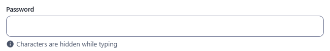
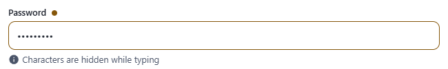
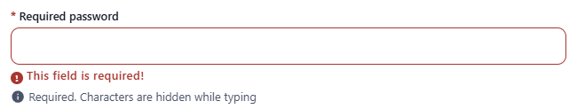

← [Field types](../FIELDS.md) · [Documentation](../../README.md)

# password

Single-line input whose characters are hidden. Component: `CustomInput` with `type="password"`.

Catalogue: `resources/text_formats.js`, fields `password` and `requiredPassword`.

## Declaration

```js
{ field: 'password', input: 'password', label: 'Password', localised: false }
```

## Options

| Option | Type | Default | Description |
|---|---|---|---|
| `field`, `input`, `label`, `required`, `localised`, `unique` | | | As for [string](string.md). |
| `options.hint` | string | none | Help text under the input. |
| `options.readonly` | boolean | `false` | Not editable, an eye icon after the label. |
| `options.disabled` | boolean | `false` | Greyed out, not focusable. |
| `options.min` / `options.max` | number | none | Minimum / maximum length, as for [string](string.md). |
| `options.regex` | object | none | Pattern the password must match, as for [string](string.md#regex). |

There is no reveal button.

## Variations

### Default

`resources/text_formats.js`, field `password`.



Typed characters are masked:



### Required

`resources/text_formats.js`, field `requiredPassword`.



## Stored value

The plain text the editor typed. The CMS does **not** hash or encrypt it, neither in the browser nor on the server, and REST returns it unchanged:

```json
{ "password": "secret" }
```

## Validation and behaviour

- UI: `required`, `min` / `max` (length) and `regex` when the field is filled, on blur and on Create/Save. An empty optional password is valid.
- Server: nothing besides `unique`.
- Do not use this type for real credentials unless your own code hashes the value; it only hides the characters while typing.
